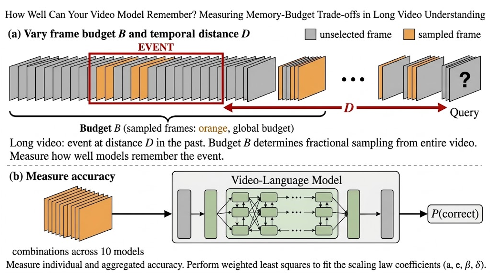
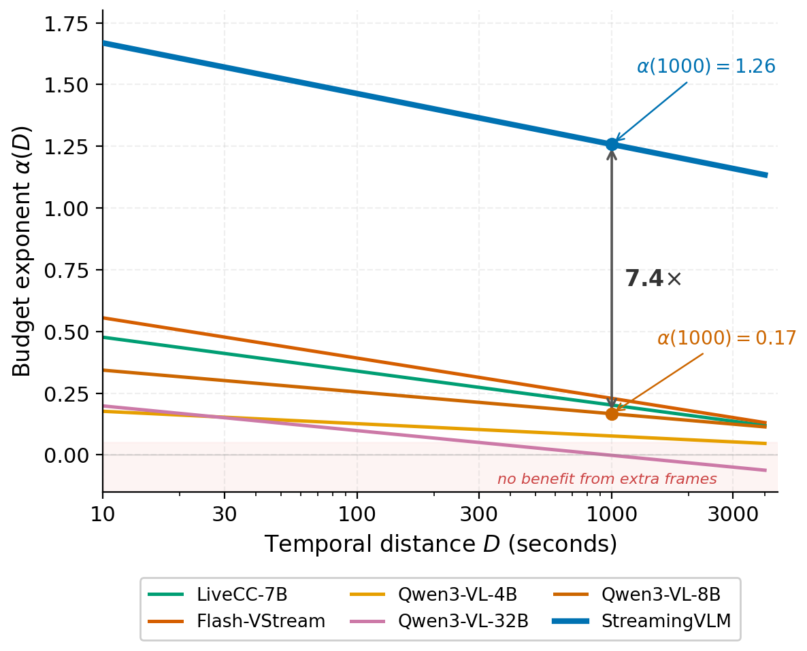
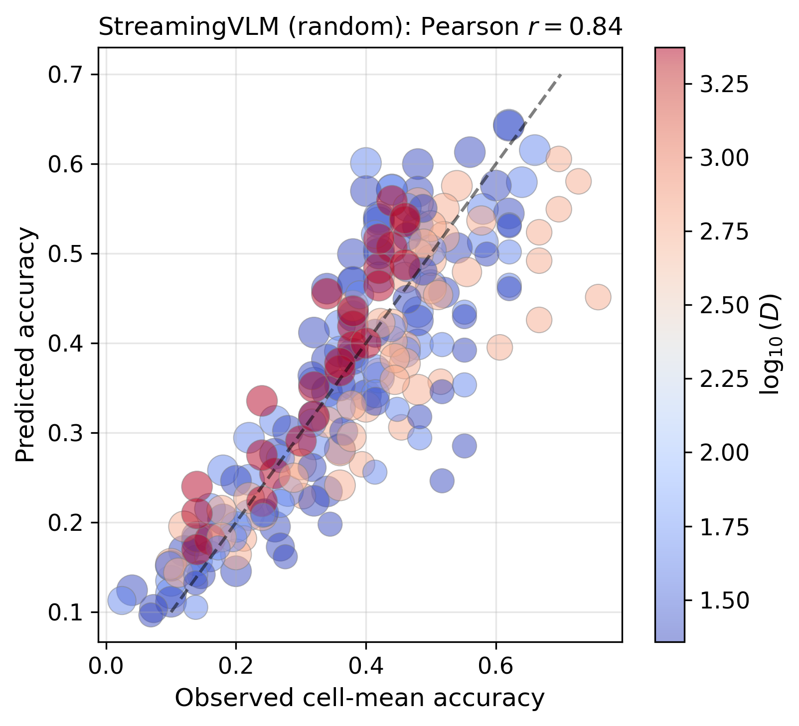
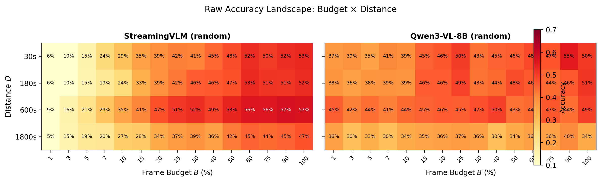

# How Well Can Your Video Model Remember? Measuring Memory-Budget Trade-offs in Long Video Understanding

## 论文元信息

- 标题：How Well Can Your Video Model Remember? Measuring Memory-Budget Trade-offs in Long Video Understanding
- 作者：Yixian Tian
- arXiv ID：2606.20726
- 类别：cs.CV
- 论文链接：https://arxiv.org/abs/2606.20726
- PDF 链接：https://arxiv.org/pdf/2606.20726
- 报告依据：PDF 全文与摘要，文本抽取状态为 `fulltext:pypdf`
- 代码状态：本文未提供可确认的公开代码。论文正文、参考页与已知元信息中未给出明确 GitHub 仓库；按任务给定的搜索结果状态，本文不写源码片段，不伪造代码实现。
- 日期说明：任务元信息给出发布时间为 2026-06-23T04:00:00+00:00；PDF 首页与 arXiv 标记显示 v1 日期为 2026-06-17（见 PAGE 1）。

## 摘要

本文提出一种用于长视频理解（long video understanding）的经验评估模型，刻画模型在有限帧预算（frame budget）下回忆远距离历史事件的能力。核心指标是预算指数（budget exponent）$\alpha(D)$：它衡量在时间距离 $D$ 处，增加帧预算 $B$ 对回答准确率的边际收益。论文不是提出新的视频模型，而是提出一个诊断协议：在多个预算、多个时间距离、多个模型与采样策略上拟合准确率曲面，从而回答“同样多给一些帧，哪个模型真的能记住更远的内容”（见 PAGE 1, PAGE 2）。

一句话总结：这篇论文把长视频模型的“记忆能力”从平均准确率改写成可测量的预算-距离响应曲线，证明 STREAMINGVLM 在 $D=1000$ 秒处的预算有效性约为最佳 Qwen3-VL 基础模型的 $7.4\times$（见 PAGE 1, PAGE 10）。

## 背景与动机

长视频理解系统面对的实际问题并不是“能否看懂一段短视频”，而是在小时级视频中回答关于过去事件的问题。例如安防录像、手术视频、课程录播或会议档案中，问题可能发生在当前查询时间之前几分钟甚至几十分钟。论文将这种任务形式化为：模型在查询时间 $t_q$ 接收问题，而答案所在事件早已结束，模型需要从有限采样帧中恢复相关信息（见 PAGE 1, PAGE 5）。

这种场景有一个工程约束：模型不能处理全部视频帧。论文称之为帧预算 $B \in (0,1]$，即从查询前视频片段 $[0,t_q]$ 中采样的帧比例。$B=1.0$ 表示全预算输入，$B=0.1$ 表示只使用十分之一的帧。现实部署中，预算受 GPU 显存、延迟、上下文长度、KV cache 或视频 token 数量限制，因此“用多少帧”本身就是系统设计问题（见 PAGE 1, PAGE 5, PAGE 6）。

已有 scaling law 主要关注训练阶段资源，例如模型参数量、训练数据量与训练 compute 如何影响损失；这些规律无法直接说明推理阶段的帧预算如何影响视频问答准确率。论文明确指出，Kaplan、Chinchilla 等工作回答的是 training-time resource allocation，而本文关心 fixed model 在 inference time 下，准确率如何随 $B$ 缩小与 $D$ 增大而退化（见 PAGE 2, PAGE 3, PAGE 4）。

已有 streaming video model 与 long-video benchmark 也存在指标聚合问题。STREAMINGVLM、LIVECC、FLASH-VSTREAM 等模型常以平均准确率或标准 benchmark 分数比较，但平均值会混合短距离与长距离、低预算与高预算条件。RIVER-bench 的优势在于它显式按答案距离组织问题，因此适合研究 temporal distance 对 recall 的影响（见 PAGE 4, PAGE 5）。

本文的出发点可概括为一句：平均准确率不足以描述长视频记忆，必须同时控制帧预算 $B$ 与时间距离 $D$。论文自称是一个 “diagnostic study”，即诊断研究，而不是新模型贡献（见 PAGE 2）。这一区分很重要：它试图提供一个标准化测量协议，而不是通过架构创新直接提升某个模型。

## 预备知识

论文定义视频总时长为 $T$ 秒，查询时间为 $t_q$，答案所在时间窗口为 $[t_{start},t_{end}]$，其中 $t_{end}<t_q$。时间距离（temporal distance）定义为：

$$
D=t_q-t_{end}
$$

这里 $D$ 表示答案事件结束后到提问时刻之间的秒数。人话解释：如果问题在视频第 1800 秒提出，而答案相关事件在第 800 秒结束，那么模型需要回忆约 1000 秒前的信息，$D=1000$（见 PAGE 5）。

帧预算（frame budget）定义为：

$$
B\in(0,1]
$$

其中 $B$ 是从 $[0,t_q]$ 中抽取的总帧比例。$B$ 不是绝对帧数，而是相对于可见视频前缀的比例。论文后续还使用 $\log_{10}B$，因为预算的边际收益通常不是线性的：从 1% 增加到 10% 与从 50% 增加到 60% 的信息增益不同（见 PAGE 5, PAGE 6）。

预测结果为二元变量：

$$
Y\in\{0,1\}
$$

其中 $Y=1$ 表示模型回答正确，$Y=0$ 表示错误。论文拟合的不是单个样本是否正确，而是 cell-level 聚合准确率，即在同一预算、距离层级与视频长度桶内的平均准确率（见 PAGE 5, PAGE 7）。

为了建模准确率，论文使用 logit 变换。若 $P=P(Y=1)$ 表示正确概率，则 logit-accuracy 表示为：

$$
\operatorname{logit}(P)=\log\frac{P}{1-P}
$$

人话解释：logit 把 $0$ 到 $1$ 之间的概率变成实数空间，便于用线性模型拟合预算、距离与视频长度的影响。论文在 cell accuracy 上先裁剪到 $[0.02,0.98]$，再做 logit 变换，以避免 0 或 1 导致无穷值（见 PAGE 7）。

## 方法详解

### 1. 从平均准确率到预算-距离经验律

论文提出的核心经验模型是：

$$
\operatorname{logit}(P)=\alpha(D)\cdot\log_{10}B+\beta\cdot\log_{10}D+\delta\cdot\log_{10}T+c
$$

这个公式对应论文 Eq. 2（见 PAGE 6）。其中 $P$ 是正确概率，$B$ 是帧预算比例，$D$ 是时间距离，$T$ 是视频总长度，$\beta$ 控制距离主效应，$\delta$ 控制视频长度主效应，$c$ 是截距。人话解释：模型假设准确率的 logit 值由预算、距离、视频长度以及预算-距离交互共同决定。

预算指数定义为：

$$
\alpha(D)=a+e\cdot\log_{10}D
$$

这个公式对应论文 Eq. 3（见 PAGE 6）。$a$ 是基础预算敏感度（base budget exponent），表示模型整体上从更多帧中获益的能力；$e$ 是距离衰减率（distance decay rate），表示这种获益能力随时间距离增大而如何变化。若 $e<0$，说明越久远的事件，增加帧预算越难转化为准确率收益。

论文在 Introduction 中也把完整模型写为：

$$
\operatorname{logit}(P)=\alpha(D)\cdot\log_{10}B+\beta\cdot\log_{10}D+\delta\cdot\log_{10}T,\quad \alpha(D)=a+e\cdot\log_{10}D
$$

该表达对应论文 Eq. 1（见 PAGE 2）。与 PAGE 6 的 Eq. 2 相比，PAGE 6 版本显式加入截距 $c$。人话解释：论文的主要建模思想不是只看“更多帧是否更好”，而是看“更多帧在不同时间距离处是否仍然有效”。

### 2. 预算指数 $\alpha(D)$ 的含义

预算指数被定义为准确率 logit 对预算对数的偏导：

$$
\alpha(D)=\frac{\partial \operatorname{logit}(P)}{\partial \log_{10}B}
$$

这个定义在论文 PAGE 2 与 PAGE 6 均有说明。人话解释：当预算增加十倍时，模型正确率的 log-odds 大约增加 $\alpha(D)$。因此，$\alpha(D)$ 越大，说明在距离 $D$ 处，额外帧越有价值。

论文强调，$\alpha(D)$ 衡量的是 budget-distance responsiveness，而不是绝对模型质量。一个模型可以在低预算下有较高基础准确率，但 $\alpha(D)$ 很小，意味着继续增加帧几乎不能改善长距离回忆。相反，一个高 $\alpha(D)$ 模型可能在极低预算下表现较差，但一旦给足帧，准确率上升很快（见 PAGE 6, PAGE 10）。

距离衰减率定义为：

$$
e=\frac{\partial \alpha(D)}{\partial \log_{10}D}
$$

人话解释：$e$ 衡量预算有效性随时间距离增长的变化速度。若 $e\approx 0$，则额外帧在近距离与远距离处同样有用，论文称这更接近 “true streaming model”；若 $e\ll 0$，则说明长距离处额外帧逐渐失效（见 PAGE 2, PAGE 6）。

### 3. 为什么需要交互项

论文的关键创新不是把 $B$ 与 $D$ 分别放入模型，而是加入预算与距离的交互：

$$
e\cdot\log_{10}B\cdot\log_{10}D
$$

这个交互项隐含在 $\alpha(D)\cdot\log_{10}B$ 中，因为：

$$
\alpha(D)\cdot\log_{10}B=(a+e\cdot\log_{10}D)\cdot\log_{10}B
$$

展开后得到 $a\log_{10}B+e\log_{10}B\log_{10}D$。人话解释：如果没有该项，模型会假设帧预算在 20 秒前和 2000 秒前同样有效，这显然无法诊断长视频记忆退化。

论文后续证明该交互项虽然对 $R^2$ 的提升幅度不大，但会改变模型排序。例如，在随机采样下，如果忽略距离依赖项，QWEN3-VL-32B 会因 $a=0.30$ 高于 QWEN3-VL-4B 的 $a=0.23$ 而被认为预算有效性更强；但完整模型在 $D=1000$ 秒处给出 QWEN3-VL-4B 的 $\alpha(1000)=0.08$，QWEN3-VL-32B 约为 $0.00$，出现长距离排序反转（见 PAGE 15）。

### 4. 估计方法：cell-level WLS

论文使用加权最小二乘（weighted least squares, WLS）在 cell-level 聚合数据上拟合模型。每个 cell 由预算、距离层级与视频长度桶确定；论文要求每个 cell 至少有 5 个预测，排除 $B=1.0$ 的全预算情况，并排除 $B<0.03$ 的极低预算区域（见 PAGE 6, PAGE 7）。

特征向量为：

$$
x=[\log_{10}B,\ \log_{10}B\cdot\log_{10}D,\ \log_{10}D,\ \log_{10}T,\ 1]
$$

这个公式对应论文 Eq. 4（见 PAGE 7）。人话解释：第一项估计基础预算效应 $a$，第二项估计预算-距离交互 $e$，第三项估计距离主效应 $\beta$，第四项控制视频长度 $T$，最后一项是截距。

权重与 cell sample size 成正比。这意味着样本数更多的 cell 对拟合结果影响更大。论文同时说明，bootstrap confidence interval 主要在 cell-level 或 video-level 上进行；cell-level CI 可能偏乐观，因为没有完全处理视频或问题内部相关性（见 PAGE 7, PAGE 9, PAGE 23）。

### 5. 评价协议与实验设置

实验主要使用 RIVER-bench 的 Retro-Memory 子集。距离层级包括 short（平均约 23 秒）、medium（约 44 秒）、long（约 578 秒）与 very long（约 2358 秒）。视频长度桶为 $T\in\{60,300,900,1800,3600\}$ 秒。预算共 15 个层级，范围为 $B\in[0.01,1.0]$（见 PAGE 5）。

模型覆盖 10 个视频或多模态模型，包括 STREAMINGVLM、LIVECC-7B、FLASH-VSTREAM-7B、QWEN3-VL 系列、INTERNVL3.5-8B、VIDEOLLAMA3-7B 与 VIDEOLLAMB-7B。采样策略包括 random、uniform，以及仅对 STREAMINGVLM 额外评估的 recency（见 PAGE 5, PAGE 6）。

重要的是，论文采用 offline retrospective evaluation。所有模型都不是在真实在线流式条件下逐帧更新状态，而是一次性接收从 $[0,t_q]$ 中采样出的 $B$ 比例帧，并通过 full attention 与问题共同输入。该设计用于隔离架构利用远距离帧的能力，避免把 KV-cache eviction policy 与模型本身混在一起（见 PAGE 6）。

| 实验维度 | 论文设置 | 证据 |
|---|---:|---|
| 主 benchmark | RIVER-bench Retro-Memory | PAGE 5 |
| 距离层级 | short / medium / long / very long，均值约 23s / 44s / 578s / 2358s | PAGE 5 |
| 视频长度桶 | 60 / 300 / 900 / 1800 / 3600 秒 | PAGE 5 |
| 预算层级 | 15 个预算比例，$B\in[0.01,1.0]$ | PAGE 5 |
| 模型数量 | 10 个模型 | PAGE 5 |
| 采样策略 | random / uniform / recency | PAGE 5, PAGE 6 |
| 总预测量 | 约 155,000 个二元预测 | PAGE 1, PAGE 6 |

表格解读：该实验设计的强点在于同时扫描预算、距离、模型与采样策略，而不是只报告单点准确率。其主要限制也来自这里：它是一个诊断性网格实验，结论依赖 RIVER-bench Retro-Memory 的任务结构，不能直接等价为所有业务视频流场景下的真实在线记忆能力。

### 6. Figure 1(a)：实验设置

用途：Figure 1(a) 用于说明论文如何同时操控帧预算 $B$ 与时间距离 $D$。  
读图要点：问题发生在查询时间，答案事件位于过去；当 $D$ 变大时，同样预算覆盖到答案相关帧的概率会下降（见 PAGE 3）。

支撑的判断：这张图支撑了论文的基本问题设定：长视频记忆不是单纯“处理更长视频”，而是“在有限预算下能否覆盖并利用远处事件”。因此，$B$ 与 $D$ 必须共同进入模型，而不能只看总视频长度或平均准确率。

### 7. Figure 1(b)：预算指数曲线

用途：Figure 1(b) 用于展示 $\alpha(D)$ 如何作为 streaming capability 的诊断指标。  
读图要点：图中 STREAMINGVLM 在 $D=1000$ 秒处保持 $\alpha=1.26$，QWEN3-VL-8B 下降到 $\alpha=0.17$，形成约 $7.4\times$ 差距（见 PAGE 3）。

支撑的判断：该图支持论文最核心的经验结论：模型之间的差异并不只体现在平均准确率，而体现在“多给帧是否还能转化为长距离回忆收益”。这也是 $\alpha(D)$ 比平均 accuracy 更适合诊断长视频记忆的原因。

## 实验分析

### 1. 拟合质量与消融实验

论文报告，经验律在不同模型与采样策略上的 cell-level weighted $R^2$ 范围为 0.05 到 0.75。对于强预算敏感模型，如 STREAMINGVLM，拟合质量较高；对于准确率几乎不随预算变化的模型，如 VIDEOLLAMA3-7B，$R^2$ 接近 0，说明没有稳定的预算-距离结构可拟合（见 PAGE 7, PAGE 8）。

| 模型与采样策略 | Full law $R^2$ | 去掉 $e$ 项 | 去掉 $\log D$ 项 | 证据 |
|---|---:|---:|---:|---|
| STREAMINGVLM random | 0.75 | 0.74 | 0.75 | PAGE 8 |
| LIVECC-7B random | 0.21 | 0.20 | 0.18 | PAGE 8 |
| FLASH-VSTREAM random | 0.47 | 0.45 | 0.45 | PAGE 8 |
| QWEN3-VL-8B random | 0.32 | 0.32 | 0.32 | PAGE 8 |

表格解读：交互项 $e$ 对 $R^2$ 的增益数值不大，通常为 0.002 到 0.02 左右，但它改变的是诊断对象本身：没有 $e$，$\alpha(D)$ 就不能随距离变化。也就是说，$e$ 不一定显著提高整体方差解释率，却决定了模型能否识别长距离处的预算有效性变化，这一点在模型排序反转中有直接作用（见 PAGE 8, PAGE 15, PAGE 17）。

### 2. Figure 2：STREAMINGVLM 的拟合检验

用途：Figure 2 用于验证 Eq. 2 对 STREAMINGVLM 的 cell-mean accuracy 是否具有解释力。  
读图要点：横轴和纵轴分别对应预测准确率与观测准确率，点大小表示 cell sample count；论文报告 STREAMINGVLM 的 Pearson $r=0.84$（见 PAGE 8）。

支撑的判断：这张图说明该经验律对高预算敏感模型确实能捕捉系统性趋势。它不证明模型能预测单个问题是否答对；论文也明确说 instance-level linear probability model 的 $R^2<0.08$，因此该 law 应被理解为 cell-level 描述模型，而不是单样本分类器（见 PAGE 7, PAGE 8）。

### 3. 长距离预算有效性的核心结果

论文最强的结果是 STREAMINGVLM 与最佳基础模型在 $D=1000$ 秒处的预算指数差异。STREAMINGVLM random 的 $a=1.87$，$e=-0.21$，得到 $\alpha(1000)=1.26$；QWEN3-VL-8B random 的 $a=0.43$，$e=-0.09$，得到 $\alpha(1000)=0.17$（见 PAGE 9, PAGE 10）。

| 模型 | 类型 | 采样 | $e$ | $a$ | $\alpha(1000)$ | Ret.% | $R^2$ | 证据 |
|---|---|---|---:|---:|---:|---:|---:|---|
| STREAMINGVLM | Streaming | random | -0.21 | 1.87 | 1.26 | 75 | 0.75 | PAGE 10 |
| STREAMINGVLM | Streaming | uniform | -0.17 | 1.79 | 1.27 | 79 | 0.72 | PAGE 10 |
| LIVECC-7B | Streaming | random | -0.14 | 0.61 | 0.20 | 42 | 0.21 | PAGE 10 |
| FLASH-VSTREAM | Streaming | random | -0.16 | 0.72 | 0.23 | 41 | 0.47 | PAGE 10 |
| FLASH-VSTREAM | Streaming | uniform | -0.09 | 0.56 | 0.30 | 63 | 0.45 | PAGE 10 |
| QWEN3-VL-8B | Base | random | -0.09 | 0.43 | 0.17 | 49 | 0.32 | PAGE 10 |
| QWEN3-VL-32B | Base | random | -0.10 | 0.30 | 0.00 | 约 0 | 0.31 | PAGE 10 |
| INTERNVL3.5-8B | Base | random | -0.54 | 1.51 | -0.12 | — | 0.65 | PAGE 10 |
| VIDEOLLAMA3-7B | Base | random | 0.05 | -0.17 | -0.03 | — | 0.05 | PAGE 10 |

表格解读：STREAMINGVLM 的优势不只是 $a$ 高，而是远距离处仍保持较高 $\alpha(1000)$。LIVECC-7B 与 FLASH-VSTREAM 虽然也是 streaming-oriented models，但 random 条件下 $\alpha(1000)$ 仅约 0.20 到 0.23，更接近基础模型而非 STREAMINGVLM。INTERNVL3.5-8B 的现象更特殊：它的 $a=1.51$ 很高，但 $e=-0.54$ 极负，导致长距离预算效应坍塌，这说明短距离预算响应并不等价于长距离记忆能力（见 PAGE 10, PAGE 12）。

论文把 $\alpha$ 转化为 accuracy space：在 $D=1000$ 秒、$T=3600$ 秒时，从 $B=0.10$ 增加到 $B=1.0$，STREAMINGVLM 的预测准确率从 26% 到 55%，增加 29 个百分点；QWEN3-VL-8B 从 35% 到 39%，只增加 4 个百分点（见 PAGE 9, PAGE 10）。这使 $\alpha(D)$ 具备直接工程意义：它近似回答“多花十倍帧预算值不值”。

### 4. Figure 3：原始准确率地形

用途：Figure 3 用于对比 STREAMINGVLM 与 QWEN3-VL-8B 在预算与距离二维网格上的 raw accuracy landscape。  
读图要点：STREAMINGVLM 在所有距离上沿预算轴都有明显梯度；QWEN3-VL-8B 的准确率曲面较平，说明增加预算带来的准确率变化较小（见 PAGE 9）。

支撑的判断：这张图为 $\alpha(D)$ 的直观解释提供证据。高 $\alpha$ 对应的是准确率曲面沿预算方向有陡峭斜率；低 $\alpha$ 对应的是地形平坦，即额外帧难以被模型转化为正确回答。

### 5. 采样策略的模型依赖性

论文发现 random sampling 与 uniform sampling 之间不存在全局最优。对于 streaming models，random sampling 往往带来更高的基础预算敏感度 $a$，但也伴随更负的 $e$，即距离衰减更快。例如 FLASH-VSTREAM random 的 $a=0.72$ 高于 uniform 的 $a=0.56$，但 random 的 $e=-0.16$ 比 uniform 的 $e=-0.09$ 更负，最终在 $D=1000$ 秒处 uniform 的 $\alpha(1000)=0.30$ 反而高于 random 的 0.23（见 PAGE 11）。

基础模型的采样策略更不稳定。QWEN3-VL-4B uniform 的 $a=0.60$ 高于 random 的 0.23，但 $e=-0.20$ 导致长距离处 $\alpha(1000)\approx0.01$，低于 random 的 0.08。QWEN3-VL-32B 则相反，uniform 的 $\alpha(1000)=0.10$ 高于 random 的约 0.00（见 PAGE 11）。

这说明采样策略不能按默认习惯选择。若业务目标是长距离事件回溯，应该在目标距离上比较 $\alpha(D)$，而不是只看短距离平均准确率或固定预算下的 benchmark 排名。

### 6. 模型规模不是充分条件

论文对 QWEN3-VL 系列的分析显示，参数规模与长距离预算有效性并非单调关系。在 uniform sampling 下，QWEN3-VL 从 2B 到 32B 的 $\alpha(1000)$ 分别为 0.15、0.01、0.06、0.10；2B 反而高于 4B 与 8B。这不是说小模型整体更强，而是说明预算-距离响应不是简单的 model scale 函数（见 PAGE 11, PAGE 12）。

在 random sampling 下，QWEN3-VL-8B 是该家族中表现最好的基础模型，$\alpha(1000)=0.17$。但它仍显著低于 STREAMINGVLM random 的 1.26。论文谨慎指出，这种比较是 observational：模型在预训练数据、架构与 tuning 上不同，因此不能把差异单纯归因于参数量（见 PAGE 12）。

### 7. 跨架构证据与失败模式

INTERNVL3.5-8B 表现出“短距离高预算响应、长距离快速衰减”的失败模式。它的 $a=1.51$ 高于大多数基础模型，但 $e=-0.54$ 是所有模型中最负的之一，导致 $\alpha(1000)=-0.12$，且置信区间包含 0。这说明它在短距离处能利用更多帧，但在远距离处额外帧不再带来可靠收益（见 PAGE 12）。

VIDEOLLAMA3-7B 则表现为预算不敏感。其 $R^2<0.11$，$a$ 与 $\alpha(1000)$ 的置信区间均包含 0，论文描述其准确率从低预算到全预算几乎平坦。VIDEOLLAMB-7B 代表另一种失败模式：answer generation collapse，即 79% 响应无法产生有效答案字母，oracle accuracy 仅 4.4%，低于四选一随机基线 25%（见 PAGE 12, PAGE 13）。

这三类失败模式说明，所谓 memory architecture 或更强基础能力并不自动产生高 $\alpha(D)$。论文的证据更支持这样一种判断：在该 retrospective recall 任务上，STREAMINGVLM 的高预算有效性更可能与 memory-specific training 有关，而不是一般模型规模或基础 VLM 能力的直接结果（见 PAGE 13）。

### 8. LVOmniBench 跨 benchmark 探针

论文还在 LVOmniBench 上做了 cross-benchmark probe，但这里 $D$ 的语义不同：RIVER-bench 中 $D$ 是 temporal recall distance，而 LVOmniBench 中 $D$ 是 video duration。因此，二者的系数值不能直接比较（见 PAGE 13, PAGE 14）。

| Benchmark | 模型 | 采样 | $a$ | $e$ | $\alpha(D^\dagger)$ | $R^2$ | 证据 |
|---|---|---|---:|---:|---:|---:|---|
| RIVER-bench | QWEN3-VL-8B | uniform | 0.60 | -0.18 | 0.06 | 0.27 | PAGE 14 |
| RIVER-bench | QWEN3-VL-2B | uniform | 0.13 | 0.01 | 0.15 | 0.23 | PAGE 14 |
| LVOmniBench | QWEN3-VL-8B | uniform | -1.34 | 0.41 | 0.12 | 0.54 | PAGE 14 |
| LVOmniBench | QWEN3-VL-8B | random | -0.84 | 0.24 | 0.00 | 0.37 | PAGE 14 |
| LVOmniBench | QWEN3-VL-4B | uniform | 1.81 | -0.52 | -0.03 | 0.12 | PAGE 14 |
| LVOmniBench | QWEN3-VL-2B | uniform | 1.83 | -0.40 | 0.42 | 0.15 | PAGE 14 |

表格解读：LVOmniBench 上 QWEN3-VL-8B 的 $e>0$，这与 RIVER-bench 上普遍 $e<0$ 相反。论文给出的解释是语义差异：video duration 越长，内容覆盖需求越高，更多帧更有帮助；temporal recall distance 越长，答案相关帧越稀疏，预算更难有效覆盖。4B 与 2B 在 LVOmniBench 上 $R^2\le0.15$，论文明确认为拟合质量过低，不能强解释其系数（见 PAGE 14, PAGE 16）。

## 讨论

本文最有价值的贡献是把“长视频记忆”从泛化表述变成可测量曲线。平均准确率回答的是某个模型总体答对多少；$\alpha(D)$ 回答的是在给定距离 $D$ 处，多给帧是否仍然有效。对于部署系统，这两个问题不同：如果一个模型 $\alpha(1000)\approx0$，即使增加采样帧数，也难以显著改善 1000 秒前事件的回答准确率（见 PAGE 10, PAGE 16）。

该指标适合用于长视频检索、事件回溯、视频问答系统的帧采样预算设计。比如当目标业务主要查询 10 到 20 分钟前的事件时，应优先比较模型在该距离范围的 $\alpha(D)$，而不是只用短视频或全预算条件下的平均准确率排序。论文的预算分配应用也说明，Equation 2 可以在给定目标准确率与时间距离时反推所需帧预算（见 PAGE 14, PAGE 15）。

不过，$\alpha(D)$ 不应被误读为模型绝对能力。论文明确指出，在极低预算 $B=0.01$ 时，QWEN3-VL-8B 的绝对准确率可高于 STREAMINGVLM，尽管其 $\alpha$ 更低。这意味着高 $\alpha$ 模型可能更依赖帧覆盖；低预算下若没采到关键帧，它会快速退化（见 PAGE 10）。

与并行或相关工作相比，本文和 EGOSTREAM 都在诊断 streaming episodic memory，但粒度不同。EGOSTREAM 更关注同一 backbone 下不同 KV-cache policy 的差异；本文比较的是多个模型架构在控制帧预算下的响应曲线，并给出连续参数模型。二者互补：前者回答“哪种缓存策略保留记忆更好”，后者回答“哪个模型在长距离处更能从额外帧获益”（见 PAGE 15）。

对于检测、跟踪或业务视频流，这篇论文的关联是间接的。它不直接提升检测器或 tracker，也不评估目标跨帧关联、遮挡恢复或在线 ID 保持。其业务价值更偏向帧采样预算、长视频问答、历史事件定位前的模型选择。若要用于具体业务视频流，还需要在业务数据上重新标注时间距离、答案跨度与可接受延迟，再拟合或校准 $\alpha(D)$。

## 局限分析

第一，benchmark 与任务范围有限。论文主结果来自 RIVER-bench Retro-Memory，任务是 factual recall；LVOmniBench 只是 cross-benchmark probe，且 $D$ 的语义变成视频长度而不是回忆距离。论文自己也明确说，LVOmniBench 上的系数不能与 RIVER-bench 直接比较，需要更广泛模型家族覆盖来增强泛化结论（见 PAGE 13, PAGE 16, PAGE 17）。

第二，交互项的方差解释增益有限。Table 1 显示，去掉 $e$ 项后 $R^2$ 下降通常很小。论文的解释是，$\log B$ 主效应解释了大部分 cell-level variance，而交互项捕捉的是预算有效性如何随距离变化。这个解释合理，但也意味着 $e$ 更适合做诊断 refinement，而不是声称所有模型都有强 budget-distance coupling（见 PAGE 8, PAGE 17）。

第三，拟合质量在模型间差异很大。STREAMINGVLM 的 $R^2=0.75$，但 VIDEOLLAMA3-7B 只有 0.05，LIVECC-7B 只有约 0.21。对低 $\alpha$ 或低 $R^2$ 模型，$\alpha(D)$ 的可解释性下降；此时合理结论应是“该模型在此任务上缺乏可测的预算-距离结构”，而不是过度解释具体系数（见 PAGE 7, PAGE 17）。

第四，答案跨度（answer span）是未控制混杂因素。论文将 $D=t_q-t_{end}$ 视为点状距离，但实际答案可能是 2 秒瞬时动作，也可能是 10 分钟持续事件。随机或均匀采样命中答案窗口的概率与窗口长度相关，因此同样 $D$ 下，窄跨度事件会更依赖预算。论文承认 RIVER-bench 未标注 answer span width，因此无法直接分层；这可能影响对 $\alpha$ 的解释（见 PAGE 17, PAGE 18）。

第五，实验是 offline retrospective，而非真实在线 streaming inference。所有模型一次性接收采样帧并 full attention 处理，这有利于隔离模型架构能力，但不能直接代表 KV cache 受限的在线部署。STREAMINGVLM 的 recency sampling 虽接近其训练机制，却对 Retro-Memory 任务带有对抗性，因为低预算时最可能丢掉早期答案帧，从而抬高 $\alpha$ 的斜率解释风险（见 PAGE 6, PAGE 9, PAGE 18）。

第六，公开代码证据不足。论文没有提供可确认的公开实现仓库，因此本文不能进行论文方法到源码函数的对应分析，也不能验证 WLS、bootstrap、采样流程和 evaluation harness 的具体实现细节。对于生产复现而言，这是当前报告中最直接的工程证据缺口。

第七，统计不确定性仍需谨慎。论文说明 random sampling 每个预算层级只使用一次 draw；cell-level WLS 把聚合 cell 当作观测对象，clustered standard errors 会更保守。虽然 video-level cluster bootstrap 仍支持 STREAMINGVLM 与 QWEN3-VL-8B 的非重叠区间，但对其他模型尤其是低 $R^2$ 模型，不宜过度解读边界系数（见 PAGE 7, PAGE 9, PAGE 18）。

## 结论

本文提出的经验律并不试图解释视频模型内部机制，而是提供一个可操作的诊断坐标系：在帧预算 $B$、时间距离 $D$ 与视频长度 $T$ 的条件下，拟合模型准确率曲面，并用 $\alpha(D)$ 衡量额外帧在目标距离处的边际价值。其核心结论是，长视频模型之间的差异在平均准确率中可能被掩盖，但在预算有效性上会被显著放大（见 PAGE 1, PAGE 2, PAGE 18）。

对研究者而言，$\alpha(D)$ 提供了评估 streaming video model 的新指标；对工程部署而言，它提供了预算配置与模型选择依据。最直接的结论是：如果业务目标是长距离事件回溯，不能只问“哪个模型平均分最高”，而要问“在目标时间距离处，多给帧是否仍然有用”。在本文证据范围内，STREAMINGVLM 在 $D=1000$ 秒处的预算响应显著强于最佳 Qwen3-VL 基础模型，但该结论仍需在真实在线推理、业务视频流、不同答案跨度与更多 benchmark 上重新验证（见 PAGE 10, PAGE 17, PAGE 18）。

## 证据索引

- PAGE 1：摘要；定义本文目标、约 155,000 个二元预测、$\alpha(D)$、STREAMINGVLM 与 QWEN3-VL-8B 在 $D=1000$ 秒处约 $7.4\times$ 差距、29 pp vs 4 pp 准确率收益。
- PAGE 2：Introduction；贡献列表；Eq. 1；论文定位为 diagnostic study；说明本文不是新模型而是标准化测量协议。
- PAGE 3：Figure 1；展示实验设置与 $\alpha(D)$ 曲线，支撑预算-距离联合诊断。
- PAGE 4：相关工作；说明已有 streaming models 与 long-video benchmarks 未系统联合建模 $B$ 与 $D$。
- PAGE 5：Problem formulation；定义 $T$、$t_q$、答案窗口、$D=t_q-t_{end}$、$B\in(0,1]$、$Y\in\{0,1\}$；列出 RIVER-bench 实验设置。
- PAGE 6：Offline retrospective evaluation；Eq. 2 与 Eq. 3；解释 $\alpha(D)$、$a$、$e$、$\delta\log T$ 控制项。
- PAGE 7：WLS 估计细节；Eq. 4；cell-level aggregation、过滤条件、拟合解释标准、instance-level caveat。
- PAGE 8：Table 1 与 Figure 2；消融实验、STREAMINGVLM 拟合质量、Pearson $r=0.84$。
- PAGE 9：Figure 3；STREAMINGVLM 与 QWEN3-VL-8B 的 raw accuracy landscape；长距离预算有效性解释。
- PAGE 10：Table 2；各模型 $a$、$e$、$\alpha(1000)$、Ret.%、$R^2$；29 pp vs 4 pp 的 operational effect size。
- PAGE 11：采样策略分析；random 与 uniform 的模型依赖 trade-off；QWEN3-VL scale pattern。
- PAGE 12：Figure 5/6 文字描述与跨架构分析；INTERNVL3.5-8B 高 $a$ 但强负 $e$；模型规模非充分条件。
- PAGE 13：VIDEOLLAMA3-7B 与 VIDEOLLAMB-7B 失败模式；LVOmniBench probe 的任务设定。
- PAGE 14：Table 3；LVOmniBench 与 RIVER-bench 的 $D$ 语义差异；跨 benchmark 参数对比。
- PAGE 15：Figure 7 与 budget allocation；距离相关交互项导致模型排序反转。
- PAGE 16：Discussion；与 EGOSTREAM、FADEMEM 的关系；泛化性讨论。
- PAGE 17：Limitations；benchmark scope、interaction term contribution、variable fit quality、answer span confound。
- PAGE 18：Offline retrospective limitation、其他统计限制与 Conclusion；总结 $\alpha(D)$ 的诊断价值和未来工作。
