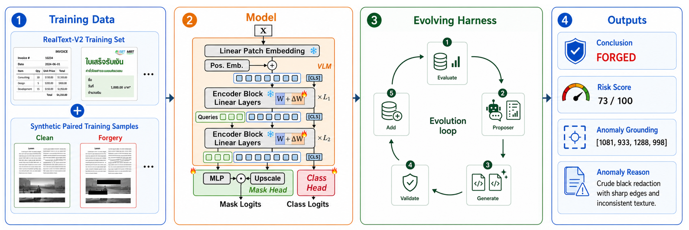
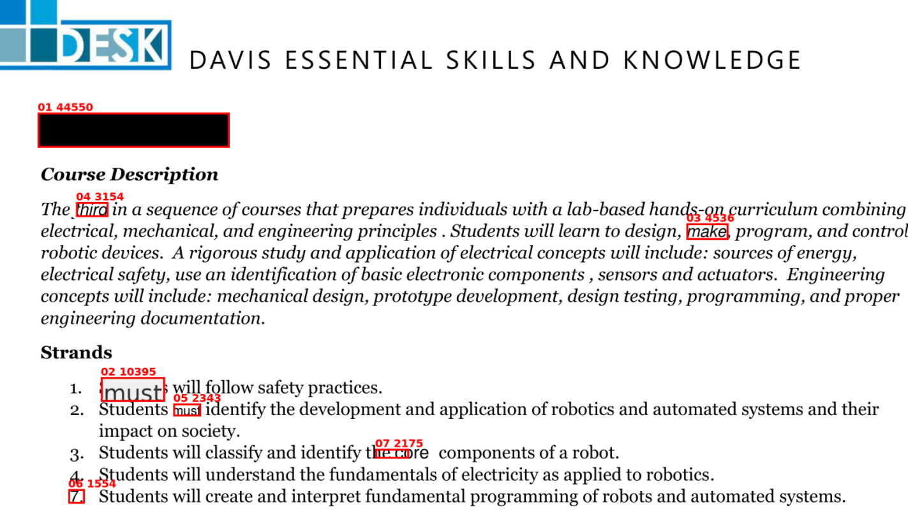

# SEED: Simple ViT and Evolving Harness for Explainable Text Forgery Detection

## 摘要

**论文元信息。** 本文解析论文 **SEED: Simple ViT and Evolving Harness for Explainable Text Forgery Detection**，作者为 Kahim Wong、Kemou Li、Yiming Chen、Haiwei Wu、Jiantao Zhou；arXiv ID 为 2606.21138，论文链接为 <https://arxiv.org/abs/2606.21138>，PDF 链接为 <https://arxiv.org/pdf/2606.21138>。论文自述 SEED 是 ACM MM 2026 GenText-Forensics Challenge 的第三名方案，任务面向多语言文本中心图像的检测、像素级定位与自然语言取证报告生成（见 PAGE 1、PAGE 2）。论文在摘要中声明代码与数据可用，链接为 <https://github.com/KahimWong/GenText-Forensics-3rd-Place>（见 PAGE 1）。当前仓库为公开仓库，README 中给出的模块结构与论文三阶段方案一致。

**一句话总结。** SEED 将“相似性引导的合成伪造数据生成、基于 DINOv3 ViT-L/16 与 LoRA 的统一检测/定位模型、以及通过 Meta-Harness 演化得到的 MLLM 报告生成器”组合成一个模块化管线，用较少可训练参数完成文本篡改图像的检测、定位和可解释报告生成（见 PAGE 2、PAGE 3、PAGE 4）。

本文的核心贡献可以概括为三点。第一，SEED 不是单纯做二分类或分割，而是面向挑战赛要求输出结构化 Markdown forensic report，报告必须同时回答 what、where、why，即“篡改了什么、在哪里篡改、为什么支持伪造结论”（见 PAGE 1、PAGE 2）。第二，SEED 采用 DINOv3 ViT-L/16 作为视觉基础模型，通过 LoRA 低秩适配（Low-Rank Adaptation）和 EoMT 结构，把图像级检测与像素级定位放在同一个 ViT 框架内完成（见 PAGE 2、PAGE 3、PAGE 4）。第三，SEED 将检测器输出的伪造概率和掩码交给 Meta-Harness，通过 proposer-evaluator loop 自动搜索报告生成 harness，而不是手写固定 prompt（见 PAGE 4）。

需要先说明证据边界：论文全文中只有两个编号公式，即最终挑战得分公式 Eq. (1) 与训练损失 Eq. (2)（见 PAGE 2、PAGE 4）。论文还给出了若干数学符号定义，例如输入图像 $X$、输出概率 $\hat{y}$、伪造图 $\hat{P}$、查询嵌入 $Q$、密集特征 $Z$、mask logits $M$ 等（见 PAGE 3、PAGE 4）。本文会引用这些论文中出现或由文字直接定义的数学表达，但不会补写论文没有给出的 LoRA 展开式、Mask2Former 内部损失展开式或 MLLM 生成公式；这些部分标记为“证据不足”。

## 背景与动机

AI 辅助图像编辑降低了文本级图像篡改的门槛，尤其影响金融、法律、身份记录等具有高信任要求的文档场景（见 PAGE 1）。与自然图像中的篡改不同，文本中心文档往往具有结构化布局、规则排版、印刷字体和背景纹理；被篡改的文本可能与周围内容高度融合，缺少明显边缘伪影，因此检测难度高于普通图像伪造（见 PAGE 1）。

GenText-Forensics Challenge 将这一问题提升为统一生成任务：给定一张文本中心图像，系统不仅需要判断是否伪造，还需要定位像素级伪造区域，并生成符合严格 Markdown schema 的取证报告（见 PAGE 2）。Figure 1 展示了挑战样例：输入包括伪造图像和伪造 mask，目标输出是包含 `[Conclusion]`、`[RISK_SCORE]`、`[GROUNDING]`、`[REASON]`、summary 和 `END OF REPORT` 的结构化报告（见 PAGE 1）。

用途：下图用于展示挑战任务的输入侧，即被篡改的文本中心文档。  
读图要点：应关注文本、遮挡区域、字体或语义不一致等可能支持伪造判断的局部证据。  


支撑的判断：Figure 1 的 forged image 说明挑战并不是抽象二分类，而是要在真实文档布局中定位局部异常，并为报告生成提供视觉证据（见 PAGE 1）。

用途：下图用于展示与 forged image 对应的像素级 forgery mask。  
读图要点：mask 给出被认为篡改的区域，是训练定位模型与评价 localization quality 的直接监督信号。  


支撑的判断：Figure 1 的 forgery mask 支撑论文将任务拆为 image-level detection 与 pixel-level localization 两个视觉子任务，再连接到报告生成（见 PAGE 1、PAGE 2）。

已有文本篡改定位（Text-Centric Image Forgery Localization, TFL）研究从 DocTamper、DTD、FFDN、ADCD-Net、TIFDM 到 CAFTB，通常依赖 RGB、DCT、噪声域特征、多尺度聚合或 CNN-Transformer 定制结构（见 PAGE 2）。论文指出，这类方法多采用 full-parameter fine-tuning（FPFT，全参数微调），而近期研究认为 FPFT 可能造成 vision foundation model 的低秩特征塌缩，降低跨域泛化能力（见 PAGE 2）。

SEED 的出发点是：在文本篡改检测中，训练集伪造模式容易被模型记忆，跨域泛化比训练集拟合更关键。因此作者选择冻结大部分 DINOv3 预训练参数，仅通过 LoRA 学习低秩残差更新，以保留视觉基础模型的 transferable visual priors（可迁移视觉先验）（见 PAGE 2、PAGE 3）。实验部分也支持这一动机：降低 LoRA rank、减少训练步数、减小 batch size 均提升跨域平均 F1（见 PAGE 5）。

另一个动机来自数据侧。真实挑战训练集虽然包含多语言、多领域、多篡改类型，但文本篡改模式仍可能不足以覆盖测试分布。论文因此采用 similarity-guided synthetic forgery generation，从 clean images 中选择 source-target crop pairs，生成 copy-move、splicing、insertion、inpainting、coverage 五类合成伪造，并构造 clean-forged paired training batches（见 PAGE 3）。

最后，报告生成不能简单视为模板填充。检测器输出的是图像级概率 $\hat{y}$ 和像素级概率图 $\hat{P}$，而挑战要求的是包含结论、风险分数、坐标 grounding、异常原因与 summary 的自然语言报告；二者表示形式不同，且报告 schema 严格（见 PAGE 4）。因此 SEED 引入 Meta-Harness，自动搜索 mask rendering、mask-to-boxes、prompt construction、output repair 等 harness 组件（见 PAGE 4）。

## 预备知识

**Text-Centric Image Forgery Localization（文本中心图像伪造定位）** 指在文档、票据、证照、截图、场景文本等图像中检测并定位被篡改的文字区域。论文明确指出，篡改文本经常与结构化布局无缝融合，且缺少自然图像篡改中常见的边界伪影，因此需要能够 localize manipulation 并 produce explainable evidence 的系统（见 PAGE 1）。

**Vision Transformer（ViT）与 DINOv3。** SEED 使用 DINOv3 ViT-L/16 作为 frozen backbone。这里的 ViT-L/16 表示大规模 ViT，patch size 为 16；DINOv3 是视觉基础模型，提供预训练视觉表征。论文的设计原则之一是保留视觉基础模型的 transferable visual priors，而不是对所有参数进行全量更新（见 PAGE 3）。

**LoRA（Low-Rank Adaptation，低秩适配）** 是一种 residual subspace adaptation 方法。论文没有给出 LoRA 的矩阵分解公式，因此本文不补写其数学展开；论文证据只支持如下表述：SEED 将 rank $r=1$ 的 LoRA 应用于 self-attention 层的 query、key、value、output projections，以及 MLP 层的 up/down projections，同时冻结其他 backbone 参数（见 PAGE 3）。公开代码中的 `model/lora.py` 进一步显示其实现是冻结原始 Linear 权重，只训练低秩残差参数。

**EoMT 与 Mask2Former-style mask head。** EoMT 的核心思想是把 ViT 转化为 segmentation model。SEED 在最后 $L_2=4$ 个 ViT blocks 前插入 learnable query token，使 query token 产生查询嵌入 $Q$，patch tokens 产生 dense features $Z$；随后使用 Mask2Former-style mask head 产生 mask logits $M$，再上采样为输入分辨率并经 sigmoid 得到最终概率图 $\hat{P}$（见 PAGE 4）。

**MLLM 与 Meta-Harness。** Multimodal Large Language Model（MLLM，多模态大语言模型）在 SEED 中不直接做端到端检测，而是接收 detector 的预测 mask overlay 和图像，生成结构化 forensic report（见 PAGE 4）。Meta-Harness 则是自动搜索 harness 的框架，候选 harness 封装可视化、坐标框转换、prompt 构造和输出修复逻辑，并通过 proposer-evaluator loop 迭代优化（见 PAGE 4）。

## 方法详解

### 1. 总体框架：三阶段管线而非单模型端到端

SEED 将 explainable text forgery detection 拆成三个阶段：合成伪造数据生成、ViT 检测与定位、MLLM 报告生成（见 PAGE 2、PAGE 3）。这种拆分与挑战任务的组成一致：视觉模型负责 detection 和 localization，harness 与 MLLM 负责 explanation 与 report schema compliance（见 PAGE 2、PAGE 4）。

用途：下图用于展示 SEED 的整体架构。  
读图要点：Stage 1 生成合成伪造；Stage 2 使用 DINOv3 ViT 检测并定位；Stage 3 通过 evolving loop 搜索 harness；Stage 4 输出结构化 forensic report。  



支撑的判断：Figure 2 直接支撑本文对 SEED 的三阶段解读，即它不是一个单一检测网络，而是“数据生成 + 视觉检测定位 + 报告生成 harness”的组合系统（见 PAGE 3）。

这种模块化设计的优点是评价指标可被分解优化。挑战最终分数定义为：

$$
S_{\mathrm{Fin}} = 0.3S_{\mathrm{Det}} + 0.4S_{\mathrm{Loc}} + 0.15S_{\mathrm{Exp}} + 0.15S_{\mathrm{Rep}}.
$$

其中 $S_{\mathrm{Det}}$ 是 image-level F1，$S_{\mathrm{Loc}}$ 是 mask mIoU，$S_{\mathrm{Exp}}$ 是 BERTScore，$S_{\mathrm{Rep}}$ 是 LLM judge rubric score（见 PAGE 2）。人话解释：最终分数中 localization 权重最高，为 0.4；detection 次之，为 0.3；解释文本质量和报告质量各占 0.15，因此视觉定位是主导项，但报告生成也会显著影响最终提交结果。

### 2. 合成伪造数据生成：用相似性引导扩展训练分布

论文采用 similarity-guided synthetic method，从 RealText-V2 clean images 中自动选择 source-target crop pairs，生成高质量伪造样本（见 PAGE 3）。该方法依赖两个模型：selection model 用于选择语义兼容的 crop pair，quality model 用于评估插入 crop 的视觉质量；论文称这一过程覆盖五类 manipulation types：copy-move、splicing、insertion、inpainting、coverage（见 PAGE 3）。

训练数据规模如下。

| Source | Type | # Samples |
|---|---:|---:|
| RealText-V2 | authentic | 6000 |
| RealText-V2 | forged | 7500 |
| RealText-V2 | Total | 13500 |
| Synthetic | copy-move | 5009 |
| Synthetic | coverage | 5002 |
| Synthetic | inpainting | 5004 |
| Synthetic | insertion | 5004 |
| Synthetic | splicing | 5009 |
| Synthetic | Total | 25028 |

表格解读：Table 1 显示，合成数据规模 25028 已显著超过原始 RealText-V2 训练集总量 13500，说明 SEED 的检测器并不是只依赖挑战原始训练分布，而是通过五类合成篡改扩大伪造模式覆盖面（见 PAGE 3）。这也解释了 Table 2 中 Train+Syn 相比 Train-only 的平均 F1 提升（见 PAGE 5）。

更关键的是 paired clean-forgery batch construction。论文指出，每个 synthetic forged sample 都与 pristine source image 配对，训练 batch 中放入同一文档的 clean 与 forged 版本，使模型在相同优化步骤中观察原始文档和篡改文档（见 PAGE 3、PAGE 4）。这不是普通数据增强，而是通过控制内容变量，让模型更关注伪造痕迹而非文档域、语言、布局等背景因素。

公开代码也体现了这一点。`ds.py` 中 `PairedMixedRealTextV2TrainDs` 负责解析 synthetic sample 对应的 clean real sample，并在 `__getitem__` 中返回 real/fake pair；`main.py` 的 `_prepare_train_batch` 再把 real 与 fake 拼接成一个训练 batch。下面是与论文 paired training 直接对应的短代码片段：

`ds.py:464-493`

```python
def _sample_syn_pair(self):
    fake_row = self.syn_rows[randint(0, self.syn_sample_n - 1)]
    real_row = self._resolve_clean_real_row(fake_row["image_path"])
    if real_row is None:
        raise KeyError(
            f"Unable to find clean real pair for synthetic sample {fake_row['image_path']}"
        )
    real_sample, fake_sample = self._load_same_crop_pair(real_row, fake_row)
    return (real_row, real_sample), (fake_row, fake_sample), "syn_data"
```

这段代码支撑论文中“synthetic forged sample is paired with its pristine source image”的描述（见 PAGE 3、PAGE 4）。它不是随机采样一个 clean image，而是根据 synthetic image path 反查对应 clean real row，从而实现 matched clean-forgery pair。

### 3. ViT 检测模型：一个 backbone 同时做 detection 与 localization

论文定义模型输入为：

$$
X \in \mathbb{R}^{3 \times H \times W}.
$$

这里 $X$ 表示三通道输入图像，$H$ 与 $W$ 分别表示高度和宽度（见 PAGE 3）。模型输出两个对象：

$$
\hat{y} \in [0,1], \qquad \hat{P} \in [0,1]^{H \times W}.
$$

其中 $\hat{y}$ 是 image-level forgery probability，$\hat{P}$ 是 pixel-level forgery probability map（见 PAGE 3）。人话解释：同一个模型既输出“这张图是否伪造”的概率，也输出“每个像素是否属于伪造区域”的概率。

架构上，SEED 使用 DINOv3 ViT-L/16 作为 frozen backbone，在 self-attention 的 query、key、value、output projections 以及 MLP 的 up/down projections 上添加 LoRA，rank 为 $r=1$（见 PAGE 3）。论文明确说其他 backbone 参数保持冻结，以 minimal parameter overhead 学习 forgery-specific traces（见 PAGE 3）。

公开代码中的 `model/eomt_sep_query.py` 与 `model/lora.py` 直接对应这一设计。

`model/eomt_sep_query.py:35-53`

```python
self.backbone = self.transformers_to_timm(
    AutoModel.from_pretrained(
        "facebook/dinov3-vitl16-pretrain-lvd1689m",
        cache_dir=cfg.hf_hub_cache,
    ),
    img_size,
)

if finetune_mode == "lora":
    from model.lora import apply_lora
    self.backbone = apply_lora(
        self.backbone,
        rank=lora_rank,
        target_keywords=target_keywords,
    )
```

这段代码支撑论文中“DINOv3 ViT-L/16 backbone + LoRA adaptation”的描述（见 PAGE 3）。其中 `target_keywords` 在 `cfg.py` 中默认为 `("attention", "mlp")`，与论文所述 attention 与 MLP projection 适配一致。

`model/lora.py:63-70`

```python
y = F.linear(x2d, self.weight, self.bias)

A = self.lora_A[0].to(dtype=dtype)
B = self.lora_B[0].to(dtype=dtype)

residual = F.linear(F.linear(x2d, A), B) * self.scaling
y = y + residual
```

这段代码说明实现层面是“冻结原线性层输出 + 低秩残差输出”。论文没有给出 LoRA 数学公式，因此本文不把这段实现改写成论文公式；只能据代码确认其 residual adaptation 行为。

### 4. EoMT mask head：query token 与 dense feature 的交互

论文描述了 localization 分支的关键符号。模型在最后 $L_2=4$ 个 ViT blocks 前插入 learnable query token；经过这些 blocks 后，query token 产生：

$$
Q \in \mathbb{R}^{N_q \times d},
$$

patch tokens 产生：

$$
Z \in \mathbb{R}^{H_p \times W_p \times d}.
$$

其中 $N_q$ 是 query 数量，$d$ 是 token feature dimension，$H_p$ 和 $W_p$ 是 patch-level feature map 的高和宽（见 PAGE 4）。论文进一步说明，query features 经 MLP $\phi_{\mathrm{mlp}}$ 变换，dense features 经 upsampling function $\phi_{\mathrm{up}}$ 变换，两者通过 dot product 产生：

$$
M \in \mathbb{R}^{N_q \times H_p \times W_p}.
$$

这里 $M$ 是 mask logits；随后双线性上采样到输入分辨率并通过 sigmoid 得到 $\hat{P}$（见 PAGE 4）。人话解释：query token 负责提出“疑似伪造对象”的查询，patch feature map 提供每个位置的视觉证据，二者点积得到每个查询对应的空间 mask。

公开代码中 `_predict` 使用 `torch.einsum` 将 query-side mask head 与 upscaled dense feature 相乘，直接对应上述 dot product。

`model/eomt_sep_query.py:137-141`

```python
mask_logits = torch.einsum(
    "bqc, bchw -> bqhw",
    self.mask_head(q),
    self.upscale(x),
)
```

这段代码支撑论文中“query features 与 dense features combined via dot product to produce mask logits”的文字描述（见 PAGE 4）。代码中的 `bqhw` 与论文的 $N_q \times H_p \times W_p$ 是 batch 化后的同一结构。

### 5. 图像级检测分支：CLS token 与 detection-first inference

论文称模型 prepend 一个 `[CLS]` token，并将其最终表示输入 classification head $\phi_{\mathrm{cls}}$，线性投影后通过 softmax 输出 forgery probability $\hat{y}$（见 PAGE 3、PAGE 4）。公开代码中 `image_head = nn.Linear(dim, 2)`，forward 末尾用 `image_logits = self.image_head(...)` 产生二分类 logits。

`model/eomt_sep_query.py:286-313`

```python
if i == len(self.backbone.blocks) - self.num_blocks:
    x = torch.cat((q_sel, x), dim=1)

x = self.backbone.norm(x)
image_logits = self.image_head(x[:, qn, :])

mask_logits, class_logits, query = self._predict(x, qn=qn)
```

需要注意，代码中 `x[:, qn, :]` 表示在 query token 之后取 prefix token 位置作为 image-level head 输入，这与论文描述的 CLS token 聚合全局伪造线索相符（见 PAGE 3、PAGE 4）。此外，论文实验还评估 detection-first inference：先用 image-level detection score 决定是否使用 localization mask，低于阈值则 suppress mask，从而降低 authentic images 的 false-positive masks（见 PAGE 6）。

### 6. 训练目标：分类、BCE、Dice 的组合损失

论文给出训练样本为 $(X, Y, y)$，其中 $Y \in \{0,1\}^{H \times W}$ 是 ground-truth mask，$y \in \{0,1\}$ 表示真实性标签（见 PAGE 4）。训练目标为：

$$
\mathcal{L}
=
\lambda_{\mathrm{CE}}\mathcal{L}_{\mathrm{CE}}(c,y)
+
\lambda_{\mathrm{BCE}}\mathcal{L}_{\mathrm{BCE}}(\hat{P},Y)
+
\lambda_{\mathrm{Dice}}\mathcal{L}_{\mathrm{Dice}}(\hat{P},Y).
$$

其中权重为：

$$
\lambda_{\mathrm{CE}}=1.0,\quad
\lambda_{\mathrm{BCE}}=5.0,\quad
\lambda_{\mathrm{Dice}}=5.0.
$$

人话解释：分类损失负责判断整图是否伪造，BCE 与 Dice 损失负责像素级 mask；BCE 强调逐像素概率，Dice 更关注区域重叠，二者权重都高于 CE，反映 localization 在最终任务中的重要性（见 PAGE 4）。

公开代码中 `model/mask_classification_loss.py` 使用 Mask2FormerLoss 与 Hungarian matcher，并将 mask、dice、cross_entropy 按系数组合。这里有一个证据边界：论文公式写的是 $\lambda_{\mathrm{CE}}=1.0$，而仓库当前 `MaskClassificationLoss` 默认 `class_coefficient=2.0`；这可能来自代码版本、训练配置或论文公式与实现封装差异，本文不进一步推断，只记录二者均有证据来源。论文公式见 PAGE 4，代码默认值见 `model/mask_classification_loss.py:22-31`。

### 7. Evolving Harness：从 mask 到结构化取证报告

报告生成阶段的输入是 detector 的 image-level forgery probability $\hat{y}$ 与 pixel-level probability map $\hat{P}$；输出则是包含 verdict、bounding-box groundings、forensic reasoning 和 summary 的 Markdown 报告（见 PAGE 4）。论文强调“this conversion is non-trivial”，因为视觉概率图与自然语言报告是 fundamentally different representations（见 PAGE 4）。

用途：下图用于展示 harness 阶段送入 MLLM 的视觉输入。  
读图要点：预测伪造 mask 会叠加到原图上，使 MLLM 在生成报告前能看到显式 suspicious regions。  



支撑的判断：Figure 3 支撑“mask overlay 是报告生成桥接表示”的判断，即 MLLM 并不是只看原图或只看坐标，而是看带有预测伪造区域的可视化输入（见 PAGE 4）。

论文给出 harness candidate 的接口语义：每个 harness 接收 original image、predicted mask、image-level forgery probability，渲染 visual overlay，将 mask 转为 bounding boxes，构造 prompt，调用 MLLM，修复输出以满足 schema，并返回 valid forensic report（见 PAGE 4）。公开代码中 `meta_harness/harness.py` 定义 `ForgeryReportHarness` 抽象类，`meta_harness/overlay.py` 提供 connected components 到 bounding boxes 的转换和 red box overlay 渲染，`meta_harness/report_utils.py` 提供 schema validation 与 report builder。

`meta_harness/overlay.py:121-132`

```python
num_labels, _, stats, _ = cv2.connectedComponentsWithStats(mask_array, connectivity=4)
components = []
for label_idx in range(1, num_labels):
    x, y, w, h, area = [int(value) for value in stats[label_idx]]
    if area >= min_area:
        components.append({"box": [x, y, x + w, y + h], "area": area})
components.sort(key=lambda item: item["area"], reverse=True)
return components[:max_boxes]
```

这段代码支撑论文中“mask to bounding boxes”的 harness 功能（见 PAGE 4）。它将二值 mask 的连通域转为坐标框，并按面积排序，服务于报告中的 `[GROUNDING]` 字段。

### 8. Meta-Harness 的评价与演化循环

论文对 harness 搜索设置了固定 search set：50 个训练样本（见 PAGE 4）。每个 candidate 计算两个分数：$S_{\mathrm{Exp}}$ 是 generated explanation text 与 ground-truth expert report 的 BERTScore F1；$S_{\mathrm{Rep}}$ 是 GPT-4o-mini 根据 factuality、reasoning quality、completeness 给出的 0–100 LLM-judge rubric score（见 PAGE 4、PAGE 5）。

论文定义 harness 搜索中的 composite score 为：

$$
S = 0.15S_{\mathrm{Exp}} + 0.15S_{\mathrm{Rep}}.
$$

人话解释：这里的 $S$ 只对应最终挑战公式中 explanation-related terms 的权重，即解释文本质量和报告质量两项；它不重新评价 detector 的 detection 或 localization（见 PAGE 4）。

Evolution loop 包括五步：评估当前候选、构造 proposer prompt、proposer LLM 生成两个新 harness candidates、验证 import correctness 与 interface compliance、评估有效候选并加入 population；循环运行 $T=30$ iterations，并维护 $S_{\mathrm{Exp}}$ 与 $S_{\mathrm{Rep}}$ 的 Pareto frontier（见 PAGE 4）。论文还声明整个 harness code 由 proposer LLM 自动生成，没有手工 prompt、few-shot examples 或 repair logic 调参（见 PAGE 4）。这是一个重要主张，但除论文文字和仓库中可见 harness 文件外，全文没有给出演化过程的完整日志，因此对“完全自动生成”的可复现实证仍依赖作者报告。

## 实验分析

### 1. 数据集与评价设置

实验使用 RealText-V2 training set，并报告 pixel-level localization F1、precision、recall，以及 image-level detection F1（见 PAGE 5）。跨域测试集来自 ForensicHub，包括 T-SROIE、OSTF、TPIC-13、RTM；所有 ForensicHub samples 裁剪到 $512 \times 512$ resolution（见 PAGE 5）。

训练实现细节为：detector 训练 5k steps，优化器 AdamW，学习率从 $3 \times 10^{-4}$ cosine annealing 到 $1 \times 10^{-5}$，weight decay 为 $1 \times 10^{-4}$，batch size 为 20，使用 FP16 与 5 张 NVIDIA RTX 3090 GPUs 的 DDP（见 PAGE 5）。Harness 配置为 base MLLM 使用 Qwen3.5-Flash，judge model 为 GPT-4o-mini，proposer 为 GPT-5.5；Meta-Harness 搜索 30 iterations，每轮 2 个 candidates，BERTScore 使用 `google-bert/bert-base-multilingual-cased`（见 PAGE 5）。

### 2. 跨域检测与定位：容量降低反而提升泛化

以下表格摘取 Table 2 中最关键的配置，用于比较 LoRA rank、数据、paired training 对平均 localization F1 与 detection F1 的影响。

| # | LoRA | Step | Batch | JPEG | Data | Paired | Avg Loc-F1 | Avg Det-F1 |
|---:|---|---:|---:|---|---|---|---:|---:|
| 3 | r=32 | 5k | 20 | ✓ | Train | ✗ | 0.539 | 0.574 |
| 4 | r=1 | 5k | 20 | ✓ | Train | ✗ | 0.564 | 0.585 |
| 6 | r=1 | 5k | 20 | ✗ | Train | ✗ | 0.572 | 0.595 |
| 8 | r=1 | 5k | 20 | ✗ | Train+Syn | ✗ | 0.625 | 0.649 |
| 9 | r=1 | 5k | 20 | ✗ | Train+Syn | ✓ | 0.619 | 0.677 |

表格解读：Table 2 支持三个判断。第一，将 LoRA rank 从 $r=32$ 降到 $r=1$，Avg Loc-F1 从 0.539 提升到 0.564，Avg Det-F1 从 0.574 提升到 0.585，说明低容量适配更利于跨域泛化（见 PAGE 5）。第二，加入 synthetic data 后，Avg Loc-F1 从 0.572 提升到 0.625，Avg Det-F1 从 0.595 提升到 0.649，说明合成数据带来主要收益（见 PAGE 5）。第三，paired training 进一步把 Avg Det-F1 从 0.649 提升到 0.677，但 Avg Loc-F1 从 0.625 小幅降到 0.619，说明 clean-forgery pairing 更偏向提升图像级判别，而非无代价提升像素定位（见 PAGE 5）。

论文对训练步数和 batch size 的分析也支持“不要过度拟合训练伪造模式”的观点。10k steps、batch size 60 的配置平均 Det-F1 仅 0.381；将 batch size 减到 20 后 Avg Det-F1 提升到 0.502；再将 10k steps 减到 5k，Avg Det-F1 提升到 0.574（见 PAGE 5）。这表明在该任务上，更多训练并不必然更好，过强拟合可能损害跨域泛化。

Attention + MLP LoRA 与 MLP-only LoRA 的对比也很有信息量。论文指出，MLP-only 相比 full attention+MLP LoRA，Avg Det-F1 从 0.585 降到 0.535，而 Avg Loc-F1 基本不变，分别为 0.564 与 0.568（见 PAGE 5）。这说明 attention-layer adaptation 对 image-level detection 更关键，而 localization 对 attention 与 MLP features 的依赖更均衡（见 PAGE 5）。

### 3. 训练图像尺寸：定位收益与计算成本的权衡

Table 3 分析 training image size 对 patched detection-first inference 的影响。以下摘取 Train-1000 与 Syn-1000 上的 pixel F1 与 image F1。

| Img size | Det-thr | Mask-thr | Train Pix F1 | Train Img F1 | Syn Pix F1 | Syn Img F1 |
|---:|---:|---:|---:|---:|---:|---:|
| 512 | 0.99 | 0.99 | 0.673 | 0.992 | 0.636 | 0.912 |
| 786 | 0.99 | 0.99 | 0.700 | 0.991 | 0.673 | 0.924 |
| 1024 | 0.99 | 0.99 | 0.720 | 0.995 | 0.682 | 0.917 |
| 1280 | 0.99 | 0.99 | 0.737 | 0.994 | 0.694 | 0.924 |
| 1280 | 0.95 | 0.95 | 0.761 | 0.996 | 0.725 | 0.931 |

表格解读：Table 3 显示更大训练分辨率持续提升 pixel F1。Train-1000 上从 512 到 1280，Pix F1 从 0.673 提升到 0.737；Syn-1000 上从 0.636 提升到 0.694（见 PAGE 5、PAGE 6）。当 1280 分辨率下阈值从 0.99 降到 0.95，Train Pix F1 进一步到 0.761，Syn Pix F1 到 0.725（见 PAGE 6）。但论文同时指出，1280px 的像素数是 512px 的 $6.25\times$，是 1024px 的约 $1.56\times$，因此定位收益伴随显著训练成本（见 PAGE 6）。

该结果对业务复用有直接含义。证照、票据、截图中的文本篡改往往发生在小区域，低分辨率会模糊字符边缘和局部排版异常；提高分辨率能恢复细粒度边界。但在上线场景中，训练和推理成本、显存占用、长图切块策略都必须纳入系统设计，不能只看 pixel F1。

### 4. Detection-first inference：用整图判断抑制误检 mask

Table 4 评估两阶段推理：先看 image-level detection score，只有高于阈值时才使用 localization mask，否则 suppress mask（见 PAGE 6）。这相当于让 detection 分支充当 localization 的 gate，目标是减少 authentic images 上的 false-positive masks。

| Det-thr | Mask-thr | Pix F1 | Pix P | Pix R | Img F1 | Img P | Img R |
|---:|---:|---:|---:|---:|---:|---:|---:|
| 0.50 | 0.50 | 0.444 | 0.314 | 0.760 | 0.853 | 0.743 | 1.000 |
| 0.90 | 0.90 | 0.623 | 0.571 | 0.685 | 0.962 | 0.926 | 1.000 |
| 0.95 | 0.95 | 0.667 | 0.690 | 0.646 | 0.974 | 0.949 | 1.000 |
| 0.99 | 0.99 | 0.673 | 0.889 | 0.541 | 0.992 | 0.986 | 0.998 |
| 0.999 | 0.999 | 0.487 | 0.980 | 0.324 | 0.979 | 1.000 | 0.958 |

表格解读：从 threshold 0.50 到 0.99，pixel precision 从 0.314 大幅提升到 0.889，image F1 从 0.853 提升到 0.992，但 pixel recall 从 0.760 降到 0.541（见 PAGE 6）。这说明高阈值策略适合低误报要求高的文档风控场景，但会漏掉部分真实篡改像素。阈值 0.999 进一步提高 precision 到 0.980，却使 recall 跌到 0.324，Pix F1 降到 0.487，说明过度保守会破坏定位完整性（见 PAGE 6）。

### 5. Meta-Harness 演化：报告质量的自动改进

论文报告了 50-sample search set 上的 Meta-Harness evolution trajectory。Seed harness 已有较高 schema validity，主要因为内置 schema repair；经过 30 iterations 后，$S_{\mathrm{Exp}}$、$S_{\mathrm{Rep}}$ 和 schema validity 均提升（见 PAGE 6）。

| Stage | $S_{\mathrm{Exp}}$ | $S_{\mathrm{Rep}}$ | Schema Val. |
|---|---:|---:|---:|
| Seed harness (iteration 0) | 68.7 | 76.2 | 0.94 |
| After 5 iterations | 69.8 | 77.5 | 0.95 |
| After 15 iterations | 71.4 | 78.8 | 0.96 |
| After 30 iterations (selected) | 72.4 | 79.8 | 0.98 |

表格解读：Table 5 显示 final selected harness 相比 seed harness，$S_{\mathrm{Exp}}$ 提升 3.7，$S_{\mathrm{Rep}}$ 提升 3.6，schema validity 从 0.94 提升到 0.98（见 PAGE 6）。提升幅度不算巨大，但方向稳定，说明自动搜索确实能改进报告质量。论文还指出 proposer 发现的改进包括 coordinate-span repair、calibrated risk-score estimation、evidence-chain prompting（见 PAGE 6）。不过，这些具体改进的逐项消融没有在全文中展开，因此“哪个 harness 组件贡献最大”证据不足。

## 讨论

SEED 的适用边界首先由数据分布决定。论文中的挑战数据 RealText-V2 覆盖 20K+ samples、6 种语言和 6 个领域，包括 finance、healthcare、education、legal、identity、general（见 PAGE 2）。这使其对证照、票据、截图类文本篡改检测具有较强参考价值。但挑战规则禁止使用 external datasets，模型和 harness 的泛化结论主要来自 ForensicHub 的四个跨域测试集，而非真实生产线上所有文档来源（见 PAGE 3、PAGE 5）。

从方法论角度看，SEED 的强项不是提出复杂新网络，而是把 foundation model adaptation、synthetic data、paired training 与 report harness optimization 组合成一个任务闭环。Table 2 的结果表明，简单降低 LoRA rank、减少训练步数、加入合成数据、构造 clean-forgery pair，比盲目扩大可训练容量更有价值（见 PAGE 5）。这对文档风控模型训练有启示：跨域泛化不一定来自更大微调，而可能来自更好的数据对比结构与更保守的参数更新。

报告生成部分的意义在于把 detection/localization 的视觉输出转化为可审计文本。对于金融、法律和身份文档，二分类分数通常不足以支撑人工复核或合规留痕；报告中的 `[GROUNDING]` 与 `[REASON]` 更接近业务可解释证据（见 PAGE 1、PAGE 4）。然而，MLLM 生成天然存在幻觉、成本和稳定性风险；论文也在结论中把 MLLM hallucination in forensic reasoning 列为未来工作方向（见 PAGE 6）。

代码层面，公开仓库与论文方法总体一致：`model/eomt_sep_query.py` 对应 DINOv3 + LoRA + EoMT detector，`ds.py` 对应 paired mixed data loader，`meta_harness/overlay.py` 与 `meta_harness/report_utils.py` 对应 mask-to-box、overlay、schema validation 与 report construction。需要注意的是，公开仓库 README 提供的是可运行框架和模型/数据链接，但本文未在本地执行训练或复现实验；因此代码分析只确认“实现结构与论文描述一致”，不等于验证论文全部数值。

## 局限分析

**作者自述局限 1：检测器容易过拟合训练集伪造模式。** 论文结论明确指出，experiments reveal that the forgery detector is prone to overfitting training-set patterns；降低 LoRA rank、减少训练步数和减小 batch size 能改善 cross-domain generalization（见 PAGE 6）。这与 Table 2 中更低容量配置表现更好一致（见 PAGE 5）。

**作者自述局限 2：MLLM forensic reasoning 存在幻觉风险。** 论文未来工作明确提出应 address MLLM hallucination in forensic reasoning（见 PAGE 6）。这对取证报告尤其关键，因为报告中的自然语言原因可能被业务人员或审核人员解释为证据。如果 MLLM 根据 overlay 生成了看似合理但视觉上不成立的原因，就会引入新的合规风险。

**作者自述局限 3：合成伪造质量仍需提升。** 论文未来工作还提出 explore advanced generative models for producing higher-quality forgery samples，尤其是 challenging domains such as RTM（见 PAGE 6）。这说明当前 similarity-guided synthetic data 虽然带来明显增益，但对困难域仍不充分；Table 2 中 RTM 的 localization 和 detection 分数整体偏低，也支持这一点（见 PAGE 5）。

**独立判断 1：报告生成的评价闭环较小。** Meta-Harness search set 只有 50 training samples，虽然 Table 5 显示 $S_{\mathrm{Exp}}$ 和 $S_{\mathrm{Rep}}$ 稳定提升，但 50 样本是否足以覆盖多语言、多领域、不同篡改类型，证据不足（见 PAGE 4、PAGE 6）。如果用于生产，至少需要独立 held-out report evaluation，并按语言、领域、篡改类型分层分析。

**独立判断 2：论文对最终挑战总分缺少拆分披露。** 论文说明 SEED ranked 3rd，并给出多组 ablation 表，但全文未给出最终 leaderboard 上完整 $S_{\mathrm{Det}}$、$S_{\mathrm{Loc}}$、$S_{\mathrm{Exp}}$、$S_{\mathrm{Rep}}$ 拆分，也未给出与第一、第二名方案的直接对比（见 PAGE 1、PAGE 5、PAGE 6）。因此可以判断 SEED 是有效竞赛方案，但不能据本文单独判断它相对于所有竞争系统的主要差距来自视觉定位还是报告生成。

**独立判断 3：代码与论文公式存在小的可核对差异。** 论文 Eq. (2) 给出 $\lambda_{\mathrm{CE}}=1.0$，而当前仓库 `MaskClassificationLoss` 默认 `class_coefficient=2.0`。这不必然表示错误，可能是实现封装、不同训练脚本或后续代码更新导致；但在复现实验时需要以作者发布的 checkpoint/config 为准，而不能只按论文公式或只按当前默认代码推断。

## 结论

SEED 的价值在于将文本篡改取证问题从“检测一个分数”推进到“检测、定位、解释一体化报告”。论文给出的证据表明，DINOv3 ViT-L/16 + rank-1 LoRA + EoMT mask head 可以在较少可训练参数下完成统一检测与定位；similarity-guided synthetic data 和 paired clean-forgery training 对跨域泛化有明显帮助；Meta-Harness 则为严格 schema 的 forensic report generation 提供了自动优化路径（见 PAGE 2、PAGE 3、PAGE 4、PAGE 5、PAGE 6）。

对文档风控、证照审核、票据核验和截图篡改检测而言，SEED 最值得复用的不是某个单独模块，而是其工程化分解：先用合成与配对训练增强视觉检测，再用低秩适配控制泛化风险，最后用 mask overlay、box grounding 和 schema repair 约束 MLLM 报告生成。上线前仍需重点补足三类验证：真实业务分布上的跨域测试、MLLM 报告幻觉与成本评估、以及不同文档语言和领域下的阈值校准。

## 证据索引

| 证据点 | PAGE |
|---|---|
| 论文题目、作者、摘要、代码链接、SEED ranked 3rd | PAGE 1 |
| Figure 1：forged image、forgery mask、target forensic report schema | PAGE 1 |
| 任务要求 detection、localization、explanation，并生成结构化 forensic report | PAGE 1、PAGE 2 |
| 最终挑战得分公式 $S_{\mathrm{Fin}}$ 及四个子指标定义 | PAGE 2 |
| RealText-V2 数据集规模、语言、领域、标签与报告组成 | PAGE 2 |
| 相关工作：TFL、synthetic data、LLM-based forensic reporting | PAGE 2 |
| SEED 三个贡献：DINOv3+LoRA+EoMT、paired clean-forgery training、Meta-Harness | PAGE 2 |
| Figure 2：SEED 三阶段/四阶段 pipeline overview | PAGE 3 |
| Synthetic forgery generation 五类 manipulation types 与 Table 1 数据规模 | PAGE 3 |
| DINOv3 ViT-L/16、LoRA rank $r=1$、attention/MLP projections 适配 | PAGE 3 |
| 输入 $X$、输出 $\hat{y}$ 与 $\hat{P}$ 的数学定义 | PAGE 3 |
| Query embeddings $Q$、dense features $Z$、mask logits $M$、$L_2=4$ blocks | PAGE 4 |
| Figure 3：MLLM harness 阶段的 mask overlay visual input | PAGE 4 |
| 训练损失 Eq. (2) 与 $\lambda_{\mathrm{CE}}$、$\lambda_{\mathrm{BCE}}$、$\lambda_{\mathrm{Dice}}$ | PAGE 4 |
| Meta-Harness interface、evaluation、evolution loop、$T=30$ iterations | PAGE 4 |
| Detector 训练设置：AdamW、learning rate、batch size、FP16、5 RTX 3090 | PAGE 5 |
| Harness 配置：Qwen3.5-Flash、GPT-4o-mini、GPT-5.5、50 search samples | PAGE 5 |
| Table 2：cross-domain localization/detection F1 与 LoRA、synthetic、paired ablation | PAGE 5 |
| Table 3：training image size 对 Train-1000 与 Syn-1000 的影响 | PAGE 5、PAGE 6 |
| Table 4：detection-first inference threshold calibration | PAGE 6 |
| Table 5：Meta-Harness evolution results | PAGE 6 |
| 作者结论与未来工作：overfitting、MLLM hallucination、higher-quality forgery samples、RTM | PAGE 6 |
