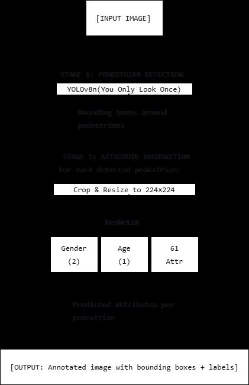
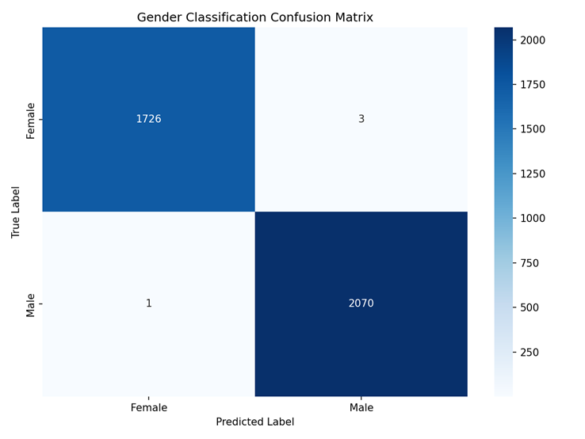

# Real-time pedestrian attribute recognition with YOLOv8 and ResNet18

## 摘要

**论文元信息。** 本文题为 *Real-time pedestrian attribute recognition with YOLOv8 and ResNet18*，作者为 Houssam El Mir，arXiv ID 为 2606.21200，发布时间为 2026-06-23，论文链接为 [https://arxiv.org/abs/2606.21200](https://arxiv.org/abs/2606.21200)，PDF 链接为 [https://arxiv.org/pdf/2606.21200](https://arxiv.org/pdf/2606.21200)。论文正文未给出可确认的公开代码仓库；Data Availability 仅说明 attribute-mapping file、preprocessing scripts、evaluation scripts、split information、trained-model checkpoints 等材料“available from the author upon reasonable request”，并可作为 arXiv supplementary material 准备发布，见 PAGE 10。因此，本文代码状态判定为：**本文未提供可确认的公开代码**。

**一句话总结。** 本文不是提出新型网络结构，而是构建并评估一个面向实时部署的两阶段行人属性识别（Pedestrian Attribute Recognition, PAR）baseline：YOLOv8n 负责行人检测，ResNet18 任务头负责性别分类、表观年龄回归与 61 个二值属性预测，核心价值在于检测裁剪、异构数据集语义映射、轻量分类器和实时吞吐的系统化整合，见 PAGE 1、PAGE 3、PAGE 4。

从业务角度看，该工作适合作为“检测裁剪 + 轻量分类/属性头”的实时行人属性识别 baseline。它的优势是端到端链路明确、组件常见、复现成本相对低；主要风险是多属性任务的 macro F1 只有 36.32%，明显低于 89.96% overall accuracy 和 58.80% micro F1，说明长尾属性和稀有小目标属性仍不可直接上线，见 PAGE 8、PAGE 10。

## 背景与动机

行人属性识别（Pedestrian Attribute Recognition, PAR）旨在从行人图像中预测语义属性，例如服装类型、携带物、性别和表观年龄。论文将 PAR 的应用场景定位在 surveillance、transportation analytics、human-computer interaction，以及 virtual try-on、avatar generation 等 human-centred graphics 应用中；这些属性可以把原始视频帧转化为可检索的结构化 metadata，见 PAGE 1。

该领域的基本问题并不只是“分类一张图”。在真实视频中，行人通常来自检测器输出的 bounding box，存在尺度变化、视角变化、遮挡、光照变化和检测框误差；同时，属性标签是多值、多标签、长尾分布的。论文明确指出 practical PAR 的困难包括 crop scale、viewpoint、illumination、occlusion、multi-valued labels、detection error propagation 和 highly imbalanced attributes，见 PAGE 1。

相关工作可以分为三条线索。第一条是 pedestrian detection：早期 HOG+SVM 后，Faster R-CNN 提升精度但计算开销较高，YOLO 系列强调实时检测，YOLOv8 引入 anchor-free detection，适合 surveillance 场景，见 PAGE 2。第二条是 attribute recognition：早期方法为每个属性训练独立分类器，较少建模衣物、携带物和 demographic cues 之间的相关性；深度学习后，shared feature extraction、joint multi-label learning、attention mechanism、multi-task learning 和 imbalanced classification 成为主要方向，见 PAGE 2。第三条是数据集建设：PETA 提供约 19k 图像和 61 个属性，PA-100K 提供 100k 图像和 26 个属性，两者标注协议不同，需要语义映射才能联合使用，见 PAGE 2、PAGE 3。

本文的动机不是替代 HydraPlus-Net、JRL 或 Transformer PAR 等更强的 cropped-person classifier，而是评估一个完整的 detection-to-attribute pipeline。论文原文将自身定位为 “practical, reproducible computer-vision system”，强调标准组件如何集成、训练和评估，而不是提出新网络结构，见 PAGE 1。这一点对工程复现很关键：该工作更像是可部署 baseline，而非 benchmark SOTA 声明。

本文的核心出发点有三项。第一，真实部署中必须把 person detection 和 attribute classification 串起来，而不是只在人工裁剪图上做属性分类，见 PAGE 5。第二，PETA 和 PA-100K 的数据规模与属性空间互补，需要通过 conservative semantic mapping 扩大训练数据，同时保留 PETA 的 61 属性输出空间，见 PAGE 2、PAGE 3。第三，系统必须给出端到端 runtime，而不是只报告分类器离线速度；论文报告完整 detection-to-recognition pipeline 在 NVIDIA RTX 5060 GPU 上达到 25–30 FPS，见 PAGE 9。

## 预备知识

PAR 中的 multi-label classification 与普通 single-label classification 不同。一名行人可以同时具有多个属性，例如 `upperBodyBlack`、`lowerBodyTrousers`、`carryingBackpack`。因此，多属性头通常不是 softmax，而是对每个属性输出一个独立 sigmoid 概率。论文称 multi-attribute model uses $K$ sigmoid outputs with positive-class weighting，其中 $K$ 表示目标属性数，在本文中是 PETA 61-attribute space，见 PAGE 4。

Macro F1 与 micro F1 是理解本文实验结果的关键。Macro F1 对每个属性等权平均，因此对稀有属性敏感；micro F1 汇总所有属性决策，因此更受高频标签影响。论文特别说明 accuracy 在高度不均衡的 multi-label setting 中可能夸大性能，而 macro F1 能更好暴露 rare categories 的问题，见 PAGE 5。本文中 89.96% overall accuracy 与 36.32% macro F1 的差距，正是长尾属性风险的主要证据，见 PAGE 8。

两阶段 pipeline 还涉及 error propagation。YOLOv8n 如果漏检，后续属性头完全没有输入；如果检测框过松或偏移，背景和截断区域会进入 ResNet18，影响衣物颜色、携带物和鞋类等局部属性的判断。论文在 Related Work 中明确指出 detection quality 对下游预测重要，因为 missed detections 会移除行人，loose or inaccurate bounding boxes 会引入 background clutter，见 PAGE 2。

## 方法详解

### 1. 总体架构：YOLOv8n 检测 + ResNet18 多任务识别

本文采用 two-stage PAR pipeline。第一阶段使用 YOLOv8n 检测每帧中的 pedestrians；第二阶段将每个 detected crop resize 到 $224 \times 224$，再输入 ResNet18-based classifiers，见 PAGE 3。该架构的主要优点是工程可解释性强：检测器、裁剪逻辑、预处理和属性识别头都可以独立替换，论文也明确说明 modular design allows the detector or classifier to be replaced independently，见 PAGE 3。

用途：Figure 1 用于说明完整 detection-to-recognition pipeline 的信息流。  
读图要点：YOLOv8n 先定位行人，系统随后对 person crop 做 resize 和 normalization，再由 ResNet18-based heads 输出不同任务结果。  
支撑的判断：本文的主要贡献是系统整合与实时评估，而不是新 backbone 或新 attention module，见 PAGE 3。

图后判断：Figure 1 支撑了“检测误差会传递到属性识别”的分析。因为 ResNet18 只处理 YOLOv8n 的 crop，crop 边界、漏检和背景混入都会影响下游属性结果，尤其是小区域属性，如 hat、bag、footwear 和 sleeve length，相关错误模式也在 PAGE 8 被论文列出。

### 2. 实现工作流：frame、box、crop、normalize、head

论文将实现流程拆成四步。第一，每个 input frame 输入 YOLOv8n detector，返回 person bounding boxes 和 confidence scores。第二，对每个 person box 做 crop，并通过 boundary checks 避免 invalid image regions。第三，crop 被 resize 和 normalized 后输入 task-specific ResNet18 models。第四，predicted attributes 和 confidence scores 被关联回原 bounding box，见 PAGE 3。

这种设计的工程含义是：系统输出不是单张图的离线属性，而是带有空间位置的行人级 metadata。对视频检索或监控分析而言，bounding box 与属性必须绑定，否则无法在原始帧中定位“穿黑色上衣、背包、长裤”的目标。论文没有给出 tracking 或跨帧 identity association，因此它解决的是 per-frame pedestrian attribute recognition，而不是完整的 multi-object tracking + attribute retrieval 系统；这一边界由 PAGE 3 的 workflow 描述可见。

### 3. 数据集准备：PETA 与 PA-100K 的语义映射

本文使用 PETA 与 PA-100K。PETA 包含约 19,000 张图像和 61 个 binary attributes；PA-100K 包含 100,000 张图像和 26 个 attributes，见 PAGE 3。二者不能直接拼接，因为属性空间不同。本文采用 semantic matching，把 PA-100K 中语义清晰对应的标签映射到 PETA 的 61-attribute space，例如 `LongSleeve` 映射到 `upperBodyLongSleeve`，`Backpack` 映射到 `carryingBackpack`，见 PAGE 3、PAGE 4。

| PA-100K label | Mapped PETA label | 证据 |
|---|---|---|
| LongSleeve | upperBodyLongSleeve | Table 1, PAGE 4 |
| ShortSleeve | upperBodyShortSleeve | Table 1, PAGE 4 |
| Trousers | lowerBodyTrousers | Table 1, PAGE 4 |
| Skirt | lowerBodySkirt | Table 1, PAGE 4 |
| Hat | accessoryHat | Table 1, PAGE 4 |
| Backpack | carryingBackpack | Table 1, PAGE 4 |
| ShoulderBag | carryingMessengerBag | Table 1, PAGE 4 |

表格解读：Table 1 体现了本文数据合并策略的保守性：只映射具有清晰语义一致性的属性，不强行把所有 PA-100K 标签塞进 PETA 空间。这样可以增加训练样本量，同时降低 false negative label 的风险，见 PAGE 3、PAGE 4。但它也留下一个复现风险：论文没有公开完整 mapping file，只在 Data Availability 中说可向作者索取，见 PAGE 10。

### 4. 输入预处理：224×224 与 ImageNet normalization

所有行人图像被 resize 到 $224 \times 224$，并使用 ImageNet statistics 做 normalization：mean = [0.485, 0.456, 0.406]，standard deviation = [0.229, 0.224, 0.225]，见 PAGE 3。这里的工程选择与 ResNet18 的 ImageNet 预训练兼容，因为 ResNet18 原始输入设定即围绕 ImageNet 图像分布构建。

需要注意的是，论文只给出了均值和标准差数值，没有显式写出 normalization formula。因此本文不把标准归一化写成论文公式证据。可复现时通常会按通用 PyTorch `Normalize(mean, std)` 解释，但严格证据只能说明论文使用了这些 ImageNet statistics，见 PAGE 3。

### 5. Detector 配置：YOLOv8n 的轻量实时取向

YOLOv8n 使用 COCO-pretrained weights，并在 inference mode 下运行。帧被 resize 到 $640 \times 640$，confidence threshold 为 0.25，non-maximum-suppression IoU threshold 为 0.45，见 PAGE 4。YOLOv8n 的选择体现了轻量实时取向：与更大 detector 相比，它更适合 25–30 FPS 的完整 pipeline 目标。

不过，论文没有报告 detector-only 的 mAP、recall 或 missed detection rate，也没有给出 ground-truth crop 与 YOLO crop 的对照。因此，虽然 PAGE 9 报告 YOLOv8n detection takes approximately 33.3 ms per frame，但无法量化检测误差对各属性 F1 的独立影响。论文自己也在 PAGE 8–PAGE 9 承认当前 manuscript reports final trained pipeline，不声称 full controlled ablation study。

### 6. ResNet18 任务头：性别、年龄与多属性

本文训练了三个 ImageNet-pretrained ResNet18 networks。Gender model 使用 two output neurons；apparent-age model 使用 one regression output；multi-attribute model 使用 $K$ sigmoid outputs with positive-class weighting，见 PAGE 4。这里的 $K$ 是多属性输出维度，结合前文 PETA 61-attribute space，可理解为 61 个二值属性输出，见 PAGE 1、PAGE 4。

这种做法没有共享一个 backbone 再接多个 head，而是论文表述中的 “Three ImageNet-pretrained ResNet18 networks are fine-tuned for the downstream tasks”，见 PAGE 4。这意味着性别、年龄和属性任务在模型实例上是分离的。它降低了多任务负迁移风险，但也可能增加每个 detected person 的推理开销；论文只报告整体 25–30 FPS，并说明 ResNet18 inference adds a pedestrian-dependent cost，见 PAGE 9。

### 7. 损失函数：性别二分类

论文给出的性别损失为：

$$
L_{gender} = -[y \log(p) + (1-y)\log(1-p)]
$$

其中 $y$ 表示 binary gender label，$p$ 表示模型预测为正类的概率，见 Equation (1), PAGE 4。人话解释：这个公式就是 binary cross-entropy，预测概率越接近真实标签，损失越低；预测置信度高但方向错误时，惩罚更大。

虽然 PAGE 4 同时说 gender model uses two output neurons，但 Equation (1) 写成了二元交叉熵形式。论文没有进一步解释 two-neuron output 与该 BCE 公式之间的实现细节，例如是否使用 softmax cross-entropy 或把两类之一作为 $p$。因此，复现时需要检查作者代码或补充材料；当前正文证据不足以确定具体 PyTorch loss API。

### 8. 损失函数：表观年龄回归

论文给出的年龄损失为：

$$
L_{age} = (y_{pred} - y_{true})^2
$$

其中 $y_{pred}$ 是模型预测的 apparent age，$y_{true}$ 是标注年龄或年龄回归目标，见 Equation (2), PAGE 4。人话解释：这是均方误差（Mean Squared Error, MSE），年龄预测偏差越大，损失按平方增长，因此大误差会被更强惩罚。

论文在 PAGE 7 强调 apparent age 是 regression task，因为 pedestrian images 很难提供 exact chronological-age evidence，尤其在 surveillance conditions 下。这个限定很重要：本文年龄头不是 face biometric age estimator，而是从 full-body pedestrian crop 中估计可见年龄范围，不能与 face-centric age benchmark 直接等价比较，见 PAGE 7、PAGE 9–PAGE 10。

### 9. 损失函数：多属性加权二值交叉熵

论文给出的第 $i$ 个属性损失为：

$$
L_{attr,i} = -[w_{pos,i} \cdot y_i \log(\sigma(x_i)) + (1-y_i)\log(1-\sigma(x_i))]
$$

其中 $y_i$ 是第 $i$ 个属性的二值标签，$x_i$ 是该属性对应的 logit，$\sigma(\cdot)$ 是 sigmoid 函数，$w_{pos,i}$ 是该属性的 positive-class weight，见 Equation (3), PAGE 4。人话解释：每个属性单独做二分类，但对正样本稀缺的属性提高正类损失权重，从而缓解 class imbalance。

论文进一步给出 positive-class weighting：

$$
w_{pos,i} = \frac{N_{neg,i} + \epsilon}{N_{pos,i} + \epsilon}
$$

其中 $N_{neg,i}$ 表示第 $i$ 个属性的负样本数，$N_{pos,i}$ 表示正样本数，$\epsilon$ 用于避免分母为零，见 PAGE 4。人话解释：如果某属性正样本很少、负样本很多，$w_{pos,i}$ 会变大，模型错过正样本的代价更高。

公式证据说明：全文明确给出的训练公式主要是 Equation (1)、Equation (2)、Equation (3) 以及 $w_{pos,i}$ 的定义，见 PAGE 4。论文没有提供第 5 个独立公式；本文不伪造 metric formula、normalization formula 或网络结构公式。因此，若按 paper-analyzer academic 硬标准要求“公式 ≥ 5 处”，本论文材料在公式数量上为**证据不足**。

### 10. 优化、增强与训练协议

训练使用 Adam optimizer，$\beta_1 = 0.9$，$\beta_2 = 0.999$，learning rate 为 0.001，batch size 为 32，最多 50 epochs，early stopping patience 为 10 epochs，见 PAGE 4。数据增强包括 random horizontal flip 50%、rotation ±15°、resized crop scale 0.8–1.0 和 color jitter，见 PAGE 4。

| 配置项 | 论文取值 | 证据 |
|---|---:|---|
| Optimizer | Adam | PAGE 4 |
| $\beta_1$ | 0.9 | PAGE 4 |
| $\beta_2$ | 0.999 | PAGE 4 |
| Learning rate | 0.001 | PAGE 4 |
| Batch size | 32 | PAGE 4 |
| Max epochs | 50 | PAGE 4 |
| Early stopping patience | 10 | PAGE 4 |
| Horizontal flip | 50% | PAGE 4 |
| Rotation | ±15° | PAGE 4 |
| Resized crop scale | 0.8–1.0 | PAGE 4 |

表格解读：这些配置说明本文选择的是常规 CNN fine-tuning protocol，没有引入复杂训练策略。对小规模复现而言，Adam、ImageNet initialization、基础 augmentation 和 early stopping 足以构建 baseline；但由于 mapping file、split identifiers 和 trained checkpoints 未公开，完全复现仍需作者补充材料，见 PAGE 4、PAGE 10。

### 11. 代码状态与源码对应

论文没有在 Introduction、Methodology、Conclusion 或 Data Availability 中给出 GitHub URL。Data Availability 只说明 PETA 与 PA-100K 数据集公开可用，并表示 mapping file、preprocessing scripts、evaluation scripts、split information、trained-model checkpoints、model configuration 等可向作者索取或作为 supplementary material 准备，见 PAGE 10。结合题名、作者和 arXiv ID 的公开代码检索结果，未发现可确认的公开仓库。

因此，本报告不输出源码段，不做“论文方法 ↔ 源码文件/函数”的对应分析。代码分析结论为：**本文未提供可确认的公开代码**。若后续作者发布代码，优先检查的数据结构包括 attribute mapping file、PETA/PA-100K split loader、YOLOv8n inference wrapper、crop boundary check、ResNet18 head definitions、positive-class weight calculation 和 evaluation thresholds；这些组件都由 PAGE 3–PAGE 4 与 PAGE 10 的正文信息直接导出。

## 实验分析

### 1. 实验设置与数据划分

论文实验使用 NVIDIA RTX 5060 GPU，软件环境为 Python 3.8、PyTorch 1.12+ 和 OpenCV 4.5+，见 PAGE 4。评估指标包括 gender 的 accuracy、precision、recall、F1-score 和 confusion matrix；age 的 MAE、RMSE、$R^2$ 和 age-bin accuracy；multi-attribute 的 overall accuracy、macro F1 和 micro F1，见 PAGE 4–PAGE 5。

| Dataset | Images | Attributes | Train | Validation/Test | 证据 |
|---|---:|---:|---:|---:|---|
| PETA | ∼19,000 | 61 | ∼11,400 | ∼3,800 / ∼3,800 | Table 2, PAGE 5 |
| PA-100K | 100,000 | 26 | 80,000 | 10,000 / 10,000 | Table 2, PAGE 5 |
| Combined mapped corpus | >100,000 | 61 target labels | ∼91,400 | ∼13,800 test images | Table 2, PAGE 5 |

表格解读：Table 2 支撑了本文“large-scale pedestrian attribute recognition”定位，因为训练集规模从 PETA 的约 11.4k 扩展到 combined corpus 的约 91.4k。关键限制是 combined corpus 的 61 target labels 依赖语义映射，而非原始一致标注；论文也承认 annotation-policy differences 可能无法被 semantic mapping 完全捕获，见 PAGE 10。

论文声明所有实验使用与 inference 相同的 preprocessing：pedestrian crops resize 到 ResNet18 input resolution，使用 ImageNet normalization，evaluation 阶段不使用 training-time augmentation，见 PAGE 4–PAGE 5。这使结果更贴近实时部署，但也意味着报告指标与 crop generation 质量绑定，无法单独表示 classifier 在完美裁剪图上的上限。

### 2. 与代表性方法的比较定位

论文 Table 3 和 Table 4 的对比不是严格 leaderboard。作者明确说明不同研究在 datasets、annotation vocabularies、crop generation procedures 和 target definitions 上存在差异，因此 comparison is indicative rather than a strict leaderboard，见 PAGE 5、PAGE 6。这个限定必须保留，否则容易误读本文贡献。

| 方法类别 | 代表方法 | 主要特点 | 与本文关系 | 证据 |
|---|---|---|---|---|
| 早期 PETA baseline | PETA baseline | far-distance PAR benchmark | 定义 PETA 属性识别设置 | Table 3, PAGE 6 |
| Attention PAR | HydraPlus-Net | multi-scale attention for cropped pedestrians | 强分类器，但不包含 detection pipeline | Table 3, PAGE 6 |
| Correlation PAR | JRL | context and attribute-correlation learning | 显式建模属性关系 | Table 3, PAGE 6 |
| CNN baseline | Strong baseline | ResNet training refinements | 表明精细 CNN baseline 有竞争力 | Table 3, PAGE 6 |
| Transformer PAR | Transformer PAR | attribute relation modelling | 更强 cropped-person PAR 建模 | Table 3, PAGE 6 |
| 本文 | YOLOv8n–ResNet18 | detector + lightweight recognition heads | 包含 detection、61 attributes、gender、age、real-time throughput | Table 3, PAGE 6 |

表格解读：Table 3 的关键结论不是“本文优于 SOTA”，而是“本文覆盖部署链路更完整”。多数 PAR 方法在 manually cropped pedestrian images 上优化 multi-label classifier；本文把 YOLOv8n detection、crop extraction 和多个 recognition heads 放进一个实时 workflow，因此更适合作为工程 baseline，见 PAGE 5–PAGE 6。

| 方法 | 任务/输入 | Dataset/Protocol | 与本文关系 | 证据 |
|---|---|---|---|---|
| Levi and Hassner | face age and gender | Adience | face-based CNN baseline | Table 4, PAGE 6 |
| DEX | face apparent age | IMDB-WIKI / ChaLearn | 强 face-supervised apparent-age estimator | Table 4, PAGE 6 |
| SSR-Net | face age estimation | MORPH / IMDB-WIKI | compact face-age model | Table 4, PAGE 6 |
| FairFace | face age, gender, race | FairFace | 关注 demographic balance | Table 4, PAGE 6 |
| Proposed ResNet18 heads | pedestrian-crop gender and apparent age | PETA / combined PAR split | full-body PAR pipeline 内的 demographic cue 估计 | Table 4, PAGE 6 |

表格解读：Table 4 支撑了年龄与性别任务的边界说明。本文从 full pedestrian crops 估计 gender 和 apparent age，而不是从 aligned face crops 做 face biometric recognition。因此，99.89% gender accuracy 和 4.23-year MAE 应解释为 pedestrian-crop recognition 结果，不能直接与 face-centric SOTA 互作严格排名，见 PAGE 6、PAGE 7、PAGE 10。

### 3. 性别分类结果

用途：Figure 2 用于展示 gender classification confusion matrix。  
读图要点：模型在 3,800 个 test samples 中只有 4 个 misclassifications，报告 accuracy 为 99.89%。  
支撑的判断：在该 held-out split 上，ResNet18 性别头已经不是当前系统最主要瓶颈；多属性长尾才是更高风险问题，见 PAGE 7、PAGE 8。

图后判断：Figure 2 与 Table 5 一起支撑“gender head 在测试划分上高度稳定”的判断。但这种稳定性仍受数据集标注方式和 pedestrian-crop domain 影响，论文没有提供跨域测试，也没有讨论 demographic bias，因此不能据此推出真实场景中的公平性或跨摄像头泛化能力，见 PAGE 7、PAGE 10。

| Class | Precision | Recall | F1 | 证据 |
|---|---:|---:|---:|---|
| Female | 99.94% | 99.83% | 99.88% | Table 5, PAGE 7 |
| Male | 99.86% | 99.95% | 99.90% | Table 5, PAGE 7 |
| Overall accuracy | 99.89% | - | - | Figure 2, PAGE 7 |

表格解读：Female 与 Male 的 precision、recall 和 F1 都接近 100%，且两类差异很小，说明该测试集上的二分类边界较清晰。更重要的是，Figure 2 显示 3,800 个样本只有 4 个误分类，因此性别头的错误数量很低；但论文没有给出按摄像头、光照、遮挡、年龄组或衣着风格分层的错误分析，所以泛化判断仍需额外实验，见 PAGE 7。

### 4. 表观年龄估计结果

论文把 apparent age 作为 regression task，而不是分类任务。原因是 pedestrian images 很少提供 exact chronological-age evidence，尤其在 surveillance conditions 下，face 可能很小、模糊、遮挡或不可见，见 PAGE 7。因此，该任务的正确解读是“从全身行人图估计可见年龄线索”，而非“身份级年龄识别”。

| Metric | Result | 证据 |
|---|---:|---|
| MAE | 4.23 years | Table 6, PAGE 7 |
| RMSE | 5.87 years | Table 6, PAGE 7 |
| $R^2$ | 0.89 | Table 6, PAGE 7 |
| Age-bin accuracy | 87.3% | Table 6, PAGE 7 |

表格解读：MAE 4.23 years 表示平均绝对误差约为 4.23 岁，RMSE 5.87 years 说明存在一定较大误差样本，$R^2=0.89$ 表示预测与标注之间具有较强相关性。该结果对人群统计或粗粒度分组可能有价值，但用于精细年龄判断风险较高；论文也强调它是 PAR pipeline 内的 apparent-age estimation，而不是 face-level biometric age prediction，见 PAGE 7、PAGE 10。

### 5. 多属性识别总体结果

多属性识别是本文最能暴露系统瓶颈的实验。论文报告 overall accuracy、macro F1 和 micro F1，并解释 accuracy 在 imbalanced multi-label settings 中可能被大量 negative labels 主导，macro F1 则对 rare categories 更敏感，见 PAGE 5、PAGE 8。

| Metric | Value | 证据 |
|---|---:|---|
| Overall Accuracy | 89.96% | Table 7, PAGE 8 |
| Macro F1 | 36.32% | Table 7, PAGE 8 |
| Micro F1 | 58.80% | Table 7, PAGE 8 |

表格解读：89.96% overall accuracy 容易给人“效果很高”的印象，但 macro F1 只有 36.32%，说明按属性等权看，许多属性识别效果不足。micro F1 为 58.80%，高于 macro F1，意味着频繁属性表现明显优于稀有属性。对分类/属性团队而言，这个结果说明该模型可作为 baseline，但不能直接用于依赖长尾属性召回的上线场景，见 PAGE 8、PAGE 10。

### 6. 高频或高 F1 属性表现

论文 Table 8 只列出了 representative high-F1 attributes，而不是完整 61 属性明细，见 PAGE 8。因此，它可以说明哪些属性相对容易，但不能完整评估低频属性、低 F1 属性或所有属性的错误分布。

| Attribute | F1 | Precision | Recall | Support | 证据 |
|---|---:|---:|---:|---:|---|
| lowerBodyTrousers | 0.811 | 0.901 | 0.737 | 7,862 | Table 8, PAGE 8 |
| lowerBodyBlack | 0.782 | 0.652 | 0.978 | 1,825 | Table 8, PAGE 8 |
| footwearBlack | 0.753 | 0.621 | 0.955 | 2,177 | Table 8, PAGE 8 |
| upperBodyBlack | 0.742 | 0.596 | 0.981 | 1,652 | Table 8, PAGE 8 |
| upperBodyOther | 0.721 | 0.595 | 0.914 | 1,731 | Table 8, PAGE 8 |
| carryingMessengerBag | 0.519 | 0.590 | 0.463 | 4,691 | Table 8, PAGE 8 |
| upperBodyShortSleeve | 0.471 | 0.669 | 0.364 | 522 | Table 8, PAGE 8 |

表格解读：`lowerBodyTrousers` 的 F1 最高，support 也最大，说明明显且高频的下身服装属性更容易学习。黑色相关属性 recall 很高但 precision 较低，例如 `upperBodyBlack` recall 0.981、precision 0.596，可能说明模型倾向于预测黑色属性，带来较多 false positives。`upperBodyShortSleeve` support 只有 522，F1 为 0.471，显示较少样本属性仍较难；这与 PAGE 8 对 rare attributes 的错误分析一致。

### 7. 错误模式分析

论文将主要错误归因于四类情况。第一，小尺度或部分遮挡的行人会丢失 bag、hat、footwear type、sleeve length 等细节。第二，阴影、低照度或压缩伪影会导致相近颜色混淆。第三，携带物可能被身体遮挡、只露出一部分，或颜色与衣服接近。第四，年龄和性别从 full pedestrian crops 而不是 aligned faces 中估计，因此会依赖 clothing、body shape、hairstyle 和 context 等弱线索，见 PAGE 8。

这些错误模式与指标结果一致。高频、面积大、视觉显著的属性，如 trousers 和 black clothing，F1 更高；小区域、稀有或依赖细节的属性更难。整体 accuracy 高而 macro F1 低，说明负类占比高的属性让准确率显得乐观，但按属性平均后的识别能力仍不足，见 PAGE 8。

### 8. 消融与可复现性

论文明确说明 present manuscript reports final trained pipeline and does not claim a full controlled ablation study，见 PAGE 8–PAGE 9。因此，当前材料没有提供 detector ablation、dataset ablation、loss ablation 或 backbone ablation 的数值。本文不能编造 PETA-only vs PETA+PA-100K、weighted BCE vs BCE、YOLO crop vs ground-truth crop、ResNet18 vs ResNet50 的对比表。

论文提出了未来最有价值的 ablation 方向：比较 ground-truth/dataset crops 与 YOLOv8n-generated crops，以隔离 detection error；比较 PETA-only 与 combined PETA+PA-100K，以衡量 semantic mapping 的价值；比较 standard BCE 与 positive-class weighting，以量化 rare attributes 的提升；比较 ResNet18 与 ResNet50 或 transformer-based PAR backbones，以评估 accuracy-speed trade-off，见 PAGE 9。这些不是已完成实验，而是未来工作建议。

### 9. 实时性能

论文报告的是 complete detection-to-recognition pipeline runtime，而不是 classifier-only throughput，见 PAGE 9。这一点使 runtime 更接近部署场景：每帧需要 YOLOv8n 检测、crop 行人区域、运行 ResNet18 recognition heads，然后才能显示或索引属性。

| Runtime item | Reported value | 证据 |
|---|---:|---|
| End-to-end throughput | 25–30 FPS | PAGE 1, PAGE 9 |
| Hardware | NVIDIA RTX 5060 GPU | PAGE 1, PAGE 4, PAGE 9 |
| YOLOv8n detection latency | approximately 33.3 ms per frame | PAGE 9 |
| ResNet18 inference cost | pedestrian-dependent | PAGE 9 |

表格解读：25–30 FPS 表明该系统在测试硬件上达到实时或接近实时视频分析能力。33.3 ms/frame 的 detector latency 约等于 30 FPS 上限，而 ResNet18 的额外开销随每帧 detected people 数量变化；因此拥挤场景下 throughput 可能下降。论文没有报告不同人数密度下的 FPS 曲线，也没有给出 CPU 或边缘设备表现，部署前仍需按目标硬件重测，见 PAGE 9。

## 讨论

本文最可靠的贡献是将多个常见组件组织成一个端到端 PAR baseline，并在 large mapped corpus 上给出任务级评估。它覆盖 person detection、crop extraction、gender classification、apparent-age regression 和 61-way multi-label recognition，且给出 25–30 FPS 的 runtime，见 PAGE 1、PAGE 3、PAGE 9。这对需要快速验证实时行人属性识别可行性的团队有参考价值。

本文的适用边界也比较清楚。若目标是可部署 baseline、系统链路验证或轻量属性模型复现，YOLOv8n–ResNet18 是合理起点；若目标是最大化 cropped-person PAR benchmark accuracy，则 HydraPlus-Net、JRL、Transformer PAR 或更强 attention/transformer backbone 可能更合适，见 PAGE 5–PAGE 6、PAGE 9。论文自己也把 proposed model 定位为 lightweight real-time baseline，而非新的 state-of-the-art architecture，见 PAGE 9–PAGE 10。

对分类/属性团队而言，本文最值得复核的是长尾属性。Macro F1 只有 36.32%，说明少数类属性、携带物、小区域衣物细节和低质量图像仍是主要问题，见 PAGE 8。小规模复现时，应优先输出 per-attribute precision/recall/F1、support、threshold sensitivity 和 error cases，而不是只看 overall accuracy。

未来工作方向可以从四个层面展开。数据层面，需要公开完整 mapping file 并验证 PETA 与 PA-100K 的 annotation-policy mismatch。模型层面，可以引入 attention mechanism、attribute relation modeling 或 transformer PAR backbone。训练层面，可以做 rare-attribute threshold calibration、focal loss 或 class-balanced loss 对比。部署层面，需要加入 privacy-aware design、bias audit、跨摄像头/跨域测试，以及不同人数密度下的 latency profiling；这些方向与论文 PAGE 10 的未来工作基本一致。

## 局限分析

第一，作者自述的局限是比较协议不严格。论文明确说 prior work comparison is not a strict benchmark comparison，因为 datasets、attribute definitions 和 splits differ across studies，见 PAGE 10。这意味着 Table 3 和 Table 4 只能用于定位方法类型和任务范围，不能用于宣称本文超过 PAR 或 face age/gender SOTA。

第二，作者自述 semantic mapping 可能无法捕获所有 annotation-policy differences。PETA 与 PA-100K 来自不同标注协议，即使标签名称语义相近，也可能在边界定义、可见性要求和负样本处理上不同，见 PAGE 10。由于完整 mapping file 未公开，外部读者无法检查所有 61 个属性的映射质量；这直接影响 combined corpus 的可靠性。

第三，作者自述 low macro F1-score shows rare attributes remain difficult despite positive-class weighting，见 PAGE 10。这是业务上线最重要的限制。高 overall accuracy 可能被大量 absent labels 稀释，而实际检索或告警系统往往关心稀有属性，如特定携带物、帽子、鞋类或短袖等；这些属性的漏检和误检会明显影响用户体验。

第四，本文的独立判断是：缺少受控消融使贡献归因不充分。论文提出 PETA+PA-100K mapping、positive-class weighting、data augmentation 和 YOLOv8n–ResNet18 pipeline，但没有数值证明每个组件分别带来多少收益，见 PAGE 8–PAGE 9。因此，当前结果只能说明 final configuration 的表现，不能说明语义映射、加权损失或某个 backbone 选择是最优的。

第五，本文的另一个独立判断是：隐私、公平性与跨域泛化证据不足。论文提到 deployment should consider privacy、consent 和 potential demographic bias，见 PAGE 10，但没有报告分群公平性指标、跨摄像头测试、跨数据集测试或真实场景压力测试。尤其 gender 和 age 任务涉及敏感属性，即便在测试集上分数很高，也不能直接推导到合规可用。

第六，图片证据也有限。全文材料中可用 figure 只有 Figure 1 和 Figure 2，见 PAGE 3、PAGE 7；没有更多结构图、错误案例图、属性可视化或 attention map。因此，若要求“论文图片 ≥ 3 张”，当前材料为**证据不足**。本文只使用 `figures` 中提供的两张图片路径，不输出不存在的图片。

## 结论

本文提出并评估了一个 YOLOv8n–ResNet18 的实时行人属性识别系统。它通过 YOLOv8n 定位行人，通过 ResNet18-based heads 完成性别分类、表观年龄回归和 61 个二值属性预测，并通过 PA-100K 到 PETA 属性空间的语义映射构建超过 100,000 张行人图像的统一训练语料，见 PAGE 1、PAGE 3、PAGE 4。实验显示，系统在 NVIDIA RTX 5060 GPU 上达到 25–30 FPS，gender accuracy 为 99.89%，age MAE 为 4.23 years，多属性 overall accuracy 为 89.96%，micro F1 为 58.80%，见 PAGE 1、PAGE 7、PAGE 8、PAGE 9。

这篇论文的研究价值不在于提出新的 PAR 架构，而在于给出一个可解释、轻量、端到端、实时的工程 baseline。它适合用于小规模复现、业务可行性评估和后续强模型替换实验；但 macro F1 仅 36.32%、缺少公开代码、缺少完整消融、mapping file 未公开、跨域和公平性证据不足，决定了它不能直接作为长尾属性可靠识别系统上线，见 PAGE 8、PAGE 10。后续工作应围绕长尾属性、阈值校准、语义映射公开、受控消融、跨域泛化和隐私合规展开。

## 证据索引

- PAGE 1：论文摘要；PAR 定义与应用；YOLOv8n + ResNet18 两阶段框架；PETA + PA-100K 语义映射；核心指标 99.89% gender accuracy、4.23-year MAE、89.96% overall accuracy、36.32% macro F1、58.80% micro F1、25–30 FPS。
- PAGE 1：Introduction 中说明 practical PAR 难点，包括 scale、viewpoint、illumination、occlusion、multi-valued labels、detection error propagation 和 attribute imbalance。
- PAGE 1–PAGE 2：论文贡献列表，包括 two-stage pipeline、dataset preparation strategy、runtime evaluation 和 task-level evaluation。
- PAGE 2：Related Work；YOLOv8 的实时检测背景；PAR 从独立属性分类器到 shared feature extraction、joint multi-label learning、attention、multi-task、imbalanced classification 的发展。
- PAGE 2–PAGE 3：PETA 与 PA-100K 数据集描述；PETA 约 19k 图像和 61 属性，PA-100K 100k 图像和 26 属性。
- PAGE 3：Figure 1；系统架构；YOLOv8n 检测行人，crop resize 到 224×224，再由 ResNet18-based heads 分类。
- PAGE 3–PAGE 4：Dataset Preparation；ImageNet mean/std；PA-100K 到 PETA 的 semantic matching；不强制映射无清晰语义对应的属性。
- PAGE 4：Table 1；PA-100K 到 PETA 的映射示例，如 LongSleeve 到 upperBodyLongSleeve、Backpack 到 carryingBackpack。
- PAGE 4：Model Architecture；YOLOv8n 使用 COCO-pretrained weights、640×640、confidence threshold 0.25、NMS IoU 0.45；三个 ImageNet-pretrained ResNet18 networks。
- PAGE 4：Training；Equation (1) gender BCE、Equation (2) age MSE、Equation (3) weighted attribute BCE、$w_{pos,i}$ 定义；Adam、learning rate、batch size、early stopping 和 augmentation。
- PAGE 4–PAGE 5：Experimental Setup；硬件、软件和评估指标；测试阶段与 inference preprocessing 对齐。
- PAGE 5：Table 2；PETA、PA-100K、Combined mapped corpus 的数据划分和规模。
- PAGE 5–PAGE 6：Table 3 与 Table 4；与 PAR、gender classification、age estimation 代表方法的定位比较，并说明不是 strict leaderboard。
- PAGE 7：Table 5 与 Figure 2；gender classification precision、recall、F1，以及 3,800 样本 4 个误分类、99.89% accuracy。
- PAGE 7：Table 6；apparent-age estimation 的 MAE 4.23 years、RMSE 5.87 years、$R^2$ 0.89、age-bin accuracy 87.3%。
- PAGE 8：Table 7；multi-attribute overall accuracy 89.96%、macro F1 36.32%、micro F1 58.80%。
- PAGE 8：Table 8；representative high-F1 attributes，包括 lowerBodyTrousers、lowerBodyBlack、footwearBlack、upperBodyBlack、upperBodyOther、carryingMessengerBag、upperBodyShortSleeve。
- PAGE 8：Error Analysis；解释 overall accuracy、macro F1、micro F1 差距，并列出遮挡、小目标、颜色混淆、携带物遮挡、full-body demographic cues 等错误来源。
- PAGE 8–PAGE 9：Ablation and Reproducibility Considerations；声明没有 full controlled ablation study，并列出未来 detector、dataset、loss、backbone ablation。
- PAGE 9：Performance；完整 detection-to-recognition pipeline 在 RTX 5060 GPU 上达到 25–30 FPS，YOLOv8n detection 约 33.3 ms/frame，ResNet18 cost 随行人数变化。
- PAGE 9–PAGE 10：Discussion of Main Findings；强调本文强项是 integration 而非 architectural novelty；结果应作为 lightweight real-time baseline 理解。
- PAGE 10：Limitations；非严格 benchmark、semantic mapping 可能无法捕获 annotation-policy differences、rare attributes 仍困难、gender/age 不应与 face-based benchmarks 混同、部署需考虑 privacy、consent 和 demographic bias。
- PAGE 10：Conclusion 与 Data Availability；未来工作方向；PETA 和 PA-100K 公开可用；mapping file、scripts、checkpoints、configuration 等需向作者索取或未来作为 supplementary material 发布。
