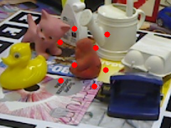
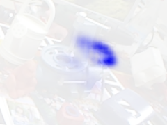
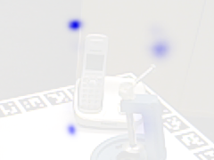

# Unsupervised Domain Adaptation for Sim-to-Real Object Pose Estimation with Contrastive Alignment and Pseudo-Label Refinement

## 摘要

| 项目 | 内容 |
|---|---|
| 标题 | *Unsupervised Domain Adaptation for Sim-to-Real Object Pose Estimation with Contrastive Alignment and Pseudo-Label Refinement* |
| 作者 | Nidhal Eddine Chenni, Arunkumar Rathinam, Djamila Aouada |
| arXiv | 2606.21287v1，cs.CV，2026-06-19 |
| 链接 | <http://arxiv.org/abs/2606.21287v1>；PDF: <https://arxiv.org/pdf/2606.21287v1> |
| 方法名 | CAPLR: Contrastive Alignment and Pseudo-Label Refinement |
| 任务 | 无监督域自适应（Unsupervised Domain Adaptation, UDA）的 sim-to-real 物体 6D 姿态估计 |
| 代码状态 | 本文未提供可确认的公开代码；题给元信息显示代码链接未知，论文正文 PAGE 1-2 也未给出仓库地址。因此本文不包含源码片段，代码级复现证据不足。 |

**一句话总结。** CAPLR 将物体姿态估计的 sim-to-real 适配从“全局对齐外观”转向“局部对齐姿态敏感特征”：先找源域与目标域中姿态相近的图像对，再在关键点附近做双层对比对齐，最后用一致性伪标签稳定目标域预测（见 PAGE 1-5）。

本文的核心问题是：只用合成数据训练的物体姿态估计模型，在真实图像上会因纹理、光照、背景、遮挡和几何结构差异而退化；但真实图像的关键点或 6D 姿态标注成本高，难以规模化获取（见 PAGE 1）。CAPLR 的设置是典型 UDA：源域是有标签合成图像，目标域是真实无标签图像，训练目标是在不使用目标域真实标签的前提下提升真实域姿态估计性能（见 PAGE 1、PAGE 3）。

本文适合关注关键点检测、物体定位、工业零件姿态估计、空间器姿态估计和合成数据训练的人阅读。它对人脸 landmark 或人体关键点并没有直接实验，虽然方法形式上与关键点回归相关，但是否适配人脸或人体场景证据不足；论文实验集中在 LineMOD、Occluded-LineMOD、HomebrewedDB、SPEED+ 和 SHIRT 等物体/航天器姿态数据集（见 PAGE 5-7）。

用途：以下 Fig. 1 裁图展示目标域真实样本上的 ground-truth keypoints，用于说明论文采用关键点到姿态的 hybrid pipeline，而不是直接回归 6D pose（见 PAGE 1）。

读图要点：红色点是目标域样本上的关键点标注，场景包含多个物体、杂乱背景和真实光照。支撑的判断是：CAPLR 面对的不是干净渲染图，而是带真实域干扰的关键点定位问题；姿态估计依赖关键点质量（见 PAGE 1、PAGE 3）。

用途：以下 Fig. 1 裁图展示合成预训练模型在目标域上的热图响应，用于观察 domain gap 对 keypoint heatmap 的影响（见 PAGE 1）。

读图要点：热图响应较分散，说明只在 synthetic source 上训练的模型虽然能捕获部分目标区域，但关键点定位不稳定。支撑的判断是：目标域 heatmap 仍含有可用的局部结构信号，因此论文后续用预测关键点作为 patch anchor，而不是完全丢弃初始预测（见 PAGE 3-4）。

用途：以下 Fig. 1 裁图用于展示 CAPLR 适配后的局部热图变化，支撑“局部特征对齐可改善关键点响应”的定性判断（见 PAGE 1）。

读图要点：蓝色高响应区域相对更集中，表明适配后的模型更倾向于在物体局部结构处形成稳定响应。支撑的判断是：CAPLR 的收益首先体现在关键点热图质量上，再通过 PnP 传播到最终 6D pose（见 PAGE 1、PAGE 4-5）。

用途：以下 Fig. 1 裁图继续展示目标域热图响应，用于说明不同样本中局部响应可能仍受背景和遮挡影响（见 PAGE 1）。

读图要点：热图中存在多个局部响应区域，提示 patch extraction 依赖预测热图时可能受到不确定性影响。支撑的判断是：论文后来在 PAGE 8 自述“patch extraction relies on uncertain predictions”，这是方法局限之一。

## 背景与动机

物体 6D 姿态估计（6D object pose estimation）通常要求从单张 RGB 图像恢复物体在相机坐标系下的旋转 $R$ 与平移 $t$。论文将已知物体的深度学习姿态估计方法分为两类：direct regression 和 hybrid approaches。前者端到端回归连续姿态参数，但旋转空间非线性、loss 设计复杂且解释性较弱；后者先预测 2D keypoints，再结合已知 3D keypoints 和相机内参通过 PnP 求解姿态，因几何可解释性和空间先验易用性而成为主流路线（见 PAGE 2）。

UDA 的动机来自 synthetic-to-real gap。合成图像可大规模生成并提供完美标注，但真实图像中的光照、纹理、背景、遮挡、相机内参和物体外观都会造成分布偏移。论文明确指出，只在 synthetic data 上训练的 DL 模型在 real data 上常因 domain gap 或 sim-to-real transfer 问题而性能下降；真实标注又受成本、人工和规模限制（见 PAGE 1）。

现有 UDA for object pose estimation 大体有三类路线。第一类是 self-supervised adaptation，例如 Self6D++ 使用 differentiable rendering 做 mask alignment，但依赖昂贵渲染管线，且仍有 rendered-vs-real discrepancy（见 PAGE 2）。第二类是 image-to-image translation，例如 Tex-Pose 或相关方法试图让合成图更真实，但外观迁移不必然保留姿态所需几何结构，目标伪标签可能仍然噪声很大（见 PAGE 1-2）。第三类是 multi-view consistency，例如 SMOC-Net 或 ONDA-Pose 相关路线，但多视角重叠等假设不一定存在于标准单目场景（见 PAGE 1-2）。

CAPLR 的出发点是：姿态估计中的域对齐不能只看全局图像或全局特征，因为全局对齐可能学习背景、纹理、风格等与姿态无关的 superficial characteristics。论文强调，回归任务的输出连续、多模态，不能像分类任务那样天然构造正负样本；而姿态关键点具有强空间结构，粗暴对齐可能破坏 task-specific spatial and geometric relationships（见 PAGE 1-2）。

因此，CAPLR 的核心动机是将 domain alignment 约束在“pose-sensitive localized regions”。它不是先把整张 synthetic image 翻译成 real image，也不是只做全局 feature matching，而是先寻找姿态相近的 source-target pair，再在关键点附近的 local patches 上做 contrastive alignment，并用 target augmentation 的一致性生成更可靠的 pseudo labels（见 PAGE 2-5）。

## 预备知识

### UDA、source/target domain 与 keypoint-based pose estimation

论文把输入图像记为 $x_i \in \mathbb{R}^{H \times W \times 3}$，其中 $H$ 和 $W$ 是图像高宽；输出 $y_i=\{(u_k,v_k)\}_{k=1}^{K}$ 是 $K$ 个 2D keypoints，每个关键点由图像坐标 $(u_k,v_k)$ 表示（见 PAGE 3）。模型 $f_\theta:X\rightarrow Y$ 是 keypoint regressor，参数为 $\theta$。

基础监督目标为：

$$
L_{\mathrm{task}}(\theta)=\mathbb{E}_{(x,y)\sim D}L(f_\theta(x),y)
$$

这里 $D$ 是数据分布，$L$ 是预测 keypoints 与 ground-truth keypoints 之间的 regression loss（见 PAGE 3，Eq. 1）。人话解释：模型先学会在图像上找关键点，而不是直接求姿态。

给定预测 2D keypoints $\{(\tilde{u}_k,\tilde{v}_k)\}_{k=1}^{K}$、已知 3D object keypoints $\{X_k\}_{k=1}^{K}$ 和相机内参 $\phi$，最终 6D pose 通过 PnP 求解：

$$
(R^\*,t^\*)=\arg\min_{R,t}\sum_{k=1}^{K}\|\phi(RX_k+t)-(\tilde{u}_k,\tilde{v}_k)\|^2
$$

其中 $R$ 是旋转矩阵，$t$ 是平移向量，$\phi(\cdot)$ 表示相机投影函数（见 PAGE 3，Eq. 2）。人话解释：PnP 在找一组旋转和平移，使 3D 关键点投影到图像后尽量贴近模型预测的 2D 关键点。

### 域差异：边缘分布与条件分布都不一致

UDA 设置中，源域 $\hat{P}=\{(x_i^s,y_i^s)\}_{i=1}^{n}$ 有标签，目标域 $\hat{Q}=\{x_i^t\}_{i=1}^{m}$ 无标签；$x^s$ 表示 source image，$x^t$ 表示 target image，$y^s$ 和 $y^t$ 表示对应标签（见 PAGE 3）。目标是在 target domain 上最小化期望误差：

$$
\mathrm{err}_Q=\mathbb{E}_{(x,y)\sim Q}[L(f_\theta(x),y)]
$$

这里 $Q$ 是目标域联合分布（见 PAGE 3，Eq. 3）。人话解释：虽然训练时没有目标域标签，真正关心的是模型在真实目标域上的 keypoint error。

论文将 domain gap 写成：

$$
P(x^s)\neq Q(x^t)
$$

$$
P(y^s|x^s)\neq Q(y^t|x^t)
$$

第一行表示 source 与 target 的输入边缘分布不同，第二行表示给定输入后的标签条件分布也不同（见 PAGE 3，Eq. 4）。人话解释：真实图像不只是“长得不一样”，同样外观变化还会改变模型如何从图像证据推断关键点。

理想对齐目标是：

$$
P(x^s)\equiv Q(x^t)
$$

$$
P(y^s|x^s)\equiv Q(y^t|x^t)
$$

这对应同时对齐输入分布与条件输出分布（见 PAGE 3，Eq. 5）。人话解释：只让图像风格相近不够，还要让“图像到关键点”的任务关系在两个域中一致。

## 方法详解

### 1. CAPLR 总体框架：把分布对齐转移到特征空间

CAPLR 没有直接在 raw image space 对齐 $P(x^s)$ 和 $Q(x^t)$，而是把目标改写为 backbone features 和 regression head outputs 的对齐。论文记 backbone 为 $g(x)$，regression head 为 $h(g(x))$，并定义：

$$
P_g(g(x^s))\equiv Q_g(g(x^t))
$$

$$
P_h(h(g(x^s)))\equiv Q_h(h(g(x^t)))
$$

其中 $P_g,Q_g$ 表示 source/target 在 backbone feature space 的分布，$P_h,Q_h$ 表示 source/target 在 head output space 的分布（见 PAGE 3，Eq. 6）。人话解释：CAPLR 认为对姿态更有用的是中间特征和任务头表示，而不是像素级外观本身。

这个目标被落实为三个阶段：Cross-Domain Pairing（CDP）、Local Patch Contrastive Alignment（LPCA）和 Consistency-Based Pseudo Label Refinement（CBPR）（见 PAGE 3-5）。三者分别回答三个问题：哪些 source-target 图像应该对齐；在图像中哪些局部区域应该对齐；目标域没有标签时如何获得更可靠的 keypoint supervision。

论文 Fig. 2 概述了方法流程：Fig. 2(A) 是 paired samples 的局部 patch contrastive alignment，Fig. 2(B) 是从 feature map 上按 keypoint projection 抽取局部 patch，Fig. 2(C) 是结合 confidence thresholding 和 spatial consistency 的 pseudo-keypoint filtering（见 PAGE 4）。题给 figures 只提供 PAGE 1 的 Fig. 1 裁图，因此本文不嵌入 Fig. 2 图片，但其结构描述来自论文正文证据。

### 2. Cross-Domain Pairing：先找到姿态相近的 source-target pair

CDP 的问题是：contrastive alignment 需要正样本对，但目标域没有标签，不能直接知道哪张 synthetic image 和哪张 real image 姿态相近。论文提出两步策略：先用 feature embedding 选候选，再用 predicted pose refinement 过滤（见 PAGE 3-4）。

第一步不用初始姿态直接配对，因为只用 source 训练的模型在 target domain 上姿态预测不可靠。论文观察到，即使 keypoint localization 不准确，heatmap activations 仍能提供 approximate object region，因此可作为局部特征抽取的锚点（见 PAGE 3）。对每张图像 $I$，模型输出 $K$ 个 keypoints $\{k_j=(x_j,y_j)\}_{j=1}^{K}$ 和 confidence scores $c_j\in[0,1]$；在 backbone feature map $F\in\mathbb{R}^{C\times H\times W}$ 上，以关键点为中心裁剪局部 patch $p_j\in\mathbb{R}^{C\times h'\times w'}$（见 PAGE 3）。

图像级 embedding 定义为：

$$
E=\frac{\sum_{j=1}^{K}c_j\mathrm{vec}(p_j)}{\sum_{j=1}^{K}c_j+\epsilon}
$$

其中 $\mathrm{vec}(\cdot)$ 表示 patch 向量化，$\epsilon$ 是数值稳定项，$c_j$ 是关键点置信度（见 PAGE 3，Eq. 7）。人话解释：这相当于用关键点置信度给局部特征加权平均，置信度高的关键点 patch 对图像表示贡献更大。

随后论文用 cosine similarity 聚类 embedding，形成 structurally similar source-target image pairs 的初始候选池（见 PAGE 3）。这里的“structurally similar”不是语义类别相同，而是关键点局部结构与姿态线索相近。

第二步对候选 pair 做 pose-based refinement。对候选 pair $(I_s,I_t)$，source 和 target 的 predicted pose 分别为 $(t_s,q_s)$ 与 $(t_t,q_t)$；$t$ 是平移，$q$ 是四元数表示的旋转。论文定义：

$$
E_T=\|t_t-t_s\|
$$

$$
E_T^{\mathrm{norm}}=E_T/\|t_s\|
$$

$$
E_R=2\arccos(|\langle q_t,q_s\rangle|)
$$

$$
E_{\mathrm{pose}}=E_T^{\mathrm{norm}}+\lambda_{\mathrm{rot}}\cdot E_R
$$

其中 $E_T$ 是 translation error，$E_T^{\mathrm{norm}}$ 是 normalized translation error，$E_R$ 是 quaternion angular distance，$\lambda_{\mathrm{rot}}$ 用来平衡平移与旋转（见 PAGE 4，Eq. 8）。人话解释：CDP 最终保留的是在候选池中姿态误差最小的 source image，使后续对齐不把不同姿态的局部结构强行拉近。

补充材料进一步说明，SPEED+ 中 $\lambda_{\mathrm{rot}}=2$，因为 patch-level alignment 对角度差异比平移差异更敏感；CDP 初始候选数固定为 1000，patch size 按数据集和特征层选择（见 PAGE 10-11）。这说明 CDP 不是无超参模块，pairing quality 与候选数、patch 尺寸和初始模型质量有关。

### 3. Local Patch Contrastive Alignment：在关键点附近做双层对齐

LPCA 的核心假设是：目标域 heatmap 虽然分散，但常常仍靠近正确 object regions；因此，与其做 global feature alignment，不如对 source-target pair 中关键点附近的 local patches 做 contrastive alignment（见 PAGE 4）。论文明确指出，全局对齐可能捕获 irrelevant background context，而 local patch alignment 更能保留 pose-critical cues（见 PAGE 4）。

对 source-target pair $(I_s,I_t)$，模型预测 source keypoints $\{k_j^s\}_{j=1}^{K}=f(I_s)$ 和 target keypoints $\{k_j^t\}_{j=1}^{K}=f(I_t)$，再围绕每个 $k_j$ 从 feature maps 中裁剪 $p_j^s$ 和 $p_j^t$（见 PAGE 4）。LPCA 不只在 backbone features 上对齐，也在 pre-output regression head features 上对齐：backbone-level patches 保留 spatial structure，head-level patches 编码 keypoint prediction 相关的 task-specific semantics（见 PAGE 4）。

对齐损失使用 InfoNCE：

$$
L_{\mathrm{iNCE}}=-\frac{1}{BK}\sum_{b,k}\log
\frac{\exp(\mathrm{sim}(p_{b,k}^{\mathrm{src}},p_{b,k}^{\mathrm{tgt}})/\tau)}
{\sum_{b'=1}^{B}\exp(\mathrm{sim}(p_{b,k}^{\mathrm{src}},p_{b',k}^{\mathrm{tgt}})/\tau)}
$$

其中 $B$ 是 batch size，$K$ 是关键点数量，$\mathrm{sim}(\cdot)$ 是 cosine similarity，$\tau$ 是 temperature hyperparameter（见 PAGE 4，Eq. 9）。人话解释：同一 keypoint index、同一 pose pair 中的 source-target patch 是正样本，batch 中其他 target patches 充当负样本；损失鼓励同姿态局部结构接近，同时区分不匹配样本。

最终 alignment loss 为：

$$
L_{\mathrm{align}}=L_{\mathrm{task}}+\lambda_{\mathrm{backbone}}L_{\mathrm{iNCE}}^{\mathrm{backbone}}+\lambda_{\mathrm{head}}L_{\mathrm{iNCE}}^{\mathrm{head}}
$$

其中 $\lambda_{\mathrm{backbone}}$ 与 $\lambda_{\mathrm{head}}$ 控制 backbone-level 和 head-level contrastive losses 的权重（见 PAGE 4，Eq. 10）。人话解释：CAPLR 没有放弃源域监督任务损失，而是在保持 keypoint regression 的同时，将 backbone 和 head 两层的局部表征向目标域靠拢。

论文补充材料说明，LPCA 阶段的 contrastive loss 通常在 5 个 epoch 内收敛；用于 alignment 的是 P1 features，因为它们直接驱动最终预测；CDP 阶段则使用 P4 features，因为其 receptive field 更大、对风格变化更稳健（见 PAGE 10-11）。这一区分很重要：配对需要稳健全局局部结构，最终对齐需要接近输出的空间细节。

### 4. CBPR：用一致性伪标签稳定目标域预测

LPCA 后，CAPLR 引入 Consistency-Based Pseudo Label Refinement（CBPR）。它的目标不是简单相信单次 target prediction，而是对同一目标图像施加多个 augmentation，用多视图预测的一致性筛选可靠 pseudo-keypoints（见 PAGE 5）。

给定目标图像 $I_t$，生成 $M$ 个增强版本 $\{I_t^{(m)}\}_{m=1}^{M}$。模型对第 $m$ 个增强版本输出 keypoint predictions $K^{(m)}\in\mathbb{R}^{K\times 2}$ 和 confidence scores $c^{(m)}\in\mathbb{R}^{K}$：

$$
K^{(m)},c^{(m)}=f(I_t^{(m)}),\quad m\in\{1,\ldots,M\}
$$

这里 $K^{(m)}$ 包含所有关键点坐标，$c^{(m)}$ 包含对应 confidence（见 PAGE 5，Eq. 11）。人话解释：同一张真实图像经过轻微增强后，可靠模型应预测近似一致的关键点位置。

对第 $k$ 个关键点，pseudo-label 由 confidence-weighted averaging 得到：

$$
k_{\mathrm{pseudo}}=\frac{\sum_{m=1}^{M}c_k^{(m)}k_k^{(m)}}{\sum_{m=1}^{M}c_k^{(m)}+\epsilon}
$$

其中 $k_k^{(m)}$ 是第 $m$ 个增强版本对第 $k$ 个关键点的预测，$c_k^{(m)}$ 是对应置信度，$\epsilon$ 用于数值稳定（见 PAGE 5，Eq. 12）。人话解释：高置信预测权重大，低置信预测权重小，得到一个更稳健的伪关键点。

CBPR 使用两个筛选条件。第一是 confidence thresholding：

$$
\exists m\in\{1,\ldots,M\}:c_k^{(m)}>c_{\mathrm{thresh}}
$$

这要求至少一个增强版本对该关键点足够自信（见 PAGE 5，Eq. 13）。人话解释：如果所有增强版本都不自信，就不把该点当作训练信号。

第二是 spatial consistency filtering：

$$
\max_{m\in\{1,\ldots,M\}}\|k_k^{(m)}-k_{\mathrm{pseudo}}\|_2<d_{\mathrm{thresh}}
$$

这要求所有增强预测与伪标签的最大距离小于阈值 $d_{\mathrm{thresh}}$（见 PAGE 5，Eq. 14）。人话解释：即使某次预测很自信，只要不同增强下位置漂移过大，也会被过滤掉。

最终 pseudo loss 为：

$$
L_{\mathrm{pseudo}}=\frac{1}{B}\sum_{b=1}^{B}\frac{1}{K_b}\sum_{k\in K_b}\sum_{m=1}^{M}\|k_{b,k}^{(m)}-k_{b,k}^{\mathrm{pseudo}}\|_2^2
$$

其中 $B$ 是 batch size，$K_b$ 是第 $b$ 个训练图像中通过筛选的有效关键点集合（见 PAGE 5，Eq. 15）。人话解释：模型被要求在不同增强下预测稳定关键点；不稳定或低置信的点不会被用来误导训练。

补充材料显示，CBPR 在实验中运行 $N=40$ 个 epoch，并选择 accepted pseudo-keypoints 数量最高的 epoch；Fig. 2a/2b 表明 accepted keypoints 随 epoch 上升，Fig. 3 显示 Lightbox 和 Sunlamp 上 PCK 在 CBPR 阶段基本稳定（见 PAGE 9）。这支持 CBPR 主要增加可用伪标签数量，而不是造成明显训练崩溃。

### 5. 网络结构、训练和后处理

论文采用 EfficientNet backbone、Bidirectional Feature Pyramid Network（BiFPN）和包含三层 deconvolution 的 regression head，输出 $K$ 个 heatmaps，每个 heatmap 对应一个 designated keypoint（见 PAGE 6、PAGE 10-11）。最终姿态通过 PnP-RANSAC 从预测 2D keypoints 恢复；BOP 数据集使用 8 个 keypoints，SPEED+ 使用置信度最高的 5 个 keypoints，原因是后者场景更困难（见 PAGE 6）。

CAPLR 有两个模型规模：CAPLRs 使用 EfficientNet-B0，约 3.9M 参数；CAPLRm 使用 EfficientNet-B5，约 35M 参数（见 PAGE 6）。这一设计使论文能够同时讨论小模型部署和中大模型性能。

训练细节方面，BOP 数据集只用 synthetic images 训练，不使用 data augmentation，输入 padding 后为 $640\times512$，输出 heatmaps 为 $320\times256$，训练 5 个 epoch；SPEED+ 输入 padding 并 resize 到 $768\times512$，heatmaps 为 $384\times256$，训练 80 个 epoch；优化器为 AdamW，learning rate 为 $10^{-4}$，batch size 为 16，实验在单张 NVIDIA A6000 GPU 上完成（见 PAGE 10）。

补充材料说明 heatmap supervision 最终选择 Kullback-Leibler divergence（KLD）loss，而不是 KLD 加 coordinate MSE。Table XIII 显示在 SPEED+ 上 KLD alone 的 $E_{\mathrm{pose}}$ 为 Lightbox 0.193、Sunlamp 0.395，而 KLD + $\lambda$MSE 分别退化到 0.257 和 0.512（见 PAGE 11）。表格证据支持作者选择 KLD 作为 heatmap 监督损失。

关键点后处理还包括 subpixel refinement 和 pose refinement。算法 1 使用局部 $3\times3$ patch 的二阶 Taylor expansion 估计 subpixel offset；PnP 初始估计使用 OpenCV `solvePnPRansac`，再用 `solvePnPRefineLM` 做 Levenberg-Marquardt refinement（见 PAGE 12）。Table XIV 显示 keypoint 与 pose refinement 同时使用时，CAPLRs 在 Lightbox/Sunlamp 的 $E_{\mathrm{pose}}$ 为 0.165/0.230，优于不 refinement 的 0.179/0.248（见 PAGE 12）。

## 实验分析

### 实验设置

CAPLR 在多个物体姿态估计 benchmark 上评估。LineMOD 含 13 个 household objects，每个序列约 1.2k real images，其中 Eggbox 和 Glue 是对称物体；论文遵循 prior works，用 15% 图像进行无标注 adaptation，其余测试（见 PAGE 5）。Occluded-LineMOD 是 LineMOD 子集，含 8 个严重遮挡物体，使用 BOP split 采样测试数据，其余用于 adaptation（见 PAGE 5）。

HomebrewedDB 包含 LineMOD 中的 benchvise、driller、phone 三个物体的新图像，场景布局、背景、相机内参和 CAD model size 与 LineMOD 不同，因此用于测试 adaptation 后的 domain generalization（见 PAGE 5）。SPEED+ 用于 spacecraft pose estimation，含 59,960 synthetic images 和两个 real subsets：Lightbox 6,740 images、Sunlamp 2,791 images；论文还用 SHIRT 作为外部真实验证集，测试 SPEED+ adaptation 是否能迁移到 unseen real images（见 PAGE 5）。

指标方面，BOP 数据集使用 ADD 和 ADD-S，报告 ADD(-S) recall，即 pose error 低于物体直径 10% 的比例；SPEED+ 使用 rotation error $E_R$、translation error $E_T$、normalized translation error $E_T^{\mathrm{norm}}$ 和 overall pose error $E_{\mathrm{pose}}$（见 PAGE 6）。这些指标分别覆盖传统物体姿态和航天器相对姿态估计需求。

### 主要结果：LineMOD 与 Occluded-LineMOD

| 数据集 | 代表 baseline | 使用数据 | Mean 指标 | CAPLRs | CAPLRm | 证据 |
|---|---:|---|---:|---:|---:|---|
| LineMOD | MAST | S + R- | 93.2 ADD(-S)↑ | 93.5 | 97.2 | Table I，PAGE 5 |
| LineMOD | ONDA-Pose | S + R- | 93.2 ADD(-S)↑ | 93.5 | 97.2 | Table I，PAGE 5 |
| LineMOD | DPODv2 real-supervised | R | 93.5 ADD(-S)↑ | 93.5 | 97.2 | Table I，PAGE 5 |
| Occluded-LineMOD | ONDA-Pose | S + R- | 69.3 ADD(-S)↑ | 79.3 | 85.8 | Table II，PAGE 6 |
| Occluded-LineMOD | Tex-Pose | S + R- | 66.7 ADD(-S)↑ | 79.3 | 85.8 | Table II，PAGE 6 |

表格解读：LineMOD 上，CAPLRm 的 97.2 mean ADD(-S) 明显高于其他 UDA baseline，也超过使用 annotated real data 的 DPODv2 93.5；CAPLRs 的 93.5 已达到 DPODv2 real-supervised mean 水平（见 PAGE 5）。Occluded-LineMOD 上差距更大，CAPLRm 达到 85.8，相比 ONDA-Pose 的 69.3 提升 16.5 个百分点；这说明局部关键点对齐在遮挡场景中尤其有效，因为遮挡会让全局外观对齐更容易受背景和缺失区域干扰（见 PAGE 6）。

需要注意的是，LineMOD 单物体结果中 CAPLR 并非每一类都最好。例如 CAPLRs 在 Lamp 上为 78.0，低于部分 baseline；CAPLRm 则总体更稳健（见 PAGE 5）。因此更准确的结论是：CAPLR 在 mean performance 上表现强，但逐物体性能仍受对象形状、对称性、遮挡和初始 heatmap 质量影响。

### SPEED+ 与空间器姿态估计

| 模型类别 | 方法 | 参数量 | 数据 | Lightbox $E_{\mathrm{pose}}$↓ | Sunlamp $E_{\mathrm{pose}}$↓ | 证据 |
|---|---|---:|---|---:|---:|---|
| Small | YOLOv8s | 11.5M | S | 0.432 | 0.432 | Table III，PAGE 6 |
| Small | UAKD | 3.8M | S | 0.248 | 0.360 | Table III，PAGE 6 |
| Small | Lava1302 | 8.2M | S + R- | 0.165 | 0.059 | Table III，PAGE 6 |
| Small | CAPLRs | 3.9M | S + R- | 0.165 | 0.230 | Table III，PAGE 6 |
| Medium/Large | TangoU | 50M | S + R- | 0.073 | 0.090 | Table III，PAGE 6 |
| Medium/Large | VPU | 190M | S + R- | 0.101 | 0.061 | Table III，PAGE 6 |
| Medium/Large | CAPLRm | 35M | S + R- | 0.080 | 0.122 | Table III，PAGE 6 |

表格解读：SPEED+ 上的结论更细致。CAPLRs 在 Lightbox 上达到 0.165，与 Lava1302 持平，但 Sunlamp 上 0.230 明显弱于 Lava1302 的 0.059（见 PAGE 6）。CAPLRm 在 Lightbox 上 0.080，接近 TangoU 的 0.073，优于 VPU 的 0.101；但 Sunlamp 上 0.122 落后于 TangoU 和 VPU。论文报告 CAPLRm 两域平均 $E_p=0.101$，排名第三，位于 VPU 0.081 和 TangoU 0.082 之后（见 PAGE 7）。

这表明 CAPLR 对空间器场景有竞争力，尤其在模型规模更小的情况下仍能逼近强 baseline；但它不是在 SPEED+ 每个域上全面最优。Sunlamp 的强光照和复杂阴影更容易破坏 heatmap anchor 和 patch matching，补充材料中的失败案例也将 harsh lighting、shadows 和 confusing light source 列为 pairing failure 和 alignment failure 的主要原因（见 PAGE 13-14）。

### 泛化到未见真实域

| 评估设置 | 方法 | 指标 | 结果 | 证据 |
|---|---|---|---:|---|
| HomebrewedDB, LineMOD adaptation | MAST | Mean ADD(-S)↑ | 89.0 | Table IV，PAGE 6 |
| HomebrewedDB, LineMOD adaptation | Tex-Pose | Mean ADD(-S)↑ | 89.1 | Table IV，PAGE 6 |
| HomebrewedDB, LineMOD adaptation | ONDA-Pose | Mean ADD(-S)↑ | 95.8 | Table IV，PAGE 6 |
| HomebrewedDB, LineMOD adaptation | CAPLRm | Mean ADD(-S)↑ | 92.9 | Table IV，PAGE 6 |
| SHIRT roe2, SPEED+ adaptation | CAPLRm S | $E_T/E_R$↓ | 0.110m / 6.04° | Table V，PAGE 6 |
| SHIRT roe2, SPEED+ adaptation | CAPLRm S + R- | $E_T/E_R$↓ | 0.087m / 4.49° | Table V，PAGE 6 |
| SHIRT roe2, SPEED+ adaptation | CAPLRm S + R | $E_T/E_R$↓ | 0.097m / 3.74° | Table V，PAGE 6 |

表格解读：HomebrewedDB 上 CAPLRm 的 92.9 mean 低于 ONDA-Pose 的 95.8，但高于 MAST 和 Tex-Pose，说明其跨真实域泛化有收益但不是该表最优（见 PAGE 6）。SHIRT 上，CAPLRm 从 synthetic-only 到 S+R- 在 roe2 上将 translation error 从 0.110m 降到 0.087m，将 rotation error 从 6.04° 降到 4.49°；这支持 SPEED+ adaptation 能部分迁移到外部真实数据，而不只是适配原测试集图像（见 PAGE 6-7）。

不过，SPEED+ 设置中论文写明“all test images are used for adaptation discarding their labels”，并以 SHIRT 评估来缓解 overlap 问题（见 PAGE 5）。这意味着 SPEED+ 主表并不是完全独立的 unseen target evaluation；它更接近 transductive UDA。生产部署时，如果目标域持续变化，仍需要验证 CAPLR 在未参与 adaptation 的真实流数据上的稳定性。

### 消融实验：哪个模块贡献最大

| 配置 | LineMOD ADD(-S)↑ | Occluded-LM ADD(-S)↑ | Lightbox $E_{\mathrm{pose}}$↓ | Sunlamp $E_{\mathrm{pose}}$↓ | 证据 |
|---|---:|---:|---:|---:|---|
| Synthetic only | 84.4 | 70.3 | 0.193 | 0.395 | Table VIII，PAGE 7 |
| Alignment only | 93.3 | 78.7 | 0.177 | 0.256 | Table VIII，PAGE 7 |
| CAPLRs full | 93.5 | 79.3 | 0.165 | 0.230 | Table VIII，PAGE 7 |

表格解读：最大的性能跃迁来自 alignment only：LineMOD 从 84.4 到 93.3，Occluded-LM 从 70.3 到 78.7，Sunlamp 从 0.395 到 0.256（见 PAGE 7）。CBPR 的增益相对较小但稳定，例如 Lightbox 从 0.177 到 0.165，Sunlamp 从 0.256 到 0.230。这说明 CAPLR 的主引擎是 local patch contrastive alignment，CBPR 更像是后续可靠性强化模块。

CDP 的消融也支持两阶段 pairing 的必要性。Table VI 中，在 Lightbox 的 $[1m,15^\circ]$ 兼容阈值下，Single-Stage Features 只有 35.16% accuracy，Single-Stage Predictions 为 75.95%，Two-Stage Ours 为 83.26%，接近 Ground-Truth pairs 的 88.50%；Sunlamp 同一阈值下 Two-Stage 为 72.62%，高于 Single-Stage Predictions 的 66.46% 和 Features 的 28.84%（见 PAGE 7）。这说明 feature-based candidate selection 和 pose-based refinement 是互补的：前者缩小搜索空间，后者降低姿态错配。

| CDP 方法 | Lightbox $[1m,15^\circ]$ Accuracy↑ | Sunlamp $[1m,15^\circ]$ Accuracy↑ | 证据 |
|---|---:|---:|---|
| Ground-Truth pairs | 88.50 | 89.29 | Table VI，PAGE 7 |
| Single-Stage Features | 35.16 | 28.84 | Table VI，PAGE 7 |
| Single-Stage Predictions | 75.95 | 66.46 | Table VI，PAGE 7 |
| Two-Stage Ours | 83.26 | 72.62 | Table VI，PAGE 7 |

表格解读：feature-only pairing 太弱，prediction-only pairing 在 target domain 初始预测噪声下也不够稳定；two-stage CDP 显著更接近 ground-truth pairing。该结果直接支撑 CAPLR 第一阶段设计，而不是只在算法叙述中声称 pairing 有效（见 PAGE 7）。

双层对齐消融显示，backbone-only 与 head-only 各有局限。Table VII 中，SL1 Backbone 在 Lightbox 为 0.166，但 Sunlamp 为 0.384；SL2 Head 在 Lightbox 为 0.177，Sunlamp 为 0.260；Dual alignment 使用 100% target data 时为 Lightbox 0.165、Sunlamp 0.230（见 PAGE 7）。这说明 backbone alignment 更影响 domain invariance，head alignment 更贴近任务输出，而 dual-level alignment 在困难光照域更稳。

## 讨论

CAPLR 的适用边界首先由 pipeline 决定：它假设已知物体具有可定义的 3D keypoints，且可通过 2D keypoints + PnP 恢复姿态（见 PAGE 2-3、PAGE 6）。因此，它天然适合工业物体定位、BOP-style known object pose、航天器相对姿态估计等任务；对 category-level pose、人脸 landmark、人体姿态或 deformable objects 的适用性，论文没有实验验证，证据不足。

从方法论看，CAPLR 的主要贡献不是提出新的 pose solver，而是把 UDA 对齐粒度从 image/global feature 调整到 keypoint-localized patch，并同时覆盖 backbone 和 regression head（见 PAGE 4）。这对 keypoint/pose 任务有明确意义：姿态误差往往由少数关键点漂移触发，局部区域对齐比整图风格对齐更贴近误差来源。

从实验看，CAPLR 在 LineMOD 和 Occluded-LineMOD 上表现很强，尤其遮挡场景中的提升说明局部对齐比全局外观迁移更抗干扰（见 PAGE 5-6）。但在 SPEED+ Sunlamp 等极端光照域，CAPLR 仍落后于部分 domain-specific 方法，失败案例也显示阴影、强光源、地球背景差异和 patch 背景污染会破坏 alignment（见 PAGE 13-14）。

一个需要进一步澄清的问题是 target-domain model selection。补充材料写到 LPCA 阶段“model is evaluated on the target domain at each epoch, and the checkpoint with the highest percentage of correct keypoints score is retained”（见 PAGE 11）。如果该 PCK 使用目标域标签，则与严格 UDA 部署设定存在张力；如果使用无标签 proxy metric，则论文文本没有充分说明。该点不否定方法贡献，但影响复现实验协议和真实部署选择 checkpoint 的方式。

## 局限分析

作者自述的第一项局限是 CAPLR 依赖 source-target pairings。当 synthetic CAD models 与 real objects 差异显著时，找到可靠配对会更困难；作者未来希望减少或移除 explicit pairing 的需要（见 PAGE 8）。这与 Table VI 和 Fig. 5-6 的补充分析一致：CDP 大多数 pair 落入低误差区间，但仍有一部分 pair 在遮挡、阴影和强光下出现大旋转或大平移差异（见 PAGE 12-13）。

作者自述的第二项局限是 patch extraction 依赖 uncertain predictions，而不是 fully learnable。换言之，CAPLR 使用初始 heatmap/keypoint 作为 patch anchor；如果初始预测错到背景或光源，alignment 会把错误局部区域当作姿态敏感区域（见 PAGE 8）。补充材料 Fig. 7 进一步显示，背景差异、强散射光和 synthetic pair 中的 Earth background 都可能误导 patch-based alignment，导致性能退化（见 PAGE 14）。

独立判断的第一项风险是公开代码缺失。论文和题给材料未提供可确认 repository，本文不能做源码对应、实现审计或复现实验验证。因此，关于 EfficientNet、BiFPN、CDP、LPCA、CBPR 的分析只能基于论文正文和补充材料，不能确认实现细节、默认超参、数据 split 脚本和 checkpoint selection 代码（见 PAGE 10-12；代码状态证据不足）。

独立判断的第二项风险是 transductive UDA 评价与实际部署之间的差距。SPEED+ 主实验使用所有 test images 参与 adaptation 且丢弃标签，论文用 SHIRT 做外部验证来缓解该问题（见 PAGE 5-7）。这对 benchmark 合理，但工业部署中目标域数据可能持续变化，且无法预先获得完整测试分布；CAPLR 在 streaming、online 或 open-world target domain 下的稳定性仍未被证明。

独立判断的第三项风险是对非刚体关键点任务的外推不足。CAPLR 的 PnP、3D object keypoints、CAD model 和 ADD(-S) 指标都针对刚体已知物体；人脸 landmark 或人体 pose 虽然也有关键点，但形变、身份差异、遮挡和拓扑先验不同。把 CAPLR 直接迁移到人脸或人体，需要重新验证 local patch pairing 和 pseudo-label filtering 是否仍然有效，论文没有提供该证据。

## 结论

CAPLR 提供了一条较清晰的 sim-to-real object pose UDA 路线：用 CDP 建立姿态相近的 source-target 正样本，用 LPCA 在关键点局部区域同时对齐 backbone 与 head 表征，再用 CBPR 对目标域伪关键点做置信度和空间一致性过滤。该设计与姿态估计的几何结构匹配，避免了单纯全局 feature matching 或 image translation 对 pose-critical cues 的忽视（见 PAGE 2-5）。

实验上，CAPLR 在 LineMOD、Occluded-LineMOD 上取得强 mean performance，在 SPEED+ 上以较小模型规模达到有竞争力的空间器姿态估计结果，并在 HomebrewedDB 和 SHIRT 上展示一定跨真实域泛化能力（见 PAGE 5-7）。最有说服力的证据来自消融：alignment only 已贡献主要提升，CBPR 进一步稳定改善；two-stage CDP 明显优于 feature-only 或 prediction-only pairing（见 PAGE 7）。

面向业务应用，CAPLR 对“合成数据充足、真实标注稀缺、目标物体刚性且可定义 3D keypoints”的场景有参考价值，例如工业零件姿态、机器人抓取前定位、航天器相对位姿估计等。面向未来研究，最关键的方向是减少显式配对依赖、学习式 patch extraction、无标签 checkpoint selection，以及在更广泛的非刚体或 category-level pose 场景中验证方法边界（见 PAGE 8、PAGE 11、PAGE 13-14）。

## 证据索引

| 主题 | 关键证据 | 页码 |
|---|---|---|
| 论文任务与摘要贡献 | CAPLR 三组件：Efficient Cross-Domain Pairing、Contrastive Alignment、Consistency-Based Pseudo-Label Refinement | PAGE 1-2 |
| Fig. 1 定性结果 | GT keypoints、synthetic pretrained heatmaps、CAPLR refined heatmaps、recovered object pose | PAGE 1 |
| 背景动机 | synthetic-only 模型因 domain gap 在 real data 退化；真实标注成本高 | PAGE 1 |
| 相关工作局限 | self-supervised pipelines、image translation、multi-view consistency、global feature alignment 的限制 | PAGE 1-2 |
| keypoint regression 任务定义 | 输入 $x_i$、输出 $y_i$、任务损失 $L_{\mathrm{task}}$ | PAGE 3，Eq. 1 |
| PnP 姿态恢复 | 由 2D keypoints、3D keypoints 和 camera intrinsics 求解 $(R^\*,t^\*)$ | PAGE 3，Eq. 2 |
| UDA 目标误差 | target domain expected prediction error $\mathrm{err}_Q$ | PAGE 3，Eq. 3 |
| domain gap 数学表达 | $P(x^s)\neq Q(x^t)$，$P(y^s|x^s)\neq Q(y^t|x^t)$ | PAGE 3，Eq. 4 |
| 理想域对齐目标 | 输入分布与条件输出分布同时对齐 | PAGE 3，Eq. 5 |
| feature-space reformulation | 对齐 backbone features $g(x)$ 和 head outputs $h(g(x))$ | PAGE 3，Eq. 6 |
| CDP embedding | confidence-weighted patch embedding $E$ | PAGE 3，Eq. 7 |
| CDP pose refinement | translation error、normalized translation error、quaternion angular distance、$E_{\mathrm{pose}}$ | PAGE 4，Eq. 8 |
| LPCA | local patch InfoNCE loss | PAGE 4，Eq. 9 |
| alignment objective | $L_{\mathrm{align}}=L_{\mathrm{task}}+\lambda_{\mathrm{backbone}}L_{\mathrm{iNCE}}^{\mathrm{backbone}}+\lambda_{\mathrm{head}}L_{\mathrm{iNCE}}^{\mathrm{head}}$ | PAGE 4，Eq. 10 |
| CBPR augmented predictions | $K^{(m)},c^{(m)}=f(I_t^{(m)})$ | PAGE 5，Eq. 11 |
| CBPR pseudo-label | confidence-weighted pseudo-keypoint | PAGE 5，Eq. 12 |
| CBPR filtering | confidence thresholding 与 spatial consistency filtering | PAGE 5，Eq. 13-14 |
| CBPR loss | $L_{\mathrm{pseudo}}$ | PAGE 5，Eq. 15 |
| 数据集设置 | LineMOD、Occluded-LineMOD、HomebrewedDB、SPEED+、SHIRT | PAGE 5 |
| 指标 | ADD、ADD-S、ADD(-S)、$E_R$、$E_T$、$E_T^{\mathrm{norm}}$、$E_{\mathrm{pose}}$ | PAGE 6 |
| 网络结构 | EfficientNet、BiFPN、heatmap regression head、PnP-RANSAC、CAPLRs/CAPLRm 参数量 | PAGE 6、PAGE 10-11 |
| LineMOD 结果 | Table I，CAPLRs 93.5、CAPLRm 97.2 mean ADD(-S) | PAGE 5 |
| Occluded-LineMOD 结果 | Table II，CAPLRs 79.3、CAPLRm 85.8 mean ADD(-S) | PAGE 6 |
| SPEED+ 结果 | Table III，CAPLRs/CAPLRm 在 Lightbox 与 Sunlamp 的 $E_{\mathrm{pose}}$ | PAGE 6-7 |
| 泛化结果 | HomebrewedDB Table IV，SHIRT Table V | PAGE 6-7 |
| CDP 消融 | Table VI two-stage pairing 优于 single-stage variants | PAGE 7 |
| dual-level alignment | Table VII backbone/head/dual alignment 与 target data availability | PAGE 7 |
| CBPR 消融 | Table VIII synthetic only、alignment only、full CAPLR 对比 | PAGE 7 |
| 作者自述局限 | 依赖 source-target pairings；patch extraction 依赖 uncertain predictions | PAGE 8 |
| synthetic pretraining | Table IX full synthetic pretraining 明显优于 ImageNet-only pretraining | PAGE 9 |
| CBPR 稳定性 | accepted pseudo-keypoints 上升，PCK 稳定 | PAGE 9 |
| 扩展上下界 | Tables X-XII synthetic-only、CAPLR、real-finetuned upper bound | PAGE 10 |
| KLD loss 选择 | Table XIII，KLD 优于 KLD + MSE | PAGE 11 |
| keypoint/pose refinement | Algorithm 1 与 Table XIV | PAGE 12 |
| CDP 失败案例 | Fig. 5-6，强光、阴影、遮挡导致 pair failure | PAGE 12-13 |
| UDA 失败案例 | Fig. 7，背景差异、heatmap 错误、光照影响 patch alignment | PAGE 14 |
| 定性改善 | LineMOD、Lightbox、Sunlamp qualitative comparisons | PAGE 17-19 |
