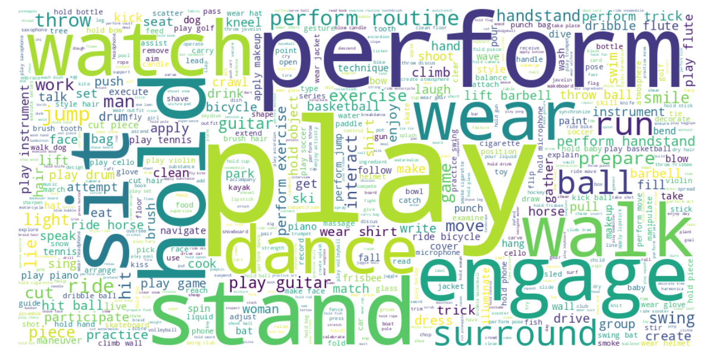
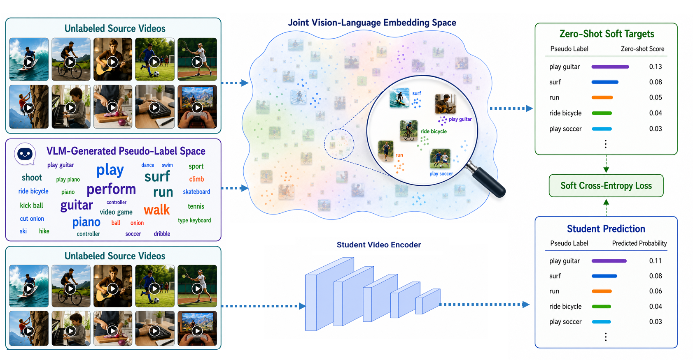

# LEViL: Label-Efficient Video Learning via Zero-Shot Distillation over VLM-Generated Pseudo-Label Spaces

## 摘要

| 项目 | 内容 |
|---|---|
| 论文 | LEViL: Label-Efficient Video Learning via Zero-Shot Distillation over VLM-Generated Pseudo-Label Spaces |
| 作者 | Aslı Çelik |
| arXiv | 2606.21358v1 |
| 链接 | http://arxiv.org/abs/2606.21358v1 |
| 发布时间 | 2026-06-19 |
| 任务方向 | 视频理解；少标注视频动作识别；无标注视频预训练 |
| 代码状态 | 本文未提供可确认的公开代码；论文正文、脚注与给定搜索结果均未确认仓库链接，因此不写源码段 |
| 主要证据 | PDF 全文抽取，见 PAGE 1-8 |

一句话总结：LEViL 用多模态大模型为无标注视频生成文本语义空间，再用冻结的视频语言模型产生软标签蒸馏学生视频编码器，并在下游少标注动作识别中继续保留目标类别上的零样本语义监督。

本文提出的核心并不是再设计一个复杂视频骨干网络，而是重新定义视频预训练的监督来源。传统监督预训练依赖 Kinetics、Sports-1M 等大规模人工标注视频数据集；LEViL 则尝试从无标注视频中自动生成一个可解释的伪标签空间（pseudo-label space），再把冻结 VLM 的视频-文本相似度转化为软目标分布，作为学生模型的训练信号，见 PAGE 1-5。

从实验上看，LEViL 在 UCF101 与 HMDB51 的有限标注设置中，超过论文比较的 CNN-based 半监督动作识别方法；在完整标注微调中，仅使用无标注预训练得到的初始化也能提供有效迁移，见 PAGE 6-7。需要同时注意，论文未报告充分消融实验，且基准集中在 UCF101/HMDB51，真实长视频、细粒度事件识别与检测级时空定位的适用性仍属证据不足，见 PAGE 8。

## 背景与动机

视频动作识别的基本问题是：给定一段视频，模型需要识别其中发生的动作类别。相较图像识别，视频包含时间维度，模型通常需要处理帧间运动、动作持续过程、场景变化与人-物交互关系，因此训练成本和标注成本都更高。论文在引言中明确指出，视频人工标注昂贵，少量标注数据训练容易导致过拟合和泛化不足，见 PAGE 1。

迁移学习是视频识别中常见的缓解方案。典型做法是在大规模源数据集上进行监督预训练，然后把模型初始化迁移到目标数据集。Kinetics 与 Sports-1M 是论文提到的代表性源数据集，见 PAGE 1。然而，这种范式仍然依赖人工标注源视频，且源域和目标域越不相似，迁移得到的初始化越可能失效或收益下降。也就是说，监督预训练并没有消除标注问题，只是把标注成本转移到了源数据集构建阶段。

另一个限制来自标签表达本身。传统交叉熵训练通常使用 one-hot 动作标签，一个视频被压缩成一个离散类别。论文指出，单个动作标签不能显式编码视频中的对象、场景、交互关系和时间上下文，见 PAGE 1。这一点对少标注学习尤其关键：当标注样本有限时，模型从硬标签中获得的语义信息很稀疏，很难学到动作背后的语义结构。

VLM（Vision-Language Model，视觉语言模型）为这个问题提供了新入口。VLM 将视觉和文本映射到共享语义嵌入空间，能够比较视频与自然语言描述之间的相似度。更进一步，视频多模态大模型可以生成开放词表的视频描述，不限于预定义动作类别。论文据此提出：与其让源数据集标签定义预训练任务，不如让 VLM 从无标注视频内容中发现可训练的文本语义空间，见 PAGE 2-3。

LEViL 的出发点可以概括为三个层次。第一，用 MLLM 为无标注视频生成 caption，从中抽取动作、对象和动作-对象交互。第二，用冻结的视频语言模型在这些文本概念上产生零样本软分布。第三，在下游微调时，不只使用少量人工标签，还继续使用目标类别名称构造文本 prompt，让冻结 VLM 提供目标标签空间上的软监督，见 PAGE 2-5。

## 预备知识

视觉语言模型（VLM）在本文中有两个角色。一个是生成式或指令调优的多模态模型，用来为视频生成自然语言描述；论文使用 InternVL2-8B 完成 caption generation，见 PAGE 3 与 PAGE 6。另一个是冻结的视频语言模型，用来计算视频嵌入和文本嵌入之间的相似度；论文使用 InternVideo2-CLIP-S 生成 zero-shot similarity scores，见 PAGE 4 与 PAGE 6。

知识蒸馏（knowledge distillation）通常指让学生模型学习教师模型输出的软分布，而不是只学习硬标签。在 LEViL 中，教师不是用固定类别训练得到的分类器，而是冻结的视频语言模型。它对每个视频和每个文本伪标签计算相似度，再经过温度缩放 softmax 形成概率分布。这个分布不是“视频属于某一个类”的单点判断，而是“视频与一组语义概念的相关性结构”，见 PAGE 4-5。

伪标签空间（pseudo-label space）是理解本文的核心术语。本文记该空间为 $\mathcal{T}$，其中每个元素 $t_k$ 是一个文本伪标签，可以是动作、动作相关对象，或动作-对象交互。这里的 $M$ 表示过滤后保留下来的文本伪标签数量。与固定源类别空间不同，$\mathcal{T}$ 来自无标注视频的 VLM caption，因此监督空间由数据内容自动诱导出来，见 PAGE 3。

目标标签空间（target label space）则用于下游适配。若目标数据集有 $C$ 个动作类别，论文将其写作 $\mathcal{C}=\{c_1,c_2,\ldots,c_C\}$，其中每个 $c_j$ 是由类别名称构造的自然语言 prompt，例如 “a video of a person [action].”，见 PAGE 4。LEViL 的一个关键设计是：预训练阶段在自动生成的 $\mathcal{T}$ 上蒸馏，微调阶段在真实目标类别集合 $\mathcal{C}$ 上蒸馏。

## 方法详解

### 总体框架：两个阶段、两个语义空间

LEViL 的方法由 annotation-free pretraining 与 target-label-set-aware fine-tuning 两阶段组成。第一阶段不使用任何源数据标签，只把视频当作无标注输入，通过 caption 生成、NLP 抽取和 VLM 相似度构造软目标分布。第二阶段面向下游动作识别，用少量人工标签训练分类头，同时让冻结 VLM 在目标类别 prompt 上继续提供软监督，见 PAGE 3-5。

这个框架的关键术语有三个：第一是 “annotation-free video pretraining”，即不依赖人工源标注的视频预训练；第二是 “interpretable semantic pseudo-label space”，即从 caption 中抽取出的可解释文本语义空间；第三是 “target-label-set-aware fine-tuning”，即使用目标类别集合本身构造 VLM 蒸馏目标的微调方式。这三个短语分别对应论文贡献中的主要方法组件，见 PAGE 2。

### 伪标签空间构造

伪标签空间构造首先从无标注视频 caption 开始。论文使用 InternVL2-8B，对每个视频均匀采样固定数量的帧，并使用提示词要求模型简要描述场景、对象和正在发生的活动，见 PAGE 3。实现细节中进一步说明，caption generation 使用 8 个均匀采样帧，并将其 resize 到 $448 \times 448$，见 PAGE 6。

**用途：** Figure 2 用于说明从无标注视频到文本伪标签空间的完整构造流程。  
**读图要点：** 图中流程从视频输入开始，经 VLM caption、文本处理和过滤，最终得到动作、对象、动作-对象交互组成的 pseudo-label vocabulary。  
**支撑的判断：** LEViL 的监督空间不是人工定义的源类别，而是由无标注视频内容通过 VLM 和 NLP 自动构造，见 PAGE 4。

图后说明：Figure 2 支撑了本文“先生成语义描述，再构造训练标签空间”的方法定位。它也说明 LEViL 并不是简单对 VLM caption 做伪标签分类，而是将自由文本 caption 结构化成可用于蒸馏的标签集合。

caption 生成后，论文使用 spaCy 的 transformer-based English pipeline `en_core_web_trf` 做词性标注、词形还原和依存关系分析，见 PAGE 3。动词被抽取为动作候选，名词只有在作为检测动词的直接宾语时才被选作对象候选，对应的 verb-object pair 也被保留为动作-对象交互候选。例如论文给出的 “a person is playing guitar” 会抽取出 play、guitar 和 play guitar，见 PAGE 3。

这个依存关系约束是方法中的重要细节。它避免把 caption 中所有名词都当作对象标签，而是要求对象与动作之间有句法关系。换言之，LEViL 试图让对象词服务于动作识别，而不是把背景名词无差别加入标签空间。这个设计对视频动作识别合理，因为动作类别往往由动词、对象和两者组合共同决定。

论文将过滤后的伪标签空间定义为：

$$
\mathcal{T}=\{t_1,t_2,\ldots,t_M\}
$$

其中，$\mathcal{T}$ 表示自动构造的文本伪标签集合，$t_k$ 表示第 $k$ 个伪标签，$M$ 表示过滤后保留的伪标签数量，见 PAGE 3。人话解释：这个公式只是把从 caption 中抽取并过滤后的语义词表写成一个集合，后续蒸馏会把每个无标注视频映射成这个集合上的概率分布。

过滤分为两类。第一类是 document-frequency 约束，去除过少或过频出现的词项；第二类是 stop list，去除泛化、无信息量或语义价值较低的词项，见 PAGE 3。实现中 TF-IDF filtering 使用 minimum document frequency 5 和 maximum document frequency 0.25，最终伪标签词表包含 2391 个文本伪标签，见 PAGE 6-7。

**用途：** Figure 1 用于展示最终伪标签空间的词云。  
**读图要点：** 词云中较大的词对应更高 TF-IDF score，显示该空间包含动作、对象及其组合的开放词表语义。  
**支撑的判断：** 伪标签空间具有可解释性，可以被人工检查；这区别于纯 feature-level distillation 中难以直接解释的高维特征，见 PAGE 3。

图后说明：Figure 1 不能单独证明伪标签质量高，但它证明论文确实构造了一个可观察的文本语义空间。真正的性能证据仍来自 Table I 和 Table II 的下游实验，见 PAGE 6-7。

### 伪标签空间上的零样本蒸馏

在获得 $\mathcal{T}$ 后，LEViL 使用冻结的 InternVideo2-CLIP-S 为每个无标注视频生成软目标分布，见 PAGE 4。给定无标注视频 $v_i$，论文用 $\phi_V(\cdot)$ 表示冻结教师模型的视频编码器，用 $\phi_T(\cdot)$ 表示文本编码器。视频 $v_i$ 被编码为 $\phi_V(v_i)$，伪标签 $t_k$ 被编码为 $\phi_T(t_k)$。

视频与文本伪标签的兼容性由余弦相似度计算：

$$
s_{i,k}=
\frac{\phi_V(v_i)^\top \phi_T(t_k)}
{\|\phi_V(v_i)\|\|\phi_T(t_k)\|}
$$

其中，$s_{i,k}$ 表示第 $i$ 个视频与第 $k$ 个伪标签之间的相似度，见 PAGE 4。人话解释：这个公式在问“这个视频在 VLM 的共享语义空间中有多接近某个文本概念”。

随后，论文用温度缩放 softmax 将所有相似度转化为软目标分布：

$$
q^{\mathrm{VLM}}_{i,k}
=
\frac{\exp(s_{i,k}/\tau)}
{\sum_{j=1}^{M}\exp(s_{i,j}/\tau)}
$$

其中，$q^{\mathrm{VLM}}_{i,k}$ 表示冻结 VLM 认为视频 $v_i$ 与伪标签 $t_k$ 的相对相关性，$\tau$ 是 temperature parameter，用于控制分布尖锐程度，见 PAGE 4。人话解释：softmax 把一组相似度变成概率分布，温度越低，模型越强调最相似的伪标签；实现中 $\tau=1/50$，见 PAGE 7。

学生模型由视频编码器 $G_\theta$ 和投影头 $h_\psi(\cdot)$ 组成。对无标注视频 $v_i$，学生输出伪标签空间上的预测分布：

$$
p_i^{S}=\mathrm{softmax}(h_\psi(G_\theta(v_i)))
$$

其中，$p_i^S \in \mathbb{R}^{M}$，表示学生模型在 $M$ 个伪标签上的预测概率，见 PAGE 4。人话解释：学生网络不直接预测 UCF101 或 HMDB51 类别，而是在预训练阶段学习复现 VLM 赋予该视频的语义概念分布。

预训练损失是软交叉熵：

$$
\mathcal{L}_{\mathrm{ZSD}}
=
-\frac{1}{N_u}
\sum_{i=1}^{N_u}
\sum_{k=1}^{M}
q^{\mathrm{VLM}}_{i,k}\log p^{S}_{i,k}
$$

其中，$N_u$ 表示用于预训练的无标注视频数量，$\mathcal{L}_{\mathrm{ZSD}}$ 是 pseudo-label space 上的 zero-shot distillation loss，见 PAGE 4。人话解释：学生模型被要求模仿冻结 VLM 对每个视频的语义分布，而不是学习人工类别标签。

**用途：** Figure 3 用于解释冻结视频语言模型如何产生伪标签空间上的软目标，以及学生视频编码器如何学习这些分布。  
**读图要点：** 图中冻结 teacher 比较视频与文本伪标签，产生 soft semantic target distributions；student video encoder 通过蒸馏学习。  
**支撑的判断：** LEViL 的核心训练信号来自视频-文本 embedding space 中的相似度结构，而非人工源标签，见 PAGE 5。

图后说明：Figure 3 支撑了 LEViL 与普通伪标签方法的差异。它不是为每个视频选一个最高置信类别，而是保留多个语义概念之间的相对关系，这也是论文声称“soft target distributions”有价值的基础，见 PAGE 1 与 PAGE 4。

### 目标标签集合感知微调

预训练完成后，定义在伪标签空间 $\mathcal{T}$ 上的 projection head 被移除，替换为下游任务分类头，见 PAGE 4。此时，训练空间从自动发现的 pseudo-label space 切换到目标数据集的真实动作类别空间。这个切换很重要：预训练要学通用语义表示，微调要解决具体动作分类任务。

对于有 $C$ 个下游动作类别的目标数据集，论文将目标文本标签集合定义为：

$$
\mathcal{C}=\{c_1,c_2,\ldots,c_C\}
$$

其中，$c_j$ 表示第 $j$ 个目标类别对应的自然语言 prompt，例如 “a video of a person [action].”，见 PAGE 4。人话解释：这一步把离散动作类别转写成 VLM 能理解的文本输入，使冻结 VLM 可以直接在目标类别集合上做零样本比较。

对目标视频 $v_i$ 和目标类别 prompt $c_j$，教师相似度为：

$$
s_{i,j}=
\frac{\phi_V(v_i)^\top \phi_T(c_j)}
{\|\phi_V(v_i)\|\|\phi_T(c_j)\|}
$$

其中，$s_{i,j}$ 表示视频 $v_i$ 与第 $j$ 个目标类别文本 prompt 的相似度，见 PAGE 4。人话解释：这个公式与预训练阶段的余弦相似度形式一致，只是文本集合从伪标签 $\mathcal{T}$ 换成了真实目标类别 $\mathcal{C}$。

目标类别上的 VLM 软目标分布为：

$$
q^{\mathrm{VLM}}_{i,j}
=
\frac{\exp(s_{i,j}/\tau)}
{\sum_{m=1}^{C}\exp(s_{i,m}/\tau)}
$$

其中，$q^{\mathrm{VLM}}_{i,j}$ 表示冻结 VLM 对目标类别 $c_j$ 的相对偏好，见 PAGE 5。人话解释：即使少量人工标签只告诉模型正确类别，VLM 软分布仍能表达类别间相似关系，例如某些动作在视觉上或语义上更接近。

学生在目标类别上的预测为：

$$
p_i^S=\mathrm{softmax}(g_\psi(G_\theta(v_i)))
$$

其中，$g_\psi(\cdot)$ 是任务特定分类头，$p_i^S \in \mathbb{R}^{C}$，见 PAGE 5。人话解释：这就是最终用于下游动作分类的学生预测，只不过训练时会同时受到人工硬标签和 VLM 软标签约束。

有标注目标视频的监督交叉熵为：

$$
\mathcal{L}_{\mathrm{CE}}
=
-\frac{1}{N_l}
\sum_{i=1}^{N_l}
\sum_{j=1}^{C}
y_{i,j}\log p^S_{i,j}
$$

其中，$N_l$ 是有标注目标视频数量，$y_{i,j}$ 是 one-hot ground-truth label，见 PAGE 5。人话解释：这是标准监督学习损失，只在有限标注样本上计算。

无标注目标视频上的 target-label-set-aware zero-shot distillation loss 为：

$$
\mathcal{L}_{\mathrm{TLSA-ZSD}}
=
-\frac{1}{N_u}
\sum_{i=1}^{N_u}
\sum_{j=1}^{C}
q^{\mathrm{VLM}}_{i,j}\log p^S_{i,j}
$$

其中，$N_u$ 是微调阶段使用的无标注目标视频数量，见 PAGE 5。人话解释：这项损失让学生在目标类别集合上继续吸收 VLM 的语义结构，而不是只依赖少量硬标签。

最终微调目标为：

$$
\mathcal{L}_{\mathrm{FT}}
=
\lambda_{\mathrm{ft}}\mathcal{L}_{\mathrm{CE}}
+
\lambda_{\mathrm{distill}}\mathcal{L}_{\mathrm{TLSA-ZSD}}
$$

其中，$\lambda_{\mathrm{ft}}$ 和 $\lambda_{\mathrm{distill}}$ 控制监督损失与蒸馏损失的权重，见 PAGE 5。实现中二者均设为 0.5，见 PAGE 7。人话解释：LEViL 在微调时一半依赖真实标签，一半依赖 VLM 对目标类别的软语义判断。

### 组件与证据对应

| 方法组件 | 论文中的做法 | 证据页码 | 代码状态 |
|---|---|---:|---|
| Caption generator | InternVL2-8B，为每个视频生成简短场景、对象、活动描述 | PAGE 3, PAGE 6 | 未提供可确认源码 |
| NLP pseudo-label extraction | spaCy `en_core_web_trf` 抽取 verbs、direct-object nouns、verb-object pairs | PAGE 3 | 未提供可确认源码 |
| Pseudo-label filtering | document frequency filtering + stop list；最终 2391 个伪标签 | PAGE 3, PAGE 6-7 | 未提供可确认源码 |
| Frozen teacher | InternVideo2-CLIP-S 计算视频-文本相似度 | PAGE 4, PAGE 6 | 未提供可确认源码 |
| Student backbone | 3D ResNet-18，PyTorch，从 `weights=None` 随机初始化 | PAGE 7 | 未提供可确认源码 |
| Fine-tuning objective | CE + target-label-set-aware zero-shot distillation | PAGE 5, PAGE 7 | 未提供可确认源码 |

表格解读：这张表说明 LEViL 的方法链条在论文中是完整描述的，但缺少可复现实验代码。因没有可确认公开仓库，本文不能给出“论文方法到源码文件/函数”的对应关系，也不能写代码段；任何源码级实现推断都属于证据不足。

## 实验分析

### 实验设置

预训练数据由 UCF101、HMDB51 的训练视频，以及 Kinetics-400 和 Kinetics-600 的 5% 子集组成，见 PAGE 5。论文强调，在预训练阶段不使用这些数据集的动作标签，所有视频都只作为无标注输入，用于 caption generation、pseudo-label space construction 和 zero-shot distillation，见 PAGE 6。

评估数据集为 UCF101 与 HMDB51。有限标注实验采用已有工作中的 labeled/unlabeled splits 和标注比例，性能指标为 video-level Top-1 classification accuracy，见 PAGE 6。完整标注微调使用每个目标数据集的 official split 1，见 PAGE 6。

实现细节上，论文报告所有实验在单张 NVIDIA GeForce RTX 5090 GPU 上完成，见 PAGE 6。训练时每个视频随机采样 8 个连续帧并 resize 到 $224 \times 224$；评估时确定性采样 10 个 temporal clips，并平均 clip-level scores 得到 video-level prediction，见 PAGE 6-7。学生模型是 3D ResNet-18，AdamW 学习率 $10^{-4}$，预训练 100 epochs，batch size 80；半监督微调每个 mini-batch 包含 40 个有标注视频和 40 个无标注视频，微调 20 epochs，见 PAGE 7。

### 有限标注动作识别结果

| Method | UCF101 1% | UCF101 10% | HMDB51 40% | HMDB51 50% | Distillation | Modality | Backbone |
|---|---:|---:|---:|---:|---|---|---|
| Supervised | 8.2 | 24.0 | 18.0 | 30.7 | 否 | V | R3D-18 |
| VideoSSL | - | 42.0 | 32.7 | 36.2 | 是 | V | R3D-18 |
| DANet | - | 64.6 | - | - | 是 | V | R3D-18 |
| CMPL | 23.8 | 67.6 | - | - | 否 | V | R3D-18 |
| LTG | - | 62.4 | 46.5 | 48.4 | 否 | V+TG | R3D-18 |
| MvPL | - | 55.5 | 30.5 | 33.9 | 否 | V+TG+F | R3D-18 |
| L2A | - | 60.1 | 42.1 | 46.3 | 是 | V | R3D-18 |
| ActorCutMix | - | 40.2 | 32.9 | 38.2 | 否 | V | R(2+1)D-34 |
| FD-VLM | 24.2 | 62.4 | - | 34.5 | 是 | V | R3D-18 |
| TimeBalance | 29.1 | 69.8 | 49.8 | 51.4 | 否 | V | R3D-18 |
| LEViL | 54.3 | 73.3 | 51.8 | 55.6 | 是 | V | R3D-18 |

表格解读：该表来自论文 Table I，见 PAGE 6。最强信号是 UCF101 1% 标注设置：LEViL 达到 54.3，而 TimeBalance 为 29.1、FD-VLM 为 24.2、CMPL 为 23.8。这个差距说明 LEViL 在极低标注条件下收益最明显。UCF101 10% 上，LEViL 为 73.3，也高于 TimeBalance 的 69.8。HMDB51 40% 和 50% 上，LEViL 分别为 51.8 和 55.6，同样超过表中比较方法。需要注意，论文为了控制比较范围排除了 transformer-based SVFormer 和 SeFAR，只比较 CNN-based video backbones，见 PAGE 7。

论文对 FD-VLM 的讨论尤其关键。FD-VLM 也是视频-文本多模态监督相关方法，但它依赖 feature-level distillation，然后用硬标签微调；论文认为这种高维特征空间中的知识难以显式检查或控制，并且微调阶段如果不保留 VLM-derived supervision，模型可能逐渐偏向有限硬标签监督，增加低标注过拟合风险，见 PAGE 7。LEViL 则在预训练阶段使用可解释文本伪标签空间，在微调阶段使用目标类别集合上的软目标，因此语义监督贯穿两个阶段。

### 完整标注微调中的预训练初始化效果

| Pretrain | Backbone | Strategy | N x H/W | UCF101 | HMDB51 |
|---|---|---|---|---:|---:|
| None | R3D-18 | None | 16 x 112 | 42.4 | 25.3 |
| None | R3D-18 | ImageNet Inflation | 16 x 112 | 74.3 | - |
| UCF/HMDB | R3D-18 | DANet | 8 x 112 | 76.8 | - |
| Kinetics+Sports-1M | R(2+1)D-18 | DistInit | 32 x 112 | 85.7 | 54.9 |
| Kinetics | R3D-18 | Supervised Pretraining | 16 x 112 | 87.8 | 59.3 |
| Kinetics | R3D-18 | Supervised Pretraining | 8 x 224 | 81.7 | 61.2 |
| Kinetics R(2+1)D | R(2+1)D | Supervised Pretraining | 16 x 112 | 96.8 | 74.5 |
| Kinetics | R3D-18 | TCLR | 16 x 112 | 84.1 | 53.6 |
| UCF+HMDB+Kinetics 5% subsets | R3D-18 | LEViL, ZSD pretraining only | 8 x 224 | 72.5 | 56.2 |

表格解读：该表是论文 Table II 的关键行摘录，见 PAGE 6。LEViL 在完整标注微调中并没有超过 Kinetics supervised pretraining 的最好结果，尤其与 Kinetics R(2+1)D supervised pretraining 的 UCF101 96.8、HMDB51 74.5 相比仍有明显差距。但 LEViL 的目标不是宣称击败完整监督大规模预训练，而是证明无源标签、较小无标注池也能提供有效初始化。它相对从零训练的 R3D-18 明显提高：UCF101 从 42.4 到 72.5，HMDB51 从 25.3 到 56.2，见 PAGE 6-7。

### 实验结论的边界

从 Table I 看，LEViL 对少标注设置的贡献更强；从 Table II 看，它作为 full-data fine-tuning 初始化有用，但不构成对大规模监督预训练的全面替代。论文自己的表述也比较克制：LEViL 从比较小的无标注预训练池中学习 transferable representations，并作为 practical alternative 支持无人工源标注的视频预训练，见 PAGE 7-8。

消融实验方面，证据不足。论文没有在给定全文中报告去掉 pseudo-label space construction、去掉 target-label-set-aware distillation、只用 caption hard labels、只用 VLM zero-shot targets、替换 InternVL2-8B 或替换 InternVideo2-CLIP-S 的系统消融。因此，虽然主实验结果支持完整框架有效，但不能从现有证据中定量判断每个组件的独立贡献。

统计稳健性方面也证据不足。全文未给出多随机种子均值、标准差或置信区间，也未说明在不同 split 上的重复实验结果。UCF101/HMDB51 是经典数据集，但数据规模和场景多样性有限；若应用到真实监控长视频、工业事件检测、细粒度动作区分或开放集持续上线，仍需要补充实验。

## 讨论

LEViL 的方法优势主要来自监督形式的改变。传统 one-hot 标签只告诉模型“这个视频属于某类”，而 LEViL 的 VLM soft distribution 同时编码多个文本概念之间的相对相关性。对于少标注学习，这种软语义结构可以缓解硬标签稀疏问题。论文在 PAGE 1-2 已明确把这一点作为动机：单一动作标签不能显式覆盖对象、场景、交互和时间上下文。

第二个优势是可解释性。FD-VLM 一类 feature-level distillation 方法把知识嵌入高维特征空间，难以人工检查；LEViL 的伪标签空间由文本组成，可以通过 Figure 1 这样的词云被观察，也可以通过 stop list、document frequency 等规则被控制，见 PAGE 3 与 PAGE 7。这种可解释性对业务落地有意义，因为低标注新类上线时，开发者往往需要检查伪标签是否偏离目标场景。

第三个优势是训练和推理成本分离。论文指出冻结 VLM 只在训练时用于 caption generation 和 soft-target construction；测试时预测只由学生视频模型完成，不引入额外推理成本，见 PAGE 8。这对实际部署重要，因为视频 VLM 或 MLLM 通常推理成本较高，而 3D ResNet-18 这类学生网络更适合部署到受限环境。

该方法的适用边界也比较清楚。它适合目标类别能被自然语言 prompt 较好表达、且视频中可由 VLM caption 捕捉出动作和对象语义的任务。对于极细粒度动作、依赖微小姿态差异的类别、长时序因果事件，或者需要时空定位而非整段分类的任务，本文没有给出直接证据。换言之，LEViL 更像是标签高效分类预训练与微调框架，而不是通用视频理解系统。

从业务价值看，该方法可作为低标注视频分类系统的预训练或伪标签方案参考。例如，在新场景事件分类、行为识别或新动作类别上线时，如果已有大量未标注视频但标注预算有限，可以先用 MLLM/VLM 产生语义监督，再用轻量视频编码器学习部署模型。不过，这一推论来自方法机制和 UCF101/HMDB51 实验外推；真实业务数据的有效性仍需要重新验证。

## 局限分析

作者自述的第一类局限是伪标签质量依赖 caption 质量。论文明确指出，如果生成描述没有捕捉到相关视频内容，抽取出的伪标签就可能信息不足，见 PAGE 8。这是 LEViL 的结构性风险：caption generator 的偏差会传递到伪标签空间，再传递到学生模型预训练。

作者自述的第二类局限是当前 pseudo-label construction 过程较简单和通用，未必适合所有数据集或应用领域。论文认为更精细的 prompt design 与 pseudo-label selection strategies 可能进一步提升监督质量，且框架可替换更强 captioning 和 video-language models，见 PAGE 8。这说明 LEViL 的方法上限很大程度受外部 VLM 能力和文本处理策略影响。

独立判断的第一点是：论文缺少关键消融，难以隔离两阶段贡献。Table I 报告的是完整框架在半监督设置中的结果，Table II 报告的是 ZSD pretraining only 作为初始化的结果，见 PAGE 6-7。但没有系统比较“无预训练 + TLSA-ZSD”、“有预训练 + 无 TLSA-ZSD”、“无 pseudo-label filtering”等版本。因此，当前证据能证明整体有效，却不能精确说明收益主要来自预训练、微调蒸馏，还是二者交互。

独立判断的第二点是：基准偏经典，任务粒度偏整段分类。UCF101 和 HMDB51 是视频动作识别经典 benchmark，但不等价于复杂真实视频理解。论文没有报告长视频、多事件视频、开放集类别、类别长尾、跨域监控场景或时空定位指标。因此，对于“真实监控长视频、细粒度动作和检测级时空定位效果”，应明确标注为证据不足。

独立判断的第三点是：生成式 AI 参与流程需要更强可复现约束。论文 ACKNOWLEDGMENT 说明 ChatGPT 和 Gemini 被用于语言编辑、图示生成和 stop-list candidate identification，且作者进行了审查验证，见 PAGE 8。stop list 影响伪标签空间，进而影响训练信号；若没有公开代码、stop list、caption 文件与生成配置，外部复现难度会增加。

## 结论

LEViL 的主要贡献在于把视频预训练的监督空间从人工源类别转向 VLM 生成的开放文本语义空间。它先用 InternVL2-8B 为无标注视频生成 caption，再用 spaCy 抽取动作、对象与动作-对象交互形成伪标签集合 $\mathcal{T}$，随后用冻结 InternVideo2-CLIP-S 在该集合上产生 soft target distributions，并训练 3D ResNet-18 学生编码器，见 PAGE 3-7。

在下游适配阶段，LEViL 进一步把目标类别名称构造成文本 prompt，让冻结 VLM 在真实目标标签集合 $\mathcal{C}$ 上提供 zero-shot distillation，与少量人工标签的交叉熵共同优化，见 PAGE 4-5。实验表明，该完整框架在 UCF101/HMDB51 的有限标注设置中超过论文比较的 CNN-based 半监督方法；ZSD pretraining only 也能在 full-data fine-tuning 中提供有效初始化，见 PAGE 6-7。

总体而言，LEViL 是一种面向视频动作识别的标签高效学习框架，其价值在于降低对人工源标签和固定源类别空间的依赖。它尚不能替代所有大规模监督预训练，也没有充分证明在复杂真实长视频中的泛化效果；但作为“用 VLM 语义空间组织无标注视频预训练”的方案，它提供了清晰、可解释且具有迁移潜力的技术路线。

## 证据索引

| 证据点 | PAGE |
|---|---:|
| 论文标题、作者、摘要、研究问题：监督视频预训练依赖大规模标注源数据，且源-目标域相似性影响迁移效果 | PAGE 1 |
| 单一动作标签无法显式编码对象、场景、交互和时间上下文；少标注时粗粒度监督不足 | PAGE 1 |
| VLM/MLLM 可生成视频描述，包含动作、对象、交互与时间上下文 | PAGE 2 |
| 论文贡献：无标注视频预训练、VLM-guided pseudo-label space、zero-shot soft distillation、target-label-set-aware fine-tuning | PAGE 2 |
| 方法总览：两个 VLM 角色，caption generator 与 frozen video-language teacher | PAGE 3 |
| InternVL2-8B caption prompt、spaCy `en_core_web_trf`、verbs/direct-object nouns/verb-object pairs 抽取 | PAGE 3 |
| 伪标签空间公式 $\mathcal{T}=\{t_1,\ldots,t_M\}$；Figure 1 词云 | PAGE 3 |
| Figure 2：伪标签空间构造 pipeline | PAGE 4 |
| 伪标签空间上的 cosine similarity、temperature softmax、student prediction、ZSD loss，对应 Eq. 2-5 | PAGE 4 |
| 目标标签集合 $\mathcal{C}$、target label prompt、目标空间相似度与 softmax，对应 Eq. 6-8 | PAGE 4-5 |
| student target prediction、监督 CE、TLSA-ZSD、最终 fine-tuning loss，对应 Eq. 9-12 | PAGE 5 |
| Figure 3：zero-shot distillation over caption-derived pseudo-label space | PAGE 5 |
| 预训练数据：UCF101/HMDB51 training videos + Kinetics-400/600 5% subsets；预训练不使用动作标签 | PAGE 5-6 |
| Table I：有限标注 UCF101/HMDB51 Top-1 accuracy 对比；LEViL 在所有列取得最高结果 | PAGE 6 |
| Table II：完整标注微调中不同预训练策略对比；LEViL ZSD pretraining only 为 UCF101 72.5、HMDB51 56.2 | PAGE 6 |
| 实现细节：RTX 5090、InternVL2-8B、InternVideo2-CLIP-S、2391 pseudo-labels、R3D-18、AdamW、训练轮数和 loss 权重 | PAGE 6-7 |
| 与 FD-VLM 的差异：feature-level distillation 难以检查，LEViL 使用可解释文本伪标签空间并在微调阶段保留 VLM 语义监督 | PAGE 7 |
| 推理阶段无额外 VLM 成本；测试只使用学生视频模型 | PAGE 8 |
| 作者自述局限：caption 质量影响伪标签；当前 pseudo-label construction 简单通用，prompt 和 selection 可改进 | PAGE 8 |
| 生成式 AI 使用说明：ChatGPT/Gemini 用于语言编辑、图示和 stop-list candidate identification，作者审查验证 | PAGE 8 |
