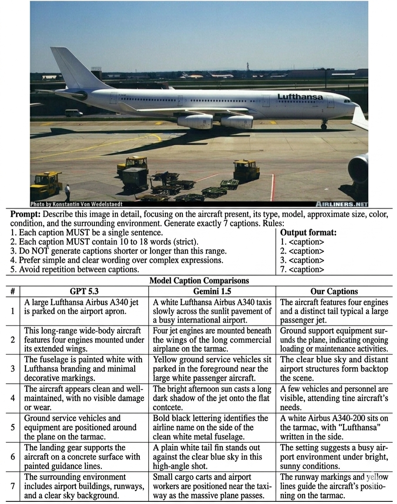
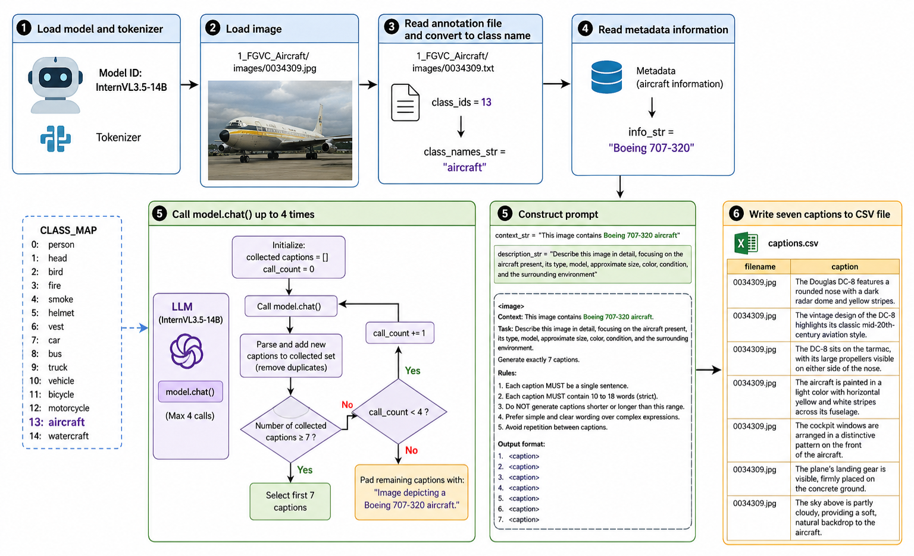
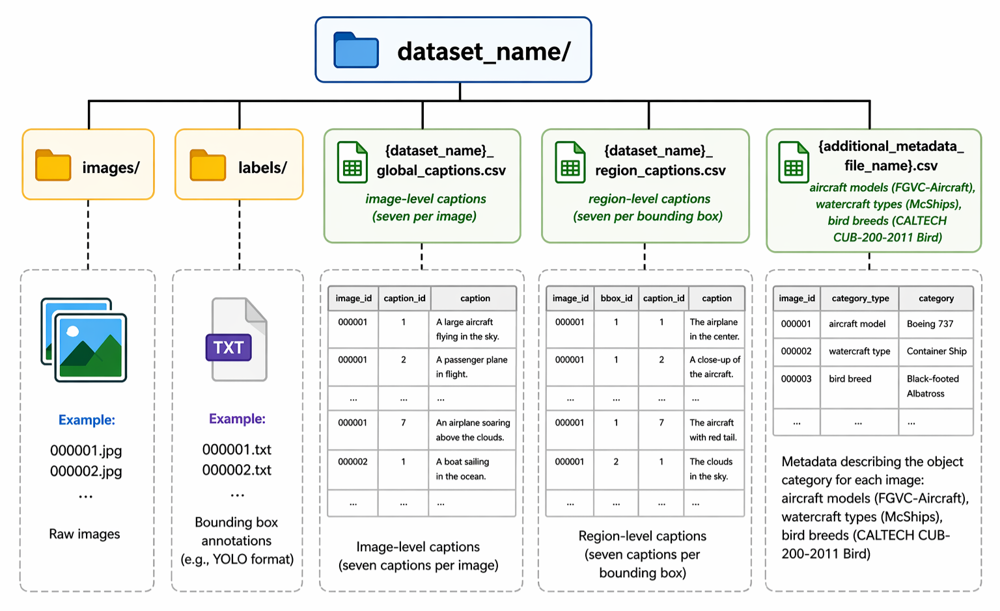
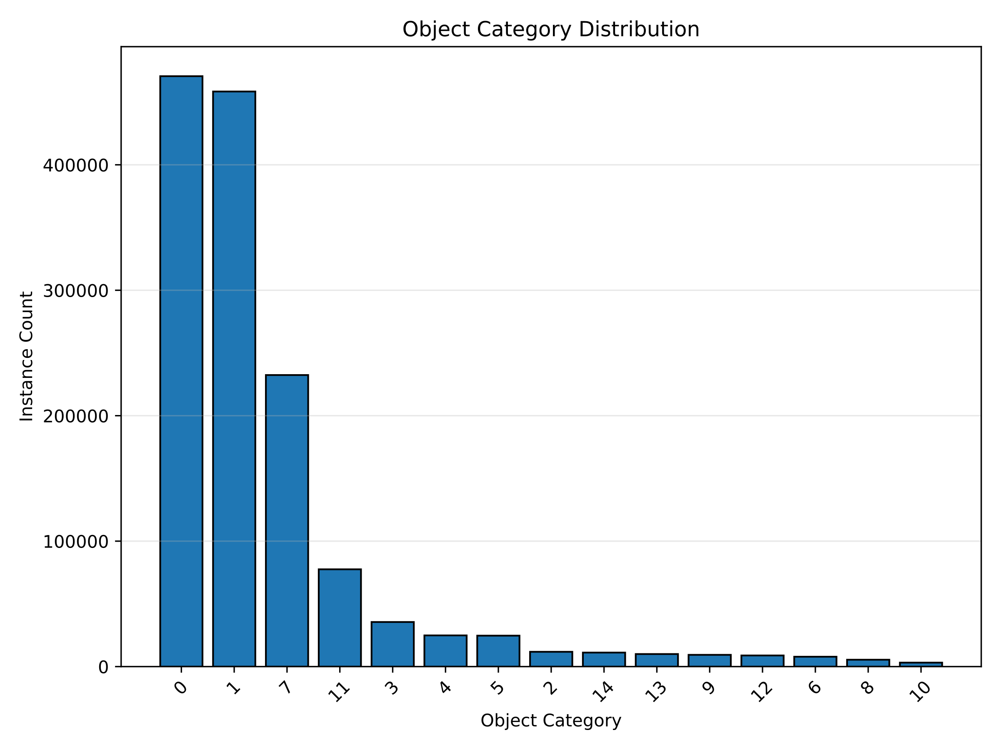

# MIRCaps: A Large-Scale Mixed-Domain Dataset with Image-Level and Region-Level Captions for Fine-Grained Vision-Language Learning

## 摘要

**论文元信息。** 本文分析对象为 arXiv:2606.21419v1，题为 *MIRCaps: A Large-Scale Mixed-Domain Dataset with Image-Level and Region-Level Captions for Fine-Grained Vision-Language Learning*，作者为 Arlindo Luciano Tulumba Roberto 与 Hyungjoon Kim，发表于 2026-06-19，类别为 cs.CV 与 cs.AI。论文链接为 http://arxiv.org/abs/2606.21419v1，PDF 链接为 https://arxiv.org/pdf/2606.21419v1。论文在摘要中声明数据集与代码公开于 https://zenodo.org/records/20418601，见 PAGE 1；但当前全文材料未提供可核验的源码文件树、核心函数或配置内容，因此本文的代码分析结论为：**公开代码可确认到链接层面，源码实现证据不足；本文不贴代码段，不做源码级对应分析。**

**一句话总结。** MIRCaps 提出一个面向通用图像与 CCTV 监控场景的混合域图文数据集，通过图像级描述（image-level captions）、区域级描述（region-level captions）和边界框标注（bounding boxes）联合构建细粒度视觉-语言监督，用于提升轻量级视觉语言模型（Vision-Language Models, VLMs）在属性描述、图像描述生成和目标检测训练中的可用性，见 PAGE 1。

本文的核心贡献不是提出新的模型架构，而是提出一种大规模、混合域、属性密集的自动标注数据资源。论文声称 MIRCaps 包含 141,364 张图像、981,947 条图像级 captions、1,742,264 条区域级 captions，以及 1,391,779 个 bounding box annotations，见 PAGE 1。其目标是弥补现有图文数据集在 CCTV 场景、对象属性、动作、状态和环境上下文方面的覆盖不足。

从证据强度看，本文最有价值的部分是数据构建流程、质量评估和下游任务验证。论文给出了数据来源、15 类统一目标类别、COCO 到 YOLO 标注格式转换、InternVL3.5-14B 自动生成 captions、人工评估、CLIPScore 评估、轻量级 VLM 微调实验，以及 YOLOv12s / RT-DETR-L 目标检测实验，见 PAGE 2 至 PAGE 8。需要谨慎的是，论文中部分统计数字存在不一致：摘要与结论使用 981,947 / 1,742,264 条 caption 统计，Table 1 的 total 行则写为 980,947 / 1,719,246，见 PAGE 1、PAGE 4 和 PAGE 8。这不影响数据集方向本身，但影响复现实验和数据审计时的计数可信度。

## 背景与动机

视觉语言模型（Vision-Language Models, VLMs）试图将视觉感知与自然语言推理结合起来，使系统能够进行图像描述生成（image captioning）、视觉问答（Visual Question Answering, VQA）、文本-视频检索和场景级推理。论文在 Introduction 中提到 BLIP-2、LLaVA、Flamingo 等架构已经推动视频分析能力发展，尤其在 CCTV 监控和零售事件理解中，轻量感知模块与 VLM 语义推理结合可以降低幻觉并改善实时分析，见 PAGE 1。

本文的出发点是：VLM 的性能并不只取决于数据量，还取决于文本-图像配对的粒度和精度。论文强调，稳健的跨模态对齐需要显式建模对象属性、空间拓扑、动作、对象状态和环境上下文，见 PAGE 1。换言之，一个 caption 如果只说“a bus next to a building”，对通用图像检索可能够用，但对交通监管、安防、事故检测或开放词汇检测训练来说，车辆颜色、是否移动、是否拥挤、人员是否上车等信息才是高价值监督。

现有图像描述基准各有侧重。MS COCO Captions 依赖人工标注，具有较高质量，但通常是短句和通用场景描述；LAION-400M 规模巨大，但图文质量和任务定向能力并不等价；Visual Genome 提供区域级描述，但并不专门面向 CCTV 或监控类对象分布。MIRCaps 的定位是补足两个缺口：一是混合通用域与 CCTV 域；二是同时提供图像级和对象区域级文本监督，见 PAGE 1 和 PAGE 4。

论文明确指出“mixed-domain image-caption datasets”仍然有限，这里的 mixed-domain 指既包含一般视觉场景，也包含 CCTV-based video surveillance systems 相关图像，见 PAGE 1。对于自动标注和数据闭环团队，这一定位具有直接工程价值：它不只是训练一个 captioning 模型，而是为“框级文本描述生成、属性标注、开放词汇检测、监控视频语义检索”提供可迁移的 schema 参考。

| 数据集 | 图像数 | Captions 数 | 平均 captions / image | Caption 类型 | 标注方法 | 图像域 |
|---|---:|---:|---:|---|---|---|
| LAION-400M | 400,000,000 | 400,000,000 | 1 | Image-level | Automatic | General purpose |
| MS COCO Captions | 330,000 | 1,650,000 | 5 | Image-level | Manual | General purpose |
| Flickr30k | 31,783 | 158,915 | 5 | Image-level | Manual | General purpose |
| Visual Genome | 108,000 | 5,400,000 | 50 | Region-level | Manual | General purpose |
| MIRCaps | 141,364 | 981,947 | 6.99 | Image-level | Automatic | CCTV / General purpose |
| MIRCaps | 141,364 | 1,742,264 | 6.98 | Region-level | Automatic | CCTV / General purpose |

表格解读：该表基于论文 Table 2，见 PAGE 4。MIRCaps 的绝对规模小于 LAION-400M 和 MS COCO 的 image-level caption 总量，也小于 Visual Genome 的 region-level caption 总量；但它的差异化在于同时覆盖 image-level 与 region-level captions，并显式覆盖 CCTV / general purpose 混合域。对业务数据团队而言，这类数据结构更接近“检测框 + 属性句子 + 场景句子”的训练闭环，而不是单纯的图片-短句配对。

## 预备知识

**图像级描述（image-level caption）** 描述整张图像的主要内容、场景、环境和关键对象。MIRCaps 为每张图像平均提供约 7 条 image-level captions，目标是覆盖同一图像的不同方面，见 PAGE 1。图像级描述适合训练模型理解整体场景，例如“街道上有一辆黄色出租车，周围有建筑和交通灯”。

**区域级描述（region-level caption）** 则与单个标注框或裁剪区域对应，重点描述对象类别、颜色、动作、状态、大小和局部上下文。论文称每个 annotated bounding box 平均具有 7 条 region-level captions，见 PAGE 1。区域级描述对开放词汇检测、grounded captioning、细粒度属性学习更关键，因为它把自然语言监督绑定到具体视觉区域。

**边界框（bounding box）** 是目标检测中描述对象位置的矩形框。论文将不同来源数据集的标注统一到 YOLO 格式，即每行包含 `<class_ID> <x_center> <y_center> <w> <h>`，其中坐标均相对于图像宽高归一化到 `[0,1]`，见 PAGE 2。这种统一格式有利于跨数据集训练 YOLOv12s、RT-DETR-L 等检测模型，但也带来一个风险：如果源数据集本身没有穷尽标注所有对象，格式统一并不能修复漏标问题，论文也在 Limitations 中承认了这一点，见 PAGE 8。

**质量评估指标。** Caption 质量方面，论文使用 CLIPScore 衡量图像-文本语义对齐，并使用人工评估检查 hallucination、对象存在一致性、尺寸、颜色、动作、状态、场景上下文和附加信息，见 PAGE 5 和 PAGE 6。检测任务方面，论文使用 mAP、mAP@50、mAP@50:95、Precision、Recall、IoU 等目标检测指标，见 PAGE 8。图像质量方面，论文使用 NIQE、BRISQUE、PIQE 等无参考图像质量评估指标，见 PAGE 4 和 PAGE 14。

**公式证据说明。** 论文全文中可确认的显式编号公式仅 Equation 1、Equation 2 和 Equation 3，见 PAGE 5。paper-analyzer academic 风格通常要求至少 5 处公式引用，但本文材料不足以支持 5 个论文公式；以下只解析论文实际给出的 3 个公式，不补造训练损失、检测目标函数或未出现的指标公式。

论文首先定义 image-caption alignment 的平均 CLIPScore：

$$
CS_{\text{image}} = \frac{1}{N_{\text{image}}} \cdot \sum_{i=1}^{N_{\text{image}}} CLIPScore(I_i, C_i)
$$

其中，$CS_{\text{image}}$ 表示最终平均 CLIPScore，$N_{\text{image}}$ 表示图像-caption pair 总数，$I_i$ 表示第 $i$ 张图像，$C_i$ 表示与其对应的 caption。人话解释：这个公式就是把每对图像和文本的 CLIPScore 加总后取平均，用于估计整批 caption 与图像语义是否一致，见 PAGE 5。

人工评估中，每个问题的分数定义为：

$$
Question\ Score =
\left(
\frac{\sum YES\ responses}{N_{\text{samples}} \times N_{\text{annotators}}}
\right)
\times 100
$$

其中，$N_{\text{samples}}$ 是样本数，$N_{\text{annotators}}$ 是标注员数量，YES responses 是标注员对某个评估问题回答 YES 的次数。人话解释：如果三位标注员在大量样本上越常回答“是”，该维度得分就越高，见 PAGE 5。

整体平均分定义为：

$$
Overall\ Average =
\left(
\frac{\sum All\ YES\ responses}{\sum All\ evaluations}
\right)
\times 100
$$

这个公式把所有评估问题、所有样本和所有标注员的 YES 结果合并为一个总比例。人话解释：它不是某一个维度的准确率，而是 caption 在多维人工检查下的综合通过率，见 PAGE 5。

## 方法详解

MIRCaps 的第一步是定义统一对象类别。论文面向 CCTV 观察场景和项目需求定义 15 类对象：Person、Head、Bird、Fire、Smoke、Helmet、Vest、Car、Bus、Truck、Vehicle、Bicycle、Motorcycle、Aircraft、Watercraft，对应类别 ID 0 至 14，见 PAGE 2。这里的 Head 特指 CrowdHuman 数据集中的人体头部标注，Vehicle 表示 car 以外的机动车，如 bus 和 truck，见 PAGE 2。

这一类别设计有明显工程导向。Person、Head、Helmet、Vest 对安全生产和安防监控有直接价值；Fire、Smoke 对灾害检测有价值；Car、Bus、Truck、Bicycle、Motorcycle、Vehicle 对交通视频分析有价值；Aircraft、Watercraft、Bird 则扩大了细粒度对象类型和跨域变化。相比通用 caption 数据集，MIRCaps 更接近“目标检测标签空间 + 属性文本监督”的组合。

数据来源方面，论文聚合了多个公开目标检测数据集，包括 FGVC-Aircraft、DFire、DFS Fire and Smoke、CrowdHuman、OD-VIRAT-Tiny、Forest Fire、CQUniversity Fire and Smoke、CALTECH CUB-200-2011 Bird、Vehicle Orientation、MS COCO 2014、McShips、PPE 和 HardHat-Vest，见 PAGE 2。选择标准包括类别覆盖、数据集规模、单对象 / 多对象场景、数据多样性和最终 image-caption 数据的变异性，见 PAGE 2。

预处理环节主要解决跨数据集格式不一致问题。论文移除了图像与标签不匹配、缺失文件、重复条目等数据；对于非 YOLO 格式的框标注，例如 OD-VIRAT-Tiny 的 COCO 格式 `[x,y,w,h]`，论文将其转换为 YOLO 的 `[x_center,y_center,w,h]`，并归一化到 `[0,1]`，见 PAGE 2。随后，论文采用统一类别名和 ID mapping，忽略源数据集中与最终类别无关的对象，见 PAGE 2 和 PAGE 13。

| 源数据集 | 原始标签示例 | MIRCaps 统一标签 |
|---|---|---|
| DFire | Fire (0), Smoke (1) | Fire (3), Smoke (4) |
| CrowdHuman | fbox, hbox | Person (0), Head (1) |
| OD-VIRAT-Tiny | Bicycle, Car, Person, Vehicle | Bicycle (11), Car (7), Person (0), Vehicle (10) |
| Vehicle Orientation | Car_front, Car_back, Car_side | Car (7) |
| McShips | Civilianship, Warship | Watercraft (14) |
| HardHat-Vest | Helmet, Vest, Head | Helmet (5), Vest (6), Head (1) |

表格解读：该表摘取自 Appendix D 的 Table 9，见 PAGE 13。MIRCaps 的核心不是直接拼接多个数据集，而是把不同数据集的局部标签空间折叠到统一的 15 类标签空间。这样做降低了训练检测器时的类别冲突，但也会损失源数据集中更细粒度的类别差异，例如 Vehicle Orientation 中的朝向信息被合并为 Car。

用途：下图用于说明 MIRCaps 与现有 SOTA 多模态模型生成 caption 的差异，重点观察是否包含对象类型、颜色、大小、细粒度型号和场景信息，见 Figure 1 / PAGE 2。

读图要点：Figure 1 展示了论文声称的优势：即使使用相对较小的 InternVL3.5-14B 生成 captions，MIRCaps 的描述也能捕获 primary object、type、estimated size、color、scene，以及 aircraft model 等细粒度信息，见 PAGE 2。支撑的判断：本文的主要数据价值来自属性丰富的 caption schema，而不是模型参数规模优势；论文用 Figure 1 支撑这一点。

Caption 生成阶段，论文使用 InternVL3.5-14B 为所有图像生成 captions，见 PAGE 3。为了提高语义质量，作者将原始数据集中的额外 metadata 注入 prompt，例如 CALTECH-200-2011 Birds 的鸟类 species、FGVC-Aircraft 的制造商和型号、McShips 的 civilian / warship 类型，见 PAGE 3。与此同时，prompt 会根据 bounding box annotation 派生出的对象类别动态构建，使模型生成上下文相关、类别相关的 captions，见 PAGE 3。

用途：下图用于说明 caption generation pipeline，即从图像、检测框、类别和 metadata 到 image-level / region-level captions 的自动生成流程，见 Figure 2 / PAGE 3。

读图要点：Figure 2 的关键是 caption 生成不是单纯对整图调用一次 VLM，而是结合了对象类别和源数据 metadata。支撑的判断：MIRCaps 的 caption 更可能包含型号、类别、局部属性等细节，原因在于 prompt construction 阶段显式注入了额外结构化信息，而不是完全依赖模型自由描述，见 PAGE 3。

Caption 清洗阶段，论文删除同一图像或同一区域的完全重复 captions，并清理多余空格、不一致标点和大小写错误，见 PAGE 3。这是自动标注数据集中必要但不足的步骤：它能改善格式和重复问题，却不能完全消除语义 hallucination 或框内对象错配。因此论文后续仍需要 CLIPScore 和人工评估来检验 caption fidelity，见 PAGE 5。

数据组织方面，MIRCaps 被组织为 13 个目录，每个目录对应一个源数据集。每个目录包含 images、labels、image-level caption CSV、region-level caption CSV，以及可选 metadata CSV；metadata 只存在于 FGVC-Aircraft、McShips 和 CALTECH CUB-200-2011 Bird 三个数据集，见 PAGE 3。论文举例说明 FGVC-Aircraft 目录包含 10,000 张图像、10,000 个 `.txt` annotation files、70,000 条 image-level captions、70,000 条 region-level captions，以及 aircraft manufacturer / model metadata，见 PAGE 3。

用途：下图用于说明 MIRCaps 的基础目录层级，即每个源数据集如何被整理为 images、labels、caption CSV 和 metadata CSV，见 Figure 3 / PAGE 3。

读图要点：Figure 3 强调数据集的可训练性：images 和 labels 可直接供检测模型使用，caption CSV 可供 VLM 微调或图文检索任务使用，metadata CSV 可支持属性增强 prompt。支撑的判断：MIRCaps 的设计接近工程数据湖结构，而不是只发布一组 caption 文本。

| 数据集 | 图像数 | 标注文件数 | Global captions | Region captions | Metadata |
|---|---:|---:|---:|---:|---:|
| FGVC-Aircraft | 10,000 | 10,000 | 70,000 | 69,723 | 6,668 |
| DFire | 21,527 | 21,527 | 149,323 | 185,753 | 0 |
| CrowdHuman | 20,396 | 20,396 | 135,549 | 248,768 | 0 |
| OD-VIRAT-Tiny | 19,860 | 19,860 | 139,018 | 159,211 | 0 |
| McShips | 7,879 | 7,879 | 55,153 | 55,153 | 78,171 |
| HardHat-Vest | 6,727 | 6,727 | 47,089 | 216,840 | 0 |
| Total | 141,364 | 141,364 | 980,947 | 1,719,246 | 96,626 |

表格解读：该表摘取自 Table 1，见 PAGE 4。DFire 的图像与 global captions 数量最高；CrowdHuman 的 region captions 很高；McShips 的 metadata 数量最高。需要注意的是，Table 1 的 total 行与摘要 / 结论中的 caption 总量不一致：Table 1 为 980,947 / 1,719,246，而摘要与结论为 981,947 / 1,742,264，见 PAGE 1、PAGE 4 和 PAGE 8。这是复现和审计时必须核对的数据版本问题。

质量评估部分分为图像质量、框标注质量和 caption 质量。图像质量使用 NIQE、BRISQUE、PIQE、亮度、对比度、锐度、分辨率、纵横比、RGB 统计和 corrupted image ratio，见 PAGE 4、PAGE 14。边界框质量首先经过 visual inspection，作者称没有发现 critical mismatches；其次分析 1,391,779 个 bounding box instances 在 15 类上的分布，见 PAGE 4 和 PAGE 5。

用途：下图用于展示 MIRCaps 的 15 类对象长尾分布，重点观察 Person、Head、Car 等高频类别与 Bus、Vehicle 等低频类别的差距，见 Figure 4 / PAGE 5。

读图要点：Figure 4 对应论文的 category distribution analysis。论文指出 Person 有 470,648 个实例，Head 有 458,434 个实例，Car 有 232,410 个实例，Bicycle 有 77,550 个实例；Bus 只有 5,475，Vehicle 只有 3,158，见 PAGE 4 至 PAGE 5。支撑的判断：MIRCaps 的目标检测标签空间高度长尾，模型训练时需要关注类别不平衡，否则 tail classes 的检测性能可能不足。

Caption 质量评估有两层。第一层是 CLIPScore，论文报告 overall average CLIPScore 为 28.56，image-level 为 28.50，region-level 为 28.62，见 PAGE 5。第二层是人工评估，三位独立标注员检查 25,844 个 image-caption pairs，其中 image-level 和 region-level 各 12,922，覆盖 13 个源数据集，每个数据集随机抽取 142 张图像和 142 张 cropped images，见 PAGE 5。

| Caption 类型 | 平均 CLIPScore | Image-caption pairs |
|---|---:|---:|
| Image-level | 28.50 | 981,947 |
| Region-level | 28.62 | 141,709 |
| Overall | 28.56 | 1,131,257 |

表格解读：该表来自 Table 3，见 PAGE 5。Region-level captions 的 CLIPScore 略高于 image-level captions，说明局部裁剪区域与文本之间可能更容易形成语义对齐。但这里也存在一个需要审计的问题：论文前文声称 region-level captions 总量超过 170 万，而 Table 3 中用于 CLIPScore 的 region-caption pairs 只有 141,709，见 PAGE 1、PAGE 4 和 PAGE 5。因此这个质量评估结果不能直接等同于全量 region-level captions 的质量结论。

代码分析方面，论文在摘要中声明数据集与代码公开于 Zenodo，见 PAGE 1。当前材料中没有 README、脚本路径、训练配置文件、数据构建脚本或核心源码函数；Zenodo 链接本身只能证明论文声明了公开入口，不能支撑源码级 method-to-code 对应。因此本文不提供伪造代码片段。可确认结论是：**本文未提供可确认的公开源码内容；代码实现细节证据不足。**

## 实验分析

论文的实验分为两个下游任务：图像描述生成（image captioning）和目标检测（object detection）。图像描述生成部分评估轻量级 VLM，包括 SmolVLM-256M-Instruct、BLIP、BLIP2-2.2B、Qwen2.5-VL-3B-Instruct；指标包括 BLEU-4、METEOR、CIDEr-D、BERTScore 和 CLIPScore，见 PAGE 6 和 PAGE 7。目标检测部分评估 YOLOv12s 与 RT-DETR-L，数据集按 80% / 10% / 10% 划分为训练、验证和测试集，对应 112,269 / 14,034 / 14,034 张图像，见 PAGE 7。

| 模型 | BLEU-4 | METEOR | CIDEr-D | BERTScore | CLIPScore |
|---|---:|---:|---:|---:|---:|
| SmolVLM-256M-Instruct Baseline | 0.05 | 0.30 | 0.05 | 0.86 | 0.29 |
| SmolVLM-256M-Instruct Finetuned | 0.26 | 0.50 | 0.33 | 0.88 | 0.29 |
| BLIP Baseline | 0.07 | 0.23 | 0.13 | 0.85 | 0.28 |
| BLIP Finetuned | 0.17 | 0.41 | 0.10 | 0.86 | 0.28 |
| BLIP2-2.2B Baseline | 0.09 | 0.25 | 0.16 | 0.85 | 0.30 |
| BLIP2-2.2B Finetuned | 0.27 | 0.48 | 0.33 | 0.87 | 0.28 |
| Qwen2.5-VL-3B-Instruct Baseline | 0.29 | 0.49 | 0.36 | 0.88 | 0.28 |
| Qwen2.5-VL-3B-Instruct Finetuned | 0.13 | 0.46 | 0.09 | 0.88 | 0.29 |

表格解读：该表来自 Table 7，见 PAGE 7。SmolVLM 和 BLIP2 微调后在 BLEU-4、METEOR、CIDEr-D 上显著提升，说明 MIRCaps 对部分轻量模型确实提供了有效 caption supervision。但 Qwen2.5-VL-3B-Instruct 出现反常结果：baseline 在 BLEU-4 和 CIDEr-D 上高于 finetuned。论文解释为 pretrained instruction-tuned model 在提示未限制长度时生成更长、更具词汇多样性的描述，更容易获得 overlap-based metrics 的高分；微调后模型更接近数据集风格，输出较短更简洁，因此部分指标下降，见 PAGE 6。

这个结果提示一个重要方法论问题：captioning 自动指标并不总是等价于业务可用性。如果业务目标是生成更短、更结构化的对象属性描述，finetuned Qwen2.5-VL 的 BLEU-4 下降未必说明模型退化；但如果目标是与参考 caption 产生最大词汇重叠，则 baseline 可能更占优势。论文用 Figure 5 的定性样例说明 pretrained instruction-tuned models 倾向生成更长描述，而 fine-tuned models 倾向生成对象中心、数据集风格的描述，见 PAGE 7。由于用户提供的 figures 列表未包含 Figure 5 的 markdown_path，本文不嵌入该图，仅引用其页码证据。

人工评估结果比单一 CLIPScore 更能反映 caption 结构问题。Image-level captions 在 hallucination check、object presence consistency、color、scene context、additional information 等维度上得分较高；region-level captions 在 color 上表现很好，但在 additional information、action、object presence consistency 上更弱，见 PAGE 5 和 PAGE 6。

| 评估问题 | Image-level captions (%) | Region-level captions (%) |
|---|---:|---:|
| Q1 Hallucination Check | 97.33 | 74.32 |
| Q2 Object Presence Consistency | 92.24 | 71.52 |
| Q3 Size | 22.01 | 35.26 |
| Q4 Color | 93.86 | 90.68 |
| Q5 Action | 61.21 | 37.45 |
| Q6 State | 70.91 | 57.37 |
| Q7 Scene Context | 99.13 | 58.16 |
| Q8 Additional Information | 95.02 | 32.56 |
| Overall Avg. | 78.96 | 57.17 |

表格解读：该表来自 Table 5，见 PAGE 6。Image-level captions 的整体人工得分为 78.96%，region-level captions 为 57.17%。这说明区域级描述虽然 CLIPScore 略高，但人工多维质量并不全面优于图像级描述。尤其 Q8 additional information 只有 32.56%，表明局部区域 caption 不稳定地携带型号、品种、船只类别等补充信息；Q5 action 也只有 37.45%，说明框级动作描述仍是弱项。

Inter-annotator agreement 使用 Fleiss’ Kappa 衡量。论文报告 image-level captions 的 overall kappa 为 0.4836，region-level captions 为 0.5004，均为 Moderate，见 PAGE 6。颜色和场景上下文等较明确视觉属性更容易达成一致；hallucination check 和 state 判断更难，见 PAGE 5 和 PAGE 6。这与监控数据的实际难点一致：颜色通常可见，状态和动作则依赖时间上下文、清晰度和标注员判断标准。

目标检测实验使用 YOLOv12s 和 RT-DETR-L，在相同数据集划分上微调。YOLOv12s 使用 SGD、初始学习率 0.01、cosine decay、batch size 12、训练 92 epochs、early stopping patience 50，并在最后 10 个 epochs 禁用 mosaic augmentation，见 PAGE 16。RT-DETR-L 使用 AdamW、初始学习率 1e-4、cosine scheduling with warmup、batch size 2、训练 43 epochs，见 PAGE 16。共同设置包括 640×640 输入分辨率和 AMP，见 PAGE 16。

| 数据集 / 模型 | 图像数 | Epochs | mAP@50 | mAP@50:95 | Precision | Recall | IoU |
|---|---:|---:|---:|---:|---:|---:|---:|
| MIRCaps / YOLOv12s | 141,364 | 92 | 68.9 | 49.7 | 80.7 | 63.3 | 68.4 |
| MIRCaps / RT-DETR-L | 141,364 | 43 | 63.6 | 43.6 | 75.7 | 60.6 | 47.8 |

表格解读：该表摘取自 Table 8，见 PAGE 8。YOLOv12s 在 mAP@50、mAP@50:95、Precision、Recall 和 IoU 上均高于 RT-DETR-L，说明在该训练预算和数据条件下，YOLOv12s 更适合这组混合域检测数据。需要注意两个限制：第一，RT-DETR-L 训练 epoch 更少且 batch size 更小，直接比较可能受硬件限制影响；第二，Table 8 的行名写作 “VACaps (ours)” 而非 MIRCaps，见 PAGE 8，可能是论文排版或命名残留，需要复现实验时核对。

论文没有提供严格意义上的消融实验。它没有单独比较“只用 image-level captions”“只用 region-level captions”“不注入 metadata”“不做 caption cleansing”“不同 prompt schema”等变量。因此，关于每个设计组件的独立贡献，当前证据不足。论文能支撑的结论是：在完整 MIRCaps 数据构建流程下，部分轻量 VLM 微调后 captioning 指标提升，YOLOv12s 在该检测数据上表现优于 RT-DETR-L；但不能支撑“metadata 注入单独带来多少收益”或“region-level captions 对检测提升多少”的因果结论。

## 讨论

MIRCaps 的适用边界首先取决于任务类型。对于需要对象属性描述、框级文本生成、开放词汇检测数据扩展、CCTV 图像语义检索的团队，MIRCaps 的 schema 具有较强参考价值：每张图像有全局 captions，每个框有局部 captions，并且类别覆盖人员、车辆、火烟、防护装备、水上与空中目标，见 PAGE 1 和 PAGE 2。该结构比单纯的 image-caption pair 更适合构建“检测框到自然语言属性”的数据闭环。

其次，MIRCaps 更适合做数据范式借鉴，而不能直接假定适合所有生产场景。论文的数据来自 13 个公开源数据集，覆盖分辨率从 60×60 到 7200×10800，平均约 698×1056，见 PAGE 14。这种多样性有利于泛化，但也会引入场景、设备、角度、标注标准和授权条件的混杂。监控业务如果直接迁移，需要重新检查 CCTV 图像质量、隐私合规、人脸 / 人体数据使用边界，以及类别长尾对目标检测模型的影响。

第三，MIRCaps 对轻量级 VLM 的结论需要谨慎解释。SmolVLM 和 BLIP2 微调收益明显，BLIP 部分指标改善但 CIDEr-D 下降，Qwen2.5-VL 微调后 overlap-based metrics 反而下降，见 PAGE 7。这说明数据集可以提供监督，但不同模型架构、预训练能力、prompt 长度约束和生成风格会显著影响指标表现。把 MIRCaps 用于工程训练时，应明确目标输出格式：是详细自然语言场景描述，还是短句属性标签，还是检测框对应的结构化短描述。

第四，论文对 region-level captioning 的验证还不充分。虽然 MIRCaps 提供大量 region-level captions，并且 Table 3 显示 region-level CLIPScore 略高，见 PAGE 5，但作者在 Limitations 中明确承认，由于计算资源限制，VLM 并未在 object-centric captions 上进行 region-level captioning fine-tuning，见 PAGE 8。因此，MIRCaps 的区域级描述潜力还没有被完整下游实验验证。

## 局限分析

作者自述的第一项局限是 **Limited Bounding Box Coverage**。虽然 MIRCaps 定义了 15 个对象类别，但若原始源数据集没有标注所有类别的所有实例，则统一后的数据集中仍会存在漏标。作者指出 YOLOv12 和 RT-DETR-L 的检测结果受到 incomplete bounding box annotations 影响，未来工作需要确保所有对象实例被穷尽标注，见 PAGE 8。这一局限对检测训练很关键，因为漏标会把真实对象当作背景处理，直接损害召回率和尾部类别性能。

作者自述的第二项局限是 **Limited Fine-Tuning for Region-Level Captioning**。论文承认，尽管 region-level captions 的平均 CLIPScore 为 28.62，人工评估 overall quality 为 57.17%，但用于 image-level captioning 的 VLM 没有在 object-centric captions 上微调，原因是计算资源有限，见 PAGE 8。因此，论文不能证明这些 region-level captions 已经能稳定提升区域级 captioning 模型，只能说明数据已经构建并进行了初步质量验证。

作者还在 Ethical Considerations 中指出，MIRCaps 包含 surveillance images，存在被用于 privacy-invasive applications 的风险；源数据集聚合可能引入场景和对象分布偏差，影响 downstream fairness and generalization；自动生成 captions 可能仍包含 residual hallucinations；不完整 bounding box annotations 可能降低下游目标检测性能，见 PAGE 8。这些风险对于视频监控业务尤其重要，不能只从模型指标角度评估数据集价值。

我的独立判断有三点。第一，论文内部统计不一致需要优先修复：摘要 / 结论和 Table 1 对 image-level 与 region-level caption 总量的报告不同，见 PAGE 1、PAGE 4 和 PAGE 8；Table 3 的 region-caption CLIPScore 样本数也远小于全文声称的 region-level captions 总量，见 PAGE 5。第二，缺少消融实验使得方法组件贡献不可分解：metadata 注入、动态 prompt、caption cleansing、区域裁剪、类别统一各自贡献多大，论文没有定量回答。第三，目标检测实验与 caption 数据之间的关系还不清楚：检测实验主要验证 bounding box annotations 的可用性，而不是验证 captions 对 detection 的直接增益，见 PAGE 7 和 PAGE 8。

此外，授权和再分发限制会影响落地。Appendix G 指出 MIRCaps 以 CC BY 4.0 发布，但由于部分源数据集存在 non-commercial research-only、no explicit license 或 non-commercial research / educational use 限制，完整数据不能以全集形式重新分发；论文提供 captions、metadata 和脚本帮助用户从官方源获取图像与标注，见 PAGE 17。对于企业数据团队，这意味着不能只看技术可用性，还必须逐源检查许可证与数据处理合规。

## 结论

MIRCaps 的主要贡献是提出了一个面向通用域与 CCTV 域的混合多模态数据集，以图像级 captions、区域级 captions 和边界框标注组成细粒度视觉-语言监督。它的价值在于数据组织和 annotation schema：同一图像既有全局场景描述，也有对象级区域描述，并以统一的 15 类目标检测标签空间连接到下游检测任务，见 PAGE 1 至 PAGE 4。

实验结果显示，MIRCaps 对部分轻量级 VLM 的 image captioning 微调有帮助，尤其 SmolVLM-256M-Instruct 与 BLIP2-2.2B 在 BLEU-4、METEOR 和 CIDEr-D 上提升明显，见 PAGE 7；在目标检测实验中，YOLOv12s 在该数据集上优于 RT-DETR-L，见 PAGE 8。但论文也存在明确边界：区域级 captioning 尚未充分微调验证，边界框覆盖不完整，统计口径存在不一致，代码实现无法在当前材料中核验，监控图像存在隐私与合规风险，见 PAGE 8 和 PAGE 17。

对于“自动标注 / 数据”方向，MIRCaps 最值得借鉴的是区域 caption schema 与数据闭环思路：用检测框定位对象，用 metadata 和类别 prompt 增强生成，用 image-level 与 region-level captions 同时服务场景理解与对象属性学习。若用于视频监控属性标注、框级文本描述生成和开放词汇检测训练数据建设，应先做小规模复核：抽样检查 CCTV 图像质量、caption hallucination、漏框比例、长尾类别覆盖、隐私合规和许可证约束，再决定是否扩大训练规模。

## 证据索引

- PAGE 1：论文标题、作者、摘要、MIRCaps 总体规模、VLM 背景、MS COCO 短 caption 局限、三项主要贡献、Zenodo 公开链接。
- PAGE 2：15 类对象类别定义；源数据集列表；数据选择标准；文件过滤、COCO 到 YOLO 格式转换、类别映射、文件重命名；Figure 1 caption 对比。
- PAGE 3：InternVL3.5-14B caption generation；metadata 注入；动态 prompt；caption cleansing；Figure 2 caption pipeline；Figure 3 dataset structure；13 个目录的数据组织方式。
- PAGE 4：Table 1 数据集统计；Table 2 与 LAION-400M、MS COCO、Flickr30k、Visual Genome 等基准的比较；图像质量、框标注质量和类别分布分析开头。
- PAGE 5：Figure 4 类别分布；CLIPScore Equation 1；Table 3 caption category CLIPScore；人工评估样本设计；Equation 2 与 Equation 3。
- PAGE 6：Table 4 人工评估问题；Table 5 image-level / region-level caption 人工评估结果；Table 6 Fleiss’ Kappa 标注一致性；captioning 实验开头。
- PAGE 7：Table 7 轻量 VLM 图像描述实验结果；Figure 5 定性 caption 样例；Figure 6 region-level caption 样例；目标检测实验设置开头。
- PAGE 8：Table 8 YOLOv12s 与 RT-DETR-L 检测结果；结论；作者自述两项 limitations；ethical considerations 中的 privacy、bias、hallucination 和 incomplete bounding box 风险。
- PAGE 13：Table 9 源数据集类别到统一类别空间的映射。
- PAGE 14：Table 10 NR-IQA，Table 11 亮度 / 对比度 / 锐度，Table 12 分辨率、RGB 分布和 corrupted rate。
- PAGE 15：Table 13 与 Table 14 image-level / region-level captions 的人工评估附录细项。
- PAGE 16：YOLOv12s、RT-DETR-L 和 common training configuration。
- PAGE 17：Table 15 源数据集许可证、下载地址、再分发限制和 CC BY 4.0 发布说明。
