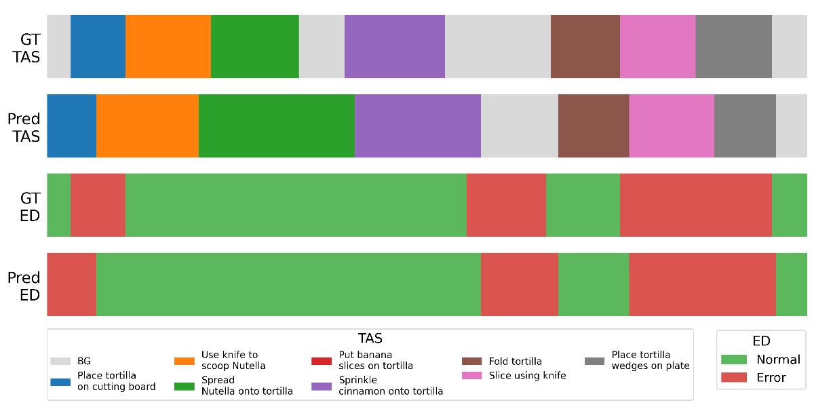
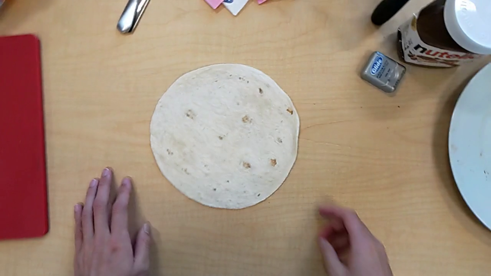
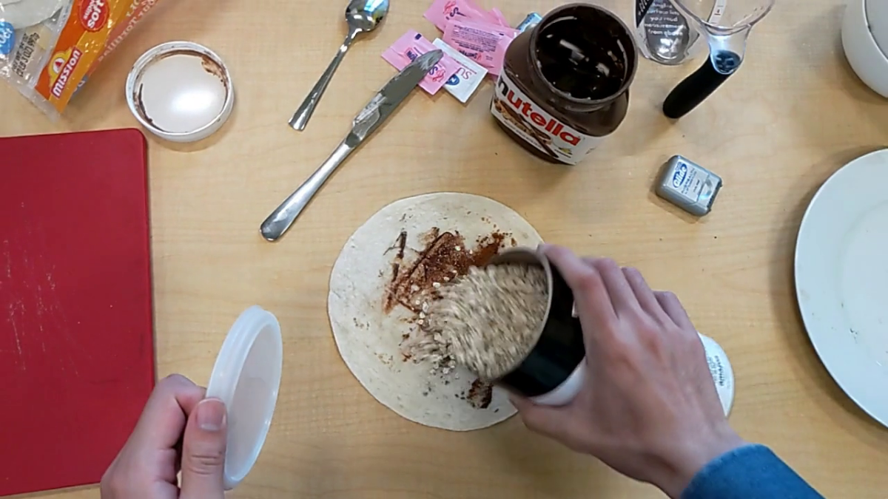
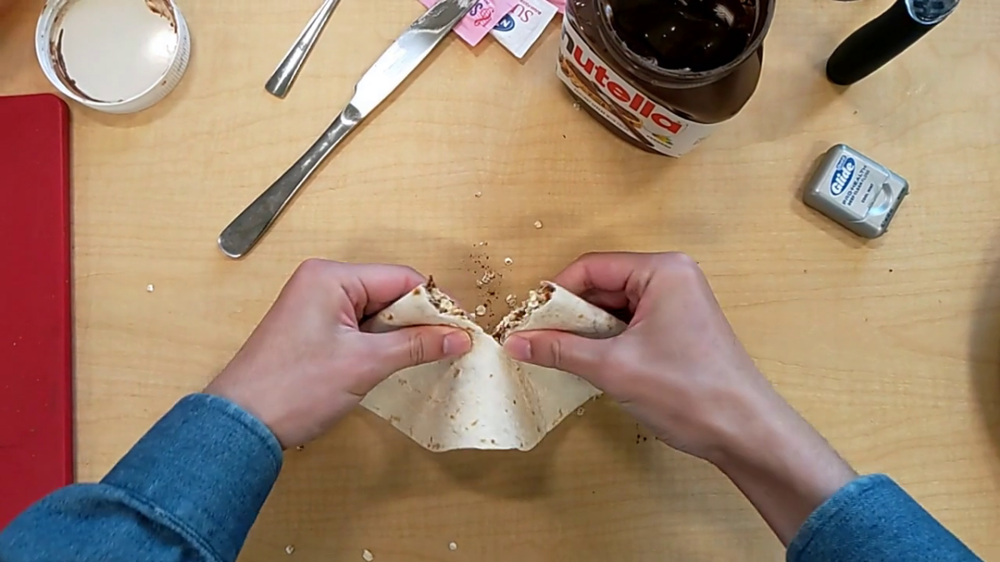

# The Unreasonable Effectiveness of VLMs for Zero-shot Procedural Mistake Detection

## 摘要

| 项目 | 内容 |
|---|---|
| 标题 | The Unreasonable Effectiveness of VLMs for Zero-shot Procedural Mistake Detection |
| 作者 | Serdar Ozsoy, Lars Doorenbos, Federico Spurio, Gianpiero Francesca, Juergen Gall |
| 机构 | University of Bonn, Toyota Motor Europe, Lamarr Institute |
| arXiv | 2606.21579v1 |
| 链接 | http://arxiv.org/abs/2606.21579v1 |
| 发布时间 | 2026-06-19，见 PAGE 1 |
| 推荐方向 | 视频理解，尤其是流程性动作理解与错误检测 |
| 代码状态 | 本文未提供可确认的公开代码；已知代码链接未知，全文 PAGE 1-PAGE 15 未见明确仓库地址，代码段证据不足 |

一句话总结：本文提出 ZeProM，将预训练视频语言模型（Video-Language Model, VLM）直接用于零样本流程错误检测（zero-shot procedural mistake detection），在不使用任务特定训练数据的条件下，同时完成时序动作分割（Temporal Action Segmentation, TAS）、错误检测与错误解释，并在 EgoPER 与 CaptainCook4D 上接近或超过部分全监督方法，见 PAGE 1-PAGE 2、PAGE 5-PAGE 7。

本文的核心结论并不是“更大的模型一定更好”，而是一个更具体的观察：当任务被组织成合适的输入表示与结构化输出表示后，单个预训练 VLM 可以承担过去由多阶段监督流水线完成的流程分析任务。作者明确强调 ZeProM 使用一个 “single pre-trained VLM”，并且 “without needing any task-specific training”，见 PAGE 1、PAGE 10。

需要先说明证据边界：论文没有提供模型训练损失、网络结构推导或参数更新公式。可确认的数学表达主要集中在任务定义、标签空间、采样温度与 Monte Carlo 概率聚合描述，见 PAGE 3-PAGE 4。因此，本文只解释论文中出现或由论文文字规则直接等价改写的公式；对于未给出的训练目标、实现源码和部署代码，均标注为证据不足。

## 背景与动机

流程错误检测（procedural mistake detection）关注的是：在一段完整的流程视频中，识别操作者何时以及如何偏离了既定步骤。论文指出，人类在流程性任务中的错误不可避免，并会在效率、生产率和资源消耗上造成损失，因此识别错误发生的位置具有实际价值，见 PAGE 1。这个问题在烹饪、装配、医疗辅助、工业质检和服务流程检查中都具有迁移意义。

传统离线流程错误检测方法通常将任务拆成两个模块：第一步是时序动作分割（Temporal Action Segmentation, TAS），即把视频切成与动作步骤对应的时间段；第二步是错误检测，即判断每个动作段是否执行错误，见 PAGE 3。这类方法往往依赖密集标注的视频来训练 TAS 网络，再用另一个模块判断哪些分割段异常。论文以 GTG2Vid 为例，说明其使用 DiffAct 分割视频，再结合 LLM/VLM 特征进行错误检测，见 PAGE 3。

这种多阶段全监督范式的问题在于可迁移性较差。只要流程步骤发生小改动，就可能需要重新采集、重新标注训练数据；而错误本身往往是低频且多样的，这使得监督学习成本更高。论文在摘要和引言中反复指出，现有方法依赖 tailored training datasets 和 task-specific training，这限制了它们的更广泛应用，见 PAGE 1-PAGE 2。

近期研究已经开始把 VLM 放入流程错误检测流水线，但通常只是作为局部组件。例如，一些方法让 VLM 生成场景图、解释已检测出的错误，或抽取特定片段的特征；TAS 仍由全监督网络完成，见 PAGE 1、PAGE 3。本文的出发点正是反转这个设计：不再把 VLM 当作流水线中的辅助模块，而是让它作为单一模块直接完成动作分割、错误检测和解释生成。

因此，本文提出的问题可以概括为：给定一段流程视频和任务描述，现有 VLM 能否在零样本条件下完成流程错误检测？论文将这一设置命名为 zero-shot procedural mistake detection，要求模型仅依据任务指令检测错误，而不依赖该任务的训练视频或错误样本，见 PAGE 2-PAGE 4。

## 预备知识

论文中的视频被表示为由连续帧组成的序列。设 $V$ 表示输入视频，$f_i$ 表示第 $i$ 帧，$T$ 表示视频总帧数，则论文给出的基本表示为：

$$
V=\{f_i\}_{i=1}^{T}
$$

这一定义说明，流程错误检测的输入不是单张图像，而是包含时间顺序的视频帧序列；模型必须在时间维度上定位动作和错误，见 PAGE 3。

传统流程错误检测首先预测每一帧所属的动作步骤标签。论文将时序动作分割的预测标签记为：

$$
\hat{y}^{s}\in\{a_0,a_1,\cdots,a_S\}
$$

其中，$\hat{y}^{s}$ 是预测的动作标签，$a_0$ 表示背景类，$a_1$ 到 $a_S$ 表示流程中的 $S$ 个动作步骤。这个公式的含义是：TAS 的目标是为每个视频帧分配一个动作步骤或背景标签，见 PAGE 3。

错误检测则进一步为动作段分配二值错误标签。论文将错误标签写为：

$$
\hat{y}^{e}\in\{0,1\}
$$

其中，$\hat{y}^{e}=1$ 按约定表示错误，$\hat{y}^{e}=0$ 表示没有错误。用更直白的话说，TAS 解决“这段视频在做哪一步”，错误检测解决“这一步做得是否正确”，见 PAGE 3。

论文还区分了 segment-level errors 与 task-level errors。segment-level errors 是只看单个片段就能判断的错误，例如动作本身执行错了；task-level errors 则需要结合整个流程上下文判断，例如某个必要步骤被省略，见 PAGE 5。这一区分很重要，因为只检测片段内错误的方法无法自然处理遗漏步骤。

本文使用的核心指标包括 Error Detection Accuracy（EDA）、F1@.5、Omission Accuracy（O-Acc）、Omission IoU（O-IoU），以及 TAS 中的 IoU、Edit score、F1@K、Accuracy、MoF 等，见 PAGE 5-PAGE 7。EDA 衡量错误检测准确性，F1@.5 衡量预测片段与真实片段在 0.5 重叠阈值下的检测质量；O-Acc 和 O-IoU 则用于遗漏步骤检测。

## 方法详解

### 1. 从全监督流程到零样本流程错误检测

传统方法将流程错误检测拆分为 TAS 和错误检测两个阶段。论文指出，已有系统通常先训练 TAS 网络，为每一帧预测 $\hat{y}^{s}$，再由后续模块预测 $\hat{y}^{e}$，见 PAGE 3。这种设计的优势是模块清晰，但代价是需要密集标注的视频数据。

ZeProM 的关键变化是把输入约束改为“视频 + 任务描述”。在零样本设定下，模型需要从任务说明中理解有哪些步骤、步骤如何被执行，再在没有任务特定训练样本的情况下输出错误标签。论文表述为：模型应当从 action descriptions and dependencies 出发，为任意视频预测错误标签，见 PAGE 4。

这个设定对 VLM 的要求比普通视频问答更高。模型不仅要识别画面中发生了什么，还要将观察到的动作与任务步骤对齐，并判断具体执行细节是否偏离要求。例如 Figure 1 中 quesadilla 任务里，ZeProM 能指出 tortilla 被放在桌面而不是红色砧板上、添加了任务图中不存在的 oats、手撕 tortilla 而不是用刀切、以及把 tortilla 放入碗而不是盘子，见 PAGE 2。

用途：下图用于说明 ZeProM 在同一段视频中同时输出动作分割、错误判断和解释，是本文方法的直观入口，见 PAGE 2 Figure 1。

读图要点：图中每个片段都对应一个动作段，ZeProM 输出 MISTAKE: YES，并给出具体解释。支撑的判断是：该方法不是只做二分类，而是将错误定位与自然语言解释绑定在同一结构化输出中，见 PAGE 2。

### 2. 输入表示：为什么只用有序步骤列表

ZeProM 的第一个设计重点是输入表示（input representation）。论文指出，传统 TAS 方法通常把步骤编码成 one-hot 向量，而 ZeProM 利用动作名称本身的语义信息进行零样本分割，见 PAGE 4。这意味着步骤描述不能只是编号，还必须包含自然语言动作名称。

作者选择用简单的 numbered actions list 描述流程，即按照顺序列出动作编号和动作名称，见 PAGE 4。论文明确说，更复杂的表示，如完整图结构，并没有带来更好性能。原因是显式依赖关系可能使模型在早期片段预测错误后，将错误传播到整个图结构，抵消了图表示的收益，见 PAGE 4。

这一点在消融实验中得到支持。Table 6 显示，用 DOT-graph 表示时 EDA 为 81.4、F1 为 40.2；用 DAG 表示时 EDA 为 82.5、F1 为 40.9；ZeProM 的有序列表表示达到 EDA 84.1、F1 41.0，见 PAGE 9。也就是说，更结构化的输入并不必然更适合 VLM；对当前任务而言，顺序动作列表更稳定。

用途：下图继续展示 Figure 1 中 ZeProM 对多个动作片段的处理方式，用于支撑“有序任务步骤 + 视觉片段对齐”的设计思想，见 PAGE 2。

读图要点：图像中的动作被标成 A、B、C、D 等片段，模型需要把每个片段与任务描述中的步骤进行匹配。支撑的判断是：输入动作列表提供了语义锚点，VLM 负责从视频中发现与这些锚点对应或不对应的实际操作，见 PAGE 2、PAGE 4。

### 3. 任务提示：先分割，再判断错误

ZeProM 没有直接要求 VLM 为每一帧输出错误标签，而是要求模型先把视频切分成动作段，再判断每段是否构成错误，见 PAGE 4。论文认为，这种设计与既有全监督流水线一致，同时促使模型花费更多 token 对任务进行推理，类似 chain-of-thought 或 reasoning 方法的效果，见 PAGE 4。

附录给出了完整 Prompt 模板。该模板要求模型观察烹饪流程视频，执行六类任务：分割离散动作段、给出起止时间、匹配 task graph steps、根据错误规则判断 wrong execution、wrong order、missing step、wrong action、处理 background 分类，并最终给出 overall verdict，见 PAGE 14-PAGE 15。

这里的关键不是 prompt 很长，而是规则具体。比如，模板要求总片段时长必须等于视频长度，片段之间不得有空隙或重叠；若片段超过 45 秒，要重新检查是否包含多个动作；当操作者更换物体、工具或动作类型时，应开始新片段，见 PAGE 14。这些规则直接约束了 VLM 的时序输出质量。

### 4. 输出表示：用结构化片段代替逐帧标签

ZeProM 的第二个核心设计是输出表示（output representation）。论文没有让模型生成每一帧的 dense labels，而是要求输出 JSON 格式的 segment list，见 PAGE 4。每个 segment 包含 segment ID、start time、end time、action description、matched step、binary error field 和 error description。

虽然论文使用 JSON 作为输出格式，但本文不输出 JSON；这里讨论的是模型内部预测结构。其思想是让 VLM 输出人可读且可评估的动作段，而不是直接给出难以解释的逐帧标签。这样，错误检测结果天然附带 action description 与 error explanation，见 PAGE 4。

论文还指出，ZeProM 不预先指定 segment 数量，并且模型生成的片段足够强，可以做到 non-overlapping、contiguous segments，因此作者没有对输出应用后处理，见 PAGE 4。这是一个重要经验结果：如果 VLM 不能稳定输出连续非重叠片段，那么零样本 TAS 就很难进入标准评估。

用途：下图用于说明输出表示中的 explanation 字段为什么有意义。ZeProM 不只是标记错误，还能解释错误原因，见 PAGE 2 Figure 1。

读图要点：图中 explanation 明确指出动作与任务图不一致，例如添加了任务图中没有的 topping。支撑的判断是：结构化输出将错误标签与自然语言证据绑定起来，提高了结果可解释性，见 PAGE 2、PAGE 4。

### 5. ZeProM-MC：用采样随机性近似错误概率

基础 ZeProM 输出的是二值错误标签，不包含概率。论文指出，直接让模型在输出中加入 confidence score 效果不理想，因此提出 ZeProM-MC，通过 VLM token generation 中的随机性获得概率预测，见 PAGE 4。

ZeProM-MC 使用采样温度 $t$。当 $t>0$ 时，VLM 的采样过程引入随机性；当 $t=0$ 时，模型输出确定性结果。论文先在 $t=0$ 下得到最可能的分割与错误标签：

$$
\hat{y}_{s,0},\quad \hat{y}_{e,0}
$$

其中，$\hat{y}_{s,0}$ 表示确定性采样得到的分割，$\hat{y}_{e,0}$ 表示对应的错误标签。这个公式的含义是：先固定一个参考分割，再在此基础上聚合随机预测，见 PAGE 4。

随后，ZeProM-MC 将温度升高，生成 $N$ 次额外样本：

$$
\{\hat{y}_{s,t,i}\}_{i=1}^{N},\quad \{\hat{y}_{e,t,i}\}_{i=1}^{N},\quad t>0
$$

这里，$i$ 表示第 $i$ 次随机采样，$N$ 是采样次数，$t$ 是采样温度。通俗地说，模型被多次询问同一个视频，每次允许一定随机性，然后观察不同输出是否稳定地认为某段有错误，见 PAGE 4。

论文用文字说明了聚合方式：把 $N$ 次预测中的片段匹配到原始确定性分割中其 midpoint 所落入的 segment，然后把某一帧的错误预测次数除以总预测次数 $N+1$，见 PAGE 4。该规则可等价写为：

$$
p_e(f)=\frac{1}{N+1}\sum_{j=0}^{N}\mathbb{1}[\text{sample }j\text{ 中与 }f\text{ 匹配的片段被预测为错误}]
$$

其中，$p_e(f)$ 表示帧 $f$ 的错误概率近似值，$\mathbb{1}[\cdot]$ 是指示函数，条件成立时为 1，否则为 0。这个公式不是论文新增的显式公式，而是 PAGE 4 自然语言聚合规则的数学化表达；它表达的是“多次采样中有多少比例认为该帧所在片段是错误”。

### 6. 方法与已有工作的差异

与 AEM、GTG2Vid 等方法相比，ZeProM 的主要区别不是是否使用 VLM，而是 VLM 在系统中的位置。AEM 和 GTG2Vid 也使用 LLM/VLM 作为构件，例如 AEM 用 GPT-4o 从单帧生成 scene graph，但它们仍是多模块系统，见 PAGE 6。ZeProM 则让 VLM 承担完整任务。

这种差异带来两个后果。第一，ZeProM 不需要为每个新流程重新训练 TAS 模块，因而更适合任务变化频繁、标注稀缺的场景，见 PAGE 1-PAGE 2。第二，ZeProM 的性能上限受制于 VLM 的视觉理解、长视频理解和 prompt 稳定性；一旦 VLM 误解物体或动作，错误会直接反映在分割和错误解释中，见 PAGE 8-PAGE 9。

用途：下图用于补充 Figure 1 的多片段错误检测案例，说明 ZeProM 对修改、添加、放置位置等错误类型都能输出解释，见 PAGE 2。

读图要点：模型解释中关注 object、tool、location 与 task graph 的不一致。支撑的判断是：ZeProM 的错误判断依赖对任务步骤细节的语义对齐，而不是仅判断视频是否异常，见 PAGE 2、PAGE 14-PAGE 15。

### 7. 代码分析状态

本文未提供可确认的公开代码。论文正文、附录和给定元信息中没有明确 GitHub 仓库链接，已知代码链接为未知。因此，本文不写源码片段，也不声称任何函数、文件路径或实现细节已经公开验证。对于复现层面，可确认的信息仅包括运行环境：作者使用模型默认设置，fps 设为 4；ZeProM-MC 中 $t=0.7$；使用 4 张 96GB H100 GPU、128 CPU、500GB RAM、VLLM 0.19.1、Python 3.12.3 和 PyTorch 2.10.0，见 PAGE 5。

## 实验分析

### 1. 实验设置

论文在两个流程错误检测基准上评估 ZeProM：EgoPER 与 CaptainCook4D，见 PAGE 5。EgoPER 包含五个食谱：pinwheels、quesadilla、oatmeal、coffee、tea，共 385 个第一视角视频，总时长 28 小时；其中 213 个为正确执行，178 个包含一个或多个错误，错误类型包括 omission、addition、modification、slip、correction，见 PAGE 5。

CaptainCook4D 也是第一视角烹饪视频数据集，包含 384 个视频，总时长 94.5 小时，覆盖 24 个食谱；其中 164 个正确执行，220 个包含错误，错误类别包括 preparation、measurement、timing、temperature、missing step、technique、order，见 PAGE 5。相比 EgoPER，CaptainCook4D 视频更长、食谱更多，对长视频理解和跨任务泛化提出更高要求。

作者将错误分为 segment-level 和 task-level 两类，并分别评估。segment-level errors 通过 EDA 和 F1@.5 衡量；task-level omissions 通过 O-Acc 和 O-IoU 衡量；TAS 则通过 IoU、Edit、F1@K、Accuracy、MoF 等标准指标衡量，见 PAGE 5-PAGE 7。

### 2. EgoPER 片段级错误检测

| 方法 | 训练范式 | 平均 EDA | 平均 F1@.5 |
|---|---|---:|---:|
| EgoPED | 全监督 | 57.0 | 22.5 |
| AMNAR | 全监督 | 64.4 | 29.4 |
| GTG2Vid | 全监督 | 79.7 | 33.0 |
| AEM | 全监督 | 66.7 | 39.0 |
| ZeProM(Q-M) | 零样本 | 80.1 | 34.8 |
| ZeProM(Q-L) | 零样本 | 84.1 | 41.0 |

表格解读：该表来自论文 Table 1，见 PAGE 6。最关键的结果是 ZeProM(Q-L) 在平均 EDA 上达到 84.1，超过最强全监督参考 GTG2Vid 的 79.7；在平均 F1@.5 上达到 41.0，超过 AEM 的 39.0。论文摘要中提到的平均 EDA 提升 4.4 个点、F1@.5 提升 2.0 个点，正对应 ZeProM(Q-L) 相对最强全监督方法的平均结果，见 PAGE 1、PAGE 6。这个结果支持作者的主张：零样本 VLM 框架不仅是可用的，而且在部分标准评估上已经超过全监督流水线。

从业务视角看，EDA 的提升说明模型对“该段是否错误”的判断更稳定；F1@.5 的提升说明其时间定位与片段匹配质量也有改善。两者同时提升，意味着 ZeProM 不是只靠更宽松的错误判断获得高准确率，而是在一定程度上同时改善了定位和分类。

### 3. CaptainCook4D 片段级错误检测

| 方法 | 训练范式 | 全集平均 EDA | 全集平均 F1@.5 | 5-recipe EDA | 5-recipe F1@.5 |
|---|---|---:|---:|---:|---:|
| EgoPED | 全监督 | 69.8 | 证据不足 | 证据不足 | 10.5 |
| AMNAR | 全监督 | 72.3 | 证据不足 | 证据不足 | 证据不足 |
| GTG2Vid | 全监督 | 证据不足 | 证据不足 | 66.3 | 16.2 |
| AEM | 全监督 | 71.9 | 证据不足 | 证据不足 | 证据不足 |
| ZeProM(Q-M) | 零样本 | 69.6 | 14.0 | 66.3 | 10.2 |
| ZeProM(Q-L) | 零样本 | 69.0 | 17.9 | 67.4 | 16.0 |

表格解读：该表来自论文 Table 2，见 PAGE 6。CaptainCook4D 上 ZeProM 的优势不如 EgoPER 明显：ZeProM(Q-L) 全集 EDA 为 69.0，低于 AMNAR 的 72.3 和 AEM 的 71.9；但在 5-recipe 子集上，ZeProM(Q-L) 的 EDA 为 67.4，高于 GTG2Vid 的 66.3，F1@.5 为 16.0，接近 GTG2Vid 的 16.2。由于 GTG2Vid 只在 5 个食谱子集上报告，不能与 ZeProM 全集结果直接等价比较，论文也明确标注了这个差异，见 PAGE 6。

这组结果说明 ZeProM 对更长、更复杂、食谱更多的数据集仍有竞争力，但还没有在所有维度上稳定超过全监督方法。对于真实工业或服务场景，这一点很重要：零样本方法降低了标注门槛，但长视频、多流程、多环境下的鲁棒性仍需要进一步验证。

### 4. 任务级遗漏错误检测

| 方法 | 训练范式 | 平均 O-Acc | 平均 O-IoU |
|---|---|---:|---:|
| EgoPED | 全监督 | 65.1 | 54.2 |
| GTG2Vid | 全监督 | 75.1 | 48.4 |
| ZeProM(Q-M) | 零样本 | 66.8 | 30.8 |
| ZeProM(Q-L) | 零样本 | 72.1 | 43.5 |

表格解读：该表来自论文 Table 3，见 PAGE 7。ZeProM(Q-L) 的平均 O-Acc 为 72.1，超过 EgoPED 的 65.1，但低于 GTG2Vid 的 75.1；平均 O-IoU 为 43.5，低于 EgoPED 的 54.2 和 GTG2Vid 的 48.4。换言之，ZeProM 已能零样本识别遗漏步骤，但对遗漏位置或覆盖程度的精确匹配仍弱于部分全监督方法。论文也将其描述为 approaches supervised-level performance，而不是全面超越，见 PAGE 6-PAGE 7。

遗漏错误比片段内错误更难，因为它要求模型理解整个流程中“应该发生但没有发生”的步骤。这类错误无法只靠观察某一个局部片段判断。ZeProM 在 O-Acc 上接近 GTG2Vid，说明 VLM 具备一定整体流程建模能力；O-IoU 的差距则提示，时序边界和缺失步骤定位仍是薄弱环节。

### 5. 时序动作分割能力

| 数据集 | 方法 | 训练范式 | 指标 1 | 指标 2 | 指标 3 | 指标 4 | 指标 5 |
|---|---|---|---:|---:|---:|---:|---:|
| EgoPER | EgoPED | 全监督 | IoU 44.6 | Edit 61.3 | F1@0.5 47.5 | Acc 68.5 | - |
| EgoPER | AMNAR | 全监督 | IoU 56.3 | Edit 69.4 | F1@0.5 57.3 | Acc 75.3 | - |
| EgoPER | GTG2Vid | 全监督 | IoU 58.0 | Edit 75.4 | F1@0.5 70.4 | Acc 70.3 | - |
| EgoPER | AEM | 全监督 | IoU 58.5 | Edit 69.7 | F1@0.5 58.5 | Acc 73.5 | - |
| EgoPER | ZeProM | 零样本 | IoU 48.8 | Edit 81.0 | F1@0.5 59.5 | Acc 64.1 | - |
| 50Salads | OVTAS | 零样本 | MoF 31.5 | Edit 88.7 | F1@10 42.6 | F1@25 31.4 | F1@50 14.1 |
| 50Salads | ZeProM | 零样本 | MoF 68.9 | Edit 67.8 | F1@10 70.0 | F1@25 66.0 | F1@50 56.0 |

表格解读：该表整合自论文 Table 4a 与 Table 4b，见 PAGE 7。EgoPER 上没有单一方法在所有 TAS 指标上最优：ZeProM 的 Edit score 为 81.0，高于所有全监督参考，但 IoU 和 Acc 低于若干监督方法。50Salads 上，ZeProM 相比 OVTAS 在 MoF、F1@10、F1@25、F1@50 上显著更高，尤其 F1@50 从 14.1 提升到 56.0；但 Edit score 低于 OVTAS。这个结果说明 ZeProM 的动作段检测质量较强，但片段顺序编辑距离并非所有场景下都最优。

这组实验的价值在于证明 ZeProM 不只是错误检测器，也确实具备零样本 TAS 能力。由于流程错误检测依赖动作分割质量，TAS 结果支撑了 ZeProM 能作为统一模块替代部分多阶段流水线的论点，见 PAGE 7。

### 6. 概率预测与采样次数

| 方法 | 采样次数 | 平均 EDA | 平均 AUC |
|---|---:|---:|---:|
| ZeProM-MC(Q-L) | n=1 | 84.1 | 60.8 |
| ZeProM-MC(Q-L) | n=5 | 86.7 | 65.5 |
| ZeProM-MC(Q-L) | n=10 | 86.1 | 66.9 |

表格解读：该表来自论文 Table 5，见 PAGE 9。将采样次数从 1 增加到 5，平均 EDA 从 84.1 提升到 86.7，AUC 从 60.8 提升到 65.5；继续增加到 10 时，EDA 略降到 86.1，但 AUC 进一步升至 66.9。该结果说明 Monte Carlo 采样对概率排序能力有帮助，尤其体现在 AUC 上；但更多采样需要更多 VLM 推理调用，成本随 $N$ 增加，见 PAGE 9。

对于实际部署，ZeProM-MC 更适合需要风险排序、人工复核优先级或阈值调节的场景。如果只需要二值判断，基础 ZeProM 更经济；如果需要把“疑似错误”按置信程度排序，MC 版本更有价值。

### 7. 消融实验：输入与输出设计是否必要

| 消融项 | 设置 | EDA | F1 |
|---|---|---:|---:|
| 输入表示 | DOT-graph | 81.4 | 40.2 |
| 输入表示 | DAG | 82.5 | 40.9 |
| 输入表示 | ZeProM ordered list | 84.1 | 41.0 |
| 输出表示 | No-TAS | 79.2 | 32.8 |
| 输出表示 | ZeProM joint TAS + mistake detection | 84.1 | 41.0 |

表格解读：该表来自论文 Table 6，见 PAGE 9。输入表示方面，有序动作列表优于 DOT-graph 和 DAG；输出表示方面，直接错误检测的 No-TAS 明显低于联合 TAS 与错误检测的 ZeProM。这个消融结果支撑了论文的两项设计判断：第一，VLM 未必受益于复杂图结构输入；第二，要求模型先分割再检测，比直接让模型判断错误更有效。

这也解释了为什么 ZeProM 的贡献不是简单地“把视频丢给大模型”。论文真正验证的是一组任务表示设计：有序步骤输入、分割优先输出、结构化片段字段、可解释错误描述、以及可选的 MC 采样概率化。

## 讨论

ZeProM 的适用边界首先由任务类型决定。论文评估的是离线流程视频，即模型可以看到完整视频后再判断错误，见 PAGE 3。对于在线实时错误检测，本文没有提供实验证据。若迁移到实时工业质检或现场辅助，模型需要在视频流尚未结束时做增量判断，这与本文设定不同，证据不足。

第二个边界是流程描述质量。ZeProM 依赖任务动作列表作为唯一可用的流程知识，见 PAGE 4。如果步骤描述含糊、动作粒度不一致、工具和位置约束没有写清楚，模型可能无法判断细节偏差。附录 Prompt 对 location、object、tool 等 key detail 的强调说明，错误检测高度依赖这些细节是否被明确给出，见 PAGE 14。

第三个边界是长视频与开放场景。CaptainCook4D 比 EgoPER 更长、食谱更多，ZeProM 在该数据集上接近但没有全面超越监督方法，见 PAGE 6。这提示其在开放监控长视频、复杂多人交互、遮挡严重或非烹饪领域中的效果仍需独立验证。

从方法论上看，本文的启示是：当基础 VLM 已经具备较强视觉语言推理能力时，任务表示可能比额外训练更关键。ZeProM 用 prompt 和结构化输出把一个复杂视频任务转换为 VLM 可执行的分割、匹配、判断、解释流程。这对作业流程合规检测、工业服务视频质检、低标注视频事件识别都有启发意义。

不过，本文也没有证明 VLM 可以替代所有监督方法。EgoPER 的强结果很突出，但 CaptainCook4D、omission O-IoU、TAS IoU/Acc 等指标仍有差距，见 PAGE 6-PAGE 7。更稳妥的结论是：ZeProM 证明了零样本统一方法在流程错误检测中具有竞争力，而不是终结了监督式视频理解。

## 局限分析

作者自述的主要局限之一是计算成本。论文明确指出 ZeProM 依赖 large VLMs，完整模型可能很大，难以在消费级硬件上运行；即使使用 Qwen3.5-397B-A17B-GPTQ-Int4 量化模型，主实验仍运行在单节点 4 张 H100 GPU 上，完整 EgoPER 数据集处理耗时 87.8 分钟，见 PAGE 9。这对实时应用、边缘部署和低成本批处理都是实质约束。

作者自述的另一类局限来自 hallucinations 和数据标签歧义。PAGE 8 的 Figure 2 描述了 ZeProM 把 raisins 混淆为 coffee、把 knife 当作 spoon 的失败案例；PAGE 7-PAGE 8 同时指出，一些 correction errors 本身存在标签歧义，例如先把水倒入杯中再倒入碗中，ZeProM 认为这是一个正确的整体片段，而数据集标签把两个 “pour water into bowl” 片段标成错误。作者认为这类标签歧义会压低 ZeProM 表现，见 PAGE 7-PAGE 8。

我的独立判断是，ZeProM 的解释能力也可能带来误导风险。因为错误解释是由同一个 VLM 生成的，如果视觉识别已经出错，解释往往会为错误判断提供看似合理的自然语言理由。PAGE 8 的失败案例和 PAGE 15 的 broader impact 都支持这一风险：模型可能 hallucinate errors 或 provide misleading error explanations。

另一个独立判断是，本文尚未充分回答 prompt 稳定性与跨语言适配问题。附录 Prompt 针对 cooking procedure videos，并且示例中的 task graph 与错误规则较细，见 PAGE 14-PAGE 15。若迁移到中文作业指导书、工业 SOP、服务流程或医疗流程，需要重新验证动作术语、工具名称、环境约束和错误类别对 VLM 输出稳定性的影响。对此，论文没有给出实验，证据不足。

此外，论文 broader impact 中指出，底层 VLM 可能编码训练数据中的社会偏见，导致基于性别、种族或其他人口属性的错误分类差异，也可能产生幻觉错误或误导性解释，见 PAGE 15。这在高风险领域尤其需要审慎处理，因为错误检测系统的输出可能影响人员评价、质检处罚或安全决策。

## 结论

本文提出的 ZeProM 证明了一个重要方向：流程错误检测不一定必须依赖复杂的多阶段全监督流水线。通过合适的输入表示和结构化输出，单个预训练 VLM 可以在零样本条件下同时完成动作分割、错误检测和错误解释，并在 EgoPER 上超过部分全监督方法，在 CaptainCook4D 和遗漏错误检测上接近监督水平，见 PAGE 1-PAGE 7。

更准确地说，ZeProM 的贡献包括三点：第一，定义并实证研究了 zero-shot procedural mistake detection；第二，提出联合 TAS 与错误检测的统一 VLM 框架；第三，通过 EgoPER、CaptainCook4D、50Salads、ZeProM-MC 和消融实验说明，任务表示设计能够显著释放 VLM 的零样本视频理解能力，见 PAGE 2-PAGE 10。

未来方向上，论文提出可探索 lightweight adaptation，例如 prompt learning，以在消耗部分计算资源的前提下进一步提升性能，见 PAGE 10。对于实际业务落地，更现实的路线可能是：先用 ZeProM 做低标注场景下的错误候选发现与解释生成，再结合少量人工复核、领域 prompt 校准和轻量适配，逐步提高特定流程中的稳定性与可控性。

## 证据索引

| 关键事实 | PAGE 证据 |
|---|---|
| 论文题名、作者、机构、arXiv v1 日期 | PAGE 1 |
| 摘要中提出 ZeProM、零样本流程错误检测、单个预训练 VLM、EgoPER 平均提升 | PAGE 1 |
| Figure 1 展示 quesadilla 任务中的零样本分割、错误检测和解释 | PAGE 2 |
| 本文贡献：引入 zero-shot procedural mistake detection、提出 ZeProM、无需训练数据接近或超过监督方法 | PAGE 2-PAGE 3 |
| 相关工作：现有方法通常拆分 TAS 与错误检测，VLM 多作为局部组件 | PAGE 3 |
| 任务定义：视频 $V=\{f_i\}_{i=1}^{T}$、动作标签 $\hat{y}^{s}$、错误标签 $\hat{y}^{e}$ | PAGE 3 |
| ZeProM 输入表示：有序动作列表优于复杂图结构的动机 | PAGE 4 |
| ZeProM 输出表示：结构化 segment list、错误字段和解释字段、无后处理 | PAGE 4 |
| ZeProM-MC：采样温度、确定性分割、$N$ 次随机采样、按 midpoint 匹配与概率聚合 | PAGE 4 |
| 数据集设置：EgoPER 和 CaptainCook4D 的视频数量、时长、错误类型 | PAGE 5 |
| 指标设置：EDA、F1@.5、O-Acc、O-IoU、TAS 指标 | PAGE 5 |
| 实现细节：fps=4、$t=0.7$、4 H100、VLLM、Python、PyTorch | PAGE 5 |
| EgoPER segment-level 主结果 Table 1 | PAGE 6 |
| CaptainCook4D segment-level 主结果 Table 2 | PAGE 6 |
| Task-level omission 结果 Table 3 | PAGE 7 |
| TAS 结果 Table 4，包括 EgoPER 与 50Salads | PAGE 7 |
| Figure 2 失败案例：标签歧义、raisins/coffee、knife/spoon 混淆 | PAGE 7-PAGE 8 |
| Figure 3 可解释错误检测示例：coffee beans spillage | PAGE 8 |
| ZeProM-MC 概率预测 Table 5 | PAGE 9 |
| 输入与输出消融 Table 6 | PAGE 9 |
| 作者局限：大模型硬件成本、4 H100、EgoPER 87.8 分钟、幻觉与误检 | PAGE 9 |
| 结论与未来工作：统一方法、无需任务特定训练、prompt learning | PAGE 10 |
| 每类错误表现：correction errors 较弱、标签歧义 | PAGE 12 |
| Prompt 模板：分割、匹配、错误规则、missing steps、overall verdict | PAGE 14-PAGE 15 |
| Broader impact：偏见、幻觉错误、误导性解释 | PAGE 15 |
