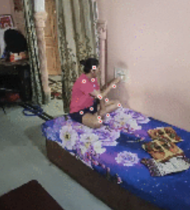
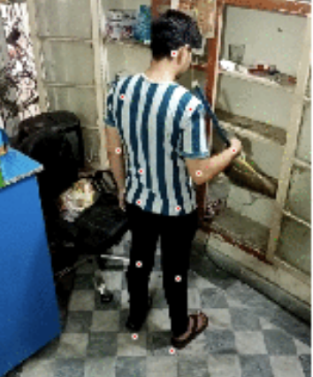
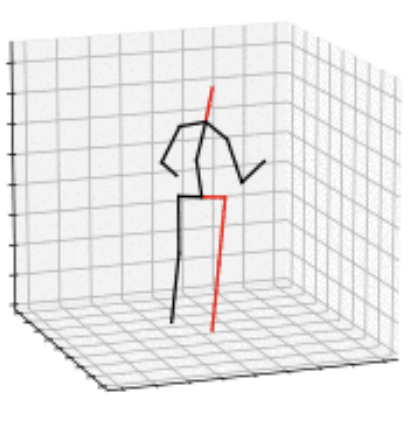

# T-MOR: Learning Motion-Aware Skeleton Representations for Human Action Recognition

## 摘要

| 项目 | 内容 |
|---|---|
| 论文 | T-MOR: Learning Motion-Aware Skeleton Representations for Human Action Recognition |
| 作者 | Di Yang, Mahmoud Ali, Quan Kong, Gianpiero Francesca, Francois Bremond |
| arXiv | 2606.21607, cs.CV, 2026-06-23 |
| 链接 | https://arxiv.org/abs/2606.21607 |
| 任务方向 | 人体动作识别（Human Action Recognition）、视频理解（Video Understanding）、骨架表征学习（Skeleton Representation Learning） |
| 代码状态 | 本文未提供可确认的公开代码；正文 PAGE 1-6 未出现代码仓库链接，外部标题/作者/ID检索也未确认到匹配仓库。 |
| 报告依据 | PDF 全文抽取文本与图像资产，关键事实均标注 PAGE 证据。 |

一句话总结：T-MOR 提出一种以骨架序列为推理输入、以视频与语言为训练监督的运动感知表征学习框架，通过聚类引导的多模态对比学习将 skeleton motion、RGB video 和 text semantics 对齐，使模型在动作分类、动作检测和零样本迁移中获得更强的跨数据集泛化能力，且推理阶段只需要轻量骨架输入（见 PAGE 1-3）。

本文的核心贡献可以概括为三点。第一，T-MOR 将人体骨架运动（skeleton motion）作为动作理解的核心表征，而不是让模型主要依赖 RGB 外观或全局语义（见 PAGE 1）。第二，它在训练阶段使用视频编码器与文本编码器提供跨模态语义锚点，但在下游推理时仅保留骨架编码器 $E_M$，这使其适合隐私敏感、带宽受限或算力受限场景（见 PAGE 1-2）。第三，作者构建 PoseCap-1M，声称其包含超过一百万个同步的视频、骨架与文本三元组，为大规模 skeleton-centered 预训练提供数据基础（见 PAGE 1、PAGE 3-4）。

需要提前说明两类证据边界。其一，当前材料只包含正文 PAGE 1-6，论文多次提到 Appendix 提供数据采集、实现细节和附加实验，但这些附录内容未在输入材料中给出，因此 PoseCap-1M 的采集流程、标签生成方式、质量控制和可下载性均证据不足（见 PAGE 4）。其二，论文摘要提到 few-shot 能力，但正文可见页主要展示 linear probing、fine-tuning、zero-shot、3D detection 和 ablation，未给出 few-shot 具体表格；因此本文不扩展 few-shot 结论，只保留“作者声称具备 few-shot transfer”的有限表述（见 PAGE 1、PAGE 5）。

## 背景与动机

人体动作识别要解决的问题，并不是简单判断画面中出现了什么物体，而是识别人在一段时间内如何移动、如何与环境交互、动作边界在哪里。论文在引言中将相关路线分为三类：基于 RGB 视频的时空表征模型、基于 skeleton 的人体关节轨迹模型，以及将视觉内容与自然语言对齐的 vision-language foundation models（见 PAGE 1）。这三类方法分别强调外观时空模式、身体结构运动和语义迁移能力。

现有视觉语言模型（Vision-Language Models, VLMs）如 CLIP 风格模型在通用视觉理解任务上表现很强，但本文指出它们通常依赖 image/video 的 appearance-level supervision，缺乏显式人体运动建模（见 PAGE 1）。这对 human-centric action recognition 是关键缺陷，因为许多动作类别的差异并不在静态外观，而在时序结构和物理运动。例如“拿起”“放下”“插入”“拔出”可能出现在相似场景和物体组合中，但关节轨迹与动作方向不同。

Skeleton-based 方法具有另一类优势。骨架序列直接编码人体关节坐标，通常比 RGB 更紧凑，也更少受背景、光照和衣物纹理影响。论文明确称 skeleton representations 是一种 compact and explicit abstraction of embodied motion，并强调它们对背景杂波和视觉变化具有鲁棒性（见 PAGE 1）。这也是该工作的推荐业务价值所在：如果上游姿态估计可用，系统可以在低带宽条件下只传输关键点，而不传输原始视频。

但传统 skeleton 方法也有局限。论文指出，多数 skeleton-based 方法在 closed-set settings 中训练，这会导致模型难以迁移到新动作或新任务，除非进行大量重新训练（见 PAGE 1）。也就是说，骨架方法擅长建模运动，但缺乏大规模语义监督；VLM 擅长语义泛化，却缺乏显式运动结构。T-MOR 的出发点正是把这两类能力合并：用 skeleton 作为核心运动表征，用 video/text 作为训练阶段的语义与视觉监督。

PoseCap-1M 则对应数据层面的动机。作者认为，图像-文本或视频-文本 foundation model 已有大规模语料，但 skeleton motion 缺少同时包含 video、language 和 skeleton sequence 的大规模资源（见 PAGE 3-4）。论文还指出，室内实验室数据集往往缺少非受控视频中的遮挡、组合活动和视角变化，因此不适合作为广泛可迁移模型的唯一预训练来源（见 PAGE 4）。不过，当前正文未提供 PoseCap-1M 的具体采集流程、许可和标签质量统计；这些属于证据不足部分。

## 预备知识

本文的基本输入是骨架序列。论文将一个 skeleton sequence 记为 $sk \in \mathbb{R}^{T \times J \times C_{in}}$，其中 $T$ 表示帧数，$J$ 表示关节数量，$C_{in}$ 表示坐标维度；二维骨架时 $C_{in}=2$，三维骨架时 $C_{in}=3$（见 PAGE 2）。这一定义很重要，因为 T-MOR 的推理输入不是 RGB 帧，而是一个时序关节坐标张量。

模型中有三个编码器。$E_M$ 表示 motion encoder，即骨架运动编码器；$E_V$ 表示 visual encoder，即视频编码器；$E_T$ 表示 text encoder，即文本编码器。论文采用 UNIK 作为 motion branch，该分支由 Transformer 与 TCN 组合，用于同时捕捉空间关节关系与时间演化；视频与文本分支则使用冻结的 ViCLIP 编码器（见 PAGE 2）。冻结 $E_V$ 和 $E_T$ 的含义是，视频-语言模型不在 T-MOR 训练中更新参数，而是作为语义锚点指导 $E_M$ 学习。

对比学习（contrastive learning）是方法核心。一般形式是拉近正样本对、推远负样本对。T-MOR 的差异在于，正负样本不是完全依赖随机 batch 或 memory bank，而是由 DBSCAN 对 motion embeddings 聚类后确定：同一聚类内样本作为 positives，不同聚类作为 negatives（见 PAGE 2-3）。作者认为这种 cluster-guided 机制可以缓解 false negatives，即随机采样时把同类动作误当负样本的问题（见 PAGE 1-2）。

用途：下图展示 Fig. 1 中 RGB 视频与姿态关键点叠加的样例，用于说明 T-MOR 关注的是人体运动而非仅依赖场景外观（见 PAGE 1）。

读图要点：图中可见人体关键点被叠加在居家场景视频上，场景外观包含床、墙面、家具等背景信息，但动作判别真正依赖人体姿态和关节移动。支撑的判断：该图支持论文关于 skeleton representation 能够提供 compact embodied motion abstraction 的论点（见 PAGE 1）。

用途：下图展示另一个日常活动片段中的人体关键点，用于说明 PoseCap-1M 面向多样化 human activities，而非单一实验室动作（见 PAGE 1）。

读图要点：图像包含非受控室内环境、不同人物姿态和局部遮挡，说明动作识别不能只依赖干净背景或标准视角。支撑的判断：这与论文对真实视频中 viewpoint changes、occlusions 和 compositional activities 的动机描述一致（见 PAGE 4）。

用途：下图展示骨架抽象后的运动表示，用于说明模型推理阶段可以脱离 RGB 外观，仅使用 skeleton input（见 PAGE 1-2）。

读图要点：可视化中只保留人体关节结构与运动方向，外观纹理、背景和物体细节被移除。支撑的判断：这直接对应 T-MOR 的设计目标，即训练时利用视频与语言，推理时使用轻量骨架输入（见 PAGE 1-2）。

## 方法详解

### 1. 总体框架：训练多模态，推理单模态

T-MOR 的数据单元是三元组 $(sk, v, a)$，分别表示 skeleton motion、RGB video 和 text description（见 PAGE 2）。训练时，骨架序列 $sk$ 通过随机时间裁剪和随机旋转生成增强视图 $sk^+$；motion encoder $E_M$ 分别编码 $sk$ 和 $sk^+$；冻结的视频编码器 $E_V$ 编码视频 $v$；冻结的文本编码器 $E_T$ 编码文本 $a$（见 PAGE 2-3）。Fig. 2 将该过程概括为 pre-training data、embedding module、representation learning 和 zero-shot transfer 四部分（见 PAGE 2）。Fig. 3 则进一步展示 skeleton embedding、visual embedding、text embedding、projection layers $\phi$ 和 multi-modal contrastive loss 的结构（见 PAGE 3）。

这个设计的关键不在于让推理变成三模态系统，而是把多模态信息压缩到 skeleton encoder 中。训练完成后，$E_M$ 可以迁移到 action classification、frame-wise detection 和 zero-shot action classification 等任务，且下游只需要 skeleton data 和 skeleton encoder（见 PAGE 3-4）。这使 T-MOR 与直接部署 VLM 的策略不同：VLM 在推理时通常仍依赖图像或视频输入，而 T-MOR 试图让骨架表征继承视频-语言语义。

### 2. Motion encoder：以 UNIK 建模骨架时空结构

论文采用 UNIK 作为 motion branch，并说明该 motion encoder 是 Transformer 与 TCN 的组合架构（见 PAGE 2）。Transformer 更适合建模长程依赖，TCN 更适合局部时间卷积和时序模式提取。经过 motion encoder 后，模型使用 spatio-temporal pooling 将整个 skeleton sequence 表示为一维特征向量 $E_M(sk)$（见 PAGE 2）。

下游任务的输出头根据任务不同而变化。对于 video-level classification，论文在 spatio-temporal pooling layer 后添加分类器；对于 frame-wise detection，则在 spatial pooling layer 后添加分类器（见 PAGE 2）。这说明 T-MOR 的预训练主体是共享的 skeleton encoder，任务特定部分相对轻量。

### 3. 多模态锚点：冻结 ViCLIP，而不是直接替代 skeleton model

视频和文本编码器来自 ViCLIP。论文说明 ViCLIP 的视频分支基于 spatio-temporal Vision Transformer，语言分支采用 CLIP-style Transformer text encoder（见 PAGE 2）。T-MOR 并不是直接使用 ViCLIP features 做最终识别，而是将它们作为 semantic anchors 来学习 motion-aware skeleton representations（见 PAGE 2）。因此，训练时的多模态监督服务于骨架表征，而不是取代骨架表征。

这一点对于工程部署有明显含义。如果任务场景无法稳定保存或传输 RGB 视频，例如隐私保护、低带宽边缘设备或摄像头只输出姿态流，T-MOR 的推理路径仍然可用。论文反复强调推理阶段 only lightweight skeleton inputs，这一设计见 PAGE 1-2。

### 4. Cluster-guided contrastive learning：正负样本由运动嵌入结构决定

T-MOR 的核心方法是 cluster-guided multi-modal contrastive learning。论文在每个 epoch 后使用 DBSCAN 对全数据集上的 motion embeddings $E_M(sk)$ 聚类，并将同一 cluster 内样本视为局部一致的 positives，不同 cluster 的样本作为 negatives（见 PAGE 2）。该设计针对 MoCo 类 memory bank 中可能存在的 false negatives：随机采样的“负样本”可能实际属于同一动作语义，从而破坏表征学习（见 PAGE 1-2）。

motion-motion contrastive objective 写作：

$$
\mathcal{L}_{mm} = -\mathbb{E}\left[\log \frac{S^{mm}_{align}}{S^{mm}_{align}+S^{mm}_{disc}}\right]
$$

该公式在说：模型希望同一运动簇内的 skeleton embeddings 对齐，同时让不同簇的 skeleton embeddings 保持区分性；分子越大、分母中负样本贡献越小，损失越低（见 PAGE 3）。

其中 alignment 项为：

$$
S^{mm}_{align}=\sum_{sk^+ \in P_{sk}} e^{Sim(E_M(sk), E_M(sk^+))}
$$

这里 $P_{sk}$ 表示由 DBSCAN 确定的 intra-cluster positive set，$sk^+$ 是与查询骨架序列语义一致的正样本或增强视图。人话解释：同一局部运动语义区域内的样本应被拉近，而不是只把同一个视频的增强视图拉近（见 PAGE 3）。

discrimination 项为：

$$
S^{mm}_{disc}=\sum_{sk^- \in N_{sk}} e^{Sim(E_M(sk), E_M(sk^-))}
$$

这里 $N_{sk}$ 表示 inter-cluster negative set，$sk^-$ 是来自其他运动簇的负样本。人话解释：模型不仅要学会“同类动作相似”，还要学会“不同动作的运动轨迹在嵌入空间中可分”（见 PAGE 3）。

### 5. Similarity function：投影头与温度缩放

论文定义相似度函数为：

$$
Sim(x,y)=\frac{\phi(x)\cdot\phi(y)}{\|\phi(x)\|\cdot\|\phi(y)\|}\cdot\frac{1}{Temp}
$$

其中 $\phi$ 是可学习投影头，即 MLP；$Temp$ 是温度超参数；分式部分是 cosine similarity（见 PAGE 3）。人话解释：先把不同模态或不同视图的特征投影到更适合对齐的空间，再用归一化点积衡量方向相似度，温度项控制分布的尖锐程度。温度越低，模型越强调最相似和最不相似样本之间的差异。

### 6. Self-supervised motion-video pre-training

第一阶段是 self-supervised motion-video pre-training，使用 motion-motion 和 motion-video 两类对齐信号，不使用动作标注（见 PAGE 3）。motion-video objective $\mathcal{L}_{mv}$ 与 $\mathcal{L}_{mm}$ 同形，只是把正负 skeleton features 替换成视觉表示 $E_V(v)$ 和 $E_V(v^-)$（见 PAGE 3）。总的自监督目标为：

$$
\mathcal{L}_{self}=\mathcal{L}_{mm}+\mathcal{L}_{mv}
$$

该公式在说：预训练阶段同时要求 skeleton embedding 在骨架运动空间内部结构合理，并与对应视频 embedding 对齐。这样即使没有 action label，RGB 视频中的视觉运动线索仍能提高 skeleton encoder 的迁移质量（见 PAGE 3）。

### 7. Supervised motion-text alignment：把动作语义注入骨架空间

第二阶段引入文本语义，用于 supervised motion-text alignment。论文给出 motion-text loss：

$$
\mathcal{L}_{mt}=-\mathbb{E}\left[\log \frac{S^{mt}_{align}}{S^{mt}_{align}+S^{mt}_{disc}}\right]
$$

该公式与 motion-motion loss 类似，但目标变成骨架运动与文本语义之间的对齐。人话解释：如果一个 skeleton sequence 对应文本描述 “A man is playing tennis”，那么 $E_M(sk)$ 应接近 $E_T(a)$，并远离不匹配动作文本（见 PAGE 3）。

其 alignment 项为：

$$
S^{mt}_{align}=e^{Sim(E_M(sk),E_T(a))}
$$

这里 $a$ 是与 skeleton sequence 对应的文本描述。人话解释：真实匹配的动作文本应成为 skeleton motion 的语义锚点（见 PAGE 3）。

其 discrimination 项为：

$$
S^{mt}_{disc}=\sum_{sk^- \in N_a} e^{Sim(E_M(sk),E_T(a^-))}
$$

这里 $a^-$ 表示负样本文本，来自与查询运动不匹配的样本。人话解释：模型要避免把相似场景但不同动作的文本描述错误地贴近当前骨架运动（见 PAGE 3）。

最终监督目标为：

$$
\mathcal{L}_{sup}=\mathcal{L}_{mm}+\mathcal{L}_{mv}+\mathcal{L}_{mt}
$$

该公式在说：T-MOR 的完整监督训练同时约束运动内部结构、运动-视频关系和运动-文本关系。作者认为这种 structure-aware multi-modal optimization 可形成 semantically compact yet discriminative manifolds，并且不引入额外模型复杂度（见 PAGE 3）。

### 8. PoseCap-1M：大规模 skeleton-centered 预训练资源

PoseCap-1M 被定义为包含超过一百万个同步 video、skeleton 和 text triplets 的数据集，覆盖 diverse human activities（见 PAGE 1）。论文认为这类资源对于 transferable skeleton motion representation 是必要的，因为现有 image-text 或 video-text 语料不能直接提供 skeleton-centered training signal（见 PAGE 3-4）。

不过，当前材料只说明 Appendix 会提供 data collection details，但附录未包含在输入文本中（见 PAGE 4）。因此，PoseCap-1M 的数据来源、姿态估计器类型、文本描述生成方式、动作类别分布、数据许可、噪声过滤策略和可下载性均证据不足。本文只依据正文可确认其规模声明和三元组形式，不进一步推断数据质量。

### 9. 代码分析状态

本文未提供可确认的公开代码。正文 PAGE 1-6 没有 GitHub、project page 或 repository URL；已知代码链接也标注为未知。按照可证据原则，本文不写代码段，也不将 UNIK、ViCLIP 或相关项目的公开实现等同于 T-MOR 官方实现。可确认的方法-实现对应仅停留在论文层面：motion branch 使用 UNIK，video/text features 使用 ViCLIP，projection head $\phi$ 是 MLP，DBSCAN 用于每 epoch 后的 motion embedding 聚类（见 PAGE 2-3）。

## 实验分析

实验覆盖三类主要任务。第一是 2D skeleton-based action classification，数据集包括 Toyota Smarthome、UAV-Human 和 Penn Action（见 PAGE 4）。第二是 action detection，数据集包括 Toyota Smarthome Untrimmed（TSU）和 Charades（见 PAGE 4）。第三是 zero-shot transfer 与 3D action detection，其中 zero-shot 在 Smarthome 和 Penn Action 上对比 CLIP-style/VQA 模型，3D detection 在 PKU-MMD 上评估 event-level mAP（见 PAGE 5）。

实验设置区分 linear probing 和 fine-tuning。Linear probing 固定 backbone，只训练分类器，因此更直接衡量预训练表征质量；fine-tuning 更新全网络参数，因此更接近实际迁移后的最高性能（见 PAGE 4）。论文明确强调，下游评估只使用 skeleton data 和 skeleton encoder，不使用 video 或 text inputs（见 PAGE 4）。

### 表 1：动作分类迁移结果（摘自 Table I，见 PAGE 4）

| 设置 | 方法 | 预训练 | Backbone | Smarthome CS | Smarthome CV2 | UAV-Human CS1 | UAV-Human CS2 | Penn Top-1 |
|---|---|---|---|---:|---:|---:|---:|---:|
| Linear probing | UNIK | None | UNIK | 24.6 | 20.7 | 3.8 | 4.1 | 29.8 |
| Linear probing | T-MOR | PoseCap-1M (V+M) | UNIK | 49.3 | 46.4 | 27.6 | 43.4 | 86.3 |
| Linear probing | T-MOR | PoseCap-1M (V+M+T) | UNIK | 52.6 | 53.4 | 33.5 | 60.1 | 97.8 |
| Fine-tuning | ViA | Posetics | UNIK | 64.5 | 65.2 | 42.6 | 69.5 | 98.0 |
| Fine-tuning | T-MOR | PoseCap-1M (V+M) | UNIK | 63.2 | 61.8 | 40.4 | 67.8 | 96.2 |
| Fine-tuning | T-MOR | PoseCap-1M (V+M+T) | UNIK | 66.2 | 66.7 | 44.4 | 70.8 | 98.2 |

表格解读：linear probing 中，T-MOR (V+M+T) 相比未预训练 UNIK 的提升非常显著，例如 Penn Action 从 29.8 提升到 97.8，Smarthome CV2 从 20.7 提升到 53.4（见 PAGE 4）。由于此时 backbone 被固定，这说明 PoseCap-1M 上的视频和语言监督确实被压缩进 skeleton encoder 的表征中。fine-tuning 中，T-MOR (V+M+T) 在多个列上超过 ViA Posetics，例如 Smarthome CV2 为 66.7 vs. 65.2，UAV-Human CS2 为 70.8 vs. 69.5；但 Penn Action 与 ViA 的差距很小，98.2 vs. 98.0，说明在高饱和数据集上增益有限（见 PAGE 4）。

### 表 2：动作检测迁移结果（摘自 Table II，见 PAGE 4）

| 设置 | 方法 | 预训练 | Backbone | TSU CS | TSU CV | Charades mAP |
|---|---|---|---|---:|---:|---:|
| Linear probing | UNIK | None | UNIK | 8.1 | 6.9 | 6.1 |
| Linear probing | T-MOR | PoseCap-1M (V+M) | UNIK | 19.8 | 12.6 | 11.3 |
| Linear probing | T-MOR | PoseCap-1M (V+M+T) | UNIK | 23.2 | 19.4 | 16.6 |
| Fine-tuning | UNIK | None | UNIK | 28.2 | 11.0 | 18.6 |
| Fine-tuning | T-MOR | PoseCap-1M (V+M) | UNIK | 33.4 | 21.9 | 18.3 |
| Fine-tuning | T-MOR | PoseCap-1M (V+M+T) | UNIK | 38.3 | 23.6 | 26.0 |

表格解读：动作检测比动作分类更依赖时间边界与连续运动建模，因此更能检验 motion-aware representation。linear probing 中，T-MOR (V+M+T) 在 TSU CS 从 8.1 提升到 23.2，在 Charades 从 6.1 提升到 16.6（见 PAGE 4-5）。fine-tuning 中，Charades 从 UNIK 的 18.6 提升到 26.0，说明文本语义和视频监督对复杂多标签检测有明显帮助。不过，T-MOR (V+M) 在 fine-tuning 的 Charades 上为 18.3，略低于 UNIK 的 18.6，这提示仅使用 visual-motion 自监督并不总能在所有检测设置中稳定提升，完整 V+M+T 才是主要有效配置（见 PAGE 4-5）。

### 表 3：零样本迁移结果（摘自 Table III，见 PAGE 5）

| 方法 | Smarthome CS | Smarthome CV2 | Penn Top-1 |
|---|---:|---:|---:|
| CLIP | 10.1 | 13.6 | 63.1 |
| XCLIP | 16.5 | 14.8 | 72.7 |
| ViCLIP | 15.4 | 14.6 | 74.3 |
| MotionCLIP | 2.6 | 2.2 | 6.1 |
| T-MOR (Motion only) | 14.5 | 7.0 | 69.5 |
| T-MOR (Motion+Visual) | 21.9 | 17.4 | 80.9 |

表格解读：T-MOR (Motion only) 在 Penn Action 上达到 69.5，明显高于 MotionCLIP 的 6.1，但在 Smarthome CV2 上只有 7.0，低于 CLIP/XCLIP/ViCLIP（见 PAGE 5）。这说明纯骨架零样本迁移已经具备一定语义能力，但仍受数据集和动作类型影响。T-MOR (Motion+Visual) 则在三列中均达到最高，说明 motion features 与 visual-language features 互补；但这一路径已不再是“只用 skeleton input”的极简推理设置，而是融合 motion 和 RGB features 的组合策略（见 PAGE 5）。

### 表 4：PKU-MMD 三维动作检测结果（摘自 Table IV，见 PAGE 5）

| 方法 | 模态 | mAP@IoU 0.1 | mAP@IoU 0.3 | mAP@IoU 0.5 |
|---|---|---:|---:|---:|
| GRU-GD | RGB | 82.4 | 81.3 | 74.3 |
| Augmented-RGB | RGB | 86.3 | 84.5 | 81.1 |
| Window proposal | Skeleton | 92.2 | - | 90.4 |
| T-MOR | Skeleton | 94.3 | 93.2 | 90.7 |

表格解读：PKU-MMD 结果说明 T-MOR 的预训练并不局限于 2D skeleton benchmarks，也能迁移到 3D skeleton action detection（见 PAGE 5）。在 IoU 0.1 和 0.3 上，T-MOR 高于列出的 RGB 与 skeleton 方法；在 IoU 0.5 上，T-MOR 为 90.7，略高于 Window proposal 的 90.4。这个差距不大，但说明其优势不仅来自宽松边界匹配，在较严格 IoU 下仍保持竞争力（见 PAGE 5）。

### 表 5：消融实验（摘自 Table V，见 PAGE 5）

| 方法 | 预训练 | Loss | Smarthome CS | TSU CS |
|---|---|---|---:|---:|
| Baseline | None | - | 24.6 | 8.1 |
| MM | PoseCap-1M | $\mathcal{L}_{mm}$ | 42.5 | 12.8 |
| MV | PoseCap-1M | $\mathcal{L}_{mv}$ | 46.3 | 16.3 |
| MT | PoseCap-1M | $\mathcal{L}_{mt}$ | 49.0 | 18.6 |
| MM+MV | PoseCap-1M | $\mathcal{L}_{mm}+\mathcal{L}_{mv}$ | 49.3 | 19.8 |
| MM+MT | PoseCap-1M | $\mathcal{L}_{mm}+\mathcal{L}_{mt}$ | 51.5 | 21.7 |
| MM+MV+MT | PoseCap-1M | $\mathcal{L}_{mm}+\mathcal{L}_{mv}+\mathcal{L}_{mt}$ | 52.6 | 23.2 |

表格解读：单一 loss 已能显著超过 baseline，说明 motion-motion、motion-video、motion-text 三种监督都有效（见 PAGE 5）。其中 $\mathcal{L}_{mt}$ 单独达到 Smarthome 49.0 和 TSU 18.6，说明文本语义对可迁移动作表征有较强作用。完整组合 $\mathcal{L}_{mm}+\mathcal{L}_{mv}+\mathcal{L}_{mt}$ 达到最佳，支持作者关于 motion、visual、text cues 互补的结论（见 PAGE 5）。不过，表中没有单独隔离 DBSCAN cluster-guided 机制与普通 InfoNCE 的直接对照，因此“聚类引导本身贡献了多少”在当前可见材料中证据不足。

## 讨论

T-MOR 最适合的应用边界，是已经能够获得相对可靠人体关键点、且动作类别依赖身体运动而非精细物体外观的场景。例如居家照护、工厂安全、异常行为分析、低带宽视频理解和隐私保护场景中，骨架序列比原始视频更容易传输、存储和脱敏。论文在 PAGE 1 将应用背景指向 healthcare monitoring、intelligent environments 和 robotics，这与 skeleton-only inference 的部署假设一致。

该方法的主要学术价值在于重新定义了 VLM 与 skeleton model 的关系。它不是把 VLM 作为最终识别器，而是将 VLM 的 visual-textual supervision 作为训练期教师或语义锚点，使 skeleton encoder 学到可迁移动作语义（见 PAGE 2）。这为 human-centric embodied perception 提供了一条中间路线：既不过度依赖 RGB 外观，也不把 skeleton learning 限制在 closed-set supervised training 中。

不过，T-MOR 的实验仍有若干未解决问题。第一，论文展示了多个 benchmark 的提升，但当前正文没有给出姿态估计质量下降、关节缺失、多人遮挡、摄像头视角突变等鲁棒性实验。对于实际系统，这些因素往往决定 skeleton-only 方法能否落地。第二，PoseCap-1M 是方法成立的重要基础，但正文只给出规模和三元组形式，未提供完整数据统计和质量审计；如果数据不可得或标注噪声较高，复现和公平比较会受到限制（见 PAGE 3-4）。

## 局限分析

作者自述层面的局限主要体现在未来工作中。论文结论写到未来将把 T-MOR pre-training 扩展到 additional modalities，例如 optical flow，以进一步增强 action representation learning（见 PAGE 6）。这说明当前 T-MOR 虽然利用 motion、visual 和 text，但尚未使用 optical flow 等显式像素运动模态；对于细粒度时间动态，光流可能提供 skeleton 坐标之外的补充证据。

第二个作者侧证据是 Appendix 依赖。论文在实验与数据部分多次说明 Appendix 提供 dataset description、implementation details、additional studies 和 data collection details（见 PAGE 4），但当前输入材料没有附录。因此，许多关键复现信息在可见正文中证据不足，包括 PoseCap-1M 的构建流程、预训练超参数、DBSCAN 参数、queue size 的具体设置、backbone 对比细节和 few-shot 结果。这不是对方法本身的否定，但限制了本文基于现有材料的可复核性。

独立判断方面，T-MOR 依赖上游姿态质量。论文的推理优势来自 skeleton-only input，但 skeleton 本身通常由 pose estimator 从 RGB 视频中抽取；若上游关键点受遮挡、多人交互、截断人体或低分辨率影响，$sk \in \mathbb{R}^{T \times J \times C_{in}}$ 的噪声会直接传递到 $E_M$。当前可见实验没有系统评估 pose noise sensitivity，因此在真实监控或移动机器人场景中需要额外验证。

另一个独立判断是，cluster-guided contrastive learning 的有效性没有被完全单独拆解。Table V 证明多模态 loss 组合有效，但未展示“有 DBSCAN cluster guidance”与“无 cluster guidance 的同等 loss”之间的直接对照（见 PAGE 5）。因此，完整 T-MOR 的整体有效性证据较强，但 cluster-guided 机制相对于常规 InfoNCE 的独立贡献，在当前正文材料中证据不足。

代码层面同样存在局限。由于未提供可确认公开代码，本文无法检查 DBSCAN 聚类频率、memory queue、projection head 结构、数据增强实现、ViCLIP feature caching、UNIK 迁移方式等细节是否与公式一致。对于希望复现或工程化落地的团队，这是当前材料的主要缺口。

## 结论

T-MOR 的主要贡献是把 skeleton motion representation 从封闭集监督学习推进到多模态可迁移预训练：训练时用视频和文本提供视觉-语义监督，推理时保留轻量骨架输入；通过 motion-motion、motion-video 和 motion-text 三类对比目标，模型在动作分类、动作检测、零样本迁移和 3D skeleton detection 中取得了可见提升（见 PAGE 4-5）。实验中最有说服力的是 linear probing 和 ablation：前者证明预训练后的 $E_M$ 本身已经包含可迁移动作信息，后者证明文本、视觉和运动监督的组合优于单一路径（见 PAGE 4-5）。

从研究与业务角度看，T-MOR 适合被视为“骨架动作基础表征”的候选方向，尤其适用于强调隐私、低带宽和人体运动理解的系统。但在实际采用前，仍需确认 PoseCap-1M 的可得性与质量、公开代码状态、姿态噪声鲁棒性、DBSCAN 机制的独立贡献，以及在目标业务数据上的真实提升幅度。当前证据支持其作为视频理解与关键点后处理团队的高优先级跟进论文，但不足以直接支持无复现实验的工程替换。

## 证据索引

| 结论 / 事实 | PAGE 证据 |
|---|---|
| T-MOR 面向 human action recognition，问题来自 VLM 缺乏显式 motion modeling | PAGE 1 |
| 三类相关路线：video-based、skeleton-based、vision-language foundation models | PAGE 1 |
| Skeleton 表征紧凑、显式、对背景变化更鲁棒，但传统方法多为 closed-set | PAGE 1 |
| T-MOR 训练阶段对齐 skeleton、video、text，推理阶段只用 lightweight skeleton inputs | PAGE 1-2 |
| PoseCap-1M 包含超过一百万 video-skeleton-text triplets | PAGE 1、PAGE 3-4 |
| Fig. 1 展示 motion-aware human action representation 与多模态视频样例 | PAGE 1 |
| Fig. 2 展示 pre-training、embedding module、representation learning、zero-shot transfer 流程 | PAGE 2 |
| Fig. 3 展示 skeleton / visual / text embedding、projection layers 和 multi-modal contrastive loss | PAGE 3 |
| Skeleton sequence 定义为 $sk \in \mathbb{R}^{T \times J \times C_{in}}$ | PAGE 2 |
| Motion branch 使用 UNIK，结构为 Transformer 与 TCN 组合 | PAGE 2 |
| Video/Text encoder 使用冻结 ViCLIP，作为 semantic anchors | PAGE 2 |
| DBSCAN 用于每个 epoch 后聚类 motion embeddings，形成 positive/negative sets | PAGE 2-3 |
| $\mathcal{L}_{mm}$、$S^{mm}_{align}$、$S^{mm}_{disc}$、$Sim(x,y)$、$\mathcal{L}_{self}$ 公式来源 | PAGE 3 |
| $\mathcal{L}_{mt}$、$S^{mt}_{align}$、$S^{mt}_{disc}$、$\mathcal{L}_{sup}$ 公式来源 | PAGE 3 |
| 动作分类实验设置与 Table I 数据 | PAGE 4 |
| 动作检测实验设置与 Table II 数据 | PAGE 4-5 |
| Zero-shot transfer 的 Table III 数据 | PAGE 5 |
| PKU-MMD 3D action detection 的 Table IV 数据 | PAGE 5 |
| Ablation study 的 Table V 数据 | PAGE 5 |
| 论文声称附录提供数据与实现细节，但当前材料未包含附录 | PAGE 4 |
| 未来工作将加入 optical flow 等 additional modalities | PAGE 6 |
| 正文 PAGE 1-6 未提供可确认公开代码链接 | PAGE 1-6 |
