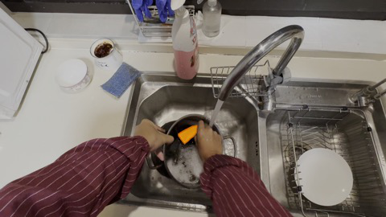

# FeVOS: Foresight Expression Video Object Segmentation

## 摘要

| 项目 | 内容 |
|---|---|
| 标题 | FeVOS: Foresight Expression Video Object Segmentation |
| 作者 | Kehan Lan, Kaining Ying, Henghui Ding |
| 机构 | Fudan University |
| arXiv | 2606.25585v1 |
| 发布时间 | 2026-06-24 |
| 论文链接 | http://arxiv.org/abs/2606.25585v1 |
| 代码状态 | 本文未提供可确认的公开代码；全文首页给出项目主页，但提供材料中没有 GitHub 或源码仓库链接，故不写代码段（见 PAGE 1） |

一句话总结：FeVOS 将传统指代表达视频目标分割（Referring Video Object Segmentation, RVOS）从“在已观察帧中找被描述目标”推进到“根据已观察帧预测未来事件涉及的目标并分割它”，并构建包含 968 个视频、14,525 条 foresight expressions、37,412 个 masks 与 2,904 条 CoT 标注的数据集，同时提出基于 Sa2VA 的 FeVOS-R1，通过 CoT-SFT 与 GRPO 强化学习提升预测性视频分割性能（见 PAGE 1、PAGE 7、PAGE 9-10）。

本文的核心贡献有三点。第一，提出 Foresight Expression Video Object Segmentation，即给定未来事件表达，要求模型在 observed frames 中输出相关目标的像素级 mask，而不是在当前帧中匹配可见描述（见 PAGE 2-5）。第二，构建 FeVOS 数据集，覆盖多源视频、预测性表达、像素级 mask 与合成 chain-of-thought（CoT）监督（见 PAGE 5-7）。第三，提出 FeVOS-R1，两阶段训练包括带 CoT 的 supervised fine-tuning（SFT）和以 IoU 为奖励的 Group Relative Policy Optimization（GRPO），在 FeVOS 上达到 42.3 J&F，超过 fine-tuned Sa2VA 的 35.8 J&F（见 PAGE 9-11）。

## 背景与动机

指代表达视频目标分割（RVOS）要求模型根据自然语言表达，在视频中对相应目标进行像素级分割。论文指出，该任务同时涉及视觉-语言理解（vision-language understanding）和像素级 grounding，因此在视频编辑、自动驾驶、语言引导机器人规划等场景中具有应用潜力（见 PAGE 1）。

现有 RVOS 数据集主要处理 observed frames 内已经发生或已经可见的信息。早期 Ref-DAVIS 与 Ref-YouTube-VOS 更偏向外观、类别、位置等静态属性；MeViS 进一步引入 motion expressions，使模型需要跨帧理解运动属性；ReVOS、ReasonVOS 等工作继续加入推理和世界知识（见 PAGE 2、PAGE 4）。这些工作虽扩展了 RVOS 的理解能力，但其表达仍然描述“已观察内容”，即模型要定位的是当前视频片段内已经可见、已经发生或正在发生的事件目标（见 PAGE 2、PAGE 4）。

FeVOS 的问题设定来自一个不同需求：在真实决策系统中，模型往往需要在动作发生之前识别将被使用、被移动、被碰撞或被交互的对象。论文给出厨房场景中的问题 “What tool will be used?”：模型只能看到 dirty pot、dish soap、手部状态等 observed frames 线索，却需要预测未来清洁动作中会被使用的 sponge，并在当前帧中分割它（见 PAGE 1-2）。这里的语言表达并不直接描述 sponge 的外观，而是描述未来事件中的角色。

这一任务把视频理解中的 future prediction 与视频分割中的 pixel-level grounding 结合起来。论文指出，已有 video understanding 任务已探索 temporal reasoning 和 future prediction，但通常采用简单 QA 范式，缺乏可用于行动决策的细粒度像素级 grounding（见 PAGE 2）。FeVOS 因此不是普通视频问答，也不是传统 RVOS，而是要求模型把“未来事件预测”落到 observed frames 中的具体目标 mask 上。

该任务的难点体现在三方面。第一，问题文本只指向 future events，难以直接与当前视觉内容对齐；第二，模型必须结合 temporal context、spatial cues 与 world knowledge 推断未来会涉及哪些对象；第三，模型还需要输出 observed frames 中目标的 pixel-level segmentation masks，而不是类别、坐标框或文字答案（见 PAGE 3）。这三个要求共同构成了 FeVOS 相比传统 RVOS 的主要研究价值。

## 预备知识

### RVOS 与 FeVOS 的任务差异

传统 RVOS 的输入通常是视频片段和 referring expression，输出是该表达对应目标在视频中的 mask。表达可以是 “the sponge in the sink” 或 “the sponge moved”，它们分别依赖可见静态属性和已发生运动信息（见 PAGE 2）。FeVOS 的 foresight expression 则指向未来，例如 “What tool will be used?”，模型需要从当前视觉线索推断未来参与者（见 PAGE 1-2）。

论文将 FeVOS 的输入视频记为：

$$
V \in \mathbb{R}^{T \times 3 \times H \times W}
$$

其中 $V$ 表示视频 clip，$T$ 表示帧数，$3$ 表示 RGB 三通道，$H$ 与 $W$ 分别表示帧高和帧宽（见 PAGE 5）。这一定义说明 FeVOS 的视觉输入仍然是标准视频张量，但语言问题的语义范围从当前帧扩展到了未来事件。

模型输出被定义为：

$$
M \in \mathbb{R}^{T \times H \times W}
$$

其中 $M$ 表示 observed frames 中目标对象的像素级 segmentation masks，每一帧对应一个 $H \times W$ 的 mask（见 PAGE 5）。用更直接的话说，FeVOS 并不要求模型输出未来帧中的目标，而是要求模型根据未来问题，在已经看到的帧里标出未来将被涉及的对象。

### 评价指标

论文沿用视频目标分割标准指标 $J$、$F$ 与 $J\&F$。其中 $J$ 表示 region similarity，通常通过 IoU 衡量区域重叠；$F$ 表示 boundary accuracy，用于衡量 mask 边界质量；$J\&F$ 是两者均值，作为整体性能指标（见 PAGE 8）。

这一评价方式使 FeVOS 的结果不能只靠语义预测正确。例如模型知道“下一步会用 spoon”，但如果 mask 边界不准，$F$ 会下降；如果区域覆盖错误，$J$ 会下降。因此 FeVOS 同时评价 foresight reasoning 与 dense segmentation。

### GRPO 的基本形式

FeVOS-R1 的第二阶段采用 Group Relative Policy Optimization（GRPO）。对于每个 query $q$，GRPO 采样一组输出 $G=\{o_i\}_{i=1}^{|G|}$，并根据每个输出的 reward $r_i$ 计算 group-relative advantage（见 PAGE 8）：

$$
A_i = \frac{r_i - \bar{r}_G}{\sigma_G}
$$

其中 $A_i$ 表示第 $i$ 个输出的相对优势，$\bar{r}_G$ 是组内奖励均值，$\sigma_G$ 是组内奖励标准差（见 PAGE 8）。这个公式的含义是：模型不直接看绝对奖励，而是看某个输出在同组候选中相对好多少。

GRPO 的策略更新目标为：

$$
J(\theta)=\mathbb{E}_{G}\left[
\frac{1}{|G|}
\sum_{i\in G}
\left(
\min\left(
s_i A_i,\,
\mathrm{clip}(s_i,1-\epsilon,1+\epsilon)A_i
\right)
-\beta D_{KL}(\pi_\theta || \pi_{ref})
\right)
\right]
$$

其中 $\theta$ 是当前策略参数，$\epsilon$ 是 clipping 参数，$\beta$ 控制 KL 正则项强度，$D_{KL}(\pi_\theta || \pi_{ref})$ 限制当前模型不要过度偏离 reference model（见 PAGE 8）。通俗地说，这个目标在奖励更高的输出方向上更新模型，同时用 KL 项保持训练稳定。

概率比值 $s_i$ 定义为：

$$
s_i = \frac{\pi_\theta(o_i|q)}{\pi_{old}(o_i|q)}
$$

其中 $\pi_\theta$ 是当前策略，$\pi_{old}$ 是更新前策略，$o_i$ 是第 $i$ 个采样输出，$q$ 是输入问题（见 PAGE 8）。该比值衡量新策略相对旧策略对同一输出的概率提升程度。

## 方法详解

### 1. 任务定义：从可见 grounding 转向预测性 grounding

FeVOS 的首要创新是任务层面的重新定义。传统 RVOS 的表达通常能在 observed frames 内找到直接视觉证据，而 FeVOS 的表达描述 future events。例如 Fig. 1 对比了 Ref-DAVIS、MeViS 与 FeVOS：Ref-DAVIS 的表达是 “the sponge in the sink”，MeViS 的表达是 “the sponge moved”，FeVOS 的表达则是 “What tool will be used?”（见 PAGE 2）。前两者分别指向可见静态属性和已观察运动，后者指向未来动作参与对象。

用途：下图用于说明 FeVOS 与传统 RVOS 数据集的任务差异，尤其是表达是否指向 observed events 或 future events。  
读图要点：关注 Ref-DAVIS、MeViS 与 FeVOS 的表达文本差异；FeVOS 的问题不直接描述目标外观，而询问未来将被使用的工具。  
支撑的判断：FeVOS 的核心变化不是换一个数据集名称，而是把 segmentation query 从已发生内容改为未发生内容（见 PAGE 2）。

图后说明：该图像资产对应论文 Fig. 1 的抽取结果之一。它支撑本文关于“FeVOS 需要预测 future involvement，而非匹配 observed attributes”的判断；但完整 Fig. 1 在 PDF 中还包含多子图与说明，本文只使用已提供的图片路径，不补造未提供图像。

这种设定对模型提出了更高要求。以厨房场景为例，模型必须从 dirty pot、dish soap、手部占用状态等 temporal context 与 spatial cues 推断 sponge 将被使用，并进一步定位右侧 sponge，因为左手被占用而右侧更便于操作（见 PAGE 2）。该例说明 FeVOS 不只是类别预测，还包含空间消歧。

用途：下图继续呈现 Fig. 1 的抽取片段，用于强调 observed frames 与 future frames 的关系。  
读图要点：应将 observed frames 视为模型实际可见输入，将 future frames 视为不可见但由问题指向的事件来源。  
支撑的判断：FeVOS 的答案 mask 位于 observed frames，而推理目标来自 future event，这构成跨时间的视觉-语言对齐问题（见 PAGE 2、PAGE 5）。

图后说明：该图像不被解释为额外实验结果，而是作为 Fig. 1 的可视化证据，帮助定位 FeVOS 与已有 RVOS benchmark 的概念差异。

论文明确指出 FeVOS 的三个挑战：问题文本仅提供未来信息；模型需分析 temporal context 与 spatial cues；模型必须输出 observed frames 中目标的 pixel-level masks（见 PAGE 3）。这三个挑战分别对应语言-视觉对齐、预测性推理和密集分割，任一环节失败都会导致最终 $J\&F$ 下降。

### 2. 数据集构建：从多源视频到预测性表达

FeVOS 数据集构建分五阶段：Video Collection、Automatic Filtration、Manual Video Splitting、Expression Annotation、Mask Annotation，整体流程见 Fig. 3（见 PAGE 5）。虽然本任务只提供了 Fig. 1 的图片文件，没有提供 Fig. 3 图片路径，但论文正文清楚描述了每个阶段，因此这里仅做文字分析，不输出不存在的 Fig. 3 图像。

视频来源包括 COIN、STAR、CLEVR、OOPS、EPIC-KITCHENS-VISOR，覆盖 egocentric activities、instructional videos、dynamic outdoor environments 等场景（见 PAGE 5）。这些来源的共同特点是含有 spatio-temporal dynamics 与 causal relationships，适合构造“早期线索预示后续事件”的样本（见 PAGE 5）。

自动过滤阶段使用 Qwen2.5-VL，根据四项规则判断视频是否适合预测性分割：第一，能切分为前后两段且前段包含可推断后段事件的 cause-and-effect narrative；第二，存在多个交互对象或主体；第三，场景包含 observable and actionable clues；第四，适合设计 referring expressions（见 PAGE 5-6）。该阶段保留约 30.5% 视频（见 PAGE 6）。

人工切分阶段由专家标注者以 0.2 秒间隔选择时间切分点或丢弃视频。切分点需保证 observation clip 中目标可见且含隐式线索，future clip 中事件清晰可预测，同时最大化预测挑战并保持合理可推断性（见 PAGE 6）。该阶段约保留 44.0% 视频（见 PAGE 6）。

表达标注采用两阶段流程。第一阶段，标注者可见 observed 与 unseen clips，选择 observed frames 中目标并设计描述未来事件的表达，例如 “the object that will be picked”；第二阶段，独立验证者只能看到 expression 与 observed frames，不能看到 unseen clips，并尝试通过预测性推理识别目标（见 PAGE 6）。该阶段保留约 85.9% 表达，以确保样本既需要 genuine predictive reasoning，又能由 observed cues 合理推断（见 PAGE 6）。

Mask annotation 使用基于 SAM2 的交互式标注工具，标注者修改并验证 observed part 中目标对象跨帧 masks，以保证 spatial and temporal consistency（见 PAGE 6）。这一步使 FeVOS 不停留在视频问答层面，而具备可用于密集监督的像素级标签。

用途：下图作为 Fig. 1 的抽取片段，用于帮助读者理解 FeVOS 数据构造中“未来表达但当前分割”的目标形式。  
读图要点：不要把 future frames 当成模型输入；它们用于构造表达与验证答案，实际任务要求基于 observed frames 输出 mask。  
支撑的判断：数据集构建必须同时控制未来事件可预测性和当前目标可分割性，否则样本会退化为猜测或普通检测（见 PAGE 5-6）。

图后说明：该图片支持数据集动机层面的解释；具体五阶段构建流程来自论文 Fig. 3 与正文描述，但 Fig. 3 未提供可用 markdown_path，因此不插入图像。

### 3. CoT 标注：让模型学习显式预测链条

FeVOS 在 video-object-expression triplets 之后进一步生成 chain-of-thought annotations。论文使用 Qwen2.5-VL 自动生成 CoT：先将 ground-truth segmentation masks 覆盖到视频帧上作为 visual prompts，突出目标对象；然后给模型 masked video 与 foresight expression，要求生成解释为什么该高亮对象是预测问题答案的 step-by-step reasoning（见 PAGE 6-7）。

这些 CoT 通常包括 visual cues、temporal context 与 causal relationships 的分析（见 PAGE 7）。论文说明每个视频生成 3 条 CoT，以提供 diverse reasoning perspectives（见 PAGE 7）。最终数据集中包含 2,904 条合成 CoT 标注，其中 train 2,337 条、val 567 条（见 PAGE 7）。

Fig. 2 展示三类代表性推理挑战：Physically-Aligned Prediction、Procedure-Grounded Prediction、Intention-Guided Prediction（见 PAGE 3、PAGE 7-8）。例如 curling stone 场景要求根据红色冰壶轨迹预测将被撞击的黄色冰壶；melon 场景要求理解切瓜流程并推断 spoon 将在下一步使用；taste dish 场景要求从交互意图判断谁会品尝食物（见 PAGE 3、PAGE 7-8）。这些案例说明 FeVOS 的 CoT 并非只解释目标外观，而是解释目标与未来事件之间的因果关系。

用途：下图作为 Fig. 1 抽取片段的最后一个提供文件，用于补充说明 FeVOS 样本中 observed clues 与 future query 的视觉关系。  
读图要点：重点关注当前帧中的多对象环境；目标选择依赖未来动作角色，而不是单帧显著性。  
支撑的判断：FeVOS 的难点在于“目标当前可见，但目标身份由未来事件定义”，这也是 CoT 监督被引入的原因（见 PAGE 3、PAGE 6-7）。

图后说明：四张提供图片均来自 PAGE 2 的 Fig. 1 抽取结果。论文中 Fig. 2、Fig. 3、Fig. 6、Fig. 7 对方法与实验很重要，但本任务未提供对应图片路径，因此本文只引用其编号和页码，不插入图片。

### 4. FeVOS 数据规模与组成

FeVOS 最终包含 968 个 video clips、14,525 条 foresight expressions、30,125 帧、1,419 个对象、37,412 个 masks 与 2,904 条 CoT（见 PAGE 7）。训练集包含 779 个视频、11,708 条表达、24,689 帧、1,137 个对象、30,694 个 masks 与 2,337 条 CoT；验证集包含 189 个视频、2,817 条表达、5,436 帧、282 个对象、6,718 个 masks 与 567 条 CoT（见 PAGE 7）。

| Split | Videos | Expr. | Frames | Obj. | Masks | CoT |
|---|---:|---:|---:|---:|---:|---:|
| Train | 779 | 11,708 | 24,689 | 1,137 | 30,694 | 2,337 |
| Val | 189 | 2,817 | 5,436 | 282 | 6,718 | 567 |
| All | 968 | 14,525 | 30,125 | 1,419 | 37,412 | 2,904 |

表格解读：FeVOS 的标注密度较高，14,525 条表达对应 968 个视频，说明一个视频可产生多个 foresight expressions；37,412 个 masks 说明该数据集提供逐帧像素监督，而不是只提供最终答案类别；2,904 条 CoT 规模小于表达总数，因此 CoT 是强化推理监督的子集资源，而非每条表达都有完整推理链（见 PAGE 7）。

论文还通过 expression cloud 与 reasoning cloud 分析词分布。foresight expressions 中频繁出现 “the next part of the video” 与 “will”，用于鼓励模型预测 forthcoming events and actions；reasoning processes 中 “Given” 等词频繁出现，用于引导模型将推理与 observed frames 中的 visual evidence 对齐（见 PAGE 7）。这说明数据集在语言层面显式区分了未来事件表达与当前视觉证据。

### 5. 模型基线：以 Sa2VA 为基础的 FeVOS-R1

FeVOS-R1 基于 Sa2VA。Sa2VA 是将 MLLM 与 SAM2 结合的统一框架，包含 vision encoder、large language model 和 SAM2 mask decoder 三个关键组件：vision encoder 提取视频视觉特征，LLM 处理视觉嵌入与文本 prompt 并生成含有特殊分割 token `[SEG]` 的响应，SAM2 mask decoder 根据 `[SEG]` hidden states 生成 pixel-wise segmentation masks（见 PAGE 8）。

论文认为 Sa2VA 在传统 RVOS 上表现强，但其 supervised fine-tuning paradigm 对预测性推理不足，因为它缺少显式推理过程，也未直接用 segmentation quality 约束推理链（见 PAGE 8）。FeVOS-R1 因此采用两阶段训练：Stage 1 用 CoT 做 supervised fine-tuning，Stage 2 用 GRPO 做 reward-guided optimization（见 PAGE 9）。

Fig. 6 展示 FeVOS-R1 总体框架：输入视频经 visual encoder，文本经 text encoder，LLM 输出带 `<think>` 与 `<answer>` 结构的 CoT 和 `[SEG]` token，SAM2 mask decoder 输出 predicted masks；Stage 1 使用 GT CoT 与 GT masks 监督，Stage 2 采样 $|G|$ 个输出并用 IoU reward 更新 policy model，同时保持 reference model 约束（见 PAGE 9）。本任务未提供 Fig. 6 图片路径，因此只做文字引用。

### 6. Stage 1：CoT-SFT 的监督目标

Stage 1 的目标是让模型先学会基本 reasoning format 与 segmentation 输出。训练时，模型需要生成 step-by-step reasoning，分析 temporal context 与 causal relationships，再输出 `[SEG]` token（见 PAGE 9）。对应损失函数包括 mask quality 的 pixel-wise cross-entropy loss $L_{ce}$、Dice loss $L_{dice}$，以及 reasoning process 的 text generation loss $L_{text}$（见 PAGE 9）。

总损失函数为：

$$
L_{total} = \alpha_{ce}L_{ce} + \alpha_{dice}L_{dice} + \alpha_{text}L_{text}
$$

其中 $L_{total}$ 是总训练损失，$L_{ce}$ 约束像素级分类，$L_{dice}$ 约束 mask 区域重叠，$L_{text}$ 监督文本推理生成；$\alpha_{ce}$、$\alpha_{dice}$、$\alpha_{text}$ 是三项损失的权重（见 PAGE 9）。这一定义说明 Stage 1 同时训练“说清楚为什么”和“分割得准确”。

从方法逻辑看，CoT-SFT 的作用不是单纯提升可解释性。它为后续 RL 提供 cold start，使模型已经掌握 `<think>`、`<answer>` 与 `[SEG]` 的输出结构，并能产生非空、非平凡的 reasoning trajectories。论文在消融中指出，pure RL from scratch 容易产生 trivial responses without meaningful reasoning trajectories（见 PAGE 13）。

### 7. Stage 2：基于 IoU reward 的 GRPO

Stage 2 关注 SFT 后推理链与分割目标之间的进一步对齐。论文指出，SFT 可以提供 preliminary reasoning knowledge，但 reasoning process 仍可能 suboptimal，且与 segmentation objectives 的对齐较弱（见 PAGE 9-10）。因此 FeVOS-R1 使用 GRPO，让模型直接优化与 mask quality 相关的 reward。

不同于需要模型输出 bounding boxes 或 JSON 中间结构的方法，FeVOS-R1 通过 `[SEG]` token 支持端到端 segmentation optimization（见 PAGE 10）。其 accuracy reward 定义为：

$$
R_{IoU} = \frac{1}{T}\sum_{t=1}^{T} IoU(\hat{M}_t, M_t)
$$

其中 $R_{IoU}$ 是奖励，$T$ 是帧数，$\hat{M}_t$ 是第 $t$ 帧 predicted mask，$M_t$ 是第 $t$ 帧 ground-truth mask，$IoU(\cdot)$ 衡量预测区域与真实区域的交并比（见 PAGE 10）。该公式的含义很直接：模型在每一帧分割得越准，平均 IoU 奖励越高。

论文特别强调，最终采用 accuracy reward alone，而不加入 format reward（见 PAGE 10）。原因是 FeVOS-R1 的 reasoning format 较轻量，并已在 SFT 阶段学会；额外 format constraints 无法带来收益，甚至会阻碍优化（见 PAGE 10、PAGE 13）。这点在 Table 5 中得到验证：IoU reward only 达到 42.3 J&F，高于 IoU+Format 的 40.9 和 Format only 的 37.7（见 PAGE 12-13）。

### 8. 实现细节：训练对象、冻结策略与硬件

SFT 阶段以 pretrained Sa2VA-4B 为 base model，其中 MLLM 为 InternVL2.5，segmentation module 为 SAM2-L（见 PAGE 10）。训练时只更新 LLM 和 SAM2 mask decoder，冻结其他部分，并使用 LoRA，rank=128，以提高参数调优效率（见 PAGE 10）。学习率为 $2 \times 10^{-5}$，cosine annealing schedule，batch size 为 4，gradient accumulation 为 4 steps，在带 CoT 的 FeVOS 数据上训练 4 epochs（见 PAGE 10）。

RL 阶段冻结 SAM2 mask decoder，只微调 LLM component，使用与 SFT 相同的 LoRA 配置（见 PAGE 10）。GRPO 训练时每个输入生成 $|G|=4$ 个 responses，学习率为 $1 \times 10^{-5}$，batch size 为 4，gradient accumulation 为 2 steps，训练 2 epochs（见 PAGE 10）。所有实验在 4 张 NVIDIA RTX 4090 GPU 上完成（见 PAGE 10）。

推理时，模型先输出 CoT response 与 segmentation answer，再用输出的 `[SEG]` token prompt SAM2 得到最终 masks（见 PAGE 10）。这说明 FeVOS-R1 的 inference 仍依赖 MLLM 推理文本与 SAM2 mask decoding 两部分。

### 9. 代码分析状态

本文未提供可确认的公开代码。论文首页提供项目主页 `https://henghuiding.com/FeVOS/`，但提供的全文材料和元信息中没有明确 GitHub 仓库、源码路径、release 标记或可克隆代码链接（见 PAGE 1）。因此，按照“不编造代码段”的原则，本文不写源码片段，也不将论文方法映射到具体文件或函数。

证据不足：无法确认 FeVOS-R1 的实际代码结构、训练脚本参数名、数据加载实现、reward 计算实现或 `[SEG]` token 到 SAM2 decoder 的工程接口。上述内容只能根据论文方法描述进行概念分析，不能写成源码级复现说明。

## 实验分析

### 1. FeVOS 主结果：预测性分割显著难于传统 RVOS

论文在 FeVOS 上比较了多类 zero-shot baselines 与 fine-tuned models。Zero-shot baselines 中，VRS-HQ 达到 31.0 J&F，GLUS 达到 29.6，VideoLISA 为 26.1，Sa2VA 为 25.4；传统 RVOS 方法 ReferFormer 和 LMPM 分别只有 18.2 与 18.9 J&F（见 PAGE 10-11）。这说明只依赖传统 grounding 或一般视频语言理解，很难完成 future-event-driven segmentation。

| Method | Backbone | J | F | J&F |
|---|---|---:|---:|---:|
| ReferFormer | ResNet-50 | 16.4 | 20.0 | 18.2 |
| LMPM | Swin-T | 17.1 | 20.7 | 18.9 |
| VISA | Chat-UniVi-7B | 22.9 | 28.2 | 25.6 |
| VideoLISA | LLaVA-Phi-3-V-3.8B | 22.9 | 29.4 | 26.1 |
| VRS-HQ | Chat-UniVi-7B | 28.8 | 33.3 | 31.0 |
| GLUS | Chat-UniVi-7B | 27.4 | 31.7 | 29.6 |
| Sa2VA | InternVL2.5-4B | 23.7 | 27.2 | 25.4 |
| GLUS* | Chat-UniVi-7B | 31.0 | 35.9 | 33.5 |
| Sa2VA* | InternVL2.5-4B | 33.1 | 38.4 | 35.8 |
| FeVOS-R1 | InternVL2.5-4B | 39.5 | 45.1 | 42.3 |

表格解读：FeVOS-R1 相比 Sa2VA* 提升 6.5 J&F，相比 zero-shot Sa2VA 提升 16.9 J&F（见 PAGE 11）。这说明性能提升不仅来自在 FeVOS 上 fine-tuning，还来自 CoT-guided reasoning 与 RL-based optimization。与此同时，最佳 FeVOS 结果 42.3 J&F 仍明显低于模型在 ReVOS 与 MeViS 上的结果，论文据此指出 predictive segmentation 比 observable-event grounding 更困难（见 PAGE 11）。

论文对结果的解释是：fine-tuning 使模型更好捕获 predictive scenarios 中的 temporal dynamics 与 causal relationships；而 CoT 与 RL 进一步帮助模型捕捉 subtle visual cues（见 PAGE 11）。这个解释与任务设定一致，因为 FeVOS 的主要误差来源不是“看不到目标”，而是“无法判断哪个可见目标会参与未来事件”。

### 2. 跨数据集泛化：FeVOS-R1 不只过拟合 FeVOS

为了评估泛化能力，论文在 ReVOS 与 MeViS 上测试模型（见 PAGE 11-12）。在 ReVOS 上，zero-shot Sa2VA 为 59.1 overall J&F，直接 fine-tuned 的 Sa2VA* 下降到 58.1，显示对 FeVOS 有一定 overfitting；FeVOS-R1 达到 60.3，超过两者，并在 reasoning subset 上达到 57.8（见 PAGE 11-12）。

| Method | Backbone | ReVOS Ref. | ReVOS Reas. | ReVOS All | MeViS J | MeViS F | MeViS J&F |
|---|---|---:|---:|---:|---:|---:|---:|
| VISA | Chat-UniVi-7B | 50.9 | 43.0 | 46.9 | 40.7 | 46.3 | 43.5 |
| VideoLISA | LLaVA-Phi-3-V-3.8B | - | - | - | 41.3 | 47.6 | 44.4 |
| VideoGLaMM | Phi3-Mini-3.8B | - | - | - | 42.1 | 48.2 | 45.2 |
| VRS-HQ | Chat-UniVi-7B | 62.1 | 56.1 | 59.1 | 47.6 | 53.7 | 50.6 |
| GLUS | Chat-UniVi-7B | 58.3 | 51.4 | 54.9 | 48.5 | 54.2 | 51.3 |
| Sa2VA | InternVL2.5-4B | 62.5 | 55.6 | 59.1 | - | - | 46.4 |
| Sa2VA* | InternVL2.5-4B | 61.0 | 55.2 | 58.1 | 43.4 | 49.7 | 46.5 |
| FeVOS-R1 | InternVL2.5-4B | 62.8 | 57.8 | 60.3 | 46.2 | 52.7 | 49.5 |

表格解读：FeVOS-R1 在 ReVOS reasoning subset 上比 Sa2VA* 高 2.6 分，在 MeViS 上比 Sa2VA* 高 3.0 J&F（见 PAGE 12）。这表明 CoT-SFT 与 RL 并未只学习 FeVOS 的表面分布，而对 reasoning-intensive scenes 有迁移收益。不过，FeVOS-R1 的 MeViS 49.5 仍低于 7B 规模 GLUS 的 51.3，论文将其部分归因于 model scale differences（见 PAGE 12）。

从业务角度看，这个泛化结果很关键。如果 FeVOS-R1 只在 FeVOS 上有效，其价值会局限于一个新 benchmark；但 ReVOS 与 MeViS 的结果说明，围绕 future reasoning 训练出的推理链可能改善更一般的 motion/reasoning segmentation。这个判断有数据支撑，但仍需谨慎，因为论文没有在真实机器人、监控或第一视角生产系统中做部署实验。

### 3. 两阶段训练消融：SFT 与 RL 互补

论文比较三种训练策略：只用 CoT-SFT、只用 RL、CoT-SFT + RL（见 PAGE 12-13）。结果显示，SFT-only 为 37.2 J&F，RL-only 为 36.0，完整两阶段为 42.3（见 PAGE 12-13）。

| ID | CoT-SFT | RL | J | F | J&F |
|---|---|---|---:|---:|---:|
| I | ✓ | ✗ | 34.7 | 39.8 | 37.2 |
| II | ✗ | ✓ | 33.5 | 38.6 | 36.0 |
| III | ✓ | ✓ | 39.5 | 45.1 | 42.3 |

表格解读：CoT-SFT 比 pure RL 高 1.2 J&F，说明显式推理监督能提供更稳定的初始 reasoning behavior；完整两阶段比 SFT-only 高 5.1，比 RL-only 高 6.3，说明 SFT 与 RL 不是替代关系，而是先建立推理格式与基本能力，再通过 reward-guided exploration 优化分割质量（见 PAGE 13）。

这个消融支持论文的方法设计。若直接从 RL 开始，模型可能缺少有意义的推理轨迹；若只做 SFT，模型虽能模仿 CoT，但推理过程未必最大化 mask IoU。两阶段结合让 textual reasoning 与 mask accuracy 发生更直接的耦合。

### 4. Reward 设计消融：格式奖励并非总是有益

论文进一步比较 reward design。传统 GRPO 视觉语言推理工作常加入 format reward，用来约束 `<think>`、`<answer>` 或 JSON 格式；FeVOS-R1 则假设 SFT 已经学会轻量 reasoning format，因此 RL 阶段应专注 IoU reward（见 PAGE 10、PAGE 13）。

| ID | IoU Reward | Format Reward | J | F | J&F |
|---|---|---|---:|---:|---:|
| I | ✗ | ✓ | 35.1 | 40.3 | 37.7 |
| II | ✓ | ✓ | 38.3 | 43.5 | 40.9 |
| III | ✓ | ✗ | 39.5 | 45.1 | 42.3 |

表格解读：只用 format reward 可达到 37.7 J&F，说明格式约束本身不能充分提升 segmentation；IoU+Format 为 40.9，低于 IoU-only 的 42.3，说明额外格式约束可能分散优化能力；最佳结果来自单独使用 segmentation-aware IoU reward（见 PAGE 12-13）。该结论的适用前提是模型已经经过 CoT-SFT，不能泛化为所有 RL 训练都不需要格式奖励。

### 5. 定性结果：显式推理改善目标选择

Fig. 7 给出 qualitative comparison。问题 “What will fly out?” 中，fine-tuned Sa2VA 错误分割整个 bottle，而 FeVOS-R1 通过内部压力与 cork 行为推断应分割 cork；问题 “What will be full of clothes soon?” 中，FeVOS-R1 根据用户从洗衣机取出衣物并放入 laundry bag 的动作，预测 laundry bag 将装满衣服（见 PAGE 13-14）。

这些案例说明 FeVOS-R1 的优势不只是 mask decoder 更强，而是目标身份判断更符合 future causal reasoning。对于 FeVOS 而言，目标类别往往在 observed frames 中可见，但模型必须判断哪个对象会成为未来事件的参与者。Fig. 7 支持论文关于 explicit reasoning enables more accurate predictions and interpretability 的结论（见 PAGE 13-14）。

证据不足：论文提供的是定性示例而非系统性错误分类统计。因此无法据此判断 FeVOS-R1 在所有 challenge types 中的具体错误占比，例如 physically-aligned、procedure-grounded、intention-guided 三类的独立性能。

## 讨论

FeVOS 的适用边界首先取决于未来事件是否可由 observed visual cues 合理推断。论文在数据构建时主动过滤掉难以合理切分或无法预测的视频，并在表达验证阶段保留能够由 validators 正确识别目标的表达（见 PAGE 6）。因此，FeVOS 研究的是 constrained foresight，而不是开放世界中任意未来事件的概率预测。

对于视频理解方向，FeVOS 的价值在于把 future prediction 与 pixel-level grounding 连接起来。视频异常预警、操作意图理解、机器人/第一视角场景中的目标预测标注等任务，都可能受益于这种“在动作发生前识别将被交互对象”的能力。论文自身也将 RVOS 潜力关联到 video editing、autonomous driving、language-guided robotic planning，并强调 proactive decision-making 对未来事件预判的需求（见 PAGE 1）。

但 FeVOS 与通用业务视频之间仍存在域差异。数据来源包括 instructional videos、egocentric activities、dynamic outdoor environments 等（见 PAGE 5），并经过多轮筛选以保证因果线索明确（见 PAGE 5-6）。真实监控、工业流程或长时段业务视频可能包含弱线索、多主体遮挡、多种合理未来走向，这些情况在论文中没有被充分实验覆盖。

从方法论看，FeVOS-R1 的设计表明 CoT 对 dense prediction 任务可能不只是解释层附件，而能成为训练信号的一部分。SFT 阶段用 CoT 建立推理轨迹，RL 阶段用 mask IoU 评价推理结果质量，形成“推理文本—分割 token—mask reward”的闭环（见 PAGE 9-10）。这为 MLLM-based segmentation 提供了一种训练范式：不只要求模型说得合理，也要求其推理最终提升像素级结果。

## 局限分析

作者自述的局限主要集中在未来方向中。第一，当前 MLLM frame limit 限制了模型利用 richer global context 的能力；第二，transient visual cues 或 local information 可能对预测推理关键，但需要优化 sampling strategy；第三，需要在更多 RVOS datasets 上执行 CoT-SFT 与 RL 以提升泛化；第四，需要缓解 reasoning process 中的 hallucinations；第五，需要建模未来预测的不确定性以处理 multiple plausible outcomes；第六，需要 real-time inference 支持下游应用（见 PAGE 14）。

这些局限与 FeVOS 的任务本质密切相关。由于 foresight expression 指向未来，单一确定答案在真实场景中可能并不总是合理。论文在构建数据集时通过表达限制和验证流程保留可合理推断的样本，例如在可能多次发生的事件中加入 “first” 等限制（见 PAGE 6）。这保证了 benchmark 可评测性，但也意味着 FeVOS 更接近确定性可预测场景，而不是完整建模开放世界未来不确定性。

我的独立判断是，FeVOS-R1 对 CoT 与 MLLM 训练依赖较强，数据构建成本也较高。数据集需要人工切分、表达标注、验证、SAM2 辅助 mask 修改与 CoT 生成（见 PAGE 5-7）；方法训练需要 Sa2VA-4B、InternVL2.5、SAM2-L、LoRA、4 张 RTX 4090，并分 SFT 与 RL 两阶段进行（见 PAGE 10）。这使得复现和迁移到新行业数据并不轻量。

另一个独立判断是，现有实验尚不能证明模型真正掌握了稳定的因果预测。FeVOS-R1 在 FeVOS 上达到 42.3 J&F，但绝对值仍低于 ReVOS 的 60.3 和 MeViS 的 49.5（见 PAGE 11-12）。论文也承认 FeVOS 的 absolute performance substantially lower than traditional RVOS benchmarks，说明 predictive reasoning 仍是未充分解决的问题（见 PAGE 14）。

证据不足：论文没有提供公开代码、训练日志、完整失败案例 taxonomy、不同数据源子集性能、CoT 质量人工评估或实时推理速度。因此，无法判断 FeVOS-R1 在工程部署中的延迟、显存、吞吐、错误可解释性和跨域鲁棒性。

## 结论

FeVOS 的主要贡献在于提出并系统化了 Foresight Expression Video Object Segmentation：模型不再只分割已被语言描述的可见对象，而要根据 future expression 和 observed visual cues 推断未来事件参与对象，并在当前帧中输出像素级 mask（见 PAGE 1-5）。这一设定把 RVOS 从观察式 grounding 推向预测式 grounding。

FeVOS 数据集提供 968 个视频、14,525 条 foresight expressions、37,412 个 masks 与 2,904 条 CoT，为该任务提供了可训练、可评测的基准（见 PAGE 7）。FeVOS-R1 则展示了一个有效 baseline：先用 CoT-SFT 建立推理格式与基础能力，再用 GRPO 和 IoU reward 对齐 segmentation quality，最终在 FeVOS 上达到 42.3 J&F，并在 ReVOS、MeViS 上表现出一定泛化能力（见 PAGE 10-13）。

本文的研究价值不在于给出一个已经解决预测性视频分割的最终模型，而在于提出了一个更接近 proactive perception 的问题定义，并给出了数据、训练范式和实验基线。后续工作若要推动其走向实际应用，需要进一步解决长视频上下文、瞬时线索采样、未来不确定性、推理幻觉、实时推理与跨域迁移问题（见 PAGE 14）。

## 证据索引

| 证据主题 | PAGE |
|---|---|
| 论文标题、作者、机构、项目主页、摘要、FeVOS 数据规模、FeVOS-R1 两阶段概述 | PAGE 1 |
| Fig. 1；Ref-DAVIS、MeViS 与 FeVOS 对比；厨房工具预测示例；传统 RVOS 与未来事件预测的差异 | PAGE 2 |
| Fig. 2；三类 CoT 样例；FeVOS 三个任务挑战；FeVOS-R1 两阶段训练动机 | PAGE 3 |
| 论文三项贡献；相关工作中 RVOS、MLLM segmentation、RL for vision-language 的定位 | PAGE 4 |
| Fig. 3；任务公式 $V \in \mathbb{R}^{T\times3\times H\times W}$ 与 $M \in \mathbb{R}^{T\times H\times W}$；视频来源与自动过滤规则 | PAGE 5 |
| 自动过滤保留 30.5%；人工切分保留 44.0%；表达标注保留 85.9%；SAM2 mask annotation；CoT 生成流程 | PAGE 6 |
| Fig. 4、Fig. 5、Table 1；FeVOS 统计数据；word cloud 与 reasoning cloud；三类 reasoning challenges | PAGE 7 |
| 评价指标 $J$、$F$、$J\&F$；Sa2VA 组件；GRPO advantage 与 objective | PAGE 8 |
| Fig. 6；FeVOS-R1 总体框架；Stage 1 CoT-SFT；总损失 $L_{total}$ | PAGE 9 |
| Stage 2 GRPO；IoU reward $R_{IoU}$；不用 format reward 的理由；训练实现细节 | PAGE 10 |
| Table 2；FeVOS 主结果；FeVOS-R1 42.3 J&F；与 Sa2VA*、zero-shot baselines 对比 | PAGE 11 |
| Table 3、Table 4、Table 5；ReVOS/MeViS 泛化结果；训练阶段消融；reward 消融 | PAGE 12 |
| 消融实验解释；format reward 讨论；Fig. 7 qualitative comparison 开始 | PAGE 13 |
| Fig. 7 定性结果；结论；未来方向与作者自述局限 | PAGE 14 |
