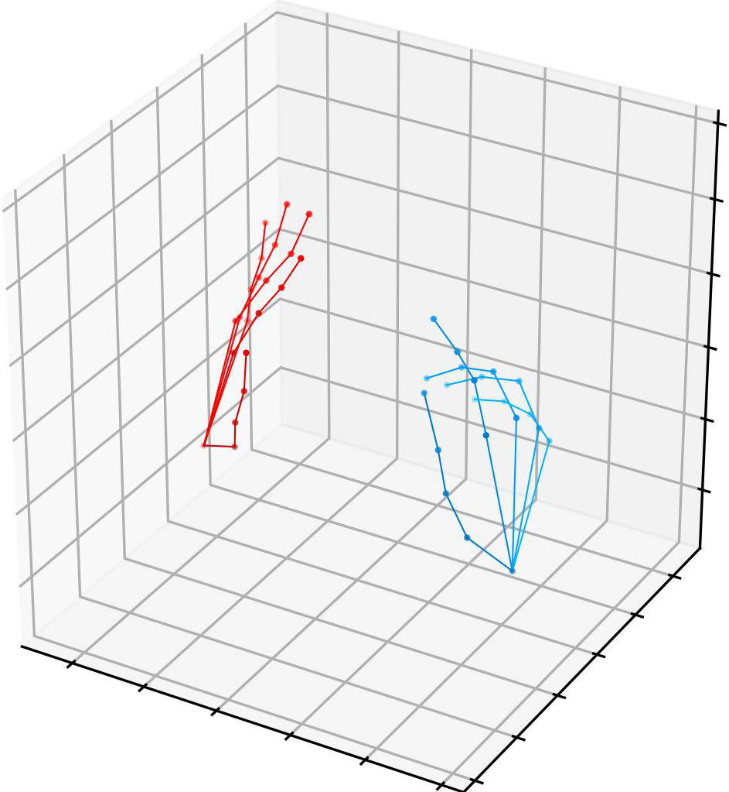
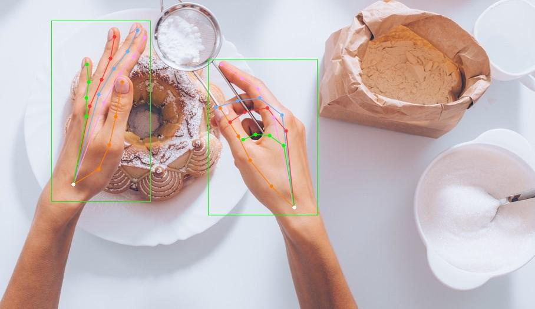

# ScaleHP: Estimating Hand Pose in Metric Space

- 论文标题：ScaleHP: Estimating Hand Pose in Metric Space  
- 作者：Ruitao Jing, Xingyu Chen, Hongyang Li, Qing Jiang, Yukai Shi, Lei Zhang  
- arXiv：2606.25619v1，发布时间 2026-06-24  
- 链接：http://arxiv.org/abs/2606.25619v1  
- 项目页：https://laiang8086.github.io/scalehp，论文第 1 页给出该链接；全文材料未给出可确认的 GitHub 仓库地址，本文按“未提供可确认的公开代码”处理（见 PAGE 1）。  
- 主题：手部姿态估计（Hand Pose Estimation, HPE）、相机坐标系三维重建、度量尺度学习（Metric Scale Learning）。  

## 摘要

ScaleHP 关注的问题不是传统“手的相对姿态是否正确”，而是“手在相机坐标系中的真实三维位置与物理尺度是否正确”。论文指出，现有多数单目手部姿态估计方法停留在根关节相对坐标（root-relative coordinate）或 MANO 参数回归层面，难以直接恢复绝对度量尺度；ScaleHP 则显式预测全局手部尺度，并通过透视投影约束下的最小二乘解析模块恢复相机空间三维关节（见 PAGE 1-3, PAGE 6-7）。

本文的核心判断是：ScaleHP 的创新点不在于重新发明手部骨架表示，而在于把“人体手骨比例与整体手长之间的稳定关系”转化为可监督的全局尺度变量 $s$，并用一个专门的 scale token 将 2D 关键点语义、3D 关键点几何与图像特征耦合起来。该设计使模型绕开外部深度估计模块，避免由场景背景、域偏移或单手局部裁剪引起的深度尺度不稳定问题（见 PAGE 2-7）。

从实验看，ScaleHP 在 FreiHand 上取得 35.8 mm CS-MPJPE，在 DexYCB 与 HO3Dv3 上分别取得 4.6 / 5.9 mm PA-MPJPE；更关键的是，Table 1 显示其在 camera-space 误差上相对最强可用基线有明显改善，说明显式尺度建模确实服务于绝对相机空间定位，而不只是改善对齐后的相对姿态（见 PAGE 11-12）。

## 背景与动机

手部姿态估计（Hand Pose Estimation, HPE）是 VR/AR、具身智能、遥操作与机器人灵巧操作中的基础模块。论文在 Introduction 中强调，对于数字孪生交互、机器人抓取、远程手术等应用，仅知道手指之间的相对构型并不足够；系统还需要知道手在物理空间中的精确位置和尺寸（见 PAGE 1-2）。这意味着任务目标必须从传统 root-relative 3D pose estimation 转向 camera coordinate system 下的 metric-space estimation。

传统单目 HPE 方法大体可分为三类：一类回归 MANO 这类参数化手模型的姿态与形状系数；一类使用 2.5D 或 3D heatmap 表示关键点位置；一类直接回归三维顶点或关键点坐标。论文在 Related Works 中指出，这些方法在根关节相对姿态上取得进展，但通常不显式建模绝对物理尺度（见 PAGE 3-4）。因此，它们适合回答“手指如何弯曲”，但不一定适合回答“这只手离相机多远、实际有多大”。

metric-space hand pose estimation 的困难来自单目图像的深度-尺度歧义（depth-scale ambiguity）。同一张二维投影可以对应“大手在远处”或“小手在近处”等多种三维解释。已有 camera-space 方法常借助外部深度估计、预定义残差深度、深度分箱或注册策略来补偿尺度，但论文认为这些外部模块在纯手部场景、背景分布变化或 out-of-domain 场景下容易失效（见 PAGE 2, PAGE 4）。

ScaleHP 的出发点是：手部骨骼长度之间存在相对稳定的人体测量学比例（anthropometric prior），这些比例与整体手部物理尺度存在隐式相关。论文引用法医学与解剖研究说明手骨比例可以反映整体手部尺寸（见 PAGE 2, PAGE 6）。这使得尺度估计不必完全依赖外部场景深度，而可以从手本身的内部几何关系中获得约束。

从研究路线看，ScaleHP 接近 monocular metric depth estimation 与 metric human mesh recovery 中“相对几何 + 度量尺度”的分解思想，但它没有直接把全局图像上下文作为尺度来源，而是把尺度推理绑定到 2D / 3D 手部关键点查询上。论文在 Metric Scale Learning 部分明确指出，scale token 与 2D、3D hand keypoint queries 紧密交互，使 joint-level semantic and geometric constraints 成为 metric-space reconstruction 的关键（见 PAGE 5）。

## 预备知识

首先需要区分三种坐标与指标。root-relative 3D coordinates 指以某个手部参考点为原点的内部坐标系，论文脚注说明通常以中指根部等 intrinsic hand reference point 为原点，但保留全局朝向（见 PAGE 2）。camera-space coordinates 则是在相机坐标系中表达三维关节位置，包含绝对平移与物理尺度。CS-MPJPE（Camera Space Mean Per Joint Position Error）直接计算相机空间中预测关节与真值关节的平均欧氏距离，不进行对齐或尺度校正，因此是本文最关键的评价指标（见 PAGE 10-11）。

R-MPJPE（Root-Aligned MPJPE）通过以腕部为中心做平移对齐，消除绝对位置误差；P-MPJPE（Procrustes-Aligned MPJPE）进一步通过平移、旋转和缩放对齐，主要衡量 articulated pose 的形状质量。论文特别提醒，root-relative 和 Procrustes-aligned 指标会丢弃绝对平移或尺度信息，因此不能作为 metric-space pose estimation 的主要证据，只能用于确认尺度学习是否损害相对姿态质量（见 PAGE 10-12）。

其次需要理解透视投影。单目相机中三维点 $(X,Y,Z)$ 投影到二维像素 $(u,v)$ 依赖焦距 $(f_x,f_y)$ 与主点 $(c_x,c_y)$。若已知 2D keypoints、root-relative 3D keypoints 和相机内参，则全局尺度 $s$ 与平移 $t$ 之间存在约束。ScaleHP 的关键策略是显式预测更稳定的全局尺度 $s$，再通过解析线性系统求解平移，避免直接回归易病态的 metric-space translation（见 PAGE 6-7）。

## 方法详解

### 1. 问题定义：从 root-relative pose 到真实 metric space

ScaleHP 假设模型先得到根关节相对三维关键点 $J_{rel}$，再将其恢复为真实度量空间关键点 $J^M$。论文给出的仿射变换为：

$$
\begin{bmatrix}
X^M \\
Y^M \\
Z^M
\end{bmatrix}
=
s
\left(
\begin{bmatrix}
x^{rel} \\
y^{rel} \\
z^{rel}
\end{bmatrix}
+
t
\right)
$$

其中，$(x^{rel},y^{rel},z^{rel})$ 表示 root-relative coordinate 下的关节坐标，$(X^M,Y^M,Z^M)$ 表示 metric-space coordinate 下的关节坐标，$s$ 是全局尺度，$t$ 是平移向量（见 PAGE 6）。这条公式的含义是：模型先预测一个标准化或相对尺度下的手部骨架，再用全局尺度和平移把它放回相机坐标系中的真实物理空间。

该定义揭示了论文的核心选择：与其同时直接回归 $s$ 和 $t$，不如先预测更稳定的尺度 $s$，再利用相机投影几何求解 $t$。论文给出的理由有两点：第一，若相机内参 $K$ 与 2D keypoints 可用，透视投影约束意味着 $s$ 与 $t$ 中只需显式估计一个，另一个可以据此恢复；第二，单目图像存在焦距歧义与深度-尺度歧义，直接从 root-relative representation 回归 metric translation 是 ill-posed 的（见 PAGE 6）。

### 2. 全局尺度定义：用骨长均值监督 scale

论文将全局尺度定义为 index、middle、ring fingers 相邻关节构成的骨段长度集合的均值。设 $I_{MR}=\{l_0,l_1,\ldots,l_{N-1}\}$ 表示相关骨长集合，则：

$$
s=\frac{1}{N}\sum_{i=0}^{N-1}l_i
$$

其中，$l_i$ 是第 $i$ 条骨段长度，$N$ 是骨段数量（见 PAGE 6）。这条公式的含义是：ScaleHP 不把尺度当作抽象 latent variable，而是把它锚定到可从数据集三维标注中计算出来的真实骨骼长度统计量。

这个定义有两层意义。第一，它把 metric scale supervision 变成直接可训练的回归目标，避免训练时依赖额外深度网络。第二，它利用了“骨段比例稳定、整体尺寸可由骨长关系间接反映”的先验，使尺度估计更接近手部内部形态学推理，而不是背景深度推理。论文明确称，该 scale 可由原始数据集标注直接得到，并可在不同场景与成像条件下泛化（见 PAGE 6）。

### 3. 从尺度到平移：透视约束下的最小二乘求解

ScaleHP 在得到全局尺度后，通过透视投影约束求解平移 $t$。对第 $j$ 个手部关键点，设二维像素坐标为 $(u_j,v_j)$，root-relative 3D 坐标为 $(x_j,y_j,z_j)$，相机内参为焦距 $(f_x,f_y)$ 与主点 $(c_x,c_y)$。沿 $x$ 轴的投影关系为：

$$
\frac{u_j-c_x}{f_x}=\frac{x_j+t_x}{z_j+t_z}
$$

其中，$t_x$ 与 $t_z$ 分别是平移向量在 $x$ 和 $z$ 方向上的分量（见 PAGE 7）。这条公式的含义是：像素坐标与三维坐标之间由相机针孔模型约束，二维横向偏移取决于三维横向位置与深度的比值。

将上式改写可得：

$$
(u_j-c_x)(z_j+t_z)=f_x(x_j+t_x)
$$

这一步只是把分式形式转成线性推导可用的乘法形式，目的是消去未知变量之间的非线性耦合（见 PAGE 7）。

论文令根关节 $p$ 为 root-relative coordinate 的原点。对根关节有：

$$
(u_p-c_x)t_z=f_x t_x
$$

其中，$u_p$ 是根关节的横向像素坐标（见 PAGE 7）。这条公式说明：根关节处的横向平移 $t_x$ 可由深度平移 $t_z$ 和根关节投影位置表示。

将根关节关系代入第 $j$ 个关键点的投影式，可得到：

$$
(u_j-u_p)t_z-f_xx_j=-(u_j-c_x)z_j
$$

这条公式的含义是：对每个关键点，未知量可以被压缩为单个 $t_z$，其余量来自预测的 2D keypoints、root-relative 3D keypoints 与相机内参（见 PAGE 7）。

同理，$y$ 方向也可得到对应约束。将 $N$ 个关键点的 $x/y$ 方向约束组合后，得到 $2N$ 个方程构成的过定线性系统：

$$
\begin{bmatrix}
\cdots \\
u_j-u_p \\
v_j-v_p \\
\cdots
\end{bmatrix}
t_z
=
\begin{bmatrix}
\cdots \\
x_jf_x-(u_j-c_x)z_j \\
y_jf_y-(v_j-c_y)z_j \\
\cdots
\end{bmatrix}
$$

其中，$(v_j,v_p)$ 是第 $j$ 个关键点与根关节点的纵向像素坐标，$c_y$ 是相机主点纵坐标（见 PAGE 7）。这条公式的实际作用是：把所有关键点对深度平移的约束合并起来，用 least squares 求一个全局一致的 $t_z$。

求得 $t_z$ 后，剩余平移分量由：

$$
t_x=\frac{u_p-c_x}{f_x}\cdot t_z,\quad
t_y=\frac{v_p-c_y}{f_y}\cdot t_z
$$

这条公式说明：一旦根深度确定，横向与纵向平移可以由根关节像素位置和相机内参直接恢复（见 PAGE 7）。最后，将预测尺度 $s$ 与求得的平移 $t$ 代入前述仿射变换，即可得到 camera coordinate system 中的 metric-space 3D hand keypoints。

### 4. ScaleHP 总体架构

论文 Fig.2 给出 ScaleHP 的整体流程：输入图像首先经过 frozen detector 提取全局手部特征与检测线索；随后进入 Metric 2D-3D Decoder，scale token 与 2D/3D keypoint queries 以及 image features 交互；最后由 training-free analytic module 求解 global translation，并输出真实 metric scale 下的相机坐标系手部姿态（见 PAGE 5）。

虽然本文可用图片资源只提供了 Fig.1 的若干局部图，不能展示 Fig.2 原图，但论文文字足以确认架构由三部分组成：frozen DETR-style detector、Metric-aware 2D-3D decoder、training-free analytical module（见 PAGE 5, PAGE 8）。

用途：以下图片用于说明论文 Fig.1 中“已有方法与 ScaleHP 目标差异”的视觉线索，强调本文关注 camera-space metric pose，而非仅 root-relative pose。  
  
读图要点：图中三维网格中的两只手以不同颜色显示，强调恢复的不是单个局部手型，而是相机空间中的三维位置关系。支撑的判断：ScaleHP 的问题设定是 metric-space hand pose estimation，要求输出具备绝对尺度与空间位置的三维手部姿态（见 PAGE 2）。

用途：以下图片用于说明 Fig.1 中“scale”这一概念的视觉提示，论文明确称 ScaleHP 是 first to explicitly predict the global scale of the hand。  
  
读图要点：该局部图以尺标形式表达尺度概念。支撑的判断：论文方法区别于依赖外部深度或后处理注册的方法，关键在于显式预测 global scale（见 PAGE 2-3, PAGE 6）。

用途：以下图片用于展示 ScaleHP 处理的输入场景，包含真实图像中的多手与物体交互。  
  
读图要点：图像中存在手-物体交互和双手场景，属于传统深度估计或背景依赖方法容易出现不稳定的情形。支撑的判断：论文强调方法应适用于真实 HCI 与机器人交互场景，而不仅是实验室内孤立手部图像（见 PAGE 1-2）。

用途：以下图片用于展示 ScaleHP 在输入图像上的 2D box 与关键点预测效果。  
  
读图要点：绿色框定位手部实例，彩色骨架显示关键点结构。支撑的判断：ScaleHP 将检测、2D/3D 关键点预测与尺度估计组织在 one-stage framework 中，而非依赖外部多阶段深度模块（见 PAGE 2-3, PAGE 8-9）。

### 5. DETR-like detector：冻结检测器提供手部实例与多尺度特征

ScaleHP 使用 Grounding DINO 1.5 作为代表性 frozen detector backbone，但论文声明框架兼容任何可提供 multi-modal feature fusion 与 query-based localization 的 open-vocabulary 或 DETR-like detector（见 PAGE 8, PAGE 10）。给定 RGB 图像 $I$ 与文本提示 `"hand"`，编码器首先融合视觉与文本特征：

$$
F_e=E(\mathrm{Backbone}_v(I),\mathrm{Backbone}_t(\text{"hand"}))
$$

其中，$F_e$ 是融合后的多模态表示，$\mathrm{Backbone}_v$ 与 $\mathrm{Backbone}_t$ 分别表示视觉与文本骨干（见 PAGE 8）。这条公式的含义是：检测器不是只看局部裁剪，而是利用文本提示在全图中定位手部相关区域。

随后，Transformer decoder 通过 deformable attention 迭代更新内容查询 $Q_i$ 与参考点 $R_i$：

$$
Q_{i+1},R_{i+1}=D(Q_i,R_i,F_e)
$$

其中，$D$ 是检测解码器，$R_i$ 是由查询导出的 2D reference points（见 PAGE 8）。这条公式说明，检测查询会围绕参考点自适应采样特征，从而捕获局部手部上下文。

检测头输出 bounding boxes 与 confidence scores：

$$
(B,C)=H(Q,R)
$$

其中，$B$ 表示检测框集合，$C$ 表示置信度（见 PAGE 8）。这一步的作用是把全图特征压缩为后续姿态解码器可使用的手部实例表示。

### 6. Metric 2D-3D Decoder：scale token 与关键点查询联合建模

Metric 2D-3D Decoder 首先根据分类阈值 $\tau_s$ 和 NMS 阈值 $\tau_{nms}$ 筛选最可信的手部实例查询 $\tilde Q$ 及其对应 bounding box $\tilde B$。随后，模型把该实例查询扩展为 $J=21$ 个 joint queries。初始层中，2D 与 3D joint queries 通过同一实例查询加上可学习关节嵌入 $E^J$ 得到：

$$
Q^{J2D}_0=Q^{J3D}_0=\tilde Q+E^J
$$

其中，$Q^{J2D}_0$ 表示 2D 关键点初始查询，$Q^{J3D}_0$ 表示 3D 关键点初始查询（见 PAGE 8）。这条公式意味着 2D 与 3D 姿态估计共享同一个实例级语义起点，再通过任务头分化。

scale token $Q_{s,0}$ 则直接由 $\tilde Q$ 初始化，用来承载全局尺度信息。论文将其设计为 decoder 的核心机制：在每一层 $l$ 中，scale token 先与 2D/3D joint queries 做 self-attention，聚合局部骨架约束：

$$
Q'_{s,l},Q_{2D,l},Q_{3D,l}
=
SA(Q_{s,l-1},\{Q_{2D,l-1},Q_{3D,l-1}\})
$$

其中，$SA$ 表示 self-attention，$Q'_{s,l}$ 是更新后的尺度查询中间表示（见 PAGE 9）。这条公式说明，尺度不是从单个全局图像向量孤立预测，而是通过与所有 2D/3D 关节查询交互来学习骨骼拓扑和比例关系。

随后，scale token 通过 deformable attention 与多尺度图像特征 $F_{GD}$ 交互：

$$
Q_{s,l}=DefAttn(Q'_{s,l},F_{GD},R_{s,l-1})
$$

其中，$R_{s,l-1}$ 是上一层 scale token 的 reference point（见 PAGE 9）。这条公式说明，scale token 同时利用手部内部几何和图像外观，占据区域大小、局部纹理与全局空间位置都可能参与尺度估计。

reference points 也会逐层更新：

$$
R_{\{2D,3D,S\},l}
=
FFN(Q_{\{2D,3D,S\},l})+
R_{\{2D,3D,S\},l-1}
$$

其中，$S$ 表示 scale token 分支，$FFN$ 是前馈网络（见 PAGE 9）。这条公式的含义是：查询不仅更新语义特征，也更新其空间参考位置，使 2D、3D 与尺度分支在迭代过程中共同收敛。

最后，最后一层查询分别进入三个任务头：

$$
J^{2D}=FFN_{2D}(Q_{2D,L}),\quad
J^{3D}=FFN_{3D}(Q_{3D,L}),\quad
s=FFN_{scale}(Q_{s,L})
$$

其中，$J^{2D}$ 是像素级 uv 坐标，$J^{3D}$ 是单位尺度归一化的 root-relative 3D 坐标，$s$ 是预测尺度标量（见 PAGE 9）。这三类输出共同输入解析模块，恢复 camera space 中的绝对三维坐标。

### 7. 训练目标：2D、3D、尺度与投影监督

ScaleHP 的训练目标由四部分组成：2D supervision、3D supervision、metric scale supervision、projection supervision（见 PAGE 9-10）。2D 关键点使用 $L_1$ 与 OKS 监督：

$$
L_{J^{2D}}=\|J^{2D}-J^{2D*}\|_1,\quad
L^{2D}_{OKS}=OKS(J^{2D},J^{2D*})
$$

其中，星号表示 ground truth（见 PAGE 9）。这条公式表示模型既要拟合关键点坐标的绝对像素误差，也要兼顾关键点相似度评价。

3D 关键点使用点级 $L_1$ 损失：

$$
L_{J^{3D}}=\|J^{3D}-J^{3D*}\|_1
$$

该损失约束 root-relative 3D joint positions 的几何准确性（见 PAGE 9）。其作用是保证 scale token 不会牺牲内部手型结构来换取尺度拟合。

尺度监督使用 MSE：

$$
L_s=\|s-s^*\|^2
$$

其中，$s^*$ 是由真实骨长统计得到的 ground-truth scale（见 PAGE 10）。这条公式直接对应 ScaleHP 的核心贡献：把 metric scale 从不可观测的歧义项变成可监督学习目标。

投影监督将预测 3D 结果投影回 2D 像素空间：

$$
L^{proj}_{2D}=\|\pi(J^{3D},K_{cam})-J^*_{2D}\|_1,\quad
L^{proj}_{OKS}=OKS(\pi(J^{3D},K_{cam}),J^*_{2D})
$$

其中，$\pi(\cdot)$ 是相机投影函数，$K_{cam}$ 是相机内参（见 PAGE 10）。这条公式的含义是：即使 3D 预测在内部空间中合理，也必须在投影后与 2D 标注一致，从而增强几何闭环约束。

### 8. 代码状态与可复现性

论文第 1 页给出项目页 https://laiang8086.github.io/scalehp，但提供的全文材料没有出现可确认的 GitHub 仓库链接、源码目录或 release 信息（见 PAGE 1）。因此，本文未提供可确认的公开代码，不展示源码段，也不将任何未验证实现当作论文官方代码分析。

这意味着当前可复现性判断只能依据论文中公开的训练与实现细节：使用 Grounding DINO 1.5 作为 frozen detector backbone；处理 full images，长边 resize 到 1280；训练 45 epochs；Adam optimizer；total batch size 16；初始学习率 $1\times10^{-4}$；第 7 个 epoch 后使用 cosine annealing；训练分布在 8 张 NVIDIA A100-80G GPU 上（见 PAGE 10）。这些细节足以说明训练规模和主要工程条件，但不足以复现模块实现、数据预处理、NMS/threshold 默认值和 decoder 层数等全部工程细节。

## 实验分析

### 1. 实验设置与数据集

论文使用 FreiHand、HO3Dv3、DexYCB、HInt、COCO-WholeBody 和 Onehand10K 进行训练；在 FreiHand 与 DexYCB 上，为保证公平比较，仅使用各自训练集训练，而非混合所有数据；在 HO3Dv3 上则使用所有可用训练数据，以覆盖更宽的物理尺度范围（见 PAGE 10）。补充材料进一步说明 FreiHand 含 130,240 张训练图与 3,960 张测试图；DexYCB 含 429,616 个训练样本与 78,768 个测试样本；HO3Dv3 含 83,325 张训练图与 20,137 张测试图（见 PAGE 22）。

评价指标包括 CS-MPJPE、R-MPJPE 和 P-MPJPE。论文明确将 CS-MPJPE 作为 metric-space hand pose estimation 的核心指标，因为它不做 root alignment、Procrustes alignment 或 post-hoc scale correction，直接衡量 camera-space 绝对定位误差（见 PAGE 10-11）。

### 2. Camera-space 主结果

| Method | FreiHand CS-MPJPE ↓ | DexYCB CS-MPJPE ↓ | HO3Dv3 CS-MPJPE ↓ |
|---|---:|---:|---:|
| CMR + GS | 48.8 | 183.2 | 152.3 |
| HandDGP + GS | 46.2 | 222.1 | 132.6 |
| NFV | 42.4 | - | - |
| ScaleHP | 35.8 | 136.3 | 50.7 |

表格解读：Table 1 是本文最关键的证据，因为它直接比较 camera-space absolute pose error，而不是对齐后的相对姿态误差。即使 CMR 和 HandDGP 使用 Optimal Global Scale 这一对基线有利的协议，ScaleHP 仍在 FreiHand、DexYCB 和 HO3Dv3 上取得最低误差。论文给出的相对改善分别为 FreiHand 上相对 42.4 mm 降低到 35.8 mm，DexYCB 上相对 183.2 mm 降低到 136.3 mm，HO3Dv3 上相对 132.6 mm 降低到 50.7 mm；这说明显式预测 hand metric scale 比数据集级尺度校准或外部注册更有效（见 PAGE 11）。

### 3. 与更广泛 hand pose 文献的对齐指标比较

| Method | FreiHand CS-MPJPE ↓ | FreiHand P-MPJPE ↓ | DexYCB R-MPJPE ↓ | DexYCB P-MPJPE ↓ | HO3Dv3 P-MPJPE ↓ |
|---|---:|---:|---:|---:|---:|
| MobRecon | 50.2 | 5.7 | 14.2 | 6.4 | - |
| METRO | - | 6.7 | 15.2 | 7.0 | - |
| MaskHand | - | 5.5 | 11.7 | 5.0 | 7.0 |
| Hamba | - | 5.7 | - | - | 6.9 |
| HandOS | - | 5.0 | - | 5.2 | 6.8 |
| ScaleHP | 35.8 | 5.0 | 10.3 | 4.6 | 5.9 |

表格解读：Table 2 显示 ScaleHP 不仅在 CS-MPJPE 上强，而且在常规 aligned metrics 下也没有牺牲相对姿态质量。FreiHand 上 P-MPJPE 为 5.0 mm，与 HandOS 持平；DexYCB 上 R-MPJPE 为 10.3 mm，P-MPJPE 为 4.6 mm，均优于表中列出的既有方法；HO3Dv3 上 P-MPJPE 为 5.9 mm。该结果支撑论文的一个重要论点：scale token 不只是用于后处理尺度补偿，也可能作为几何正则项改善相对深度结构（见 PAGE 11-12）。

### 4. 定性结果：metric space 与 top view

论文 Fig.3 展示 FreiHand evaluation set 上的定性结果，包含 origin image、metric space 和 top view，强调 ScaleHP 能恢复 absolute hand poses 并减少 depth ambiguity（见 PAGE 13）。Fig.4 展示 in-the-wild 图像结果，包括 image-plane projection、metric-space 3D visualization、front view 与 top view；论文称这些结果覆盖 hand-object、hand-hand interactions、viewpoint changes 和 severe occlusions（见 PAGE 14）。

补充材料 Fig.S1-S4 进一步与 HaMeR 做开放域图像定性比较，特别从 top-view 可视化观察多手相对深度顺序。论文称 ScaleHP 能正确解析 multiple hands 的 relative depth ordering，而 HaMeR 因缺少 metric camera-space estimation 出现明显 depth errors（见 PAGE 23-27）。需要注意，这些是定性证据，支撑“复杂场景下更稳定”的判断，但不能替代 Table 1 的定量 camera-space 误差。

### 5. Scale token 消融实验

| Method | FreiHand CS-MPJPE ↓ | DexYCB CS-MPJPE ↓ | HO3Dv3 CS-MPJPE ↓ |
|---|---:|---:|---:|
| No Scale Token | 44.3 | 40.2 | 42.0 |
| With Scale Token | 35.8 | 30.0 | 33.4 |

表格解读：Table 3 直接隔离 scale token 的作用。移除 scale token 后，论文用 Optimal Global Scale 恢复 camera-space pose；加入 scale token 后，三个 benchmark 的 CS-MPJPE 均下降。这说明 scale token 是 absolute metric-space estimation 的关键组件，而不是可有可无的辅助分支（见 PAGE 15）。

| Method | P-MPJPE ↓ | X-axis Component ↓ | Y-axis Component ↓ | Z-axis Component ↓ |
|---|---:|---:|---:|---:|
| w/o Scale Token | 5.6 | 2.3 | 2.4 | 3.5 |
| w/ Scale Token | 5.0 | 2.2 | 2.2 | 3.0 |

表格解读：Table 4 更细地分析 scale token 对深度歧义的影响。加入 scale token 后，P-MPJPE 从 5.6 降到 5.0，其中 Z-axis component 从 3.5 降到 3.0，降幅大于 X/Y 方向。这与论文的机制解释一致：scale token 学到 inter-joint skeletal length relationships，从而缓解 relative depth estimation ambiguity（见 PAGE 15）。

### 6. 联合尺度学习与尺度误差

| Training Strategy | P-MPJPE ↓ | CS-MPJPE ↓ | Scale Error $(10^{-3})$ ↓ |
|---|---:|---:|---:|
| Decoupled (Pre-train + Fine-tune) | 5.2 | 39.5 | 2.06 |
| Joint | 5.0 | 35.8 | 1.94 |

表格解读：Table 5 比较 decoupled training 与 joint training。decoupled 先训练 2D/3D queries，再加入 scale token 并冻结其余 decoder；joint training 则让 scale token 从训练早期就与 joint queries 共同交互。结果显示 joint training 同时改善 P-MPJPE、CS-MPJPE 和 scale error，说明 scale token 不是后期附加的校准头，而是参与形成 scale-aware geometric representations（见 PAGE 15-16）。

| Dataset | Scale Error $(10^{-3})$ ↓ |
|---|---:|
| FreiHand | 1.94 |
| DexYCB | 0.56 |
| HO3Dv3 | 1.02 |

表格解读：补充材料 Table S1 报告预测尺度与 ground-truth scale 的平均 $L_1$ 误差，三组数据均低于 $2\times10^{-3}$。这支持论文关于“单张 RGB 图像可较准确感知手部 metric scale”的主张。不过该表只报告 ScaleHP 自身结果，缺少其他尺度预测方法的直接对照，因此更适合作为模型内部可靠性证据，而非跨方法 SOTA 证据（见 PAGE 22）。

## 讨论

ScaleHP 的适用边界首先由任务定义决定：它适合需要 camera coordinate system 下真实尺度手部关键点的应用，例如手势交互、机器人抓取前的人手状态估计、AR/VR 中的物理尺度交互，以及需要判断多只手相对深度顺序的场景。若业务只关心 root-relative hand shape 或 2D gesture classification，则 ScaleHP 的 metric scale 设计可能不是主要价值来源（见 PAGE 1-2, PAGE 10-12）。

其次，ScaleHP 的优势来自内部生物几何先验，而不是外部场景深度。这使它在纯手部、背景变化或开放域图像中理论上更稳健。论文的 in-the-wild 定性结果和与 HaMeR 的补充比较支持这一点，但目前公开文本中的主表定量评测仍集中在 FreiHand、DexYCB、HO3Dv3 等标准数据集上；对于真实部署中的视频流、极端镜头畸变、非常规手型、儿童手、手套或工具遮挡等场景，仍需更系统的外部验证（见 PAGE 13-14, PAGE 22-27）。

方法论上，ScaleHP 对 HPE 社区的启示在于：metric estimation 不一定必须依赖通用单目深度模块，也可以利用对象类别自身的内部结构先验。对手而言，骨长比例是可用先验；对人体、动物、物体抓取等任务，也可能存在类似的 shape-scale constraints。不过，该思路能否迁移取决于目标对象是否具有稳定形态统计，以及训练集是否覆盖足够的尺度和人群分布。

## 局限分析

作者自述的局限主要集中在训练数据人口分布上。补充材料 S5 明确指出，由于训练数据集主要包含成人手部样本，模型在遇到婴幼儿或年轻儿童手部时可能出现 metric-space estimation errors；作者建议引入更宽年龄与人口统计变化范围的数据，以提升 metric-scale pose estimation 的鲁棒性（见 PAGE 23）。这是一个实质性局限，因为 ScaleHP 的核心假设依赖手骨比例与整体尺度的统计稳定性，而儿童手部发育阶段的比例分布可能与成人明显不同。

作者还将未来工作定位为从 sparse hand pose 扩展到 full hand reconstruction in metric space，例如生成 dense hand meshes 或 point clouds（见 PAGE 23）。这说明当前 ScaleHP 输出主要是 3D hand keypoints，而不是完整手部表面几何。对于机器人接触规划、精细抓取仿真或手-物体接触建模，仅有 21 个关键点可能不足以描述手掌表面、指腹接触区域和遮挡边界。

独立判断上，论文没有在给定正文中报告实时性、推理吞吐、显存占用或端侧部署复杂度。虽然模型使用 frozen Grounding DINO 1.5 与 full image long edge 1280 的设置有利于检测鲁棒性，但这也可能带来较高计算成本；对于低延迟手势交互或机器人闭环控制，缺少 FPS 与硬件配置下的推理评估是明显证据缺口（见 PAGE 8, PAGE 10）。因此，业务落地前需要补充 latency、batch size 1、低分辨率输入和轻量 detector 替换实验。

另一个证据不足之处是公开代码。全文材料只提供项目页链接，未给出可确认源码仓库、配置文件或训练脚本。论文虽然给出了主要训练超参数，但没有足够信息确认 decoder 层数、threshold 细节、数据增强、尺度真值计算实现、least-squares 数值稳定处理等工程细节。因此，本文未提供可确认的公开代码；代码级方法对应与源码复现分析证据不足（见 PAGE 1, PAGE 8-10）。

## 结论

ScaleHP 提出了一条清晰的 metric-space hand pose estimation 路线：用手部骨骼比例定义可监督全局尺度 $s$，用 scale token 在 Transformer decoder 中融合 2D 语义、3D 几何与多尺度图像特征，再用透视投影约束下的 least-squares 解析模块恢复相机空间平移。该设计针对单目 HPE 中最难的深度-尺度歧义，将尺度估计从外部深度依赖转向内部形态先验（见 PAGE 3, PAGE 5-9）。

实验上，Table 1 的 CS-MPJPE 结果是最强证据：ScaleHP 在 FreiHand、DexYCB、HO3Dv3 上均优于使用 Optimal Global Scale 的 camera-space baselines。Table 3-5 进一步说明 scale token 对绝对尺度、相对深度一致性和联合训练均有贡献（见 PAGE 11, PAGE 15-16）。但论文仍存在部署效率、公开代码、儿童及非成人手型泛化、dense reconstruction 能力等未解决问题。总体而言，ScaleHP 对手部姿态团队最值得关注的价值，是把“真实尺度的单目手部三维估计”从依赖外部深度模块的问题，重新表述为可监督的手部形态尺度学习问题。

## 证据索引

| 证据点 | PAGE |
|---|---|
| 论文题目、作者、摘要、项目页链接、ScaleHP 总体贡献 | PAGE 1 |
| HPE 在 HCI、VR/AR、机器人中的应用动机；传统 root-relative 方法不足；Fig.1 对比 ScaleHP 与 previous arts | PAGE 1-2 |
| 基于人体测量学骨骼比例推断 hand metric scale 的核心假设 | PAGE 2-3, PAGE 6 |
| 主要贡献：metric-aware HPE、scale token、35.8 CS-MPJPE 与 4.6/5.9 PA-MPJPE | PAGE 3 |
| 相关工作：root-relative HPE、camera-space HPE、外部深度模块缺陷 | PAGE 3-5 |
| Metric Scale Learning 相关背景及 ScaleHP 与 MoGe2/MetricHMR 的区别 | PAGE 5 |
| Fig.2 架构概览：frozen detector、Metric 2D-3D Decoder、training-free analytic module | PAGE 5 |
| 仿射恢复公式、全局尺度 $s$ 的骨长均值定义 | PAGE 6 |
| 透视投影约束、线性系统、least-squares 求解 $t_z$ 与恢复 $t_x,t_y$ | PAGE 7 |
| DETR-like detector、Grounding DINO、文本提示 “hand”、检测输出公式 | PAGE 8 |
| 2D/3D joint queries、scale token self-attention、deformable attention、最终预测头 | PAGE 8-9 |
| 2D、3D、scale、projection losses | PAGE 9-10 |
| 训练细节：Grounding DINO 1.5、long edge 1280、45 epochs、Adam、batch size 16、A100-80G | PAGE 10 |
| 数据集与评价指标 CS-MPJPE、R-MPJPE、P-MPJPE 定义 | PAGE 10-11 |
| Table 1：camera-space CS-MPJPE 主结果 | PAGE 11 |
| Table 2：FreiHand、DexYCB、HO3Dv3 上 SOTA aligned metrics 对比 | PAGE 12 |
| Fig.3：FreiHand 定性结果，metric space 与 top view | PAGE 13 |
| Fig.4：in-the-wild 定性结果，hand-object、hand-hand、occlusion 等场景 | PAGE 14 |
| Table 3-5：scale token 消融、深度方向误差、joint scale learning | PAGE 15-16 |
| 补充数据集规模：FreiHand、DexYCB、HO3Dv3 | PAGE 22 |
| Table S1：scale prediction L1 error | PAGE 22 |
| 作者自述局限：成人手训练数据为主，儿童手可能出现 metric-space estimation errors | PAGE 23 |
| 未来工作：扩展到 metric-space dense hand mesh 或 point cloud reconstruction | PAGE 23 |
| Fig.S1-S4：与 HaMeR 的开放域定性比较及 top-view depth ordering | PAGE 24-27 |
