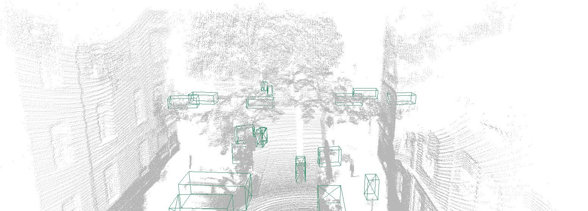
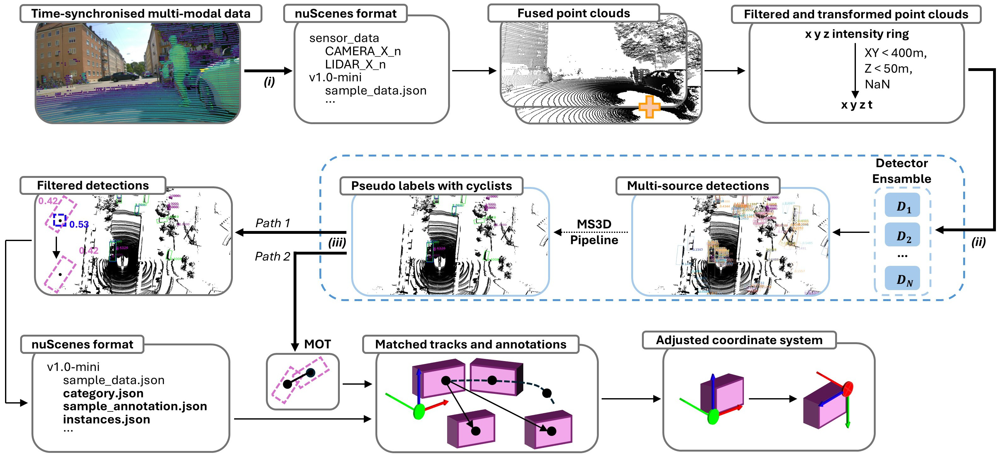
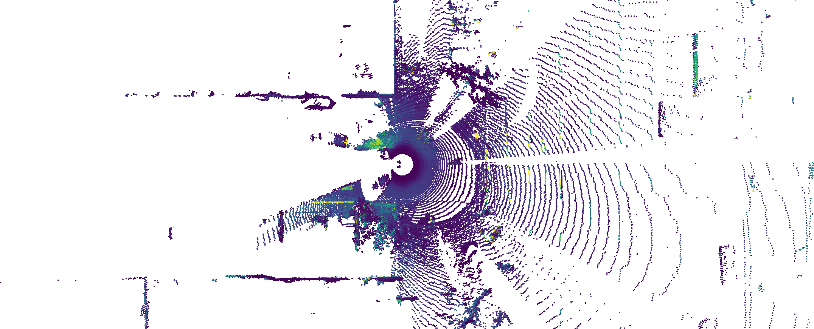

# Auto-Labelling-Based Domain Transfer for 3D Object Detection on a Bicycle-Mounted LiDAR Platform

## 摘要

**论文元信息。** 本文标题为 *Auto-Labelling-Based Domain Transfer for 3D Object Detection on a Bicycle-Mounted LiDAR Platform*，作者为 Mario Finkbeiner、Max A. Buettner、Kanak Mazumder、Fabian B. Flohr，arXiv ID 为 2606.25652，版本为 v1，发布时间为 2026-06-24，论文链接为 <http://arxiv.org/abs/2606.25652v1>。论文主题属于 3D object detection、domain adaptation、auto-labelling 与 cyclist-mounted LiDAR perception 的交叉方向。代码状态方面，全文未给出本文专属官方代码仓库；参考文献列出 VRU-Label3D、SUSTechPOINTS 与 OpenPCDet 等外部项目，但这些不是本文 benchmark 的完整官方实现发布。结合给定“已知代码链接：未知”与全文证据，本文未提供可确认的公开代码。

**一句话总结。** 本文构建了一个来自自行车搭载 LiDAR 平台 FUSE-Bike 的 3D 检测基准，用 VRU-Label3D 自动标注生成训练标签、用人工验证标签构建测试集，并证明在无人工训练标注的情况下，nuScenes 预训练 3D 检测器经自动标签微调后可显著缩小车辆视角到骑行者视角的域差距，mAP 最高提升 23.4 个百分点，且提升主要集中在 pedestrian 与 cyclist 两类安全关键 VRU 上（见 PAGE 1、PAGE 4、PAGE 5）。

本文最核心的结论不是“自动标签能替代所有人工标注”，而是更具体：当目标域是自行车低位 LiDAR 视角、目标类别是 vehicle / pedestrian / cyclist，且已有强 automotive pre-trained detectors 时，保守但结构化的自动标注可以作为有效训练信号，用于把车载检测器迁移到自行车平台。作者在 PAGE 5 明确报告，四个微调后的检测器均超过了其训练所用 auto-labels 在 held-out GT 上的质量，这一结果使本文从“自动标注数据集构建”推进到“自动标注驱动域迁移”的实证验证。

需要同时指出，全文只提供了 nuScenes-style mAP 与 precision / recall 相关公式，即式 (1) 与式 (2)，没有给出五个以上独立数学公式；因此本文只引用可由论文全文证实的公式，并在相关位置标注“公式证据不足”，不补造不存在的数学定义。

## 背景与动机

城市交通中的 vulnerable road users（VRUs，弱势交通参与者）主要包括 cyclists（骑行者）与 pedestrians（行人）。这两类对象缺乏机动车的被动安全保护，因此在自动驾驶 perception 系统中被可靠检测具有直接安全意义。论文在引言中指出，VRU 的 onboard sensor perception 是 urban autonomous driving 的中心问题之一，而自行车搭载传感器平台能够从 VRU 自身视角观测城市交通，这一点是车载传感器无法提供的（见 PAGE 1）。

现有 3D 检测数据集主要来自汽车视角，例如 nuScenes、Waymo、Lyft 等。论文在 Related Work 中强调，这些数据虽然覆盖多样城市场景，但 VRU 类别在其中稀缺；尤其 cyclists 在 nuScenes 标注中占比小于 1%（见 PAGE 2）。这导致一个直接问题：当前可用的 3D LiDAR detectors 通常在 automotive datasets 上训练，部署到自行车平台时，会遇到 sensor mounting perspective、LiDAR scan pattern、point density 与 traffic participant distribution 的综合域偏移（见 PAGE 1）。

自行车平台的域偏移并非只是“换了一个城市”或“换了一套传感器”。论文强调，自行车更低、更灵活，并处于 VRU 流中；低安装位使点云中的杆状物、植被与街边基础设施更容易在几何上类似 standing people，从而诱发 pedestrian false positives（见 PAGE 4）。因此，车辆类别往往仍可较好迁移，而行人与骑行者这两个安全关键类别表现下降更明显。

已有 cyclist-perspective datasets 多关注 semantic segmentation、VRU action recognition 或 car-to-bicycle overtaking，而没有提供 multi-class 3D object detection labels for VRUs（见 PAGE 2）。这使研究者难以回答两个基础问题：第一，车载预训练 3D 检测器在骑行者视角下到底退化多少；第二，自动生成的 3D labels 是否足以作为训练信号，而不只是作为可视化或预标注工具。

本文的动机正建立在这一缺口上。作者没有提出一个全新的检测网络，而是构造了一个 benchmark protocol：用 FUSE-Bike 平台采集的 LiDAR 数据建立 cyclist-perspective 3D detection benchmark；训练集使用 VRU-Label3D 自动标注；测试集使用人工验证 GT；检测器选择四种不同架构范式的 nuScenes 预训练模型；比较 zero-shot 与 auto-label finetuning 两种设置（见 PAGE 1、PAGE 2、PAGE 3）。因此，本文贡献更接近“数据闭环与域迁移评估框架”，而不是“单模型结构创新”。

## 预备知识

**3D object detection（3D 目标检测）** 在本文中指从 LiDAR point cloud 中预测 3D bounding boxes，并输出对象类别。本文只评估三个目标类：vehicle、pedestrian、cyclist；预训练模型原本输出 nuScenes 多类别标签，但在评估时被映射到这三个与 cyclist safety 相关的类别（见 PAGE 3、PAGE 4）。

**Zero-shot transfer（零样本迁移）** 指直接使用 nuScenes-pre-trained checkpoints，在 FUSE-Bike 测试集上推理，不使用任何目标域训练。这个设置用于暴露 vehicle-to-cyclist domain gap，即车载训练域到自行车平台目标域之间的性能落差（见 PAGE 3）。

**Auto-label finetuning（基于自动标签的微调）** 指将同一预训练 checkpoint 在 FUSE-Bike training auto-labels 上训练 20 epochs。训练标签不是人工修正的，而是由 VRU-Label3D 自动标注管线生成；检测头从 nuScenes 的 10 类重新分组为三个目标类 car、pedestrian、bicycle，共享 backbone 与部分权重继承预训练模型，而 regrouped head layers 重新初始化（见 PAGE 3、PAGE 4）。

**nuScenes-style mAP** 是本文主指标。类别集合 $C$ 表示三个目标类别，距离阈值集合 $D=\{0.5,1,2,4\}\,\mathrm{m}$ 表示 2D center-distance thresholds。论文使用中心距离匹配而非 IoU，因为低位传感器下的稀疏、部分观测点云会使 IoU 不稳定（见 PAGE 4）。

$$
\mathrm{mAP}=\frac{1}{|C||D|}\sum_{c\in C}\sum_{d\in D}\mathrm{AP}_{c,d}
$$

公式含义：对每个类别 $c$ 和每个中心距离阈值 $d$ 计算 average precision，再在类别与阈值上取平均。该公式对应论文式 (1)，见 PAGE 4。

论文还在固定 operating point 下报告 true positive（TP，真阳性）、false positive（FP，假阳性）、false negative（FN，假阴性），阈值为 score $\ge 0.3$ 且 match $\le 2\,\mathrm{m}$（见 PAGE 4）。precision 与 recall 定义如下：

$$
\mathrm{Precision}=\frac{\mathrm{TP}}{\mathrm{TP}+\mathrm{FP}}
$$

公式含义：precision 衡量预测为正的检测框中有多少是真正匹配 GT 的目标。该公式是论文式 (2) 的一部分，见 PAGE 4。

$$
\mathrm{Recall}=\frac{\mathrm{TP}}{\mathrm{TP}+\mathrm{FN}}
$$

公式含义：recall 衡量真实目标中有多少被检测器找回。论文特别指出，对 VRUs 而言 missed detection 的安全成本高于 spurious detection，因此 recall 更关键，见 PAGE 4。

**公式证据不足。** 全文材料只给出上述 mAP、precision、recall 相关公式。除这些外，论文没有提供可引用的第五个独立公式；因此本文不补造 KDE fusion、tracking、head regrouping 或 detector architecture 的数学表达。

## 方法详解

### 创新点一：构建 cyclist-perspective 3D detection benchmark

本文第一项贡献是建立一个面向 cyclist perspective 的 3D detection benchmark。数据来自 FUSE-Bike 平台，地点为德国慕尼黑城市道路环境，覆盖 dedicated bike paths、bicycle streets 与 shared general-traffic roads（见 PAGE 2）。平台使用两个 vertically stacked Ouster LiDARs，即 OS0 与 OS2，均为 128 beams；点云被融合，以结合 OS0 的近场广覆盖与 OS2 的远距离能力（见 PAGE 2）。

数据被切分为不重叠的 15-second sequences。作者说明该长度用于在文件规模与 tracking 所需 temporal context 之间折中；ego-motion 由 LiDAR-inertial odometry 估计，相比 pure LiDAR odometry 更适合 cyclist 的 agile motion（见 PAGE 2、PAGE 3）。

| Split | Scenes | Frames | Vehicle | Pedestrian | Cyclist |
|---|---:|---:|---:|---:|---:|
| Train (auto-labels) | 33 | 941 | 9903 | 4311 | 2131 |
| Test (GT) | 3 | 86 | 1093 | 396 | 365 |
| Total | 36 | 1027 | 10996 | 4707 | 2496 |

表格解读：该表复现论文 Table I 的核心数据，见 PAGE 2。训练集与测试集完全 disjoint，且无 temporal overlap；训练集为 auto-labels，测试集为 human-verified GT。虽然总标注数超过 18,000 个 3D boxes，但用于可信评估的人工验证 GT 仅为 86 frames、1854 boxes。这个设计把人工成本集中在评价集，而把大规模训练标签交给自动标注管线处理，符合“annotation-free adaptation but not evaluation-free validation”的实验逻辑。

该 benchmark 的价值在于，它没有把 auto-labels 当作最终真值来评估检测器，而是区分了 training labels 与 held-out evaluation GT。这样的分离很关键：如果用同一自动标注管线既生成训练标签又充当测试真值，那么检测器可能只是学习并复现标注器偏差。本文通过人工验证测试集避免了这一问题（见 PAGE 2、PAGE 3）。

### 图 1：自行车平台上的自动 3D labels 示例

用途：Fig. 1 用于展示 VRU-Label3D detector ensemble 在 FUSE-Bike 慕尼黑记录数据上的 3D auto-labels 示例，并直观说明车辆类别相对容易迁移、cyclists 与 pedestrians 仍是主要弱点（见 PAGE 1）。

读图要点：图中 auto-labels 反映了自行车平台视角下的空间布局与类别分布。与车载平台相比，自行车视角更低，VRU 对象在点云中更容易被遮挡、稀疏化或与街边结构混淆。

支撑的判断：Fig. 1 支撑本文的核心问题设定，即 vehicle-trained detectors 可以较合理迁移到 cars，但对 cyclist-mounted platform 最安全关键的 cyclists 与 pedestrians 仍存在明显弱点。这一判断在 PAGE 1 的图注和引言中被直接陈述，并由 PAGE 4、PAGE 5 的定量实验进一步验证。

### 创新点二：使用 VRU-Label3D 生成无人工训练标注

本文第二项方法贡献是用 VRU-Label3D 自动生成训练集标签。该框架是 MS3D++ 的扩展，针对 VRUs 进行调整。管线输入 time-synchronised LiDAR and camera streams，将数据组织为 nuScenes format，然后运行来自 Waymo、nuScenes、Lyft 等 automotive datasets 预训练的多源 detector ensemble（见 PAGE 3）。

多个 detectors 的 proposals 通过 kernel density estimation 合并，随后使用 multi-object tracker 连接跨帧 detections，以增强 temporal consistency，最后导出 standardised nuScenes-format tracked annotations（见 PAGE 3）。从“输入-处理-输出”看，输入是多模态同步数据与融合点云，处理包括 multi-source ensemble、proposal fusion、geometric filtering 与 tracking，输出是可被 OpenPCDet 风格检测器直接消费的 3D training labels。

该管线最重要的类别处理是保留 cyclist。论文指出，base MS3D++ 在 refinement stage 会丢弃 cyclists，而 VRU-Label3D 会 recover these detections 并携带到 final labels，以避免将稀缺且安全关键的 cyclist detections 当作噪声丢掉（见 PAGE 3）。这一步不是简单的数据清洗，而是针对目标任务分布做的类别保真策略。

### 图 2：VRU-Label3D 自动标注管线

用途：Fig. 2 展示本文训练标签的生成链路：同步多模态数据、nuScenes 格式化、融合和过滤点云、多源专家 ensemble、cyclist class recovery、geometric filtering、multi-object tracking 与 standardized annotations 导出（见 PAGE 3）。

读图要点：这张图的重点不在单个 detector，而在自动标注系统如何把不同来源的 automotive expertise 转化为目标平台上的 tracked annotations。它解释了为什么本文可以在不人工标注 941-frame training set 的情况下完成 finetuning。

支撑的判断：Fig. 2 支撑“训练标签来自自动标注且无人工修正”的关键事实。PAGE 3 明确说明 pseudo-labels are used directly as the training signal for all benchmark detectors, without manual correction of training scenes。因此，后续 mAP 提升不能归因于人工训练标注，而应归因于 auto-label-driven domain transfer。

### 创新点三：跨架构检测器评估，而非单模型报告

本文没有只评估一个模型，而是选择四个架构差异明显的 nuScenes-pre-trained detectors：CenterPoint、SECOND-MH、TransFusion-L 与 VoxelNeXt，均来自 OpenPCDet 的公开预训练 checkpoint（见 PAGE 3）。这些模型覆盖了 pillar/center-based、voxel/anchor-based、query-based transformer head 与 fully sparse anchor-free 等范式（见 PAGE 2、PAGE 3）。

这种设计使实验能够区分两个问题：性能下降是某个模型偶然不适配，还是 vehicle-to-cyclist domain shift 的普遍现象。论文结果显示，zero-shot 下四个检测器均表现出 VRU 类别弱、vehicle 类别较强的模式，因此域差距不是单模型问题（见 PAGE 4）。

同时，finetuning 后 detector spread 从 15.1 mAP points 缩小到 5.4 points（见 PAGE 5）。这说明 auto-label finetuning 不仅提高平均性能，也减少了 architecture-dependent component of the gap。换言之，自动标签不仅让强模型更强，也能把较弱架构拉到可比区间。

### 创新点四：把 auto-label quality 作为独立评估对象

本文并未默认自动标签是可靠的，而是在 held-out human GT 上把 auto-label pipeline 当作 detector 直接评估。Table III 显示 auto-labels vs. GT 达到 63.9 mAP，vehicle / pedestrian / cyclist 分别为 79.6 / 51.7 / 60.2（见 PAGE 5）。这一步让读者能判断训练信号本身的上限和偏差。

更重要的是，四个 finetuned detectors 在 mAP 和每个 VRU class 上都超过了 auto-labels 本身（见 PAGE 5）。这说明模型不是简单记忆 auto-label noise，而是借助预训练先验和目标域伪标签实现了超过标注器输出质量的泛化。对于数据闭环团队，这个结论很关键：自动标注即使 conservative、recall 不足，也可能作为 domain adaptation 的有效中间信号。

### 训练与评估协议

每个 detector 在两个设置中评估。zero-shot 设置直接运行 nuScenes-pre-trained checkpoint；finetuned 设置在 FUSE-Bike training auto-labels 上训练 20 epochs。检测头从 10 个 nuScenes classes 重组到 3 个 target classes，即 car、pedestrian、bicycle；backbone 与 shared weights 继承预训练模型，重组后的 head layers 重新初始化。训练数据、schedule 与 detection range 在不同 detector 间保持一致；检测与评估范围限制为 $\pm 40\,\mathrm{m}$，因为超出该范围后融合 OS0/OS2 返回过于稀疏，难以形成可靠 boxes（见 PAGE 3、PAGE 4）。

评估采用 nuScenes detection protocol，但匹配标准使用 2D center distance 而不是 IoU。该选择与低位 LiDAR 的观测特性相关：低安装位导致目标经常只被部分观测，稀疏点云下 box overlap 对微小几何误差非常敏感，而中心距离更适合衡量目标是否被定位到合理区域（见 PAGE 4）。

## 实验分析

### 主要结果：自动标签微调显著提升 mAP

| Detector | Zero-shot mAP | Zero-shot Vehicle | Zero-shot Pedestrian | Zero-shot Cyclist | Finetuned mAP | Finetuned Vehicle | Finetuned Pedestrian | Finetuned Cyclist | Relative mAP gain |
|---|---:|---:|---:|---:|---:|---:|---:|---:|---:|
| CenterPoint | 48.4 | 68.5 | 27.9 | 48.9 | 71.8 | 81.3 | 59.7 | 74.4 | +48.3% |
| SECOND-MH | 56.6 | 78.6 | 44.1 | 47.0 | 74.2 | 80.7 | 68.3 | 73.5 | +31.1% |
| TransFusion-L | 62.3 | 78.8 | 49.7 | 58.4 | 77.1 | 83.8 | 69.8 | 77.7 | +23.8% |
| VoxelNeXt | 63.5 | 79.3 | 51.8 | 59.5 | 77.2 | 83.5 | 70.5 | 77.7 | +21.6% |

表格解读：该表来自论文 Table II，见 PAGE 4。zero-shot 下，vehicle AP 对所有模型都显著高于 pedestrian 或 cyclist，说明域差距集中在 VRU 类，而不是所有类别均匀退化。finetuning 后，四个模型 mAP 均提升，其中 CenterPoint 从 48.4 提升到 71.8，绝对提升 23.4 points；VoxelNeXt 从 63.5 提升到 77.2，绝对提升 13.7 points。相对提升最大的是原始性能最低的 CenterPoint，但最终最高 mAP 由 VoxelNeXt 和 TransFusion-L 接近持平取得。PAGE 5 对这一现象的解释是：adaptation largely removes the architecture-dependent part of the gap。

从业务角度看，最重要的不是平均 mAP 本身，而是提升落在 pedestrian 与 cyclist 上。CenterPoint pedestrian AP 从 27.9 到 59.7，提升 31.8 points；cyclist AP 从 48.9 到 74.4，提升 25.5 points。论文在 PAGE 5 指出，pedestrian AP 对 CenterPoint more than doubles，cyclist AP rises by up to 56%。这与“VRU 是自行车平台最需要感知的对象”直接对应。

### Zero-shot domain gap 的结构

论文在 PAGE 4 总结：vehicles transfer reasonably well，而 two VRU classes are markedly weaker。以 VoxelNeXt 为例，zero-shot vehicle AP 为 79.3，pedestrian AP 为 51.8，cyclist AP 为 59.5；即使是最强 zero-shot baseline，vehicle 与最弱 VRU class 之间仍有 27.5 points 差距。以 CenterPoint 为例，vehicle AP 为 68.5，而 pedestrian AP 仅 27.9，差距达到 40.6 points（见 PAGE 4）。

这种不均匀域差距与训练数据分布一致。PAGE 2 指出 cyclists 在 nuScenes annotations 中少于 1%，而 PAGE 1 强调 cyclists 与 pedestrians 是最安全关键但最稀缺、标注质量最差的类别。车辆在 automotive datasets 中充分出现，因此从车载视角迁移到自行车视角时仍可保持较高 AP；VRU 类别则同时受到稀缺数据、低位视角、形态混淆与点云稀疏影响。

论文还指出，低位 sensor mounting 会导致 recall-oriented detectors 把 poles、vegetation、street infrastructure 的点簇误判为 pedestrians，产生 false positives（见 PAGE 4）。这说明域差距不是简单类别不平衡，还包含几何观察模式变化：同一个物理对象在自行车 LiDAR 中的点云形态与汽车 LiDAR 中不同。

### Operating point：召回与误检的类别权衡

论文 Fig. 3 在 score $\ge 0.3$、center distance $\le 2\,\mathrm{m}$ 的 operating point 下统计 TP、FP 与 FN（见 PAGE 4、PAGE 5）。虽然本任务提供的 figures 列表没有 Fig. 3 的可用 markdown_path，因此这里不嵌入图片，但可以基于全文描述进行证据化分析。

PAGE 5 指出，对所有 detector，finetuning 都把 missed objects 转化为 true positives，并提高三个类别的 recall；对于 zero-shot 阶段过度预测 VRUs 的模型，finetuning 也移除了多数 false positives。这说明微调不仅改变分类头的类别映射，也改变了目标域中“哪些点簇应该被解释为真实交通参与者”的决策边界。

但 trade-off 仍存在。论文报告 anchor- and query-based detectors 在 pedestrians 上偏向 precision，false positives 少但 recall 较低；center-based 与 sparse detectors 偏向 recall，代价是更多 false positives（见 PAGE 5）。这对部署有实际意义：如果系统面向安全预警，可能更偏好 recall；如果面向下游轨迹规划，过高 FP 会增加不必要制动或规划扰动。本文没有给出按风险成本优化的 operating threshold，因此这属于后续应用适配环节。

### Qualitative results：微调修正 VRU 漏检与类别分裂

用途：Fig. 4 对比同一 held-out frame 中 auto-labels、zero-shot detections 与 finetuned detections。该 frame 包含 10 vehicles、9 cyclists、3 pedestrians，展示模型在 BEV 下对多类对象的检测差异（见 PAGE 5）。

读图要点：图中每个 detector 的 zero-shot 与 finetuned 结果并排显示。论文说明，zero-shot 阶段 detectors 经常漏掉 cyclists，或把单个 VRU 分裂成多个不同类别的 spurious detections；finetuning 后这些情况被修正，cyclists 与 pedestrians 更常被检测为 single, correctly classified objects（见 PAGE 5）。

支撑的判断：Fig. 4 为 Table II 的数值结论提供可解释性。mAP 提升不是抽象指标变化，而对应到更少 cyclist missed detections、更少 VRU class splitting，以及更稳定的 BEV 目标框。图中 CenterPoint 行被特别标注为 gain 最大的模型，与 Table II 中 CenterPoint mAP 从 48.4 到 71.8 的提升一致（见 PAGE 4、PAGE 5）。

### Auto-label quality：训练信号弱于最终模型

| Evaluated labels | mAP | Vehicle | Pedestrian | Cyclist |
|---|---:|---:|---:|---:|
| Auto-labels vs. GT | 63.9 | 79.6 | 51.7 | 60.2 |

表格解读：该表来自论文 Table III，见 PAGE 5。auto-labels 在 GT 上达到 63.9 mAP，接近最佳 zero-shot detector VoxelNeXt 的 63.5 mAP，但低于所有 finetuned detectors。其主要局限是 recall，尤其 cyclists missed objects 较多。由于训练标签本身不是完美 GT，微调模型超过 auto-labels 的结果表明：预训练模型先验与目标域伪标签结合后，可以恢复部分自动标注漏掉的对象。

这一结果对数据闭环有较强启发。很多团队会担心“用噪声标签训练只会得到噪声模型”。本文的证据更细：在强预训练基础上，噪声标签若能提供足够目标域几何与类别分布信号，模型可以超过伪标签生成器本身。然而，这一结论不能外推到任意任务；它依赖本文的条件，包括三类目标、urban Munich、FUSE-Bike 传感器、nuScenes-style detectors、VRU-Label3D pipeline 以及人工 GT 测试集（见 PAGE 2 至 PAGE 5）。

### 标注成本：训练集自动化，测试集人工化

论文在 PAGE 5 至 PAGE 6 强调，941-frame training set 完全自动标注，manual annotation 只用于 86-frame evaluation set。这个设计使 adaptation to cyclist platform 几乎不产生训练标注成本，而人工成本保留给小规模高质量测试集，用来保证评估可信。

这一实验设计的价值在于可扩展性。对新设备、新视角、新城市而言，采集数据通常比标 3D boxes 便宜得多。本文表明，如果已有自动标注管线和车载预训练检测器，那么可以通过较少人工 GT 构建评价闭环，再用自动标签完成目标域适配。但本文没有证明完全无需人工；相反，人工 GT 对验证结论仍不可替代。

### 消融实验证据不足

本文没有提供传统意义上的 component ablation。例如，全文没有报告移除 KDE proposal fusion、移除 multi-object tracking、移除 cyclist recovery、改变 20-epoch schedule、改变 $\pm40\,\mathrm{m}$ range、改变 auto-label confidence filtering 后的结果。论文的主要对照是 zero-shot versus finetuned，以及 auto-label quality versus finetuned detector quality（见 PAGE 4、PAGE 5）。因此，关于 VRU-Label3D 各组件分别贡献多少，证据不足。

## 讨论

本文适用边界首先是平台边界。数据来自 FUSE-Bike，城市环境为德国慕尼黑，传感器为两个 vertically stacked Ouster LiDARs，并融合 OS0 与 OS2 点云（见 PAGE 2）。若迁移到单 LiDAR、自行车以外的 VRU 平台、不同安装高度、不同城市道路结构，性能提升幅度可能改变。本文证明的是 vehicle-to-cyclist domain transfer 在该平台上的可行性，而不是所有 VRU sensing platforms 的统一结论。

第二个边界是类别边界。本文评估 vehicle、pedestrian、cyclist 三类，并将 nuScenes 多类别预测映射到这些目标类（见 PAGE 3、PAGE 4）。这适合 cyclist safety 的核心对象集合，但不覆盖 traffic cones、barriers、animals、strollers、micro-mobility devices 等更细粒度或长尾对象。对于真实部署系统，类别体系往往需要进一步扩展。

第三个边界是评价指标边界。nuScenes-style mAP 与 operating point TP/FP/FN 可以刻画检测质量，但本文没有评估 tracking、prediction、planning impact，也没有报告检测结果对下游 collision risk estimation 的影响。由于 cyclist platform 的安全代价对 missed VRU detection 更敏感，未来工作可能需要把 recall-weighted operating policy、class-dependent thresholds 与 downstream safety metrics 纳入评价。

本文对未来工作的启示较明确。第一，自动标注不应只被看作人工标注前的预处理工具，也可以直接成为 domain transfer 的训练信号。第二，目标域人工标注的最佳用途可能不是构建大训练集，而是构建小而可信的测试集，用来验证自动标签适配是否真实有效。第三，在 VRU 低位视角下，类别保留策略非常关键；如果 pipeline 在 refinement 阶段丢弃 cyclists，后续检测器很难从目标域中恢复 cyclist distribution。

## 局限分析

**作者自述或全文直接体现的局限之一：pedestrian 仍是最困难类别。** PAGE 5 明确指出，pedestrian stays the hardest class throughout and never reaches the level of the vehicle class，作者将其归因于 low sensor mounting。即使微调后，pedestrian AP 最高为 70.5，仍低于 vehicle AP 最高 83.8（见 PAGE 4、PAGE 5）。这说明 auto-label finetuning 并未完全解决低位 LiDAR 对行人形态的感知困难。

**作者自述或全文直接体现的局限之二：auto-labels recall 保守，尤其 cyclists。** PAGE 5 在 Table III 后说明，auto-labels 的主要限制是 recall，conservative ensemble misses objects, cyclists most of all。虽然 finetuned detectors 可以超过 auto-labels，但训练信号中的漏标仍可能限制模型对更稀有、更遮挡、更远距离对象的学习。

**独立判断之一：测试集规模较小。** 测试集只有 3 scenes、86 keyframes、1854 human-verified boxes（见 PAGE 2、PAGE 3）。这足以形成初步 benchmark，但若要支撑跨城市、跨天气、跨交通密度或跨季节的部署结论，样本规模仍偏小。尤其对于 cyclist 类，测试集为 365 boxes；细分到距离、遮挡、方位角与速度后，统计稳定性可能不足。

**独立判断之二：缺少本文专属公开代码与完整复现实验细节。** 全文引用 VRU-Label3D 与 OpenPCDet，但未给出本文 benchmark 的官方代码、训练配置、数据划分文件或模型权重发布链接。本文因此更像一个可读性强的实验报告，而不是完全可复现实验包。若团队希望内部复现，需要自行补齐数据格式转换、detector head regrouping、auto-label generation、training schedule 与评估脚本细节。

**独立判断之三：没有评估自动标签偏差对长尾错误的影响。** Table III 证明 auto-labels 总体可用，Table II 证明 finetuning 有效，但没有分析 auto-labels 的错误类型是否会系统性影响模型。例如，若某些 cyclist 姿态、逆光相机辅助条件、拥挤路口或远距离目标被 auto-label pipeline 稳定漏掉，模型可能在这些场景中仍保留盲区。全文没有提供按距离、遮挡、目标尺寸或交通场景分层的误差分析，因此这部分证据不足。

## 结论

本文的主要贡献可以凝练为三点。第一，它构建了 cyclist-perspective 3D object detection benchmark：941 个 auto-labelled training frames 与 86 个 human-verified test frames，共 1027 keyframes、超过 18,000 个 3D annotations，其中 1854 个为人工验证 GT（见 PAGE 1、PAGE 2、PAGE 6）。第二，它系统量化了四个 nuScenes-pre-trained detectors 从 vehicle domain 到 cyclist platform 的 zero-shot domain gap，并发现该 gap 集中在 pedestrian 与 cyclist 两个 safety-critical VRU classes（见 PAGE 4）。第三，它证明仅用自动标签微调即可将 mAP 提升 13.7 至 23.4 points，且四个 finetuned detectors 均超过其训练所用 auto-labels 的质量（见 PAGE 5、PAGE 6）。

对检测与数据闭环团队而言，本文的实际启示是：当新平台、新视角或新城市缺少 3D 人工标注时，不必立即投入大规模人工训练集标注；更可行的路径是先建立小规模人工验证测试集，再用自动标注生成大规模训练信号，并通过预训练检测器微调验证域迁移收益。但该结论应限定在本文证据范围内：自行车搭载 LiDAR、三类 VRU-centric detection、FUSE-Bike 慕尼黑数据、VRU-Label3D 自动标注与 OpenPCDet 检测器体系。对于更复杂类别、更大地理变化或安全认证级部署，仍需更大规模 GT、分层误差分析与公开可复现实验。

## 代码分析

本文未提供可确认的公开代码。全文参考文献列出 VRU-Label3D（用于自动标注管线）、SUSTechPOINTS（用于人工验证标注）与 OpenPCDet（用于四个检测器及其 nuScenes-pre-trained checkpoints），但没有给出本文 benchmark、数据划分、训练脚本、评估配置或模型权重的官方仓库。基于任务给定“已知代码链接：未知”与全文材料，本文不展示代码段，也不把外部依赖项目误写成本文官方实现。

## 证据索引

| 证据项 | 位置 |
|---|---|
| 论文提出 1027 个 annotated LiDAR keyframes、超过 18,000 个 3D bounding boxes、1854 个 human-verified GT boxes | PAGE 1 |
| 域差距集中在 VRU classes，finetuning mAP 最高提升 23.4 points | PAGE 1、PAGE 5、PAGE 6 |
| Fig. 1 展示 FUSE-Bike 上 VRU-Label3D auto-label examples，并指出 cars transfer reasonably well、cyclists/pedestrians 是主要弱点 | PAGE 1 |
| cyclists 在 nuScenes annotations 中小于 1%，现有 bicycle datasets 不提供 multi-class VRU 3D detection labels | PAGE 2 |
| Table I：Train 33 scenes / 941 frames，Test 3 scenes / 86 frames，类别计数 vehicle / pedestrian / cyclist | PAGE 2 |
| FUSE-Bike 平台：两个 vertically stacked Ouster LiDARs，OS0 与 OS2，均 128 beams；城市慕尼黑道路环境 | PAGE 2 |
| VRU-Label3D 管线：multi-source ensemble、KDE proposal merge、multi-object tracking、nuScenes-format annotations | PAGE 3 |
| VRU-Label3D 保留 cyclist class，而 base MS3D++ refinement 会丢弃 cyclists | PAGE 3 |
| GT annotation 使用 SUSTechPOINTS，从 auto-labels 初始化，由人工 verifier 修正 box geometry 与 class | PAGE 3 |
| 四个检测器来自 OpenPCDet：CenterPoint、SECOND-MH、TransFusion-L、VoxelNeXt，均使用 nuScenes-pre-trained checkpoints | PAGE 3 |
| Finetuning protocol：20 epochs，检测头从 nuScenes 10 类重组为 car / pedestrian / bicycle，范围限制为 ±40 m | PAGE 3、PAGE 4 |
| mAP 公式、precision / recall 公式，以及 score ≥ 0.3、match ≤ 2 m operating point | PAGE 4 |
| Table II：zero-shot 与 finetuned 的 mAP、per-class AP、relative gain | PAGE 4 |
| zero-shot 下 vehicle 类明显强于 VRU 类，domain gap 非均匀而集中在 safety-critical classes | PAGE 4 |
| Fig. 3：operating-point TP / FP / FN，finetuning 提升 recall 并减少部分 VRU false positives | PAGE 4、PAGE 5 |
| Fig. 4：BEV qualitative results，finetuning 修正 cyclist 漏检与 VRU class splitting | PAGE 5 |
| Table III：Auto-labels vs. GT 为 63.9 mAP，vehicle / pedestrian / cyclist 为 79.6 / 51.7 / 60.2 | PAGE 5 |
| 四个 finetuned detectors 超过 auto-labels 本身，说明 imperfect auto-labels 足以作为 adaptation training signal | PAGE 5 |
| 标注成本：941-frame training set 自动标注，manual annotation 只用于 86-frame evaluation set | PAGE 5、PAGE 6 |
| 结论总结：auto-labelling-based domain transfer 是将 vehicle-trained detectors 迁移到新 cyclist platform 的 practical annotation-free 方法 | PAGE 6 |
