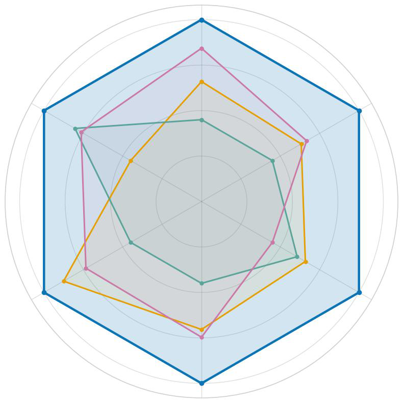
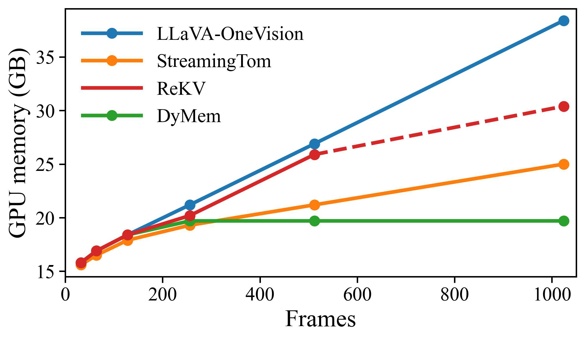

# Towards a Dynamic and Fixed-budget Memory Bank for Efficient Streaming Video Understanding

- 标题：Towards a Dynamic and Fixed-budget Memory Bank for Efficient Streaming Video Understanding
- 作者：Baiyang Song, Yuli Lin, Qiong Wu, Tao Chen, Jun Peng, Xiao Chen, Yiyi Zhou, Rongrong Ji
- arXiv：2606.25658v1
- 链接：http://arxiv.org/abs/2606.25658v1
- 代码状态：论文在摘要中声明代码位于 https://github.com/hktk07/CausalMem（见 PAGE 1），但当前无法确认该仓库可公开访问；因此本文不提供源码代码段，并标注为“证据不足”。本文未提供可确认的公开代码。
- 报告依据：PDF 全文与摘要；文本抽取状态为 fulltext:pypdf。

## 摘要

本文提出 CausalMem，一种面向流式视频理解（streaming video understanding）的训练无关（training-free）视觉记忆压缩方法。其目标不是为整段视频做离线压缩，而是在严格因果条件（strict causality）下维护一个动态但固定预算的视觉记忆库（dynamic and fixed-budget visual memory bank），使多模态大语言模型（Multimodal Large Language Models, MLLMs）在视频帧持续到来时仍能控制 token 数量、存储开销和推理成本（见 PAGE 1-3）。

一句话总结：CausalMem 用在线语义基（online semantic basis）估计视觉 token 的冗余度，并结合时间近因性（temporal recency）更新固定长度记忆库，从而在流式和离线视频理解基准上同时提升准确率与效率（见 PAGE 3-6）。

核心结论有三点。第一，论文将流式视频理解的瓶颈明确建模为“无限增长的视频 token”与“未来内容和问题不可预知”之间的矛盾，而不是单纯的长上下文问题（见 PAGE 1-2）。第二，CausalMem 不依赖模型训练，也不依赖问题到来后的文本引导检索，而是以在线方式维护一组语义主方向，用残差估计 token 是否提供新信息（见 PAGE 3-5）。第三，实验显示该方法在 LLaVA-OneVision 与 Qwen2.5-VL 上均有效；在流式设置中，LLaVA-OneVision 的 OVO-Bench 平均分由 62.6 提升到 65.7，StreamingBench 平均分由 71.1 提升到 74.3（见 PAGE 6）。

需要注意的是，论文的贡献边界也很清楚：CausalMem 是一个视觉记忆选择与更新机制，而不是新的 MLLM 主干模型；其效果仍然受底层 MLLM 的视觉感知、时序推理和指令跟随能力影响。这一点也被作者在 Limitations 中明确承认（见 PAGE 13）。

## 背景与动机

流式视频理解要解决的问题是：当视频帧不断输入、用户问题可能在任意时刻出现时，MLLM 如何在有限上下文和有限显存条件下保留足够多的视觉信息。离线视频理解可以先看到完整视频，再做全局采样、token pruning 或 token merging；流式场景则不能访问未来帧，也不能预先知道用户最终会问什么（见 PAGE 1-3）。

论文首先指出，现有 MLLM 在视频任务上已经取得进展，但长视频会导致视觉 token 线性增长。例如，LLaVA-OneVision 在 1 FPS 采样的两小时视频中需要处理超过 700k 个视觉 token，这会带来显著的计算和存储负担（见 PAGE 1）。这说明瓶颈不只是语言模型上下文长度，而是视觉 token 在进入语言模型前已经形成了高成本表示。

现有高效视频理解方法大体可分为两类。第一类是离线视觉 token 压缩，例如基于全局冗余、空间时间结构或查询相关性进行 token 剪枝或合并；这类方法通常需要完整视频或提前知道问题，因此不适合在线流式输入（见 PAGE 2-3）。第二类是 KV cache 压缩或流式记忆方法，例如 StreamMem、ReKV、LiveVLM、FluxMem 和 StreamingTOM；这些方法缓解了记忆增长，但可能依赖局部冗余、查询检索或额外 KV-cache 操作，未必能直接维护一个固定大小的视觉 token 记忆库（见 PAGE 3）。

CausalMem 的出发点是把问题重新定义为固定预算记忆库维护：在每个时间步只看到当前和历史帧，且不知道未来视频内容与未来问题的情况下，系统需要选择哪些视觉 token 写入记忆、哪些 token 删除。论文将其称为“strict causality”，即更新过程不能利用未来帧或未来问题信息（见 PAGE 3）。

用途：下图用于说明论文给出的总体主张，即 CausalMem 在流式和离线视频理解基准上相对现有视觉压缩方法取得更好结果，并强调固定大小记忆库的工程意义。

读图要点：Figure 1 的第一部分展示了 CausalMem 与若干视频压缩或流式方法在多个基准上的比较。图中不是方法细节，而是结果层面的概览，用来支撑“固定预算视觉记忆库不是只牺牲性能换效率”的判断（见 PAGE 2）。

用途：下图用于说明 CausalMem 与 OOM、CPU offload、quantization 等处理不断增长 token 的策略之间的差异：它直接把视觉记忆约束在固定大小。

读图要点：图中“Fixed-size Memory (Ours)”强调 CausalMem 的关键工程假设：流式视频系统必须使计算与存储开销有上界。它支撑的判断是，CausalMem 的问题设定比一般离线压缩更贴近长期在线视频处理（见 PAGE 2）。

## 预备知识

MLLM 视频问答通常可写成条件生成问题。给定视频 $V$ 与问题 $Q$，模型生成答案序列 $Y=\{y_1,\ldots,y_L\}$，其中 $L$ 表示答案长度，$G$ 表示 MLLM 的生成器，$Y_{<i}$ 表示第 $i$ 个词之前的答案前缀。论文在 Eq. (1) 中写作：

$$
p(Y|V,Q)=\prod_{i=1}^{L}p(y_i|G,V,Q,Y_{<i})
$$

这个公式的含义是：模型每生成一个词，都条件化于生成器、视频表示、问题和已经生成的前文；视频 token 越多，后续推理成本越高（见 PAGE 3）。

CausalMem 将完整视频 token 表示 $V$ 替换为固定预算记忆库 $M$。其中 $M\in\mathbb{R}^{b\times d}$，$b$ 是记忆库 token 数上限，$d$ 是视觉 token 特征维度。论文在 Eq. (2) 中将生成目标改写为：

$$
p(Y|V,Q)=\prod_{i=1}^{L}p(y_i|G,M,Q,Y_{<i})
$$

人话解释：模型不再把所有视觉 token 交给语言模型，而是只把固定长度的记忆库 $M$ 作为视频证据输入；因此核心问题变成如何在线维护 $M$（见 PAGE 3）。

理解 CausalMem 还需要两个线性代数概念。奇异值分解（Singular Value Decomposition, SVD）用于从第一帧 token 中提取主要语义方向；QR 分解（QR decomposition）用于把新增候选语义方向正交化，避免语义基向量之间重复。论文使用这些操作维护在线语义基 $B_t\in\mathbb{R}^{q_t\times d}$，其中 $q_t\le q$，$q$ 是语义基向量数量上限（见 PAGE 3-5）。

## 方法详解

### 1. 总体框架：固定预算记忆库与在线语义基

CausalMem 的核心机制由两个状态变量构成：在线语义基 $B_t$ 与视觉记忆库 $M_t$。$B_t$ 用来建模截至第 $t$ 个时间步已经观察到的视频主语义，$M_t$ 用来存储真正交给 MLLM 的视觉 token。前者是判断 token 冗余度的参照系，后者是最终保留的信息载体（见 PAGE 3-5）。

用途：下图用于展示 CausalMem 的方法全貌，包括视频帧编码、在线语义基更新、视觉记忆库更新、残差估计和 token 保留/删除。

读图要点：Figure 2 把 CausalMem 的关键动作串在一起：新帧进入视觉编码器与投影器后，token 会被投影到语义基张成的子空间；残差小表示更冗余，残差大表示包含较多新语义。该图支撑的判断是，CausalMem 的 token 选择不是简单 FIFO 或均匀采样，而是基于语义残差信号（见 PAGE 4）。

用途：下图用于补充 Figure 2 中“projection / residual / retain / remove”的几何解释。

读图要点：图中 token 到 $\text{span}(B)$ 的投影反映其可被现有语义基解释的部分，残差反映新信息。支撑的判断是：CausalMem 用残差范数作为 token 新颖性与非冗余性的代理指标（见 PAGE 4）。

### 2. 初始化在线语义基：用 SVD 提取第一帧主语义

设第 $t$ 帧的视觉 token 为 $X_t\in\mathbb{R}^{N\times d}$，其中 $N$ 是每帧 token 数，$d$ 是特征维度。第一帧到来时，CausalMem 对 $X_1$ 做紧凑 SVD，论文 Eq. (3) 写作：

$$
X_1\approx U_1\Sigma_1W_1^\top
$$

人话解释：$U_1$ 描述 token 维度的变化，$\Sigma_1$ 中的奇异值表示各主成分的重要性，$W_1^\top$ 给出特征空间中的主要语义方向（见 PAGE 4）。

随后，方法保留前 $q_1$ 个右奇异向量，并初始化语义基：

$$
B_1=W_1=[w_1,w_2,\ldots,w_{q_1}]\in\mathbb{R}^{q_1\times d}
$$

这里 $w_i\in\mathbb{R}^{d}$ 是第 $i$ 个语义基向量。人话解释：第一帧被用来建立最初的语义坐标系，后续帧的 token 是否“新”都要相对这个坐标系来判断（见 PAGE 4）。

### 3. 残差估计：用语义基判断 token 冗余

当第 $t$ 帧到来时，CausalMem 将当前帧 token $X_t$ 投影到上一时刻语义基 $B_{t-1}$ 张成的子空间，并重构为：

$$
\hat{X}_t=X_tB_{t-1}^{\top}B_{t-1}
$$

人话解释：$\hat{X}_t$ 表示“如果只用历史主语义来解释当前帧 token，能够解释出什么”。如果一个 token 可以被很好重构，它对记忆库的新信息贡献较低（见 PAGE 4）。

残差矩阵定义为：

$$
R_t=X_t-\hat{X}_t
$$

进一步地，第 $i$ 个 token 的残差范数为：

$$
e_{t,i}=\|R_{t,i}\|_2
$$

人话解释：$e_{t,i}$ 越大，说明当前 token 中有越多无法被历史语义基解释的内容，因此越可能包含新语义、越不冗余。论文明确把较大残差与“more novel and informative semantics”关联起来（见 PAGE 4）。

### 4. 语义基更新：新增语义方向但保持预算

为了让语义基适应视频流变化，CausalMem 从当前帧中选择残差较大的 top-k token 作为候选 token，形成 $X_t^{cand}\in\mathbb{R}^{k\times d}$。然后去掉候选残差中已经被旧语义基捕获的部分：

$$
\hat{R}_t=R_t^{cand}(I_d-B_{t-1}^{\top}B_{t-1})
$$

其中 $I_d\in\mathbb{R}^{d\times d}$ 是单位矩阵。人话解释：这一步只保留相对旧语义基真正“新增”的方向，避免把已有语义重复加入语义基（见 PAGE 4）。

随后，CausalMem 对 $\hat{R}_t$ 做 QR 分解：

$$
\hat{R}_t=\bar{Q}_t\bar{R}_t
$$

人话解释：$\bar{Q}_t$ 提供正交化后的新语义方向，使新增基向量与旧基向量不重复；Appendix B 进一步证明该更新保持行正交性（见 PAGE 4, PAGE 13-14）。

语义基与活跃度分数的拼接更新为：

$$
B'_t=[B_{t-1},\bar{Q}_t],\quad s'_t=[s_{t-1},\bar{s}_t]
$$

这里 $s_t$ 是 basis activity score，用于记录各语义基向量近期被使用的频率。人话解释：CausalMem 不只是添加新方向，还会记录每个方向在最近视频流中是否仍然活跃（见 PAGE 4-5）。

### 5. 活跃度分数：在历史稳定性与当前适应性之间折中

对于第 $j$ 个语义基向量 $B_{t,j}$，论文定义当前帧上的瞬时活跃度：

$$
a_{t,j}=\frac{1}{N}\sum_{i=1}^{N}|B_{t,j}X_{t,i}^{\top}|
$$

人话解释：如果当前帧中很多 token 都与某个语义基方向有较强响应，那么该方向在当前时刻是活跃的（见 PAGE 5）。

随后用指数滑动平均更新活跃度分数：

$$
s_{t,j}=\gamma s_{t-1,j}+(1-\gamma)a_{t,j}
$$

其中 $\gamma\in[0,1]$ 是平滑因子。人话解释：$s_{t,j}$ 既考虑历史使用频率，也考虑当前帧响应；这避免了只看历史导致适应慢，也避免了只看当前导致快速遗忘（见 PAGE 5）。

当语义基数量超过上限 $q$ 时，CausalMem 保留活跃度最高的 $q$ 个基向量：

$$
B_t\leftarrow B'_t(J_t),\quad s_t\leftarrow s'_t(J_t),\quad
J_t=\arg\max_{|J|=q}\sum_{j\in J}s_{t,j}
$$

人话解释：语义基本身也有固定预算，系统只保留近期最有代表性的语义方向，从而使冗余估计保持有界和动态（见 PAGE 5）。

### 6. 动态视觉记忆库：冗余度与时间近因性的联合选择

视觉记忆库 $M_t\in\mathbb{R}^{b_t\times d}$ 存储最终要交给 MLLM 的视觉 token，其中 $b_t\le b$，$b$ 是固定预算。每来一帧，CausalMem 先把当前帧 token 插入旧记忆库，得到临时记忆库 $M'_t=[M_{t-1},X_t]$；若 $|M'_t|>b$，就基于语义基进行压缩（见 PAGE 5）。

对临时记忆库中的 token $x_i$，CausalMem 先计算其相对语义基的残差，并做归一化：

$$
\tilde{e}_i=\frac{e_i-e_{\min}}{e_{\max}-e_{\min}+\epsilon},
\quad
e_i=\|x_i-x_iB_t^\top B_t\|_2
$$

其中 $\epsilon$ 是防止除零的小常数。人话解释：$\tilde{e}_i$ 是归一化后的非冗余分数，越高说明该 token 越不能被现有语义基解释，越值得保留（见 PAGE 5）。

除了冗余度，CausalMem 还加入时间近因性：

$$
f_i=(1-\alpha)\tilde{e}_i+\alpha\tilde{\tau}_i,
\quad
\tilde{\tau}_i=\frac{t_i+1}{t+1}
$$

这里 $t_i$ 是 token 来源帧的时间戳，$\alpha$ 控制冗余分数与时间近因分数的权衡。人话解释：流式场景下，最新帧往往更可能与即将到来的问题相关；因此记忆库不仅要保留“新语义”，也要保留“近期内容”（见 PAGE 5）。

最终，CausalMem 保留得分最高的 $b$ 个 token：

$$
M_t\leftarrow M'_t(O_t),
\quad
O_t=\arg\max_{|O|=b}\sum_{i\in O}f_i
$$

人话解释：记忆库每次超预算时都会删除低分 token，使 $M_t$ 始终维持固定长度，同时尽量保存非冗余且近期的视觉信息（见 PAGE 5）。

当问题 $Q$ 到来时，模型基于当前记忆库生成答案：

$$
p(Y|M_t,Q)=\prod_{i=1}^{L}p(y_i|G,M_t,Q,Y_{<i})
$$

人话解释：问题到来时不需要重新处理完整视频历史，而是直接使用已经维护好的固定预算视觉记忆库进行回答（见 PAGE 6）。

### 7. 与既有方法的关键差异

CausalMem 与离线 token pruning 的差异在于，它不需要访问完整视频，也不需要未来帧信息；与 query-aware retrieval 的差异在于，它不依赖用户问题预先可得；与 KV cache compression 的差异在于，它主要维护视觉 token 记忆库，而不是仅压缩语言模型内部的 key-value cache（见 PAGE 2-3）。

论文方法的一个重要设计是“在线语义基 + 固定视觉记忆库”的双预算结构。语义基预算 $q$ 控制冗余估计参照系的复杂度，记忆库预算 $b$ 控制最终输入 MLLM 的视觉 token 数。实验中，LLaVA-OneVision 使用 12k token 预算，Qwen2.5-VL 使用 6k token 预算，语义基最大数量设为 $q=64$，每帧用于更新基的候选 token 数设为 $m=8$（见 PAGE 6）。

代码分析方面，论文声称代码链接为 CausalMem，但当前没有可确认的公开仓库内容可供审查。由于无法读取 README、核心源码文件和配置文件，本文不写代码段，也不建立论文公式与源码函数之间的对应关系。证据不足；本文未提供可确认的公开代码。

## 实验分析

### 1. 实验设置

论文在流式与离线两类视频理解基准上评估 CausalMem。流式基准包括 OVO-Bench 与 StreamingBench，分别关注 timestamp-aware streaming reasoning 与 continuous long-form video comprehension；离线基准包括 Video-MME、LongVideoBench、MLVU 与 LVBench，覆盖从短视频到 1-2 小时极长视频的理解任务（见 PAGE 6）。

模型方面，论文将 CausalMem 应用于 LLaVA-OneVision 与 Qwen2.5-VL。流式基准中所有视频采样为 0.5 FPS；离线基准中，LLaVA-OneVision 对 30 分钟以下视频采用 0.5 FPS，对更长视频采用 0.2 FPS；Qwen2.5-VL 统一采用 1 FPS。实现参数为：LLaVA-OneVision 视觉 token 预算 $b=12k$，Qwen2.5-VL 预算 $b=6k$，语义基数量 $q=64$，每帧候选 token 数 $m=8$，平滑因子 $\gamma=0.9$，流式场景中 $\alpha=0.8$，离线评估中关闭 temporal score（见 PAGE 6）。

### 2. 流式基准结果

| 方法 | 帧设置 | OVO-Bench Avg | StreamingBench Avg | 证据 |
|---|---:|---:|---:|---|
| LLaVA-OneVision | 32 frames | 62.6 | 71.1 | Table 1, PAGE 6 |
| VisionZip | 0.5 FPS | 63.7 | 71.6 | Table 1, PAGE 6 |
| ReKV | 0.5 FPS | 57.3 | 69.1 | Table 1, PAGE 6 |
| LiveVLM | 0.5 FPS | 61.6 | 72.9 | Table 1, PAGE 6 |
| StreamingTOM | 0.5 FPS | 63.6 | 70.1 | Table 1, PAGE 6 |
| CausalMem | 0.5 FPS | 65.7 | 74.3 | Table 1, PAGE 6 |

表格解读：CausalMem 在两个流式基准上均取得最高平均分。相对 LLaVA-OneVision 基线，OVO-Bench 提升 3.1 个百分点，StreamingBench 提升 3.2 个百分点；相对 StreamingTOM，StreamingBench 提升 4.2 个百分点。这个结果说明固定预算不必然意味着信息损失过大，关键在于记忆更新是否能保留非冗余且近期的 token（见 PAGE 6-7）。

论文还强调，CausalMem 在 OVO-Bench 的六个子任务中有五个达到训练无关方法中的最好结果，并在 Spatial Understanding 与 Future Prediction 等子任务上优于 StreamingTOM。该结果支持一个更细的判断：在线语义基并非只对静态背景去冗余有效，也能帮助保留与空间和未来状态推断相关的信息（见 PAGE 7）。

### 3. 离线基准结果

| 方法 | Tokens | Video-MME | MLVU | LongVideoBench | LVBench | Avg | 证据 |
|---|---:|---:|---:|---:|---:|---:|---|
| LLaVA-OneVision | 6k | 58.5 | 64.7 | 56.5 | 38.4 | 54.5 | Table 2, PAGE 7 |
| StreamingTOM | 12k | 59.9 | 67.9 | 56.4 | 40.5 | 56.2 | Table 2, PAGE 7 |
| CausalMem | 12k | 60.0 | 70.9 | 57.0 | 42.1 | 57.5 | Table 2, PAGE 7 |

表格解读：虽然 CausalMem 是按严格因果的流式方式处理视频，但在离线基准上仍优于 StreamingTOM 与 LLaVA-OneVision 基线。尤其在 MLVU 上，CausalMem 达到 70.9，比 StreamingTOM 高 3.0 个百分点；在 LVBench 上达到 42.1，比 StreamingTOM 高 1.6 个百分点。这说明它保留的信息不只服务于在线短时回答，也能支持较长视频的综合理解（见 PAGE 7）。

这里需要谨慎解释：离线基准结果并不意味着 CausalMem 比所有离线全局压缩方法都更优。Table 2 比较的是若干 streaming methods 在严格因果设置下的表现，论文重点在于证明 CausalMem 的流式记忆机制具有跨场景鲁棒性，而不是宣称它在所有离线压缩设定中绝对最优（见 PAGE 7）。

### 4. 与先进 Video-MLLM 的比较

| 方法 | OVO-Bench | StreamingBench Avg | 证据 |
|---|---:|---:|---|
| Gemini 1.5 Pro | 69.3 | 75.7 | Table 3, PAGE 7 |
| GPT-4o | 64.5 | 73.3 | Table 3, PAGE 7 |
| TimeChat-Online | 61.4 | 75.3 | Table 3, PAGE 7 |
| LLaVA-OneVision | 62.6 | 71.3 | Table 3, PAGE 7 |
| LLaVA-OneVision + CausalMem | 65.7 | 74.3 | Table 3, PAGE 7 |
| Qwen2.5-VL | 未报告 | 73.9 | Table 3, PAGE 7 |
| Qwen2.5-VL + CausalMem | 67.8 | 76.9 | Table 3, PAGE 7 |

表格解读：CausalMem 作为 plug-and-play 方法，在 Qwen2.5-VL 上把 StreamingBench 平均分从 73.9 提升到 76.9，并在该表中超过 GPT-4o 的 73.3 与 Gemini 1.5 Pro 的 75.7。这个比较不能简单解读为“CausalMem 模型强于闭源大模型”，因为基础模型、帧设置和评测调用条件不同；更稳妥的结论是，固定预算记忆机制能显著改善开源 MLLM 的流式视频表现（见 PAGE 7-8）。

### 5. 效率分析

论文 Figure 3 比较了推理时间、GPU 显存开销以及随输入帧数增加的推理时间变化。文本说明称，在 30 分钟视频、1 FPS、逐帧在线处理的设置中，CausalMem 同时具有最低的 GPU memory 与 inference time overhead，并且随着帧数增加，其推理时间增长最慢（见 PAGE 8）。

由于当前 figures 清单没有提供 Figure 3 的 markdown_path，本文不嵌入 Figure 3 图片；同时，文本抽取中的图内数值不够完整，因此不额外构造精确效率数据表。证据充足的是定性结论：CausalMem 的固定预算记忆设计降低了输入 MLLM 的 token 序列长度，并避免了 KV-cache retrieval 或 quantization 引入的额外开销（见 PAGE 8）。

### 6. 消融实验

| 消融对象 | 设置 | StreamingBench | OVO-Bench | MLVU | 证据 |
|---|---|---:|---:|---:|---|
| Basis size $q$ | 0 | 74.0 | 65.3 | 68.9 | Table 4(a), PAGE 8 |
| Basis size $q$ | 16 | 74.0 | 65.5 | 70.7 | Table 4(a), PAGE 8 |
| Basis size $q$ | 64 | 74.3 | 65.7 | 70.9 | Table 4(a), PAGE 8 |
| Basis size $q$ | 512 | 73.7 | 65.2 | 70.1 | Table 4(a), PAGE 8 |
| Basis update tokens $m$ | 4 | 74.1 | 65.5 | 70.7 | Table 4(b), PAGE 8 |
| Basis update tokens $m$ | 8 | 74.3 | 65.7 | 70.9 | Table 4(b), PAGE 8 |
| Token retention score | only redundancy | 74.0 | 65.3 | 60.2 | Table 4(d), PAGE 8 |
| Token retention score | only temporal | 71.8 | 65.1 | 70.9 | Table 4(d), PAGE 8 |
| Token retention score | both | 74.3 | 65.7 | 71.1 | Table 4(d), PAGE 8 |

表格解读：消融结果支持三个判断。第一，$q=64$ 是较合理的语义基规模；$q=0$ 表示不用在线语义基而直接基于记忆库估计冗余，在 MLVU 上下降到 68.9，说明语义基对长期语义覆盖有贡献。第二，$m=8$ 在三个基准上整体最稳，过多候选 token 可能引入噪声或过细粒度信息。第三，冗余分数与时间近因分数是互补的：只保留 temporal score 会损害 StreamingBench，只保留 redundancy score 会使 MLVU 明显下降；两者结合取得整体最佳表现（见 PAGE 8-9）。

### 7. 定性结果

论文 Figure 4 展示了输入视频帧与写入记忆库的视觉 token 可视化。文本说明称，CausalMem 倾向于丢弃冗余背景和重复视觉模式，同时保留显著物体、区别性场景区域和新出现的语义内容（见 PAGE 9）。由于当前 figures 清单没有提供 Figure 4 的 markdown_path，本文不嵌入该图。

Appendix C 进一步提供 Figure 5，展示 raw video frames 与对应 memory bank representations，支持“保持紧凑表示同时保留语义显著内容”的定性判断（见 PAGE 14-15）。同样，由于 figures 清单未提供 Figure 5 的 markdown_path，本文不输出不存在的图片路径。

## 讨论

CausalMem 的适用边界首先由问题设定决定：它最适合视频流不断输入、总时长可能很长、但系统必须限制视觉 token 数量的场景。例如长视频质检、事件理解、视频检索前的记忆压缩、在线监控摘要等任务，都符合“历史信息需要保留，但不能无限累积”的约束。论文中的 12k token 预算用于小时级视频时可达到超过 20 倍视觉 token 压缩比，并占用约 82 MB 存储，这一结果直接支撑其在成本控制场景中的价值（见 PAGE 1-2）。

方法论上，CausalMem 的关键价值是把流式视频压缩从“帧级采样”或“缓存级压缩”推进到“语义基驱动的 token 记忆更新”。它不要求问题提前到达，也不要求完整视频可见；因此比 query-aware retrieval 更适合未知问题的在线场景，比纯 FIFO 更能保留全局语义，比仅压缩 KV cache 更直接控制视觉输入长度（见 PAGE 2-5）。

不过，CausalMem 仍然没有解决所有流式视频理解问题。首先，它的 token 保留目标是 query-agnostic 的，也就是在不知道未来问题的情况下保留一般意义上的语义信息；如果未来问题依赖非常细粒度、低频但关键的视觉证据，残差与时间近因性未必总能保留该证据。其次，论文主要报告标准基准的平均准确率、部分效率结果和可视化结果；对业务长尾动作、监控视角、实时吞吐、端侧部署和多摄像头并发等问题，当前材料没有直接证据。

## 局限分析

作者自述的局限集中在对基础 MLLM 的依赖。Appendix A 明确指出，CausalMem 是训练无关方法，通过维护动态固定预算视觉记忆应用于已有 MLLM，因此性能自然受 backbone MLLM 的视觉感知、时序推理和指令跟随能力影响；未来工作包括适配更先进的 MLLM（见 PAGE 13）。这意味着 CausalMem 不能弥补基础模型本身看不懂视频、不会时序推理或不能遵循复杂指令的问题。

独立判断的第一点局限是，论文使用的冗余估计主要基于视觉 token 相对于在线语义基的残差。残差大通常表示新颖语义，但“新颖”不必然等于“对未来问题有用”；尤其在安全质检、异常检测或细粒度行为识别中，关键证据可能是短暂、局部、低频且不显著的视觉变化。论文的定量基准支持平均性能提升，但尚不能证明该策略对所有长尾事件都稳健（见 PAGE 4-9）。

独立判断的第二点局限是，效率分析虽显示 CausalMem 有最低推理时间和显存开销，但当前文本材料未给出完整、可复核的吞吐表格，也没有覆盖真实服务系统中的并发、延迟分位数、视频解码开销和跨设备部署。Figure 3 支持趋势判断，但不足以直接推导生产环境成本收益（见 PAGE 8）。因此，对视频团队而言，CausalMem 适合作为小规模验证方向，而不是可以直接替代检测、跟踪或业务规则引擎的完整方案。

代码层面也存在证据限制。论文摘要提供了 GitHub 链接，但当前无法确认仓库公开可访问；因此本文不能审查实现是否严格复现 Eq. (5)-(15)、是否存在近似实现、缓存优化、batch 处理差异或额外工程 trick。证据不足；本文未提供可确认的公开代码。

## 结论

CausalMem 的主要贡献在于，它将高效流式视频理解建模为严格因果条件下的固定预算视觉记忆维护问题，并提出“在线语义基 + 动态视觉记忆库”的训练无关解法。通过 SVD/QR 维护主语义方向，通过残差估计 token 冗余，通过时间近因性适配流式场景，CausalMem 在多个流式和离线视频理解基准上提升了 LLaVA-OneVision 与 Qwen2.5-VL 的表现（见 PAGE 3-9）。

从研究价值看，本文提供了一条比简单采样、离线全局压缩和 KV cache 压缩更贴近流式视频系统的路径。从工程价值看，它的固定 token 预算、训练无关特性和较低推理开销使其适合视频理解团队做低成本验证。但在落地前，仍需要补充对公开代码、真实业务长尾数据、实时吞吐、异常事件保留能力和不同 backbone MLLM 的系统评估。

## 证据索引

| 证据主题 | PAGE |
|---|---|
| 论文标题、作者、摘要、代码声明、12k token、20× compression、82 MB | PAGE 1 |
| 流式视频理解难点、两小时视频 700k visual tokens、Figure 1、固定大小记忆库动机 | PAGE 1-2 |
| 相关工作：离线 token compression、KV cache compression、query-aware retrieval 的限制 | PAGE 2-3 |
| MLLM 条件生成目标 Eq. (1)、记忆库目标 Eq. (2)、在线语义基定义 | PAGE 3 |
| Figure 2、SVD 初始化 Eq. (3)-(4)、投影与残差 Eq. (5)-(7)、QR 与 basis update Eq. (8)-(9) | PAGE 4 |
| 活跃度分数 Eq. (10)-(12)、视觉记忆库、冗余分数、retention score Eq. (13)-(15) | PAGE 5 |
| 回答生成 Eq. (16)、基准与实现设置、Table 1 流式结果 | PAGE 6 |
| Table 2 离线结果、Table 3 与先进 Video-MLLM 比较 | PAGE 7 |
| Figure 3 效率分析、Table 4 消融实验 | PAGE 8 |
| Figure 4 定性可视化与记忆库解释 | PAGE 9 |
| 结论 | PAGE 9-10 |
| 作者自述局限 | PAGE 13 |
| 在线语义基正交性证明 | PAGE 13-14 |
| Appendix C / Figure 5 定性可视化补充 | PAGE 14-15 |
| Algorithm 1 CausalMem 流程 | PAGE 16 |
