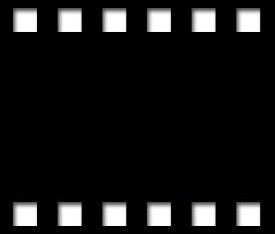
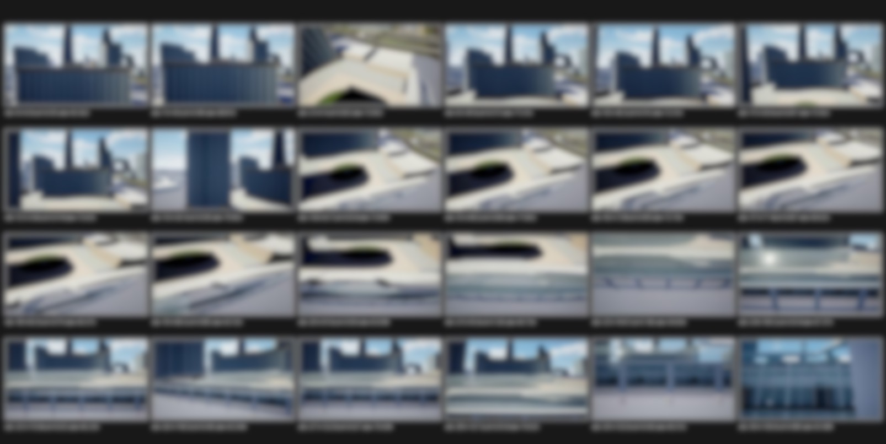
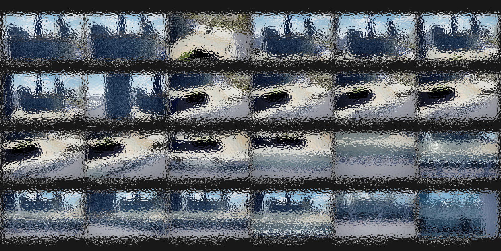

# Confidence-Aware Tool Orchestration for Robust Video Understanding

## 摘要

**论文元信息。** 本文标题为 *Confidence-Aware Tool Orchestration for Robust Video Understanding*，作者为 Yangfan He、Yujin Choi、Jaehong Yoon，arXiv ID 为 2606.26904，版本时间为 2026-06-25，类别为 cs.CV 与 cs.AI，论文链接为 http://arxiv.org/abs/2606.26904v1，PDF 链接为 https://arxiv.org/pdf/2606.26904v1。论文首页给出项目页 `https://rova-v2.github.io/`，并在结论与 broader impact 中声称释放代码和 checkpoints；但在当前提供材料中没有可确认的 GitHub 仓库链接，外部检索也未得到可确认源码仓库。因此，本文的代码状态按“**本文未提供可确认的公开代码**”处理，不贴源码段（见 PAGE 1、PAGE 11、PAGE 15）。

**一句话总结。** Robust-TO 将逐帧质量评估、置信度校准的工具调用、分层证据综合和 GRPO 训练结合起来，用显式的帧级可信度缓解 Video-LLM 在模糊、眩光、遮挡等真实退化下的“盲目信任问题”（见 PAGE 1、PAGE 2、PAGE 5、PAGE 6）。

本文的核心问题可概括为：现有 Video-LLM 通常把所有采样帧都当作同等可靠的证据，而 Robust-TO 要让模型先判断“哪些帧值得信任”，再决定“调用什么工具”，最后根据证据可靠性给出答案。论文称这一问题为 **Blind Trust Problem（盲目信任问题）**：每一帧被视作同等有信息量，每个感知输出被视作同等可靠，模型最终答案的置信度与视觉输入质量脱钩（见 PAGE 2）。

根据摘要与实验部分，Robust-TO 在 clean inputs 上达到 56.4% 平均准确率，超过最强开源 baseline 10.6 个百分点，并高于 Gemini-2.5-Pro 的 46.2%；在五类真实腐蚀下达到 54.3% 平均准确率，比最强开源 baseline 高 5.8 个百分点，且 clean-to-corrupted drop 最小（见 PAGE 1、PAGE 2、PAGE 7、PAGE 8）。

## 背景与动机

视频理解中的多模态大模型（Video Large Language Models, Video-LLMs）通常通过均匀采样或密集采样得到视频帧，再由视觉 backbone 编码后直接生成答案。这类范式在 Video-MME、MVBench、EgoSchema、NExT-QA 等 clean benchmark 上表现较强，但它默认视觉信号足够干净，并没有显式判断某一帧是否因为运动模糊、低光、眩光或遮挡而不可靠（见 PAGE 1、PAGE 2）。

论文指出，真实视频并不总是干净的。驾驶记录仪、监控、无人机、室内导航和 forensic video analysis 常会遇到 smudged windshield、motion blur、glare、low-light noise、partial occlusion 等问题。此时模型如果仍把退化帧当成可靠证据，错误就会以“看似有根据”的方式进入推理链路。作者将这种风险称作 silent failure：模型准确率下降，但自报置信度不随视觉质量下降而同步变化（见 PAGE 1、PAGE 2）。

这个动机与视频分析链路的工程实践高度相关。检测、跟踪、OCR、动作识别等工具本身都会输出局部证据，但如果下游事件理解模块不知道证据来自清晰帧还是污染帧，就很容易把“高相似度但低质量”的帧当成关键证据。例如论文 case study 中，标准 Video-LLM 在 dashcam 场景里受 motion blur 与 occlusion 影响，将车牌错误识别为 “B8C-394”；Robust-TO 则排除遮挡帧，使用较干净的 f14、f18、f19 进行 OCR，得到正确车牌 “B-7742-XK”（见 PAGE 10）。

相关工作可以分成三类。第一类是标准 Video-LLM，例如 LLaVA-OneVision、InternVL、Qwen2/2.5-VL、Video-LLaVA，它们主要改进视频时序建模、动态 FPS、窗口注意力或长视频输入，但不显式建模帧级可靠性（见 PAGE 2）。第二类是 agentic and tool-augmented video reasoning，例如 VideoAgent、memory-augmented agent、Graph-VideoAgent，它们可以迭代选择证据，但工具接口通常只返回“发现了什么”，不返回“有多可靠”（见 PAGE 2、PAGE 3）。第三类是 reinforcement learning for multimodal reasoning，例如 Video-R1、DeepVideo-R1、VideoChat-R1，它们引入 GRPO 或时序奖励，但奖励多聚焦答案正确性或时序顺序，并未把视觉质量纳入工具成本与推理置信度（见 PAGE 3）。

Robust-TO 的出发点是把帧级质量从隐变量变成显变量。它不是替换检测器、OCR 或动作识别器，而是建立一个统一证据接口：每个工具返回 `(result, confidence)`，其中 `result` 是框、轨迹、文本或动作标签等具体预测，`confidence` 是工具自身置信度与输入帧可靠性的乘积。由此，视觉质量既影响帧选择，也影响工具路由，还影响最终答案综合与 GRPO 训练奖励（见 PAGE 2、PAGE 5、PAGE 6）。

## 预备知识

**Video-LLM 与工具增强推理。** 标准 Video-LLM 将视频帧编码为视觉 token，并与文本 query 一起输入语言模型。工具增强推理（tool-augmented reasoning）则把部分感知任务外包给专门工具，例如 `detect_objects` 做目标检测，`track_temporal` 做轨迹跟踪，`read_text` 做 OCR，`recognize_action` 做动作识别。Robust-TO 继承这种工具化思想，但它要求所有工具遵循统一的 `(result, confidence)` 证据格式（见 PAGE 5、PAGE 16）。

**帧级扰动分数。** 论文用 disturbance score（扰动分数）表示一帧的退化程度。设 $f_i$ 表示第 $i$ 帧，$d(f_i)$ 越高表示该帧越不可信。论文聚焦三类可由信号统计估计的退化：blur（模糊）、brightness deviation（亮度偏离）与 occlusion（遮挡）。这三类覆盖 motion/defocus blur、glare、under/overexposure 与物理遮挡等常见现实退化（见 PAGE 4、PAGE 18）。

**GRPO。** Group Relative Policy Optimization（GRPO）是一种不使用 value network、通过组内归一化 reward 估计 advantage 的强化学习方法。Robust-TO 用 GRPO 训练 host VLM，使其学习何时分解 query、调用哪些工具、如何综合不同置信度证据。与只奖励答案正确性的 RL 不同，本文 reward 同时包含 correctness、confidence-cost、sub-query efficiency 与 format 四项（见 PAGE 3、PAGE 6、PAGE 17）。

## 方法详解

### 1. 问题形式化：把真实退化建模为未知帧级扰动

论文首先把 clean video 记为 $V=\{f_1,\ldots,f_N\}$，其中 $N$ 是视频帧数；模型实际观测到的是可能被扰动的视频流 $\tilde{V}=\{\tilde{f}_1,\ldots,\tilde{f}_N\}$。第 $i$ 帧的观测形式为：

$$
\tilde{f}_i = D_i(f_i,\delta_i), \quad D_i:\mathcal{X}\times[0,1]\rightarrow \mathcal{X}, \quad i=1,\ldots,N.
$$

这里，$D_i$ 表示第 $i$ 帧可能受到的未知退化函数，$\delta_i\in[0,1]$ 表示退化严重程度，$\delta_i=0$ 表示无退化，$\delta_i=1$ 表示信息完全丢失。这个公式的含义是：系统不知道每一帧被什么类型的噪声污染，也不知道污染程度，只能从观测像素中估计可信度（见 PAGE 3）。

由此，Robust-TO 的目标不仅是回答 query $q$，而是同时满足两项约束：第一，从像素本身无监督地推断每帧可信度；第二，让证据获取与推理过程都受这些可靠性信号约束，避免最终结论建立在严重退化帧之上（见 PAGE 3、PAGE 4）。

### 2. Frame Selection via Quality Profiling：先判断帧是否值得信任

Robust-TO 的第一阶段是 quality profiling（质量画像）。论文定义每帧的 aggregate disturbance score 为三类扰动的均值：

$$
d(f_i)=\operatorname{mean}\bigl(d_{\text{blur}}(f_i), d_{\text{bright}}(f_i), d_{\text{occl}}(f_i)\bigr).
$$

其中，$d_{\text{blur}}$ 表示模糊程度，$d_{\text{bright}}$ 表示亮度偏离，$d_{\text{occl}}$ 表示遮挡或缺少有效边缘结构的程度。这个公式的直观含义是：一帧是否可靠，不由单一质量指标决定，而由模糊、亮度、遮挡三个通道共同刻画；三个分量会在视频内做 min-max normalization，使不同通道可比较（见 PAGE 4）。

更具体地，论文在附录 C 给出 blur score：

$$
d_{\text{blur}}(f_i)=1-\min\left(1,\frac{\operatorname{Var}(\nabla^2 f_i^{\text{gray}})}{\tau_{\text{blur}}}\right).
$$

这里，$\nabla^2 f_i^{\text{gray}}$ 是灰度帧的 Laplacian，$\operatorname{Var}$ 是方差，$\tau_{\text{blur}}=500$ 是归一化常数。人话解释：清晰图像通常有更多高频边缘，Laplacian 方差较高，因此 $d_{\text{blur}}$ 较低；模糊图像边缘变平，方差降低，扰动分数升高（见 PAGE 18）。

亮度扰动定义为：

$$
d_{\text{bright}}(f_i)=2\left|\mu_{\text{lum}}(f_i)-0.5\right|.
$$

其中，$\mu_{\text{lum}}(f_i)\in[0,1]$ 是 HSV 空间 V channel 的平均亮度。这个公式表达的是：过暗和过亮都不可靠，中性亮度 0.5 附近最可靠；这正对应低光与眩光两类相反但同样有害的真实退化（见 PAGE 18）。

遮挡或有效结构缺失分数定义为：

$$
d_{\text{occl}}(f_i)=1-\frac{|\{p:G(p)>\tau_{\text{edge}}\}|}{H\times W},
$$

其中，$G(p)=\sqrt{G_x(p)^2+G_y(p)^2}$ 是 Sobel gradient magnitude，$H\times W$ 是帧分辨率，$\tau_{\text{edge}}=30$ 是边缘阈值。这个公式的含义是：如果一帧中有意义边缘像素较少，大面积区域可能被遮挡或缺少信息，$d_{\text{occl}}$ 会升高（见 PAGE 18）。

### 3. Reliability-Relevance Score：不是选最相关帧，而是选“可靠且相关”的帧

在得到 $d(f_i)$ 后，Robust-TO 用 `select_frames` 工具对候选帧排序。论文定义 reliability-relevance score：

$$
s(f_i)=(1-d(f_i))\cdot \operatorname{sim}(\phi(f_i),\psi(q)), \quad f_i\in\mathcal{F}.
$$

这里，$1-d(f_i)$ 是 frame reliability，$\operatorname{sim}(\phi(f_i),\psi(q))$ 是帧表征 $\phi(f_i)$ 与 query 表征 $\psi(q)$ 的余弦相似度，$\mathcal{F}$ 表示可靠性与 query relevance 都超过阈值的有效帧集合。这个公式的关键是乘法：一帧即使与问题高度相关，只要质量差，也会被降权；一帧即使很清晰，只要与问题无关，也不会进入关键证据集合（见 PAGE 5）。

论文设置 $K\in[4,12]$，由 host VLM 根据 query complexity 自适应选择 top-$K$ trustworthy frames。主文实验显示 key-frame selector 将平均处理帧数从 32 降到 20.7，同时准确率提高 1.6 个百分点，训练时间和单样本推理时间均明显下降（见 PAGE 2、PAGE 5、PAGE 9）。

### 4. Confidence-Guided Tool Routing：根据子问题语义与退化类型选择工具

Robust-TO 在选帧后，会将原始 query $q$ 分解为 atomic sub-queries $\{sq_1,\ldots,sq_m\}$。每个 sub-query 对应单一感知原语，例如 object localization、motion analysis、OCR 或 attribute recognition。论文强调该分解由 in-context instructions 生成，不依赖专门 parser（见 PAGE 5）。

路由分两步。第一步按 sub-query 语义类型选择候选工具：空间问题对应 `detect_objects`，时序问题对应 `track_temporal` 或 `recognize_action`，文本问题对应 `read_text`。第二步按选中帧的平均 disturbance profile $\bar{d}=(\bar{d}_{\text{blur}},\bar{d}_{\text{bright}},\bar{d}_{\text{occl}})$ 选择更适合当前退化的工具。例如 blur 主导时，controller 更偏向 `caption_frame`，因为 captioning 对边界模糊更宽容；而 `detect_objects` 更依赖清晰边界（见 PAGE 5、PAGE 20）。

论文给出的工具库包括 `assess_quality`、`select_frames`、`retrieve_frames`、`detect_objects`、`caption_frame`、`track_temporal`、`recognize_action`、`read_text`。这些工具的 normalized wall-time cost 从 0.10 到 0.70 不等，其中 `track_temporal` 成本最高，`assess_quality` 成本最低（见 PAGE 16）。

### 5. Unified Evidence Interface：把工具输出校准为 `(result, confidence)`

每次工具调用返回 $(r_j,c_j)$，其中 $r_j$ 是感知结果，$c_j$ 是校准置信度。论文定义：

$$
(r_j,c_j)=T_j(F_j,sq), \quad c_j=c^{\text{intrinsic}}_j\times\rho(F_j).
$$

这里，$T_j$ 是第 $j$ 次工具调用，$F_j$ 是该工具输入的帧集合，$sq$ 是子问题，$c^{\text{intrinsic}}_j$ 是工具内在置信度，$\rho(F_j)$ 是输入帧集合的可靠性。这个公式的意义是：工具自己很确信还不够；如果工具输入来自低质量帧，最终 confidence 必须被降低（见 PAGE 5）。

$\rho(F_j)$ 采用 conservative mean，即对可靠性最低的三分之一帧求平均：

$$
\rho(F_j)=\frac{1}{\lceil n/3\rceil}\sum_{f\in F_{j,\text{lowest}}}\bigl(1-d(f)\bigr), \quad n=|F_j|.
$$

其中，$F_{j,\text{lowest}}$ 表示 $F_j$ 中可靠性最低的 $\lceil n/3\rceil$ 帧。这个 worst-K 聚合的含义是：只要输入帧集合中有相当一部分严重退化，就不允许少数干净帧掩盖问题。消融实验显示，去掉 $\rho(F_j)$ 会使平均准确率从 50.7% 降到 43.1%；将 worst-K 改成 uniform mean 也会降到 47.4%（见 PAGE 5、PAGE 9）。

### 6. Reliability-Aware Evidence Synthesis：高置信证据主导，中低置信证据受约束

在所有 sub-query 被处理后，host VLM 不直接拼接工具输出，而是将 evidence set $I=\{(r_j,c_j,F_j,\{d(f)\}_{f\in F_j})\}_j$ 分成 high、medium、low 三个 reliability tiers。High-tier evidence 用于形成 preliminary conclusion；medium-tier evidence 只有在与 preliminary conclusion 一致时才保留；low-tier evidence 只有当没有 high-tier evidence 时才作为 fallback，并且最终答案要显式标注不确定性（见 PAGE 5、PAGE 6）。

这个三层机制使 Robust-TO 与普通 tool-augmented pipeline 区分开来。普通工具链可能把所有 tool result 当作同等文本上下文输入 VLM；Robust-TO 则把 evidence 的来源帧、扰动分数与校准置信度都带入综合阶段。论文在 Figure 2 中把该流程概括为：quality profiling + frame selection、confidence-guided tool routing、reliability-aware evidence synthesis、GRPO training（见 PAGE 4）。

### 7. Confidence-Cost Reward：训练模型在置信度和成本之间权衡

Robust-TO 用 GRPO 训练 host VLM。对每次工具调用，论文定义 confidence-cost reward：

$$
R_{\text{cc}}(c_j,T_j)=c_j-\lambda\cdot \operatorname{cost}(T_j).
$$

这里，$\operatorname{cost}(T_j)$ 是工具运行时间相对 `caption_frame` 的归一化成本，$\lambda=0.5$ 是成本权重。这个公式要求模型不要无条件调用最贵工具：高置信度有价值，但昂贵工具只有在能带来足够可靠证据时才值得调用（见 PAGE 6、PAGE 15、PAGE 16）。

对完整 trajectory $\tau$，confidence-cost reward 取所有工具调用的平均：

$$
R_{\text{cc}}^{\text{total}}(\tau)=\frac{1}{N_{\text{call}}}\sum_{k=1}^{N_{\text{call}}}R_{\text{cc}}(c_{j_k},T_{j_k}).
$$

其中，$N_{\text{call}}$ 是工具调用总数，$j_k$ 是第 $k$ 次工具调用的全局索引。这个平均化设计避免单次昂贵工具调用支配整条轨迹 reward，同时让每个调用都受 confidence-cost trade-off 约束（见 PAGE 6）。

### 8. Sub-Query Efficiency Reward 与总奖励

论文还引入 question-dependent optimal number of sub-queries $m^*$，由冻结的 VLM $\pi_{\text{est}}$ 估计。训练目标希望实际分解数 $m$ 不低于必要复杂度，也不超过太多；过少会漏掉证据，过多会浪费工具调用并引入噪声。论文称 $R_{\text{subq}}=R_{\text{min-sq}}+R_{\text{qual}}(\tau)$，但主文截取材料没有完整展示 $R_{\text{min-sq}}$ 与 $R_{\text{qual}}$ 的公式细节；因此这里对这两个子项只能做文字解释，公式证据不足（见 PAGE 6）。

总 reward 定义为：

$$
R_{\text{total}}=R_{\text{acc}}+w\bigl(R_{\text{subq}}+R_{\text{cc}}^{\text{total}}+R_{\text{fmt}}\bigr).
$$

其中，$R_{\text{acc}}\in\{-1,+1\}$ 表示答案是否正确，$R_{\text{fmt}}\in\{0,1\}$ 表示输出格式是否合规，$w=1/3$。这个公式说明 Robust-TO 的训练不是单纯追求答对，而是在答对的同时鼓励可靠证据、低成本工具调用和合理 query decomposition（见 PAGE 6、PAGE 15、PAGE 17）。

## 图示证据解读

**用途。** 下图用于说明论文 Figure 1 中三类视频推理范式的对比：标准 Video-LLM、一般 agentic/tool-augmented video reasoning、Robust-TO。它支撑的判断是：Robust-TO 的差异不在于“也用了工具”，而在于工具调用前后都显式建模帧质量与证据置信度（见 PAGE 3）。

**读图要点。** Figure 1 的文字说明指出，现有方法要么 uniform sampling，要么 query-similarity based selection，都会让 corrupted frames 进入推理；Robust-TO 则通过 quality profiling 选择高质量帧，并让工具返回 result + confidence（见 PAGE 3）。这支持本文对 Blind Trust Problem 的定义：不是模型完全没有信息，而是模型无法区分信息是否可信。

**用途。** 下图继续展示 Figure 1 的局部内容，用于强调 query similarity 与 visual reliability 的区别。高相似帧不一定可靠，尤其在 glare、occlusion 或 blur 使视觉证据失真时，单纯相似度会成为错误证据入口（见 PAGE 3、PAGE 5）。

**读图要点。** 论文在方法部分用 $s(f_i)=(1-d(f_i))\cdot\operatorname{sim}(\phi(f_i),\psi(q))$ 解决这个问题：可靠性和相关性必须同时成立。该图支撑的判断是，Robust-TO 的 frame selection 不是简单降采样，而是证据质量门控（见 PAGE 5）。

**用途。** 下图用于说明 agentic video reasoning 与 Robust-TO 的接口差异。已有 tool-augmented 方法可以调用工具，但工具往往只返回结果，不返回 calibrated confidence；Robust-TO 明确要求 `(result, confidence)`（见 PAGE 3、PAGE 5）。

**读图要点。** 该图支撑的判断是：Robust-TO 对工具结果的处理方式更接近 evidence accounting。每条证据不仅有感知输出 $r_j$，还有 $c_j$、source frames $F_j$ 与 disturbance scores $\{d(f)\}$，因此可以在最终综合阶段做 high/medium/low 分层（见 PAGE 5、PAGE 6）。

**用途。** 下图用于概括 Robust-TO 相对前两类 pipeline 的完整差异：frame selection、disturbance-aware routing、tiered evidence synthesis。它支撑的判断是，Robust-TO 是一个 orchestration framework，而不是单一视觉模型或单一检测工具（见 PAGE 3、PAGE 4）。

**读图要点。** 结合 Figure 2 的文字说明可知，Robust-TO 的完整流程是：先做 frame-wise profiling，再按 reliability-relevance 选帧，然后将 query 分解成 sub-query 并路由到工具，最后按证据 tier 生成答案，同时用 GRPO 训练该策略（见 PAGE 4）。

## 实验分析

### 实验设置

论文在 UrbanVideo-Bench 与 VSI-Bench 上评估 Robust-TO，覆盖八个任务。UrbanVideo-Bench 包括 Landmark Position（LP）、Counterfactual（CF）、Progress Evaluation（PE）、Action Generation（AG）；VSI-Bench 包括 Relative Distance（RDist）、Relative Direction（RDir）、Route Planning（RP）、Appearance Order（AO）（见 PAGE 7、PAGE 18）。腐蚀评估使用 RoVA 生成 degraded variants，包括 Motion Blur（MB）、Gaussian Noise（GN）、Glare（GL）、Occlusion（Occ）、Low-Light（LL）（见 PAGE 7、PAGE 18）。

训练方面，Robust-TO 分别以 Qwen2.5-VL-7B 与 Qwen3-VL-7B 为 base model，在 Video-R1 dataset 的 video subset 上训练，使用 GRPO，硬件为 4×A100 GPU，rollout group size 为 16，约训练 5k steps。为避免 policy model 通过操控 sub-query count 作弊，$m^*$ 由冻结的 Qwen2.5-VL-7B-Instruct 估计（见 PAGE 7、PAGE 17）。

### clean benchmark 主结果

| 方法 | 帧数 | Avg. | LP | CF | PE | AG | RDist | RDir | RP | AO |
|---|---:|---:|---:|---:|---:|---:|---:|---:|---:|---:|
| Gemini-2.5-Pro | 1fps | 46.2 | 40.0 | 75.0 | 38.7 | 23.5 | 42.0 | 34.5 | 52.4 | 63.6 |
| Qwen2.5-VL-7B-Instruct SFT | 32 | 45.8 | 40.2 | 53.4 | 38.0 | 40.8 | 47.8 | 46.3 | 44.1 | 56.1 |
| Robust-TO (Qwen2.5-VL-7B) | 20.7 | 50.7 | 55.1 | 59.9 | 39.7 | 47.6 | 50.0 | 44.3 | 36.8 | 72.0 |
| Robust-TO (Qwen3-VL-7B) | 20.7 | 56.4 | 61.1 | 64.4 | 44.7 | 59.0 | 55.5 | 48.8 | 39.8 | 77.5 |

表格解读：Table 1 的关键不是 Robust-TO 使用更多帧，而是它用更少平均帧数取得更高准确率。Qwen3-VL-7B 版本的 Robust-TO 以 20.7 帧达到 56.4% 平均准确率，高于 Gemini-2.5-Pro 的 46.2%，也高于同训练数据下 SFT 的 Qwen2.5-VL-7B。提升最明显的任务包括 Appearance Order 与 Landmark Position，这类任务需要跨时间片段综合证据，说明 reliability-aware frame selection 与 tiered synthesis 对长程证据整合有效（见 PAGE 7、PAGE 8）。

### corrupted benchmark 主结果

| 方法 | 帧数 | Clean | MB | GN | GL | Occ | LL | Corrupted Avg |
|---|---:|---:|---:|---:|---:|---:|---:|---:|
| GPT-4o | 32 | 37.4 | 32.2 | 31.7 | 32.5 | 30.8 | 33.6 | 32.2 |
| Gemini-2.5-Pro | 1fps | 44.3 | 37.7 | 37.7 | 38.8 | 36.4 | 39.8 | 38.1 |
| Video-R1 (Qwen3-VL-7B) | 32 | 52.0 | 48.5 | 48.0 | 49.0 | 47.5 | 49.5 | 48.5 |
| Robust-TO (Qwen2.5-VL-7B) | 20.7 | 50.6 | 47.0 | 46.5 | 47.7 | 46.1 | 48.3 | 47.1 |
| Robust-TO (Qwen3-VL-7B) | 20.7 | 57.3 | 54.1 | 54.0 | 54.9 | 53.5 | 55.1 | 54.3 |

表格解读：Table 2 表明 Robust-TO 的优势在 corrupted setting 下仍然稳定。Qwen3-VL-7B 版本在五种腐蚀平均下达到 54.3%，比 Video-R1 (Qwen3-VL-7B) 的 48.5% 高 5.8 个百分点，比 Gemini-2.5-Pro 的 38.1% 高 16.2 个百分点。更重要的是，不同腐蚀类型上的表现较均衡：MB、GN、GL、Occ、LL 分别为 54.1、54.0、54.9、53.5、55.1，说明该框架不是只对单一噪声类型过拟合（见 PAGE 7、PAGE 8）。

### 范式消融：组件逐步叠加带来的收益

| Reasoning Paradigm | Avg. | LP | CF | PE | AG |
|---|---:|---:|---:|---:|---:|
| Direct (R1) | 39.5 | 42.1 | 44.8 | 33.6 | 37.5 |
| P→C+SQ | 42.8 | 45.7 | 48.4 | 35.9 | 41.2 |
| +Tool | 49.4 | 52.8 | 55.9 | 39.8 | 49.1 |
| +Conf | 52.6 | 56.0 | 59.4 | 41.9 | 53.1 |
| +GRPO | 57.3 | 61.1 | 64.4 | 44.7 | 59.0 |

表格解读：Table 3 的消融说明，Robust-TO 的性能不是来自单一技巧。把 evidence collection 与 answer generation 分开带来 +3.3%p；加入 sub-query decomposition 与工具带来进一步提升；仅加入 confidence scores 就能从 49.4% 提升到 52.6%，说明 `(r_j,c_j)` 证据接口在 inference-time 已有价值；最后 GRPO 带来最大额外增益，使平均准确率到 57.3%（见 PAGE 8、PAGE 9）。

### 关键帧选择与协作综合

| 设置 | Frames | Clean / Acc. | Corrupted | Drop | Train (h) | Infer (s) |
|---|---:|---:|---:|---:|---:|---:|
| w/o Frame Selection | 32 | 49.1 | 43.5 | 5.6 | 127.9 | 243.7 |
| w/ Frame Selection | 20.7 | 50.7 | 47.1 | 3.6 | 111.7 | 157.6 |
| Improvement | -11.3 | +1.6 | +3.6 | -2.0 | -16.2 | -86.1 |

表格解读：Table 4 与 Table 14 的结果表明，关键帧选择同时提升鲁棒性和效率。平均处理帧数从 32 降到 20.7，但 clean accuracy 上升 1.6 个百分点，corrupted accuracy 上升 3.6 个百分点，单样本推理时间减少 86 秒以上。这个结果支撑论文的核心主张：在退化视频中，更多帧不一定提供更多有效信息，低质量帧反而可能污染推理链（见 PAGE 9、PAGE 20）。

### 置信度接口的消融

| Configuration | Avg. | LP | CF | PE | AG | RDist | RDir | RP | AO |
|---|---:|---:|---:|---:|---:|---:|---:|---:|---:|
| Remove $\rho(F_j)$ (intrinsic only) | 43.1 | 46.3 | 51.2 | 36.0 | 39.5 | 41.5 | 36.5 | 32.2 | 61.5 |
| Uniform mean (vs worst-K) | 47.4 | 51.5 | 56.5 | 35.5 | 44.5 | 46.5 | 41.3 | 34.7 | 68.7 |
| Full Robust-TO (worst-K + $\rho$) | 50.7 | 55.1 | 59.9 | 39.7 | 47.6 | 50.0 | 44.3 | 36.8 | 72.0 |

表格解读：Table 6 直接检验了置信度校准是否必要。仅使用工具内在置信度会损失 7.6 个百分点，说明工具自身 confidence 无法判断输入帧是否退化；uniform mean 比 worst-K 差 3.3 个百分点，说明平均化会让少数清晰帧掩盖严重退化帧。该结果为 Eq. (4) 与 Eq. (5) 的设计提供了较强证据（见 PAGE 9）。

### disturbance estimator 对比

| Estimator | Motion Blur | Gaussian Noise | Glare | Occlusion | Low-Light |
|---|---:|---:|---:|---:|---:|
| NIQE | 44.8 | 48.1 | 47.1 | 43.2 | 48.3 |
| BRISQUE | 46.1 | 49.8 | 48.5 | 44.9 | 49.7 |
| Ours | 53.4 | 53.9 | 55.4 | 53.6 | 55.8 |

表格解读：Table 16 显示，本文的三通道 disturbance estimator 优于 NIQE 与 BRISQUE。原因在于 NIQE/BRISQUE 给出单一 no-reference quality score，不能区分 blur、glare、occlusion 对工具路由的不同影响；Robust-TO 的分解式 profile 能告诉 controller 当前主要退化类型，从而在 `detect_objects`、`caption_frame`、`recognize_action` 等工具之间做更合理选择（见 PAGE 21）。

## 讨论

Robust-TO 的适用边界首先在于任务需要多源视觉证据，且视觉证据质量不稳定。论文的强项场景包括 outdoor driving、urban drone、indoor navigation、surveillance footage 等，这些场景天然存在时序跨度、遮挡和低质量帧。Appearance Order、Landmark Position、Action Generation 等任务的收益尤其明显，因为它们不能只靠单帧语义，需要跨帧、跨工具综合证据（见 PAGE 7、PAGE 8、PAGE 19、PAGE 22）。

从方法论看，Robust-TO 不是端到端检测模型，也不是单纯视频 backbone 改进。它更像一个 confidence-aware orchestration layer：上游帧选择、中游工具路由、下游证据综合和训练 reward 都共享同一套 reliability signal。这种设计对工程系统有启发意义：在真实视频分析链路中，检测、跟踪、OCR 结果不应只以 label 或 bbox 形式传递，还应携带来源帧、退化评分和校准置信度（见 PAGE 5、PAGE 6、PAGE 16）。

未解决的问题主要在实时性与可靠性估计的覆盖范围。论文称 clean videos 上额外开销低于 5%，但也承认在 heavily corrupted inputs 上，profiling、multi-tool routing 与 confidence-weighted synthesis 可能显著增加 latency；这对实时监控、在线驾驶辅助等场景构成工程压力（见 PAGE 15）。此外，当前 disturbance vocabulary 仅覆盖 blur、brightness、occlusion，不覆盖 adversarial perturbations、semantic occlusions、audio-visual misalignment 等更复杂退化（见 PAGE 15）。

对未来工作的启示是，视频理解模型的鲁棒性不应只靠扩大模型参数或训练数据。论文引用相关工作指出，scaling parameters and data alone 不一定带来 robustness；Robust-TO 的实验也显示，在 Qwen2.5-VL-7B 上通过质量感知工具编排可以超过更大或更强的 baseline（见 PAGE 2、PAGE 7、PAGE 21）。这提示后续系统可以在模型规模之外，继续研究证据质量建模、工具置信度校准和任务自适应推理策略。

## 局限分析

作者自述的第一项局限是 disturbance vocabulary 有限。Eq. (2) 只覆盖 blur、brightness deviation 和 occlusion，虽然它们是现实视频中常见退化，但 adversarial perturbations、semantic occlusions 和 audio-visual misalignment 不在当前定义范围内。作者认为可以通过 plug-and-play interface 扩展额外 disturbance channels，但这仍是 future work（见 PAGE 15）。

作者自述的第二项局限是冻结估计器 $\pi_{\text{est}}$。将 $m^*$ 估计从 policy model 解耦可以防止 reward gaming，但也把 decomposition quality 限制在 $\pi_{\text{est}}$ 的能力上。如果新领域中冻结估计器不能准确判断 query complexity，$R_{\text{subq}}$ 就可能成为噪声训练信号（见 PAGE 15）。

作者自述的第三项局限是 encoder dependence。Frame selection score Eq. (3) 依赖 host VLM 的视觉编码器 $\phi$。虽然乘法中的 reliability factor 可以抑制严重退化帧，但在 surviving candidates 中，如果 $\phi$ 对某类未见腐蚀不校准，informativeness ranking 仍可能不稳定（见 PAGE 15）。

本文的独立判断是：Robust-TO 的 pipeline 虽然在论文 benchmark 上有效，但部署复杂度不可忽视。它需要维护多种工具、统一 confidence calibration、记录 source frames 与 disturbance scores，还要设计格式化 tool-call prompt 和 evidence synthesis prompt。对于低延迟或资源受限业务，是否值得引入完整 Robust-TO，需要与任务风险、错误成本和实时要求一起评估（见 PAGE 6、PAGE 15、PAGE 16）。

另一项独立判断是：论文对“代码与 checkpoints 已释放”的表述与当前材料中的可确认链接不完全匹配。PAGE 1 只给项目页，PAGE 11 与 PAGE 15 声称 release code/checkpoints，但提供材料没有 GitHub URL 或源码结构。由于本文任务要求不得编造代码段，因此代码分析只能标注“本文未提供可确认的公开代码”，不能给出论文方法到源码文件的对应关系（见 PAGE 1、PAGE 11、PAGE 15）。

## 结论

Robust-TO 的主要贡献在于把视频理解中的“证据可信度”显式纳入系统设计。它先用 parameter-free quality profiling 估计帧级退化，再以 reliability-relevance score 选择帧，以 confidence-guided routing 调用工具，以 high/medium/low tiers 综合证据，并通过 confidence-cost GRPO reward 训练 host VLM。与只做均匀采样或只做 query-similarity retrieval 的方法相比，Robust-TO 的关键改动是：模型不再默认每帧都可信（见 PAGE 2、PAGE 4、PAGE 5、PAGE 6）。

实验上，Robust-TO 在 clean benchmarks 与 corrupted benchmarks 上都取得较强结果，尤其在 RoVA 生成的五类真实腐蚀下保持较高平均准确率，并减少处理帧数和推理时间。消融实验支持四个关键设计：质量耦合的 confidence、worst-K aggregation、confidence-guided routing 和 confidence-cost/sub-query reward 都对最终性能有贡献（见 PAGE 7、PAGE 8、PAGE 9、PAGE 20、PAGE 21）。

从业务迁移角度看，这篇论文对视频检测/跟踪结果进入下游事件理解的链路有直接参考价值。它提示系统不应只聚合“检测到了什么”，还应聚合“证据来自哪些帧、这些帧是否清晰、工具对该结果有多确信、不同证据是否相互一致”。在高风险视频分析中，这类 confidence-aware orchestration 可能比单纯提升 backbone 参数规模更接近可控鲁棒性。

## 证据索引

- PAGE 1：论文标题、作者、项目页、摘要；定义 Blind Trust Problem 的基本现象；给出 clean 与 corrupted 主结果摘要。
- PAGE 2：形式化说明 Blind Trust Problem；提出 Robust-TO 三阶段 pipeline；列出 GRPO reward 四类信号；说明 baseline 与主要结果。
- PAGE 3：相关工作；Figure 1 对比 standard Video-LLM、agentic/tool-augmented reasoning 与 Robust-TO；给出问题设定 Eq. (1)。
- PAGE 4：Figure 2 总览 Robust-TO；说明 quality profiling；给出 disturbance score Eq. (2)。
- PAGE 5：给出 reliability-relevance score Eq. (3)、工具路由策略、统一 `(result, confidence)` 接口 Eq. (4)、worst-K reliability Eq. (5)。
- PAGE 6：说明 reliability-aware evidence synthesis；给出 confidence-cost reward Eq. (6)、trajectory reward Eq. (7)、total reward Eq. (8)。
- PAGE 7：Table 1 clean benchmark 主结果；Table 2 corrupted UV-Bench 主结果；实验设置。
- PAGE 8：主结果解读；Table 3 范式消融；Figure 3 reward 消融；Figure 4 routing 消融。
- PAGE 9：Table 4 key-frame extractor 消融；Table 5 collaborative reasoning 消融；Table 6 confidence-reporting interface 消融。
- PAGE 10：Table 7 dashcam case study；说明标准 Video-LLM 错误车牌与 Robust-TO 正确证据链。
- PAGE 11：结论；列出 Robust-TO 三项组件；作者声明释放 code/checkpoints；说明局限包括 disturbance vocabulary 与 frozen estimator。
- PAGE 15：Appendix A 局限与 broader impact；列出 disturbance vocabulary、frozen estimator、encoder dependence、heavy corruption latency 四项限制。
- PAGE 16：Table 8 参数总表；Table 9 工具库及成本；说明统一工具接口。
- PAGE 17：工具 intrinsic confidence 细节；Table 10 GRPO 训练超参数；训练数据说明。
- PAGE 18：数据集与 RoVA 腐蚀设置；Table 11 数据统计；Appendix C 给出 blur、brightness、occlusion 三个 disturbance score 公式。
- PAGE 19：Table 12 matched frame budget 对比；Table 13 sub-query decomposition modality 消融。
- PAGE 20：Figure 5 routing 统计；Table 14 frame selection 对 clean/corrupted 和效率的影响。
- PAGE 21：Table 15 worst-K aggregation 消融；Table 16 disturbance estimator 对比；Table 17 key-frame extraction across backbones。
- PAGE 22：additional case studies 开始；说明 Landmark Position 与 Action Generation 案例，但提供全文在此后截断，后续案例细节证据不足。
